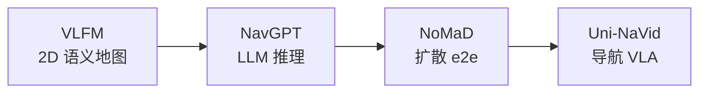

# VLN 开源复现：四范式学习路径

> **本页定位：** 将深蓝具身智能对「能跑通的 VLN 开源项目」综述整理为**范式地图 + 复现门槛表**；与 [操作侧 VLA 复现景观](./vla-open-source-repro-landscape-2025.md) 分工明确。

## 一句话总结

VLN 论文可以很前沿，但**跑不起来的代码**对初学者没有教学价值；按 **地图模块化 → LLM 推理 → 扩散端到端 → 导航 VLA** 顺序复现，比直接追 Uni-NaVid 更易建立完整直觉。

## 英文缩写速查

| 缩写 | 英文全称 | 简要说明 |
|------|----------|----------|
| LLM | Large Language Model | 大语言模型，常作高层任务/语言接口 |
| VLA | Vision-Language-Action | 视觉-语言-动作多模态基础策略方向 |
| VLM | Vision-Language Model | 视觉-语言多模态理解模型，VLA 的上游 |
| CUDA | Compute Unified Device Architecture | NVIDIA GPU 通用并行计算平台 |
| API | Application Programming Interface | 应用程序编程接口 |
| GPU | Graphics Processing Unit | 图形处理器，大规模并行仿真训练的算力基础 |

## 为什么按「范式」而不是「榜单」

- 原文筛选：**可运行、可理解**（作者称亲测复现率 100%），非 SPL/SR 排名。
- 四篇工作站在 **四条技术分支** 上，构成**学习路径**而非并列推荐。
- 任务定义见 [视觉–语言导航（VLN）](../tasks/vision-language-navigation.md)（R2R、HM3D/Habitat 等）。

## 范式演进

| 阶段 | 项目 | 决策中枢 | 显式地图 | 典型数据/环境 |
|------|------|----------|----------|---------------|
| 1 | **VLFM** | 前沿 + 语义 value map | 是（深度几何图） | Habitat、HM3D |
| 2 | **NavGPT** | GPT 类 LLM prompt | 否 | R2R |
| 3 | **NoMaD** | 扩散策略网络 | 否 | 预训练 + 真机/ROS（可选） |
| 4 | **Uni-NaVid** | VLA 序列生成 | 否 | 多任务导航视频 + 大模型权重 |

## 四项目速查与复现门槛

| 项目 | 核心机制 | 仓库 | 算力/依赖（归纳） | 新手切入点 |
|------|----------|------|-------------------|------------|
| **VLFM** | 深度图建几何地图；VLM 提语义；frontier 探索 | [vlfm](https://github.com/bdaiinstitute/vlfm) | 单卡 CUDA 推理；MobileSAM、GroundingDINO、YOLOv7 权重 | Habitat 评测脚本；理解 `vlfm/vlm` 的 `reset`/`step` |
| **NavGPT** | 视觉→文本描述；LLM 推理下一步 | [NavGPT](https://github.com/GengzeZhou/NavGPT) | **OpenAI API**；几乎无 GPU 训练 | R2R 小样本 + GPT-3.5 快速走通 `NavAgent.test()` |
| **NoMaD** | 视觉上下文 + **goal masking**；扩散采样轨迹 | [NoMaD](https://github.com/adith-m-dharan/NoMaD) | 训练需 GPU；**可用官方权重**跳过训练 | 先 `navigate.sh` / `explore.sh` 看行为差，再考虑 ROS |
| **Uni-NaVid** | 视频帧 + 指令 → `forward/left/right/stop` token | [Uni-NaVid](https://github.com/jzhzhang/Uni-NaVid) | 推理重（文内 A100 ~5Hz）；flash-attn 等 | **离线评估/示例视频**，勿从头训全文规模 |

## 与 VLA 生态的边界

- **Uni-NaVid** = **导航** 方向的 VLA（RSS 2025 叙事），与 [VLA 开源景观](./vla-open-source-repro-landscape-2025.md) 中的 **UniVLA**（跨本体**操作**潜动作）**不同名、不同任务**。
- 若已熟悉 [VLA 方法页](../methods/vla.md)，可把 Uni-NaVid 读作「VLN 子任务上的 VLA 实例」；NoMaD 则更接近 [Diffusion Policy](../methods/diffusion-policy.md) 在导航上的落地。
- **零样本对照：** [Uni-LaViRA](../entities/paper-uni-lavira.md)（arXiv:2605.27582）走 **training-free Language→Vision→Robot agent**，官方仓含 Habitat/AirSim 评测与四真机入口；适合在跑通 Uni-NaVid **之后**对照「堆轨迹训导航 VLA」vs「结构化 MLLM agent」两条路线（依赖 API、CC BY-NC-SA，不替换本页四范式入门顺序）。
- **户外方向感知（暂不可复现）：** [DA-Nav](../entities/paper-da-nav.md)（arXiv:2607.11638）用 **商业导航离散方向** + **图像平面网格** + **CoT recovery**，并零样本足式/人形；**截至 2026-07-22 未开源**，不进入本页四范式清单，仅作「动作表示 / 恢复监督」阅读对照。
- **多楼层动态 ObjectNav（暂不可复现）：** [ZONDA](../entities/paper-zonda.md)（arXiv:2607.21025）在 VLFM 式地图–语义前沿之上补 **跨楼层几何可通行、多视角 VLM 核验、行人预测避障**；**截至 2026-07-24 未开源**。工程上可先跑通 VLFM，再对照已开源 [ASCENT](https://github.com/Zeying-Gong/ascent) 理解跨楼层差异。

## 按目标选入口

| 你的目标 | 从哪开始 |
|----------|----------|
| 理解「地图 + 语义探索」 | VLFM |
| 理解「语言推理当规划器」 | NavGPT |
| 理解「无地图 e2e 策略」 | NoMaD（预训练权重） |
| 理解「导航大模型一体化」 | Uni-NaVid（离线推理） |
| 补真实室内视频→R2R 数据 | [SceneVerse++](../entities/sceneverse-pp.md) |

## 常见误区

1. **把四篇当性能排名** — 原文明确是**代表范式 + 复现友好度**。
2. **Uni-NaVid 与 UniVLA 混淆** — 前者导航 VLA，后者操作/跨平台潜动作（见 VLA 景观页）。
3. **NavGPT 无成本** — 主要开销在 **LLM API**，非算力。
4. **跳过 VLFM 直接 Uni-NaVid** — 失去对地图/前沿/语义代价的直觉，调试更难。

## 关联页面

- [VLN 10 篇论文技术地图](./vln-10-papers-technology-map.md)
- [NaVid（盘点第 10 篇）](../entities/paper-vln-10-navid.md)
- [视觉–语言导航（VLN）](../tasks/vision-language-navigation.md)
- [VLA（Vision-Language-Action）](../methods/vla.md)
- [VLA 开源复现景观（2025）](./vla-open-source-repro-landscape-2025.md)
- [Diffusion Policy](../methods/diffusion-policy.md)
- [SceneVerse++](../entities/sceneverse-pp.md) — 互联网视频→R2R 风格数据
- [3D 空间 VQA](../concepts/3d-spatial-vqa.md) — 空间推理与 VLN 对照
- [Uni-LaViRA](../entities/paper-uni-lavira.md) — 零样本三层翻译统一导航（对照 Uni-NaVid）
- [DA-Nav](../entities/paper-da-nav.md) — 城市户外方向感知 VLN（方法对照；暂未开源）
- [ZONDA](../entities/paper-zonda.md) — 多楼层动态零样本 ObjectNav（方法对照；暂未开源）

## 参考来源

- [深蓝具身智能：VLN 四范式新手复现推荐（微信公众号归档）](../../sources/blogs/wechat_shenlan_vln_repro_four_paradigms_2026.md)
- [Uni-LaViRA 论文摘录（arXiv:2605.27582）](../../sources/papers/uni_lavira_arxiv_2605_27582.md)
- [DA-Nav 论文摘录（arXiv:2607.11638）](../../sources/papers/da_nav_arxiv_2607_11638.md)
- [ZONDA 论文摘录（arXiv:2607.21025）](../../sources/papers/zonda_arxiv_2607_21025.md)

## 推荐继续阅读

- [VLFM（GitHub）](https://github.com/bdaiinstitute/vlfm) — 模块化语义导航 baseline
- [Uni-NaVid（GitHub）](https://github.com/jzhzhang/Uni-NaVid) — 统一导航 VLA 官方仓库
- [Uni-LaViRA（GitHub）](https://github.com/NJU-R-L-Group-Embodied-Lab/uni-lavira-code) — training-free 统一导航官方仓
- Matterport3D / R2R 基准官方说明 — VLN 标准评测协议
