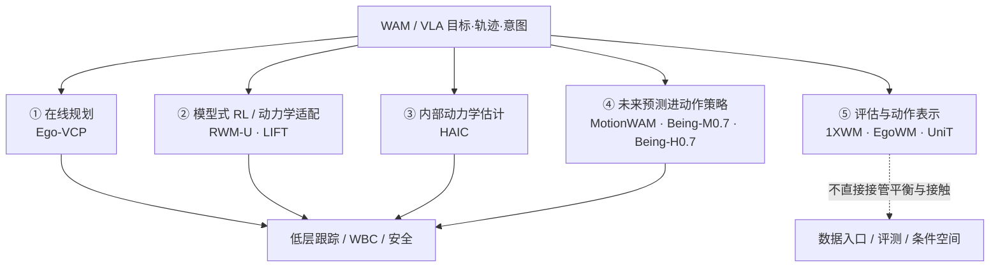

# WAM × 人形运动控制：五种系统位置

> **本页定位**：编译自[具身智能研究室 · 运动控制进入世界模型](https://mp.weixin.qq.com/s/2pP9LWlsTmTAgTglFuLwSA)的策展判断，给出 **WAM 落地物理世界时运动控制可能占据的接口位置**；方法细节与数字以各论文实体页为准。

## 一句话定义

**WAM 要进物理世界，运动控制不会消失，而会变成「把目标/轨迹/动作变成真机可执行全身行为」的接口层——按世界模型是否在线搜索、是否训策略、是否估隐藏状态、是否压进动作网、是否停在评测外侧，分成五条位置。**

## 英文缩写速查

| 缩写 | 英文全称 | 简要说明 |
|------|----------|----------|
| WAM | World Action Model | 联合世界演化与可执行动作的具身模型族 |
| WM | World Model | 预测未来状态/观测以支撑决策或评测 |
| MPC | Model Predictive Control | 短时域采样/优化后只执行第一步并重规划 |
| VLA | Vision-Language-Action | 视觉–语言–动作策略；常与 WAM 接口对接 |
| SONIC | Scalable Online Neural whole-body Integrated Control | 统一 motion token 的低层全身跟踪接口 |

## 为什么重要

- **避免标签糊成一团：** 「世界模型」既可能是 25 Hz 潜空间规划器，也可能是训练期动力学、观测补全器、动作先验，或离线评测引擎——系统位置不同，工程取舍完全不同。
- **接住企业端分工：** 上层 WAM/VLA 出目标或运动标记，下面仍要动作专家、全身跟踪、状态估计与安全层；本页把科研实例钉到这张分工图上。
- **指向可验证问题：** 动作忠实度、误差兜底、不确定性反馈、跨本体可迁移量——比「会不会生成视频」更贴近运动控制。

## 五种位置总览

| 位置 | 世界模型做什么 | 代表节点（复用，不重复造页） |
|------|----------------|------------------------------|
| **① 在线规划** | 潜空间展开候选动作，价值/失败筛选，只执行第一步 | [Ego-VCP](../entities/paper-hrl-stack-33-ego_vision_world_model_for_humanoid.md) |
| **② 模型式 RL / 适配** | 想象轨迹上继续训/微调策略；不确定性或解析动力学先验 | [RWM-U](../entities/robotic-world-model-eth-rsl.md)、[LIFT](../entities/lift-humanoid.md) |
| **③ 内部动力学估计** | 补策略看不到的物体/耦合状态，**不**替策略搜动作 | [HAIC](../entities/paper-haic.md) |
| **④ 未来预测进策略** | 训练目标/潜特征携带未来；部署更像动作策略 | [MotionWAM](../entities/paper-motionwam-humanoid-loco-manipulation-wam.md)、[Being-M0.7](../entities/paper-being-m07-humanoid-latent-wam.md)、[Being-H0.7](../methods/being-h07.md) |
| **⑤ 评估与表示** | 评测排序、动作条件视频、跨本体分词——暂在控制回路外侧 | [1XWM](../entities/paper-1xwm-redwood-world-model.md)、[EgoWM](../entities/paper-egowm-egocentric-world-model.md)、[UniT](../entities/paper-unit-unified-physical-language.md) |

## 核心读法（按位置）

### ① 在线规划：模型有决策权

[Ego-VCP](../entities/paper-hrl-stack-33-ego_vision_world_model_for_humanoid.md) 把第一视角深度与本体编成潜状态，采样高层动作序列并在世界模型里前滚，用价值与失败概率做 CEM 筛选；只执行第一步，观测一到就重规划。策展口径：G1 上约 **25 Hz**、约 **1024** 候选、时域约 **4** 步，下面仍接 RL 全身控制器。**世界模型改变下一条身体命令。**

### ② 训练期动力学：误差沿时间累积是共同风险

[RWM-U](../entities/robotic-world-model-eth-rsl.md) 用集成不确定性给想象轨迹降权；[LIFT](../entities/lift-humanoid.md) 用拉格朗日先验 + 神经残差，把随机探索留在模型、真机跑确定性策略。两者都承认：**模型在策略真正会访问的状态上是否仍可信**，决定收益上界。

### ③ 隐藏状态估计：更像「进现有控制栈」的短路径

[HAIC](../entities/paper-haic.md) 不生成高清未来画面，而从本体历史估计欠驱动物体高阶状态并投影到几何先验，再交给学生策略。输出是控制器能吃的低维量；估错时策略仍须消化残差。

### ④ 未来进策略：底层跟踪器没有消失

[MotionWAM](../entities/paper-motionwam-humanoid-loco-manipulation-wam.md) 用视频 DiT 中间特征驱动统一 motion token，执行仍靠 SONIC；[Being-M0.7](../entities/paper-being-m07-humanoid-latent-wam.md) 拆低频计划 / 高频专家；[Being-H0.7](../methods/being-h07.md) 训练期用未来后验对齐潜查询，部署去掉后验，G1 上身接口常与 AMO 分工。任务成功率涨了之后，仍要追问：收益来自视频预训练、数据、网络结构还是未来目标本身。

### ⑤ 回路外侧：评测语言与动作语言

[1XWM](../entities/paper-1xwm-redwood-world-model.md) 用动作条件未来 + 成功价值做 checkpoint/策略排序；[EgoWM](../entities/paper-egowm-egocentric-world-model.md) 把预训练视频扩散变成动作条件预测，当前主线是忠实度与结构一致性，而非直接改控制；[UniT](../entities/paper-unit-unified-physical-language.md) 提供人–机共享运动分词，既可喂策略也可作 WM 条件。它们影响 **数据怎么进模型、策略怎么被评估**，尚未接管平衡与接触。

## 工程实践（怎么用本图）

| 你的问题 | 先看哪条位置 |
|----------|--------------|
| 要不要在控制环里做短时域搜索？ | ① Ego-VCP |
| 离线/少真机探索下怎么继续训策略？ | ② RWM-U / LIFT |
| 视觉盲区下物体惯性怎么补进观测？ | ③ HAIC |
| WAM 是否还要单独模块，还是压进策略？ | ④ MotionWAM / Being |
| 还没进控制环，先要评测或跨本体动作语言？ | ⑤ 1XWM / EgoWM / UniT |

## 局限与风险

- **策展 taxonomy ≠ 论文自称类别：** 同一工作可能同时沾 ④ 与 ⑤；以实体页机制为准。
- **演示成功 ≠ 动力学泛化：** 换物体、节奏、本体后，未来预测目标还剩多少，需要单独实验。
- **开源边界不一：** 有的已全链路开源（Ego-VCP、HAIC、UniT），有的仅部分推理或挑战基线（EgoWM、1XWM）——部署前读各页「开源状态」。

## 关联页面

- [World Action Models](../concepts/world-action-models.md)
- [机器人世界模型：训练闭环三线](./robot-world-models-training-loop-taxonomy.md)
- [Generative World Models](../methods/generative-world-models.md)
- [Model-Based RL](../methods/model-based-rl.md)
- [Loco-Manipulation](../tasks/loco-manipulation.md)

## 参考来源

- [wechat_embodied_ai_lab_wam_motion_control_five_paths.md](../../sources/blogs/wechat_embodied_ai_lab_wam_motion_control_five_paths.md)

## 推荐继续阅读

- [具身智能研究室原文](https://mp.weixin.qq.com/s/2pP9LWlsTmTAgTglFuLwSA)
- [World Action Models 综述坐标](../concepts/world-action-models.md)
