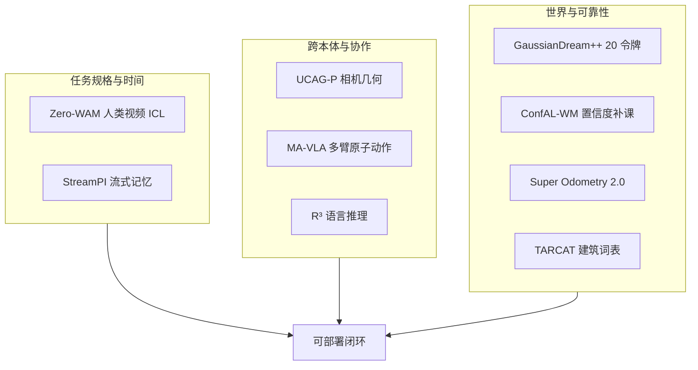

# WAM / VLA / 跨本体：9 篇论文的阅读坐标

> **本页定位**：为 [具身智能小站 · 9 篇开源盘点](https://mp.weixin.qq.com/s/FNhRO3KOm8k8CkJEqystQQ)（2026-08-28）提供 **按四类问题组织的阅读坐标**；不复述每篇方法细节。姊妹近期盘点见 [开源 8 篇](./open-source-8-papers-technology-map.md)、[VLA 可执行性 9 篇](./vla-robustness-9-papers-technology-map.md)、[视频–接触–控制 10 篇](./video-contact-control-10-papers-technology-map.md)。

## 一句话观点

**具身策略正在把关键接口显式化：视频当任务规格、注意力当时间记忆、相机几何当跨本体动作、语言推理当测试时计算——单项刷榜不如看接口能否在真机上闭环。**

## 英文缩写速查

| 缩写 | 英文全称 | 简要说明 |
|------|----------|----------|
| WAM | World-Action Model | 联合建模未来观测与动作 |
| VLA | Vision-Language-Action | 视觉-语言-动作策略 |
| UCAG | Unified Camera-centric Action Geometry | 相机坐标统一动作几何 |
| IMU | Inertial Measurement Unit | Super Odometry 的对等后备模态 |

## 为什么单独做这张地图

- 公众号把 9 篇放在「WAM、VLA、跨本体」同一叙事里，并强调开放资源形态已经分化。
- **9/9 本 ingest 新建独立 `paper-*` 节点**；GaussianDream++ 与既有 Awesome 索引级 GaussianDream 是 **不同 arXiv**，不合并。
- 需要横切面索引，避免 9 个实体成孤岛。

## 流程总览

## 分组索引

### 任务规格与流式时间

| # | 论文 | 开源（入库日） | 详情 |
|---|------|----------------|------|
| 01 | Zero-WAM | 仓已建，代码/权重计划 09-15 | [paper-zero-wam](../entities/paper-zero-wam.md) |
| 02 | StreamPI | 官方仓计划 08-30 | [paper-streampi](../entities/paper-streampi.md) |

### 跨本体几何、推理与多臂

| # | 论文 | 开源（入库日） | 详情 |
|---|------|----------------|------|
| 03 | UCAG-P | Code Release Soon | [paper-ucag-p](../entities/paper-ucag-p.md) |
| 04 | R³ | Code Coming Soon | [paper-r3-robotic-reasoner](../entities/paper-r3-robotic-reasoner.md) |
| 05 | MA-VLA | 训练/部署已开 | [paper-ma-vla](../entities/paper-ma-vla.md) |

### 三维世界、主动学习与部署可靠性

| # | 论文 | 开源（入库日） | 详情 |
|---|------|----------------|------|
| 06 | GaussianDream++ | v1 仓已开，++ 入口未标明 | [paper-gaussiandream-plusplus](../entities/paper-gaussiandream-plusplus.md) |
| 07 | ConfAL-WM | 管线 + HF 权重/数据 | [paper-confal-wm](../entities/paper-confal-wm.md) |
| 08 | SUPER ODOMETRY 2.0 | slim ROS 2；完整层级以论文为准 | [paper-super-odometry-2](../entities/paper-super-odometry-2.md) |
| 09 | TARCAT | 分类 JSON + 视频标注 | [paper-tarcat](../entities/paper-tarcat.md) |

## 综合观察（策展）

1. **接口显式化**：Zero-WAM 把任务写成视频上下文；StreamPI 把时间写成注意力结构；UCAG-P 把动作写成相机几何；R³ / MA-VLA 分别把推理预算与多臂角色写成可调用接口。
2. **训练期世界 ≠ 部署期世界**：GaussianDream++ 把三维监督留在训练；ConfAL-WM 用置信度决定补哪些区域。
3. **开放资源要拆开看**：9 篇都有项目页或仓，但可下载资产只有 MA-VLA、ConfAL-WM、TARCAT 标注与 SuperOdom slim 明确可跑；其余多为发布计划。
4. **GaussianDream++ 不复用 2605.20752 节点**：前作是 Awesome 索引级页，++ 是独立深度实体。

## 关联页面

- [World Action Models](../concepts/world-action-models.md)
- [VLA](../methods/vla.md)
- [生成式世界模型](../methods/generative-world-models.md)
- [Manipulation](../tasks/manipulation.md)
- [开源具身 8 篇技术地图](./open-source-8-papers-technology-map.md)

## 参考来源

- [具身智能小站 9 篇盘点（2026-08-28）](../../sources/blogs/wechat_embodied_station_wam_vla_cross_embodiment_9_papers_2026-08-28.md)
- [原始抓取](../../sources/raw/wechat_embodied_station_wam_vla_cross_embodiment_9_papers_2026-08-28.md)

## 推荐继续阅读

- [具身智能小站原文](https://mp.weixin.qq.com/s/FNhRO3KOm8k8CkJEqystQQ)
- [开源 8 篇技术地图](./open-source-8-papers-technology-map.md)
- [VLA 可执行性 9 篇地图](./vla-robustness-9-papers-technology-map.md)
