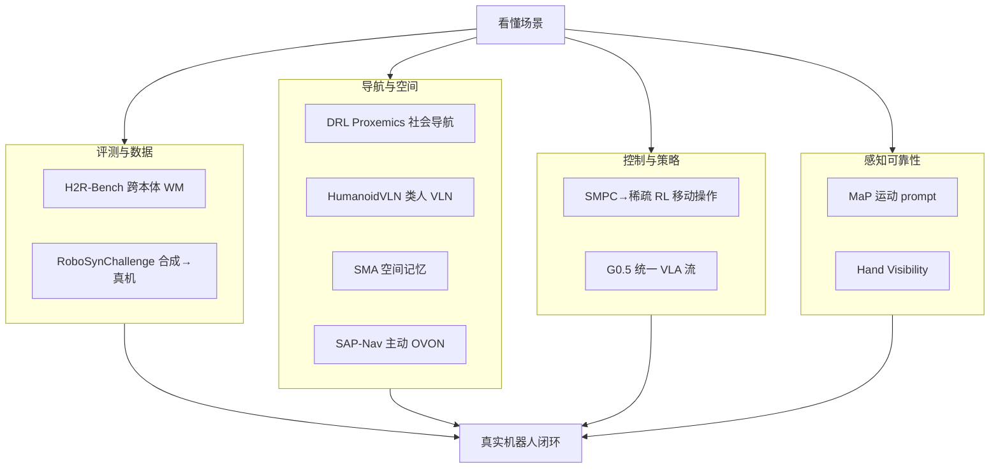

# 世界模型与真实执行：10 篇论文的阅读坐标

> **本页定位**：为 [具身智能小站 · 10 篇盘点](https://mp.weixin.qq.com/s/NJ6M3CnsmDrtu9baRo8lgQ)（2026-08-19）提供 **按四类问题组织的阅读坐标**；不复述每篇方法细节。姊妹近期盘点见 [接触–预测–适应（2026-08-18）](./contact-predict-adapt-10-papers-technology-map.md)、[9 篇 WAM/控制（2026-08-17）](../../sources/blogs/wechat_embodied_station_9_papers_2026-08-17.md)。

## 一句话观点

**世界模型很热，但真实执行才是硬门槛：跨本体生成要可诊断，导航要社会/类人/主动感知，策略要 SMPC 或统一 token 流，感知还要可见性与运动证据。**

## 英文缩写速查

| 缩写 | 英文全称 | 简要说明 |
|------|----------|----------|
| H2R | Human-to-Robot | 人类视频→机器人视频（评测组） |
| OVON | Open-Vocabulary Object Navigation | 开词汇物体导航（SAP-Nav） |
| SMPC | Sample-based Model Predictive Control | 移动操作 expert 示范（SMPC→RL） |
| VLA | Vision-Language-Action | 统一推理–动作 token 流（G0.5） |
| MaP | Motion-as-Prompt | 运动轨迹 visual prompting |

## 为什么单独做这张地图

- 公众号把 10 篇放在 **「看懂 → 真实执行」** 叙事里：世界模型、导航、VLA、控制、感知可靠性四条线并进。
- 站内 **4 篇已有 complete 节点**（HumanoidVLN、SMPC2RL、G0.5、Hand Visibility），本专辑 **新建 6 篇 + 一张横切面**，避免重复造页又防止孤岛。

## 流程总览：四组问题

## 分组索引

### 评测与数据：世界模型与合成数据要可验收

| # | 论文 | 开源（入库日） | 详情 |
|---|------|----------------|------|
| 01 | H2R-Bench | 部分开源 | [paper-h2r-bench](../entities/paper-h2r-bench.md) |
| 06 | RoboSynChallenge | 已开源 | [paper-robosynchallenge](../entities/paper-robosynchallenge.md) |

### 导航与空间：社会、类人、记忆、主动看

| # | 论文 | 开源（入库日） | 详情 |
|---|------|----------------|------|
| 02 | DRL Proxemics | 未开源 | [paper-drl-proxemics-social-nav](../entities/paper-drl-proxemics-social-nav.md) |
| 03 | HumanoidVLN | 待发布（复用） | [paper-humanoidvln](../entities/paper-humanoidvln.md) |
| 04 | SMA | 待发布 | [paper-spatial-memory-agent](../entities/paper-spatial-memory-agent.md) |
| 05 | SAP-Nav | 待发布 | [paper-sap-nav](../entities/paper-sap-nav.md) |

### 控制与策略：示范、稀疏奖励与统一 token 流

| # | 论文 | 开源（入库日） | 详情 |
|---|------|----------------|------|
| 07 | SMPC→RL | 已开源（复用） | [paper-smpc2rl-loco-manipulation](../entities/paper-smpc2rl-loco-manipulation.md) |
| 08 | Galaxea G0.5 | 已开源（复用） | [paper-galaxea-g05](../entities/paper-galaxea-g05.md) |

### 感知可靠性：运动证据与可见性

| # | 论文 | 开源（入库日） | 详情 |
|---|------|----------------|------|
| 09 | Motion-as-Prompt | 已开源 | [paper-motion-as-prompt](../entities/paper-motion-as-prompt.md) |
| 10 | Hand Visibility | 已开源（复用） | [paper-hand-visibility-detector](../entities/paper-hand-visibility-detector.md) |

## 读法建议

1. **先定你的瓶颈：** 是 WM 数据（E 组）、导航协议（N 组）、控制接口（C 组）还是感知噪声（P 组）？
2. **开源优先：** 本专辑 10 篇里 **5 篇已开源/部分开源可跟进**（RoboSyn、MaP、G0.5、SMPC2RL、Hand Visibility）；4 篇待发布/未开源只宜读协议与数字。
3. **与前三期对照：** [接触–预测–适应](./contact-predict-adapt-10-papers-technology-map.md) 偏触觉与社会规范；[9 篇 WAM](../../sources/blogs/wechat_embodied_station_9_papers_2026-08-17.md) 偏预测–控制闭环；本期强调 **真实执行与跨本体**。

## 关联页面

- [生成式世界模型](../methods/generative-world-models.md)
- [Vision-Language Navigation](../tasks/vision-language-navigation.md)
- [Loco-Manipulation](../tasks/loco-manipulation.md)
- [VLA](../methods/vla.md)

## 参考来源

- [具身智能小站 10 篇盘点（2026-08-19）](../../sources/blogs/wechat_embodied_station_world_model_exec_10_papers_2026-08-19.md)
- [原始抓取](../../sources/raw/wechat_embodied_station_world_model_exec_10_papers_2026-08-19.md)

## 推荐继续阅读

- [公众号原文](https://mp.weixin.qq.com/s/NJ6M3CnsmDrtu9baRo8lgQ)
- [接触–预测–适应 10 篇地图](./contact-predict-adapt-10-papers-technology-map.md)
