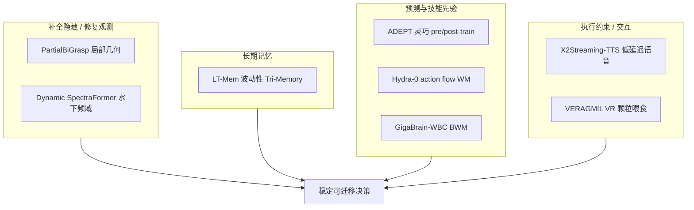

# 世界模型与长期记忆：8 篇论文的阅读坐标

> **本页定位**：为 [具身智能小站 · 8 篇盘点](https://mp.weixin.qq.com/s/30hu9SRxbRNXJcGLnNwl_g)（2026-08-21）提供 **按四类闭环能力组织的阅读坐标**；不复述每篇方法细节。姊妹近期盘点见 [世界模型与真实执行（2026-08-19）](./world-model-exec-10-papers-technology-map.md)。

## 一句话观点

**具身智能正从「看见再行动」转向「补全隐藏状态—保存长期历史—预测动作后果—约束真实执行」的系统闭环。**

## 英文缩写速查

| 缩写 | 英文全称 | 简要说明 |
|------|----------|----------|
| BWM | Behavior World Model | 低层全身控制世界模型（GigaBrain-WBC） |
| FC | Force Closure | 力闭合抓取（PartialBiGrasp） |
| LT-Mem | Lifelong Tri-Memory | Live/Delta/Meta 三层场景记忆 |
| TTS | Text-to-Speech | 流式语音（X2Streaming-TTS） |
| VR | Virtual Reality | VERAGMIL 示范采集接口 |

## 为什么单独做这张地图

- 公众号把 8 篇放在 **「不完整观测 + 长期运行 + 行为预测」** 叙事里。
- 站内 **3 篇已有 complete 详情节点**（ADEPT、GigaBrain-WBC-0.5、Hydra-0），本专辑 **新建 5 个独立 `paper-*` 页 + 一张横切面**；**同一 arXiv 不重复造页**。

## 流程总览：四组闭环

## 分组索引

### 补全隐藏状态 / 修复退化观测

| 论文 | 独立详情节点 | 一句话 |
|------|-------------|--------|
| PartialBiGrasp | [paper-partialbigrasp](../entities/paper-partialbigrasp.md) | 局部点云 → 力闭合双臂抓取 |
| Dynamic SpectraFormer | [paper-dynamic-spectraformer](../entities/paper-dynamic-spectraformer.md) | UHD 水下频域增强 |

### 保存长期历史

| 论文 | 独立详情节点 | 一句话 |
|------|-------------|--------|
| LT-Mem | [paper-lt-mem](../entities/paper-lt-mem.md) | 波动性 Live/Delta/Meta + LT-VQA |

### 预测动作后果 / 技能先验

| 论文 | 独立详情节点 | 一句话 |
|------|-------------|--------|
| ADEPT | [paper-adept-dexterity](../entities/paper-adept-dexterity.md) | Reposing 预训练 + 保守 post-train |
| GigaBrain-WBC-0.5 | [paper-gigabrain-wbc-0-5](../entities/paper-gigabrain-wbc-0-5.md) | BWM + 地形/跌倒 OOD filter |
| Hydra-0 | [paper-hydra-0](../entities/paper-hydra-0.md) | Action flow 跨本体 WM + RoboLab r=0.96 |

### 约束真实执行 / 交互接口

| 论文 | 独立详情节点 | 一句话 |
|------|-------------|--------|
| X2Streaming-TTS | [paper-x2streaming-tts](../entities/paper-x2streaming-tts.md) | 令牌级因果 TTS，15.8 ms TTFT |
| VERAGMIL | [paper-veragmil](../entities/paper-veragmil.md) | VR 颗粒喂食仿真 + BCQ |

## 关联页面

- [Generative World Models](../methods/generative-world-models.md)
- [Spatial Memory Agent](../entities/paper-spatial-memory-agent.md) — 与 LT-Mem 对照
- [ADEPT](../entities/paper-adept-dexterity.md)
- [Hydra-0](../entities/paper-hydra-0.md)

## 参考来源

- [具身智能小站 8 篇综述](../../sources/blogs/wechat_embodied_station_8_papers_world_model_memory_2026-08-21.md)
- [公众号原文](https://mp.weixin.qq.com/s/30hu9SRxbRNXJcGLnNwl_g)

## 推荐继续阅读

- [世界模型与真实执行 10 篇地图](./world-model-exec-10-papers-technology-map.md)
- [Generative World Models 方法页](../methods/generative-world-models.md)
