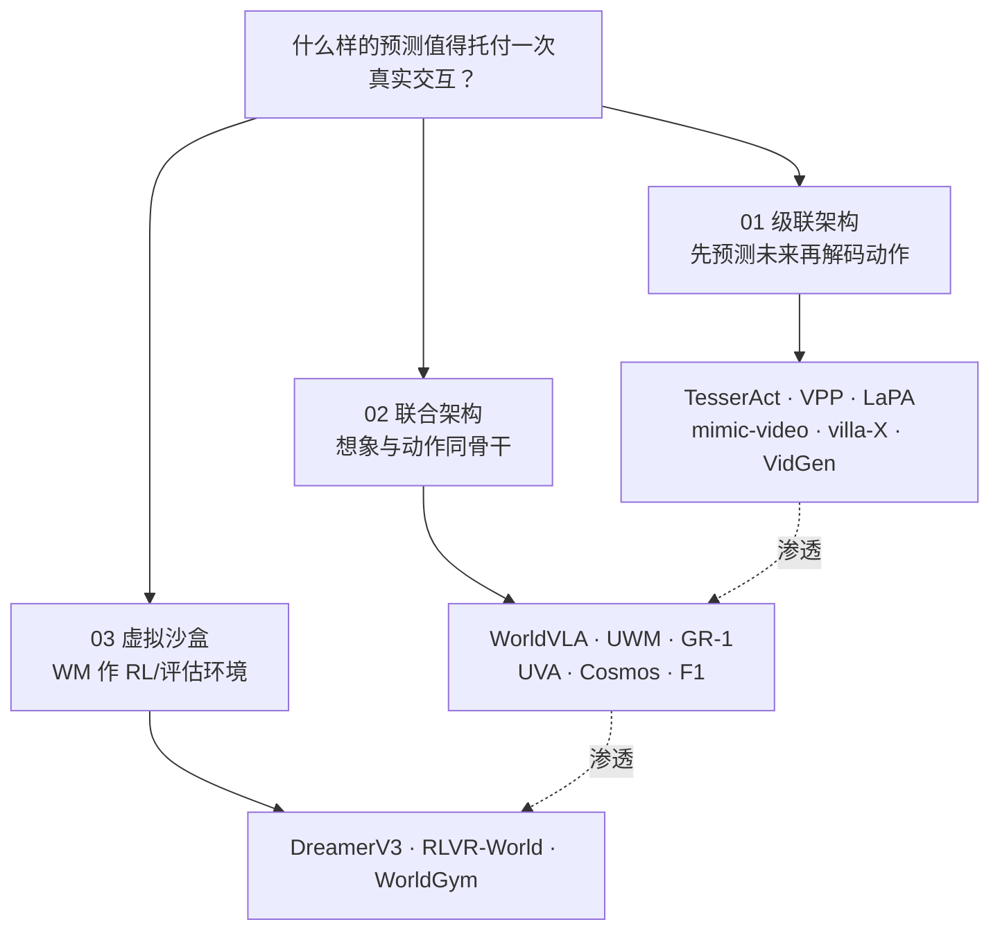

# 世界模型 15 开源项目：三线技术地图

> **本页定位**：为 [深蓝具身智能 · 15 开源世界模型](https://mp.weixin.qq.com/s/KZT8sI4n7GvHWyM20wN3gg) 提供 **按三条技术路线组织的阅读坐标**；不复述每篇论文细节，只保留 **路线分工、15 项目索引、与学术综述 taxonomy 的挂接**。学术综述三线见 [机器人世界模型训练闭环 taxonomy](./robot-world-models-training-loop-taxonomy.md)（arXiv:2605.00080）。

## 一句话观点

世界模型的价值不在「会生成未来视频」，而在 **预测能否进入策略学习、评估与闭环决策**——15 个高引开源项目按 **先预测后动作（级联）→ 想象与动作同骨干（联合）→ 想象作 RL/评估环境（沙盒）** 三条路线展开，且路径正在相互渗透。

## 与 arXiv 综述 taxonomy 的对照

| 维度 | [robot-world-models-training-loop-taxonomy](./robot-world-models-training-loop-taxonomy.md) | 本页（深蓝 15 项目） |
|------|---------------------------------------------------------------------------------------------|----------------------|
| 来源 | NTUMARS 等 arXiv:2605.00080 学术综述 | 微信公众号 **可操作复现** 策展 |
| 分类 | 策略内预测 / 学习型模拟器 / 可控视频生成 | 级联 / 联合 / 虚拟沙盒 |
| 侧重点 | 训练闭环与评价口径 | **开源代码 + 工程基线** 选型 |
| 关系 | 概念上 **①②③ 与级联/联合/沙盒高度重叠**，但命名轴不同——阅读时应 **交叉对照**，勿机械一一对应 |

## 流程总览：三条路线

## 三类分类节点（图谱 hub）

| 路线 | 分类节点 | 篇数 | 典型机制 |
|------|----------|------|----------|
| 01 级联架构 | [级联架构](./world-models-route-01-cascade.md) | 6 | 视频/4D 预测 → 逆动力学 / 动作头 |
| 02 联合架构 | [联合架构](./world-models-route-02-joint.md) | 6 | 扩散/自回归联合去噪或联合 token |
| 03 虚拟沙盒 | [虚拟沙盒](./world-models-route-03-virtual-sandbox.md) | 3 | 想象 rollout · RLVR · 策略评估靶场 |

## 15 项目速查

| # | 工作 | 路线 | Wiki 实体 |
|---|------|------|-----------|
| 01 | TesserAct | 级联 | [paper-shenlan-wm-01-tesseract](../entities/paper-shenlan-wm-01-tesseract.md) |
| 02 | VPP | 级联 | [paper-shenlan-wm-02-vpp](../entities/paper-shenlan-wm-02-vpp.md) |
| 03 | LaPA | 级联 | [paper-shenlan-wm-03-lapa](../entities/paper-shenlan-wm-03-lapa.md) |
| 04 | mimic-video | 级联 | [mimic-video 方法页](../methods/mimic-video.md) |
| 05 | villa-X | 级联 | [paper-shenlan-wm-05-villa-x](../entities/paper-shenlan-wm-05-villa-x.md) |
| 06 | Video Generators are Robot Policies | 级联 | [paper-shenlan-wm-06-video-gen-robot-policies](../entities/paper-shenlan-wm-06-video-gen-robot-policies.md) |
| 07 | WorldVLA | 联合 | [paper-shenlan-wm-07-worldvla](../entities/paper-shenlan-wm-07-worldvla.md) |
| 08 | UWM | 联合 | [paper-shenlan-wm-08-uwm](../entities/paper-shenlan-wm-08-uwm.md) |
| 09 | GR-1 | 联合 | [paper-shenlan-wm-09-gr1](../entities/paper-shenlan-wm-09-gr1.md) |
| 10 | UVA | 联合 | [paper-shenlan-wm-10-uva](../entities/paper-shenlan-wm-10-uva.md) |
| 11 | Cosmos Policy | 联合 | [paper-shenlan-wm-11-cosmos-policy](../entities/paper-shenlan-wm-11-cosmos-policy.md) |
| 12 | F1-VLA | 联合 | [paper-shenlan-wm-12-f1-vla](../entities/paper-shenlan-wm-12-f1-vla.md) |
| 13 | DreamerV3 | 沙盒 | [paper-shenlan-wm-13-dreamerv3](../entities/paper-shenlan-wm-13-dreamerv3.md) |
| 14 | RLVR-World | 沙盒 | [paper-shenlan-wm-14-rlvr-world](../entities/paper-shenlan-wm-14-rlvr-world.md) |
| 15 | WorldGym | 沙盒 | [paper-shenlan-wm-15-worldgym](../entities/paper-shenlan-wm-15-worldgym.md) |

## 按目标选入口

| 你的目标 | 从哪开始 |
|----------|----------|
| 理解「先视频预测再动作」级联 | [01 级联 hub](./world-models-route-01-cascade.md) → VPP / mimic-video |
| 理解「未来+动作同模型」 | [02 联合 hub](./world-models-route-02-joint.md) → GR-1 / UWM |
| 理解「WM 当仿真器/评估器」 | [03 沙盒 hub](./world-models-route-03-virtual-sandbox.md) → DreamerV3 / WorldGym |
| 补学术综述与评价口径 | [robot-world-models-training-loop-taxonomy](./robot-world-models-training-loop-taxonomy.md) |
| 补 WAM 概念坐标 | [World Action Models](../concepts/world-action-models.md) |

## 常见误区

1. **把 15 篇当性能排名** — 原文按 **技术路线 + 开源可复现** 策展，引用量仅作参考。
2. **级联 vs 联合非互斥** — 文内强调路线 **正在渗透**（级联加联合训练、联合吸收沙盒闭环）。
3. **开环像不像真 = 机器人变强** — 与综述一致，须看 **控制/物理一致性与下游增益**。
4. **mimic-video 与 VLA 混为一谈** — mimic-video 是 **Video-Action Model**，见 [方法页](../methods/mimic-video.md) 与 [VLA 选型 Query](../queries/manipulation-vla-architecture-selection.md)。

## 关联页面

- [机器人世界模型训练闭环 taxonomy](./robot-world-models-training-loop-taxonomy.md)
- [Generative World Models](../methods/generative-world-models.md)
- [World Action Models](../concepts/world-action-models.md)
- [Model-Based RL](../methods/model-based-rl.md)
- [Ego 9 篇 · 世界模型分类](./ego-category-03-world-models.md)
- [VLN 四范式复现地图](./vln-open-source-repro-paradigms.md) — 同作者「深蓝具身智能」姊妹策展

## 参考来源

- [wechat_shenlan_world_models_15_open_source_2026.md](../../sources/blogs/wechat_shenlan_world_models_15_open_source_2026.md) — <https://mp.weixin.qq.com/s/KZT8sI4n7GvHWyM20wN3gg>
- [wechat_world_models_15_2026-06-03.md](../../sources/raw/wechat_world_models_15_2026-06-03.md)
- [shenlan_world_models_15_reference_catalog.md](../../sources/papers/shenlan_world_models_15_reference_catalog.md)

## 推荐继续阅读

- [World Model for Robot Learning Survey（arXiv:2605.00080）](https://arxiv.org/abs/2605.00080) — 学术三线 taxonomy
- [mimic-video 官方项目页](https://mimic-video.github.io/) — 级联路线代表 VAM
