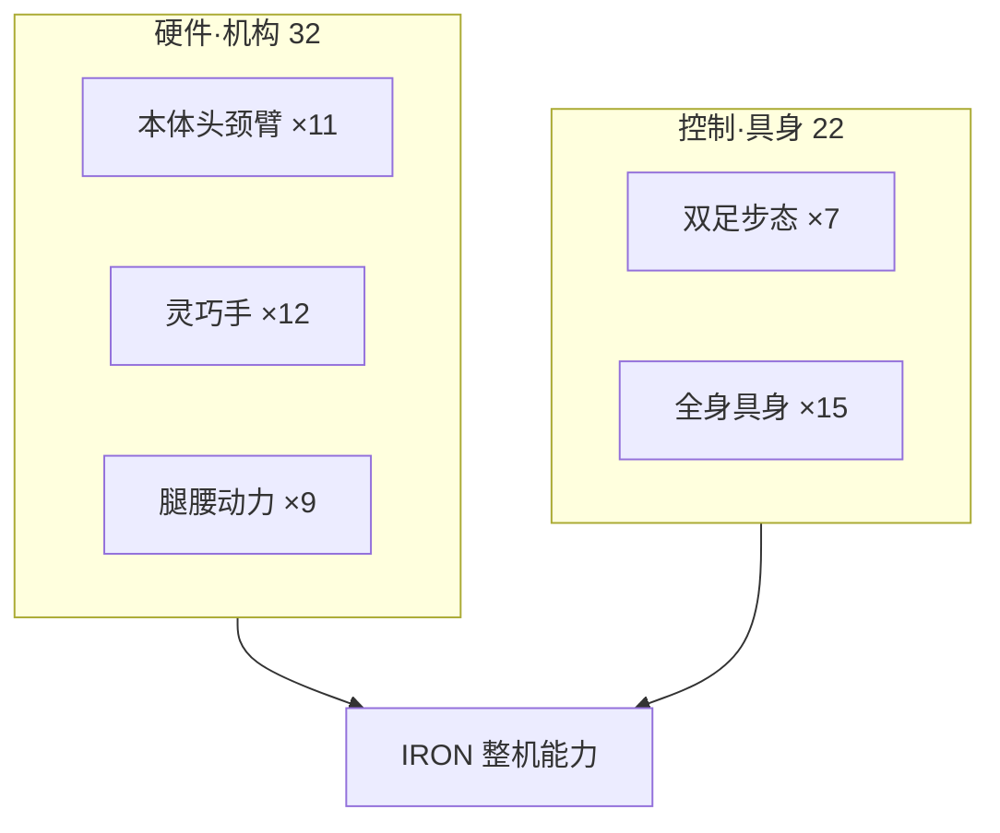

# 小鹏 IRON · 54 项专利技术地图

> **本页定位**：[AI工业 · 54 项专利拆解](https://mp.weixin.qq.com/s/R7Qi2iv1eNfm3yh2s_PUCg) 的 **54/54 独立节点索引** — 每项专利一个 [`wiki/entities/patent-xpeng-cn*`](../entities/) 详情页，**不合并、不重复 arXiv/论文节点**。

## 一句话观点

**IRON 的「技术底牌」在专利层呈现为「机构/传感/步态/具身控制」五层堆叠 — 读专利应分模块对照，而非当作单一论文。**

## 英文缩写速查

| 缩写 | 英文全称 | 简要说明 |
|------|----------|----------|
| IRON | XPeng Humanoid Robot | 小鹏人形机器人（含 IRON-R01 等） |
| CN | China Patent Publication | 中国专利公开/授权文献号 |
| WBC | Whole-Body Control | 全身控制与步态/遥操作协调 |
| VLA | Vision-Language-Action | 具身策略（与专利中 IL/RL 控制互补） |

## 为什么单独做这张地图

- 一文 **54 件 CN 专利**，跨度覆盖 **硬件 + 步态 + 具身软件**。
- **54/54 独立节点**：每项 [`patent-xpeng-cn*`](../entities/) 唯一对应一件专利号。
- 与 [XPACE](../entities/paper-xpace.md)、[ROVE](../entities/paper-rove-humanoid-vla-intervention.md) 等 **论文实体互补** — 专利侧看 **机构与控制权利要求布局**。

## 流程总览

## 分组索引

### 本体·头颈·机械臂（11）

| 专利号 | 标题 | 节点 |
|--------|------|------|
| CN120680480A | 活动肩部支架与躯干连接机构 | [active-shoulder-brac…](../entities/patent-xpeng-cn120680480a-active-shoulder-bracket.md) |
| CN119283063A | 套覆躯干与四肢的空心管电池 | [hollow-tube-battery…](../entities/patent-xpeng-cn119283063a-hollow-tube-battery.md) |
| CN224129040U | 带避让腔的关节随形柔性包覆 | [joint-flexible-cover…](../entities/patent-xpeng-cn224129040u-joint-flexible-cover.md) |
| CN119017408A | 虎克铰与双驱动头部三轴机构 | [hooke-joint-head-3do…](../entities/patent-xpeng-cn119017408a-hooke-joint-head-3dof.md) |
| CN224702057U | 正面显示与顶部声源定位的头部结构 | [head-display-mic-arr…](../entities/patent-xpeng-cn224702057u-head-display-mic-array.md) |
| CN120620279A | 十字轴与双推杆颈部姿态机构 | [neck-cross-axis-push…](../entities/patent-xpeng-cn120620279a-neck-cross-axis-pushrod.md) |
| CN120663284A | 连杆肩部升降与耸肩机构 | [shoulder-linkage-shr…](../entities/patent-xpeng-cn120663284a-shoulder-linkage-shrug.md) |
| CN120663354A | 上臂驱动与肘部连杆传动机构 | [elbow-linkage-drive…](../entities/patent-xpeng-cn120663354a-elbow-linkage-drive.md) |
| CN120680559A | 非对称转角掌座与双轴腕部机构 | [asymmetric-wrist-pal…](../entities/patent-xpeng-cn120680559a-asymmetric-wrist-palm.md) |
| CN223277984U | 肘部避让口的柔性遮挡结构 | [elbow-flex-cover…](../entities/patent-xpeng-cn223277984u-elbow-flex-cover.md) |
| CN119116008A | 臂内控制组件与关节贯通走线 | [arm-internal-wiring…](../entities/patent-xpeng-cn119116008a-arm-internal-wiring.md) |

### 灵巧手·关节（12）

| 专利号 | 标题 | 节点 |
|--------|------|------|
| CN120620259A | 多连杆灵巧手的手指侧摆机构 | [finger-splay-multili…](../entities/patent-xpeng-cn120620259a-finger-splay-multilink.md) |
| CN120620260A | 旋转驱动直接联动手指连接架的灵巧手 | [finger-rotary-drive…](../entities/patent-xpeng-cn120620260a-finger-rotary-drive.md) |
| CN121374671A | 碰撞时切断动力传递的机械手解耦机构 | [hand-collision-decou…](../entities/patent-xpeng-cn121374671a-hand-collision-decouple.md) |
| CN122323263A | 三支架一体成型的手指双向驱动关节 | [finger-integrated-br…](../entities/patent-xpeng-cn122323263a-finger-integrated-bracket.md) |
| CN122125754A | 行星减速与锥齿换向的拇指驱动关节 | [thumb-planetary-beve…](../entities/patent-xpeng-cn122125754a-thumb-planetary-bevel.md) |
| CN120985705A | 柔性线传动的双轴解耦关节 | [cable-coupled-2dof-j…](../entities/patent-xpeng-cn120985705a-cable-coupled-2dof-joint.md) |
| CN120680554A | 双侧按压解锁的机器人关节快拆连接 | [joint-quick-release…](../entities/patent-xpeng-cn120680554a-joint-quick-release.md) |
| CN224689038U | 球铰连接的手指弯曲与侧摆机构 | [finger-ball-joint…](../entities/patent-xpeng-cn224689038u-finger-ball-joint.md) |
| CN119795217A | 随拇指运动变形的虎口柔性包覆结构 | [thumb-flexible-cover…](../entities/patent-xpeng-cn119795217a-thumb-flexible-cover.md) |
| CN119188829A | 相交双轴驱动的手指摆动与俯仰机构 | [finger-dual-axis-swi…](../entities/patent-xpeng-cn119188829a-finger-dual-axis-swing.md) |
| CN118123869A | 基座内丝杆滑块驱动的紧凑手指 | [finger-leadscrew-sli…](../entities/patent-xpeng-cn118123869a-finger-leadscrew-slider.md) |
| CN117359667A | 单推杆联动多指的轻量化机械手 | [multi-finger-single-…](../entities/patent-xpeng-cn117359667a-multi-finger-single-pushrod.md) |

### 腿足·腰·动力（9）

| 专利号 | 标题 | 节点 |
|--------|------|------|
| CN120817168A | 双电机转接与三轴共心的机械腿髋关节 | [hip-3axis-coaxial-du…](../entities/patent-xpeng-cn120817168a-hip-3axis-coaxial-dual-motor.md) |
| CN120664034A | 十字轴与同心电机组合的机械腿髋关节 | [hip-cross-axis-coaxi…](../entities/patent-xpeng-cn120664034a-hip-cross-axis-coaxial.md) |
| CN119078989B | 髋膝踝直线执行器分布式机械腿 | [distributed-linear-l…](../entities/patent-xpeng-cn119078989b-distributed-linear-leg.md) |
| CN223290972U | 前置直线执行器驱动的大角度连杆膝关节 | [knee-front-linkage-1…](../entities/patent-xpeng-cn223290972u-knee-front-linkage-135deg.md) |
| CN119058853A | 十字轴与直线执行器耦合的髋关节 | [hip-cross-linear-act…](../entities/patent-xpeng-cn119058853a-hip-cross-linear-actuator.md) |
| CN119262120A | 十字轴与直线驱动联动的双轴踝关节 | [ankle-cross-dual-pus…](../entities/patent-xpeng-cn119262120a-ankle-cross-dual-pushrod.md) |
| CN224447962U | 集成缓冲、防滑与夹层传感的机器人足底 | [foot-layered-sensing…](../entities/patent-xpeng-cn224447962u-foot-layered-sensing.md) |
| CN223289840U | 双驱动连杆联动的腰部俯仰与侧摆机构 | [waist-dual-linkage…](../entities/patent-xpeng-cn223289840u-waist-dual-linkage.md) |
| CN117507805A | 中空走线的嵌套式多级行星动力模组 | [hollow-planetary-mod…](../entities/patent-xpeng-cn117507805a-hollow-planetary-module.md) |

### 双足步态控制（7）

| 专利号 | 标题 | 节点 |
|--------|------|------|
| CN119472748B | 双足迈步中的两阶段机身轨迹规划 | [biped-two-stage-com…](../entities/patent-xpeng-cn119472748b-biped-two-stage-com.md) |
| CN119975593A | 面向延迟触地的步态序列与支撑时序调整 | [delayed-footfall-gai…](../entities/patent-xpeng-cn119975593a-delayed-footfall-gait.md) |
| CN119861627A | 面向全身动作的机身质心前馈规划 | [com-feedforward-plan…](../entities/patent-xpeng-cn119861627a-com-feedforward-plan.md) |
| CN119690117B | 足尖点地中的摆动脚与机身协同控制 | [toe-touch-coordinati…](../entities/patent-xpeng-cn119690117b-toe-touch-coordination.md) |
| CN119356384A | 以相对位移和转角规划双足迈步动作 | [relative-step-planni…](../entities/patent-xpeng-cn119356384a-relative-step-planning.md) |
| CN117863190B | 融合视觉高度与落足触觉的地形轨迹规划 | [vision-tactile-terra…](../entities/patent-xpeng-cn117863190b-vision-tactile-terrain.md) |
| CN121635000A | 以足部采样和双回报引导楼梯步态调整 | [stair-dual-reward-ga…](../entities/patent-xpeng-cn121635000a-stair-dual-reward-gait.md) |

### 全身控制·具身智能（15）

| 专利号 | 标题 | 节点 |
|--------|------|------|
| CN122425667A | 响应用户意图的任务队列动态重排 | [task-queue-rerank…](../entities/patent-xpeng-cn122425667a-task-queue-rerank.md) |
| CN121424380A | 操作者上身三轴姿态的反馈跟随 | [upper-body-pose-foll…](../entities/patent-xpeng-cn121424380a-upper-body-pose-follow.md) |
| CN121879147A | 从高程表征迁移到深度视觉的运动策略 | [elevation-to-depth-r…](../entities/patent-xpeng-cn121879147a-elevation-to-depth-rl.md) |
| CN120941401A | 上肢动作与下肢行走的分区混合控制 | [upper-lower-mask-con…](../entities/patent-xpeng-cn120941401a-upper-lower-mask-control.md) |
| CN121018567A | 先模仿参考动作再学习指令的控制策略 | [il-then-rl-instructi…](../entities/patent-xpeng-cn121018567a-il-then-rl-instruction.md) |
| CN120755870A | 语音与语义共同驱动的扩散式手势生成 | [speech-diffusion-ges…](../entities/patent-xpeng-cn120755870a-speech-diffusion-gesture.md) |
| CN120606401A | 人体示范与机器人遥操数据的联合训练 | [human-robot-joint-tr…](../entities/patent-xpeng-cn120606401a-human-robot-joint-train.md) |
| CN118927245A | VR头显与惯性动捕融合的多部位遥操作 | [vr-imu-teleop…](../entities/patent-xpeng-cn118927245a-vr-imu-teleop.md) |
| CN118744424A | 手掌与肘部双位置约束的遥操作控制 | [dual-point-teleop…](../entities/patent-xpeng-cn118744424a-dual-point-teleop.md) |
| CN118254185A | 动作跟踪异常的等待、恢复与停止切换 | [motion-track-fsm…](../entities/patent-xpeng-cn118254185a-motion-track-fsm.md) |
| CN118544341A | 动作识别的双重滤波与轨迹队列缓冲 | [motion-filter-queue…](../entities/patent-xpeng-cn118544341a-motion-filter-queue.md) |
| CN118288289A | 面向关节限位的动作轨迹适配 | [joint-limit-adapt…](../entities/patent-xpeng-cn118288289a-joint-limit-adapt.md) |
| CN118700158A | 个体标定与分段映射的灵巧手遥操作 | [dexhand-calibration-…](../entities/patent-xpeng-cn118700158a-dexhand-calibration-map.md) |
| CN121267925A | 随机器人运动更新的视觉外参标定 | [moving-camera-calib…](../entities/patent-xpeng-cn121267925a-moving-camera-calib.md) |
| CN120238826A | 无线信道动作识别与可中断机器人响应 | [csi-motion-interrupt…](../entities/patent-xpeng-cn120238826a-csi-motion-interrupt.md) |

## 关联页面

- [XPACE](../entities/paper-xpace.md) — 小鹏 WAM + simulator 论文实体
- [ROVE](../entities/paper-rove-humanoid-vla-intervention.md) — IRON VLA 后训练 RL
- [Humanoid Hardware 101 · 集成执行器](./humanoid-hardware-101-integrated-actuators.md)
- [Loco-Manipulation](../tasks/loco-manipulation.md)

## 参考来源

- [微信公众号盘点](../../sources/blogs/wechat_xpeng_iron_54_patents_2026-09-24.md)
- [54 项 CN 专利索引](../../sources/patents/xpeng_iron_patents_cn.md)

## 推荐继续阅读

- [原文（微信公众号）](https://mp.weixin.qq.com/s/R7Qi2iv1eNfm3yh2s_PUCg)
- [小鹏机器人 GitHub 组织](https://github.com/xpeng-robotics)
