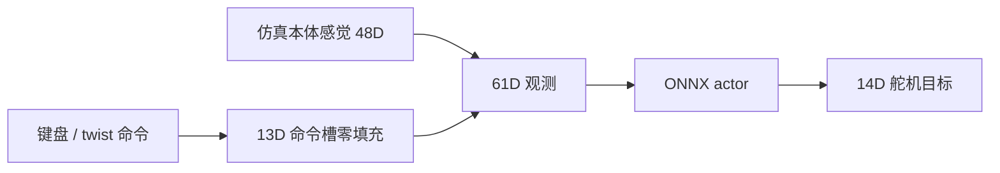

# 具身智能入门② · 不写代码把 Microduck「玩」明白

## 一句话定义

在 **CPU/GPU 仿真** 里用官方脚本驱动已导出 ONNX，把 **命令槽 → 观测 → 动作** 的数据流玩熟，再谈改奖励或上真机。

## 英文缩写速查

| 缩写 | 英文全称 | 简要说明 |
|------|----------|----------|
| MDP | Markov Decision Process | 观测/奖励/终止在 `mdp.py` 集中 |
| BAM | Better Actuator Models | 默认电压舵机仿真；`--no-bam` 为对照 |
| DR | Domain Randomization | 训练随机化；玩预训策略时不改 |
| CPU | Central Processing Unit | `infer_policy` 可在 CPU MuJoCo 彩排 |
| GPU | Graphics Processing Unit | `play` / `train` 走 MuJoCo Warp |

## 为什么重要

- **部署彩排** 与 **训练查看器** 分离：`infer_policy.py` 更贴近 Runtime 命令语义。
- 多策略热切换（walk / stand / sitstand / roulade）是 Microduck 工程模式，不是单 giant policy。

## 核心原理

## 工程实践

| 目标 | 命令 |
|------|------|
| 看 GPU 训练结果 | `uv run play Mjlab-Velocity-Flat-MicroDuck --wandb-run-path …` |
| 键盘彩排 ONNX | `uv run scripts/infer_policy.py --walking output.onnx --new-cmd-obs` |
| 多策略切换 | 追加 `--standing`、`--sitstand`、`--roulade` 等 |

- 部署 idle 常对应 **twist 全零**；勿与「策略不响应按键」混淆（见 [Microduck RL](../entities/pollen-microduck-rl.md) AGENTS 命令槽说明）。

## 局限与风险

- `play` 会自动应用 obs 归一化，**不能**用来验证手转 checkpoint。
- 无头环境需 `xvfb-run`；退出方式影响 CSV 落盘（见 ③下 / ④）。

## 关联页面

- [③上 云 GPU 训练](./zhixing-microduck-primer-part3a-cloud-gpu-ppo-training.md)
- [mjlab 实体](../entities/mjlab.md)

## 参考来源

- [wechat_zhixing_microduck_primer_part2_play_no_code_2026-10-02.md](../../sources/blogs/wechat_zhixing_microduck_primer_part2_play_no_code_2026-10-02.md)

## 推荐继续阅读

- [microduck_rl infer_policy 源码](https://github.com/pollen-robotics/microduck_rl/blob/develop/scripts/infer_policy.py)
