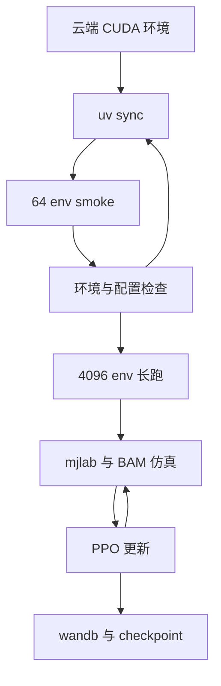

# 具身智能入门③（上）· 云 GPU 跑通 PPO 训练

## 一句话定义

在 **云端 CUDA 实例**（含国内免费 GPU 实践）克隆 [microduck_rl](https://github.com/pollen-robotics/microduck_rl)，用 **smoke → 长跑** 两阶段跑通主行走任务 PPO。

## 英文缩写速查

| 缩写 | 英文全称 | 简要说明 |
|------|----------|----------|
| PPO | Proximal Policy Optimization | rsl_rl on-policy 训练 |
| CUDA | Compute Unified Device Architecture | MuJoCo Warp 训练必需 |
| HF Jobs | Hugging Face Jobs | 无云 GPU 时的 `--hf-jobs` 备选 |
| env | parallel environments | 4096 并行为 README 推荐量级 |
| uv | Astral uv | 官方包管理与 `uv run` 入口 |

## 为什么重要

- 把 **环境错误** 压在 smoke（64 env × 5 iter）阶段，避免云端长跑空烧。
- 与 [BAM](../entities/paper-bam-extended-friction-servo-actuators.md) + DR 绑定的任务_cfg 一并生效，勿在 smoke 通过前改奖励。

## 结构与流程图

以下按本页已归纳的机制与资料绘制，表示模块或阅读路径关系。



## 核心原理

训练环：`mjlab` Warp 仿真 → PPO 50 Hz 决策 → BAM XL330 电压律 + DR → rsl_rl 更新；日志进 wandb 项目 `mjlab_microduck`。

## 工程实践

```bash
git clone https://github.com/pollen-robotics/microduck_rl && cd microduck_rl
uv sync
uv run train Mjlab-Velocity-Flat-MicroDuck --env.scene.num-envs 64 --agent.max_iterations 5
uv run train Mjlab-Velocity-Flat-MicroDuck --env.scene.num-envs 4096
```

- 魔搭等镜像若提供 `setup_env.sh`，先 `source` 再执行上述命令（④ 文内路径 `/mnt/workspace/setup_env.sh`）。
- ARM 首次 sync：export `UV_HTTP_TIMEOUT=600`（见官方 AGENTS.md）。

## 局限与风险

- 无 GPU 时必须 `--hf-jobs` 或换机器；CPU-only torch 无法 Warp 训练。
- 云盘 checkpoint 需自行管理；export 与 Rust 篇在 **本机** 进行。

## 关联页面

- [③下 日志与 ONNX](./zhixing-microduck-primer-part3b-ppo-logs-onnx-export.md)
- [PPO 方法页](../methods/ppo.md)

## 参考来源

- [wechat_zhixing_microduck_primer_part3a_cloud_gpu_ppo_2026-10-02.md](../../sources/blogs/wechat_zhixing_microduck_primer_part3a_cloud_gpu_ppo_2026-10-02.md)

## 推荐继续阅读

- [microduck_rl Quickstart](https://github.com/pollen-robotics/microduck_rl#quickstart)
