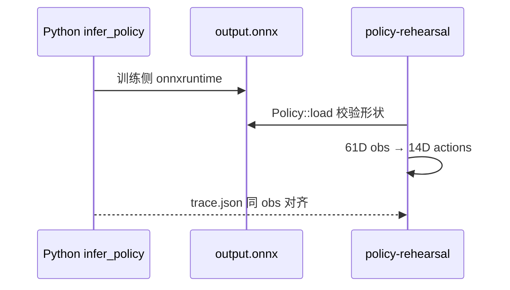

# 具身智能入门④ · Rust 运行时加载 ONNX（mock）

## 一句话定义

在 **不开电机总线** 的前提下，用 `Policy::load` 把 ③下 导出的 ONNX 载入 Rust，**加载期校验** 61→14 维与 ORT 动态库，并用 `trace.json` 与 Python 推理 **数值对齐**。

## 英文缩写速查

| 缩写 | 英文全称 | 简要说明 |
|------|----------|----------|
| ORT | ONNX Runtime | `ort` crate load-dynamic 加载 |
| JSON | JavaScript Object Notation | `policy-rehearsal` 终端输出格式 |
| NaN | Not a Number | 加载/热身阶段即拒绝 |
| p50 | 50th percentile | 推理延迟分位（相对 20 ms 周期） |
| mock | Mock / offline replay | 用录制观测替代真机传感器 |

## 为什么重要

- **仿真推理通** ≠ **Runtime 能加载**；壳层差异（dlopen、校验时机）只在 Rust 端暴露。
- Microduck 设计：**load 失败 → 保持姿态 + 健康门回滚**，避免变砖。

## 核心原理

- Feed-forward 策略：无 `h_in/c_in`；PPO 默认 walk 属此类。
- 规范权威：[policy-manifest.md](https://github.com/pollen-robotics/microduck/blob/main/docs/policy-manifest.md) schema 2。

## 工程实践

1. 安装 Rust toolchain + **ONNX Runtime ≥ 1.23**（Mac 示例见 raw ④ 全文 `ORT_DYLIB_PATH`）。
2. `cargo run --release -p duck-control --example policy-rehearsal -- output.onnx`
3. 单步对齐：`… -- output.onnx trace.json`；对比 `obs.csv` 第 100 步 action，最大差应 ~1e-9。
4. 坏图回归：`duck-control/tests/fixtures/bad_*.onnx`（10 个加载期失败用例）。

## 局限与风险

- `scope: actor inference only` — JSON _benchmark **不含** 传感器与电机 I/O。
- 编译通过 **不证明** ORT 已装；首次推理才 dlopen。
- 系列预告「Sim-to-Real 调优」为后续文，不在本专辑 5 篇内。

## 关联页面

- [Pollen Microduck](../entities/pollen-microduck.md)
- [③下 ONNX 导出](./zhixing-microduck-primer-part3b-ppo-logs-onnx-export.md)

## 参考来源

- [wechat_zhixing_microduck_primer_part4_rust_runtime_onnx_2026-10-02.md](../../sources/blogs/wechat_zhixing_microduck_primer_part4_rust_runtime_onnx_2026-10-02.md)
- [抓取全文 raw](../../sources/raw/wechat_zhixing_microduck_primer_part4_rust_runtime_onnx_2026-10-02.md)

## 推荐继续阅读

- [policy.rs 加载校验注释](https://github.com/pollen-robotics/microduck/blob/main/duck-control/src/policy.rs)
