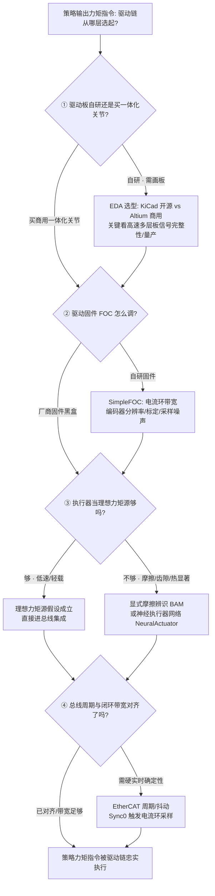

# Query：执行器驱动链选型闭环知识链

> **Query 产物**：本页由以下问题触发：「策略（RL/MPC）算出来的关节力矩指令，最终由什么样的电子硬件驱动链落地——从画驱动板、写 FOC 固件、给执行器建模辨识摩擦，到用实时总线把它们闭环起来，中间分几层、每层选什么工具/方案、数据手册标称参数和真机实测曲线为什么对不上、执行器建到多真才够、总线跑得快是不是就等于闭环带宽高？」
> 综合来源：[KiCad（开源 EDA）](../entities/kicad.md)、[Altium Designer（商用 EDA）](../entities/altium-designer.md)、[SimpleFOC（开源 FOC 驱动固件）](../entities/simplefoc.md)、[NeuralActuator（神经执行器建模）](../entities/paper-neuralactuator-neural-actuation-modeling.md)、[BAM（执行器摩擦辨识）](../entities/bam-better-actuator-models.md)、[Implicit/Explicit 执行器建模](../concepts/implicit-explicit-actuator-modeling.md)、[EtherCAT 协议基础](../concepts/ethercat-protocol.md)。它是[具身大模型分类学选型闭环](./embodied-fm-taxonomy-loop.md)（选哪一类策略）与[具身大模型评测基准选型闭环](./embodied-eval-benchmark-selection-loop.md)（怎么证明它）的**硬件侧姊妹链**——回答「策略的力矩指令能不能被真实驱动链忠实执行」。

## TL;DR：四层驱动链选型闭环一句话定位

「把策略的力矩指令落到真机」不是「买一体化关节接上就行」，而是一条**从电路设计到实时总线、层层要对齐「标称 ↔ 实测」的分层执行链**。每一层选的对象、代价、易踩的坑都不同，**上一层参数漂亮不代表下一层能忠实执行**——数据手册峰值力矩 ≠ 持续可用力矩、FOC 电流环带宽 ≠ 编码器分辨率够用、执行器网络拟合好 ≠ 分布外不漂移、总线周期快 ≠ 闭环带宽高。选错某一层的选型判据，就会让「理想力矩源」这个策略赖以成立的抽象在真机上悄悄破掉：

| 层 | 选什么 | 代表性工具/方案 | 核心取舍 | 这一层最容易骗人的地方 |
|----|--------|----------------|----------|------------------------|
| ① EDA 电路设计 | 驱动板/BMS/传感转接板怎么画、自研 vs 商用一体化关节 | [KiCad](../entities/kicad.md)（开源）、[Altium Designer](../entities/altium-designer.md)（商用） | 开源够用 vs 高速多层板信号完整性；自研省钱 vs 可靠性/调试成本 | 原理图过 ERC/DRC ≠ 高速板信号完整性 OK |
| ② 电机驱动固件 FOC | 电流环带宽、编码器分辨率、标定策略 | [SimpleFOC](../entities/simplefoc.md) + [FOC 磁场定向控制](../concepts/field-oriented-control.md) | 电流环带宽 vs 编码器分辨率/采样噪声 | 电流环带宽拉高 ≠ 位置/力矩精度自动变好 |
| ③ 执行器建模与摩擦辨识 | 理想力矩源假设何时破、显式摩擦 vs 神经执行器网络 | [BAM 摩擦辨识](../entities/bam-better-actuator-models.md)、[NeuralActuator](../entities/paper-neuralactuator-neural-actuation-modeling.md)、[Actuator Network](../methods/actuator-network.md) | 建模保真度 vs 辨识成本；解析可解释 vs 网络拟合外推 | 拟合训练集好 ≠ 分布外温升/负载漂移不崩 |
| ④ 实时总线闭环集成 | 总线周期/抖动与控制带宽的关系 | [EtherCAT](../concepts/ethercat-protocol.md) + [主站优化](./ethercat-master-optimization.md) | 总线周期 vs 闭环带宽；吞吐 vs 抖动确定性 | 周期设到 1kHz ≠ 闭环带宽就有 1kHz |

**总原则**：驱动链选型的第一问永远是「**这一层的标称参数，和它在真机负载/热/分布外条件下的实测行为，差在哪、什么时候差到会破坏上层假设**」。越靠上层（画板、写固件）越好量化、越可复现；越靠下层（执行器辨识、总线闭环）越依赖真机实测、越难一次调对。一条负责任的驱动链要**逐层把「理想力矩源」这个抽象压实到真机**，而不是停在某个标称参数漂亮的中间层上。

---

## 四层驱动链选型决策树

---

## 1. ① EDA 电路设计层：原理图过检 ≠ 板子能用

整条驱动链的物理入口是**关节驱动板 / BMS / 传感转接板的电子设计**，第一道选型是**自研驱动板 vs 采购商用一体化关节**，以及自研时**开源 EDA vs 商用 EDA**：

- **选什么**：[KiCad](../entities/kicad.md) 是 GPLv3 开源套件，覆盖层次化原理图、交互布线、ERC/DRC、SPICE、3D 预览与 `kicad-cli` 批处理，把驱动板设计真值落到可打样的 Gerber 与 BOM；[Altium Designer](../entities/altium-designer.md) 是商用统一环境，强在规则驱动的高速 layout、发布/制造 OutJob 与 ECAD-MCAD CoDesigner 机壳协同，偏量产向流程。
- **取舍主线**：**开源够用 vs 高速多层板信号完整性**——中低速驱动板/传感板 KiCad 完全够用且零授权成本；一旦是高速多层板（高频 PWM、编码器差分、EtherCAT 物理层），阻抗控制、层叠规划、约束驱动布线的成熟度会拉开差距。**自研省钱 vs 可靠性/调试成本**——自研省下一体化关节溢价，但把 bring-up、批次一致性、返修调试成本转嫁到自己身上。
- **典型误判**：把「原理图过了 ERC、PCB 过了 DRC」当成「板子在真机上一定稳」——ERC/DRC 是**几何/连接规则**，覆盖不了高速信号完整性、电源纹波在电机换向重载下的实际表现，这些要到固件 bring-up 与实测才暴露。

## 2. ② 电机驱动固件 FOC 层：电流环带宽不是万能旋钮

板子能用之后，**驱动固件把母线电压变成受控的相电流/力矩**，核心是磁场定向控制（FOC）的几个耦合参数：

- **选什么/调什么**：[SimpleFOC](../entities/simplefoc.md)（Arduino-FOC 生态）提供跨 MCU 的 [FOC](../concepts/field-oriented-control.md) 实现与模块化电机/驱动/传感/电流采样对象，适合 BLDC/步进的低功率闭环与学习；工程上要定的是**电流环带宽、编码器分辨率、电角度/零位标定与电流采样噪声**。
- **取舍主线**：**FOC 电流环带宽 vs 编码器分辨率制约**——电流环带宽拉高能让力矩响应更快，但位置/速度反馈的**编码器分辨率与采样噪声**会成为力矩精度的实际上限；分辨率不够时，一味拉高电流环带宽只会把噪声放大进力矩，得不偿失。标定质量（零位、相序、死区补偿）往往比带宽数字更决定最终力矩保真度。
- **典型误判**：把「电流环带宽 = 力矩控制质量」；实际上标称[力矩-电流曲线](../concepts/motor-torque-current-curve.md)在饱和区、[力矩-转速曲线](../concepts/motor-torque-speed-curve.md)在弱磁区都会偏离线性，固件层的标定和限幅决定了这些非线性区的行为。

## 3. ③ 执行器建模与摩擦辨识层：理想力矩源假设何时破

到这一层才正面回答**「策略把执行器当理想力矩源」这个抽象在真机上何时破**——摩擦、齿隙、带宽、热约束都会让「下发力矩 = 实际输出力矩」不成立：

- **选什么/建什么**：路线分两支——**显式解析摩擦模型**（[BAM](../entities/bam-better-actuator-models.md) / BAM-extended 用实测辨识 Stribeck/黏滞/库仑等[关节摩擦](../concepts/joint-friction-models.md)参数，可解释、参数少）与**数据驱动神经执行器网络**（[NeuralActuator](../entities/paper-neuralactuator-neural-actuation-modeling.md) / [Actuator Network](../methods/actuator-network.md) 用真机数据端到端拟合指令→力矩映射，拟合力强但外推需谨慎）。这条链与仿真侧的 [Implicit/Explicit 执行器建模](../concepts/implicit-explicit-actuator-modeling.md) 直接对接——explicit 路线正是把这些辨识出的执行器模型写回仿真。
- **取舍主线**：**建模保真度 vs 辨识成本**——理想力矩源假设最省事但最容易破；显式摩擦模型辨识成本中等、可解释；神经执行器网络保真度上限高但要负载在环采数据、且**分布外（温升、老化、异常负载）容易漂移**。是否值得往上建，取决于 sim2real gap 里执行器层的贡献占比（可用 [SAGE](../entities/sage-sim2real-actuator-gap-estimator.md) 这类 sim2real 执行器 gap 估计来定位）。
- **典型误判**：① 把「执行器网络在训练集拟合好」当成「真机各工况都准」——分布外温升/负载漂移是主要失效源；② 用**开环标定**（空载扫参数）代替**负载在环辨识**，得到的摩擦/力矩曲线在真实接触工况下系统性偏。

## 4. ④ 实时总线闭环集成层：总线周期 ≠ 闭环带宽

最后一层把画好的板、调好的固件、辨识好的执行器**用实时总线闭环起来**，核心误区是把总线周期直接当闭环带宽：

- **选什么/配什么**：[EtherCAT](../concepts/ethercat-protocol.md) 是人形底层总线首选，靠「运行中处理」与分布式时钟（DC）支撑硬实时；工程上要配的是**周期时间（12 关节以上建议 1kHz/2kHz）、报文偏移、用 Sync0 触发电流环采样、网卡中断隔离**等（见 [EtherCAT 主站优化](./ethercat-master-optimization.md)）。
- **取舍主线**：**总线周期快 ≠ 闭环带宽高**——闭环带宽受限于整条链路里最慢的环节（电流环 → 编码器采样 → 总线周期 → 主站计算 → 抖动裕度）与稳定裕度；总线周期只是其中一环，抖动（jitter）的确定性往往比平均周期更决定能不能把控制增益拉上去。**吞吐 vs 抖动确定性**——把所有电机 PDO 打进一帧提升吞吐，但要保证 WKC 一致与周期抖动可控。
- **典型误判**：① 把周期设到 1kHz 就认为闭环带宽有 1kHz——真实闭环带宽通常只有总线频率的几分之一；② 在 EtherCAT 循环里做 `printf`/文件 I/O 导致延迟累计；③ 忽略高频振动下 RJ45 接头/屏蔽层松动带来的偶发丢包。

---

## 驱动链选型矛盾速查（按取舍归因）

| 矛盾 | 一端 | 另一端 | 选型第一判据 |
|------|------|--------|-------------|
| 标称 vs 实测力矩 | 数据手册峰值力矩 | 持续力矩受热约束 | 工况是峰值瞬时还是持续负载 |
| 带宽 vs 分辨率 | FOC 电流环带宽拉高 | 编码器分辨率/采样噪声上限 | 力矩精度瓶颈在带宽还是反馈 |
| 保真度 vs 成本 | 神经执行器网络拟合强 | 显式摩擦模型省数据可解释 | gap 中执行器占比 + 外推需求 |
| 拟合 vs 外推 | 训练集拟合好 | 分布外温升/负载漂移 | 部署工况是否超出采数据分布 |
| 周期 vs 带宽 | 总线周期设得快 | 闭环带宽受最慢环节限 | 抖动确定性与稳定裕度 |
| 开源 vs 商用 EDA | KiCad 零成本够用 | 高速多层板信号完整性 | 是否高速多层板/量产 |
| 自研 vs 一体化 | 自研驱动板省钱 | 商用关节可靠/免调试 | 团队 bring-up/返修能力 |

## 典型失败模式速查（按驱动链层归因）

| 现象 | 最可能出错的驱动链层 | 第一优先排查 |
|------|--------------------|-------------|
| 仿真力矩很准真机抖/软 | ③ 理想力矩源假设破（摩擦/齿隙） | 补 BAM 摩擦辨识或执行器网络 |
| 力矩响应快但定位精度差 | ② 电流环带宽拉高但编码器分辨率不足 | 查编码器分辨率/标定，而非再拉带宽 |
| 训练工况准新工况崩 | ③ 执行器网络分布外漂移 | 扩负载/温度分布，查开环 vs 负载在环 |
| 控制增益一拉就振荡 | ④ 把总线周期当闭环带宽 | 按最慢环节+抖动重估真实带宽 |
| 重载换向时电源纹波/复位 | ① 高速板电源完整性 | 回 layout 查层叠/去耦，非固件 |
| 偶发丢包/状态机卡 Pre-Op | ④ 总线物理层/PDO 映射 | 查屏蔽接头 + ESI/PDO 一致性 |

---

## 英文缩写速查

| 缩写 | 英文全称 | 简要说明 |
|------|----------|----------|
| EDA | Electronic Design Automation | 电子设计自动化，①层原理图/PCB 工具总称 |
| ERC/DRC | Electrical/Design Rule Check | 电气/设计规则检查，几何连接层的过检项 |
| FOC | Field-Oriented Control | 磁场定向控制，②层把母线电压变受控相电流 |
| BLDC | Brushless DC Motor | 无刷直流电机，②层被驱动对象 |
| PWM | Pulse-Width Modulation | 脉宽调制，②层功率级驱动方式 |
| BAM | Better Actuator Models | ③层可微执行器摩擦辨识框架 |
| EtherCAT | Ethernet for Control Automation Technology | ④层人形底层硬实时总线 |
| DC | Distributed Clock | EtherCAT 分布式时钟，支撑硬实时同步 |
| PDO | Process Data Object | EtherCAT 周期过程数据，打帧提升吞吐 |
| WKC | Working Counter | EtherCAT 判定通信成功的唯一计数 |

## 参考来源

- [kicad-org.md](../../sources/sites/kicad-org.md) — ①层开源 EDA 官方一手资料，原理图→PCB→制造链路
- [altium-designer-primary-refs.md](../../sources/sites/altium-designer-primary-refs.md) — ①层商用 EDA 官方文档入口，高速 layout/量产发布
- [simplefoc_arduino_foc.md](../../sources/repos/simplefoc_arduino_foc.md) — ②层开源 FOC 驱动固件与参考硬件
- [neuralactuator_arxiv_2607_11734.md](../../sources/papers/neuralactuator_arxiv_2607_11734.md) — ③层神经执行器建模，数据驱动指令→力矩映射
- [bam_extended_friction_servos_arxiv_2410_08650.md](../../sources/papers/bam_extended_friction_servos_arxiv_2410_08650.md) — ③层伺服执行器摩擦辨识（BAM-extended）

## 关联页面

- 姊妹 Query：[具身大模型分类学选型闭环](./embodied-fm-taxonomy-loop.md) — 「选哪一类策略」，本页承接「策略力矩指令怎么被硬件执行」
- 姊妹 Query：[具身大模型评测基准选型闭环](./embodied-eval-benchmark-selection-loop.md) — 「怎么评测/证明它」，与本页共同兜底 sim↔real
- [EtherCAT 主站优化](./ethercat-master-optimization.md) — ④层实时总线闭环集成的深度调优
- [Implicit/Explicit 执行器建模](../concepts/implicit-explicit-actuator-modeling.md) — ③层执行器模型写回仿真的仿真侧对接
- [EtherCAT 协议基础](../concepts/ethercat-protocol.md) — ④层硬实时总线的协议基础
- [KiCad（开源 EDA）](../entities/kicad.md) — ①层开源电路设计真值
- [Altium Designer（商用 EDA）](../entities/altium-designer.md) — ①层商用量产向 EDA
- [SimpleFOC（开源 FOC 生态）](../entities/simplefoc.md) — ②层开源驱动固件
- [BAM（执行器摩擦辨识）](../entities/bam-better-actuator-models.md) — ③层显式摩擦辨识路线
- [NeuralActuator（神经执行器建模）](../entities/paper-neuralactuator-neural-actuation-modeling.md) — ③层数据驱动执行器网络路线
- [SAGE（sim2real 执行器 gap 估计）](../entities/sage-sim2real-actuator-gap-estimator.md) — ③层定位执行器层 gap 占比
- [Actuator Network](../methods/actuator-network.md) — ③层执行器网络方法页
- [力矩-电流曲线](../concepts/motor-torque-current-curve.md) — ②层力矩标称非线性的物理背景
- [力矩-转速曲线](../concepts/motor-torque-speed-curve.md) — ②层弱磁/饱和区偏离线性的背景
- [电机驱动固件与总线协议（专题）](../overview/motor-drive-firmware-bus-protocols.md) — 驱动链各层的专题汇总入口
