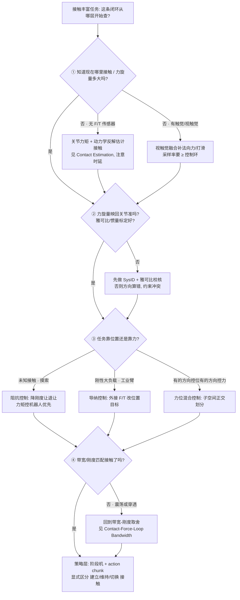

# Query：接触力旋量闭环知识链

> **Query 产物**：本页由以下问题触发：「我要做接触丰富的操作，从『手碰到东西』到『稳定用力完成任务』中间到底有哪几层，每一层各自解决什么、怎么互相约束、哪一层做不好会怎样失败？」
> 综合来源：[Contact Estimation](../concepts/contact-estimation.md)、[Force Control Basics](../concepts/force-control-basics.md)、[Hybrid Force-Position Control](../concepts/hybrid-force-position-control.md)、[Impedance Control](../concepts/impedance-control.md)、[Visuo-Tactile Fusion](../concepts/visuo-tactile-fusion.md)。

## TL;DR：四层闭环一句话定位

接触丰富操作不是「一个力控器」就能解决的，它是一条**自下而上互相约束的闭环链**。任意一层偷工，上层都补不回来：

| 层 | 名字 | 解决什么 | 关键产物 | 这一层崩了会怎样 |
|----|------|---------|---------|----------------|
| ① 感知/估计 | 接触感知与力旋量估计 | 「现在哪里接触、接触力旋量多大」 | 接触集合 + 估计的 6D 力旋量 $\mathbf{w}=[\mathbf{f},\boldsymbol{\tau}]$ | 估计有偏/滞后 → 上层在错误的力上做闭环 |
| ② 表示 | 力旋量表示与映射 | 把接触力统一成可控的 6D 量并映回关节 | $\boldsymbol{\tau}_{joint}=J^\top\mathbf{w}$、摩擦锥约束 | 雅可比/惯量不准 → 力方向算错，约束冲突 |
| ③ 控制 | 阻抗 / 导纳 / 力位混合 | 「误差与接触力之间该是什么关系」 | 期望刚度/阻尼、力位子空间划分 | 选型/带宽不当 → 接触震荡、穿透或顶死 |
| ④ 策略 | 接触丰富操作策略 | 「下一步做什么动作、何时切接触模态」 | action chunk + 阶段机 | 不分接触阶段 → 把找位、调力、恢复混成一锅 |

**总原则**：先保证「**这一层的输出是上一层能消化的**」——感知带宽要跟得上控制带宽，控制刚度要匹配接触环境与估计噪声，策略的动作粒度要给底层留出力控缓冲的时间。

---

## 四层闭环决策树

---

## 1. ① 感知/估计层：闭环的「真值」从哪来

整条闭环最容易被忽视的前提是：**控制器闭的是「估计出来的力」，不是「真实的力」**。

- **无力传感器时**：从关节力矩/速度反解接触状态与力旋量（见 [Contact Estimation](../concepts/contact-estimation.md)），代价是引入估计时延与模型误差。
- **有触觉/视触觉时**：触觉给法向力与打滑的高频证据，视觉给接触前的几何预判，二者需要时间对齐（见 [Visuo-Tactile Fusion](../concepts/visuo-tactile-fusion.md)）。
- **数据驱动接触提示**：CHORD 把视频里的接触力旋量蒸馏成可学习的引导信号，SceneBot 用 contact-prompted 的方式驱动全身场景交互——它们本质上都是在「替策略补上接触感知这一层」。

> 工程判据：感知层的有效带宽必须 ≥ 控制层期望带宽，否则控制器在「过时的力」上闭环，必然震荡。这条约束在 [Contact-Force-Loop Bandwidth](../concepts/contact-force-loop-bandwidth.md) 里被量化。

## 2. ② 表示层：把接触统一成 6D 力旋量

接触不该被当成「一个数」，而是一个 6D 力旋量 $\mathbf{w}=[\mathbf{f},\boldsymbol{\tau}]^\top$。表示层做两件事：

1. **统一**：把多点接触、摩擦、法向/切向都收进力旋量与摩擦锥约束（见 [Force Control Basics](../concepts/force-control-basics.md)）。
2. **映射**：通过雅可比转置 $\boldsymbol{\tau}_{joint}=J^\top\mathbf{w}$ 映回关节力矩。这一步对雅可比与惯量标定极其敏感——标定不准，算出来的「力的方向」就是错的，上层再好的控制律也救不回来。

## 3. ③ 控制层：阻抗 / 导纳 / 力位混合怎么选

这一层回答「位姿误差与接触力之间应该是什么关系」，三条主路线互为对偶或正交：

- **阻抗控制**（输入位移→输出力）：适合未知接触、需要主动退让的场景，要求力矩控制硬件，响应快。见 [Impedance Control](../concepts/impedance-control.md)。
- **导纳控制**（输入力→输出位移修正）：适合刚性大负载工业臂、外接 F/T 传感器，实现简单但带宽受限。
- **力位混合控制**：把任务空间正交拆成「控位子空间」和「控力子空间」，适合拧螺丝、擦拭、沿面滑动。见 [Hybrid Force-Position Control](../concepts/hybrid-force-position-control.md)。

**对偶陷阱**：阻抗与导纳在接触刚度未知时表现相反——环境越硬，阻抗控制要把刚度调**低**才稳；导纳控制则在软环境里容易迟钝。选错范式比调错参数更致命。

## 4. ④ 策略层：把闭环交给「会分阶段的策略」

最上层不再是一个控制律，而是决定「下一步做什么、何时切接触模态」。关键是**显式区分接触阶段**：接触建立（别撞太猛）→ 接触维持（稳住法向力与摩擦）→ 接触切换（贴住→滑动→插入）。详见 [Contact-Rich Manipulation](../concepts/contact-rich-manipulation.md) 与 [Query：接触丰富操作实践指南](./contact-rich-manipulation-guide.md)。策略输出的 action chunk 必须给底层力控留出执行窗口，否则等于绕过了②③两层。

---

## 典型失败模式速查（按层归因）

| 现象 | 最可能的崩溃层 | 第一优先排查 |
|------|--------------|-------------|
| 接触瞬间剧烈震荡 | ③ 带宽/刚度 vs ① 感知时延 | 降刚度或提感知带宽，见 bandwidth 页 |
| 力方向不对、越控越偏 | ② 雅可比/惯量标定 | 重做 SysID 与雅可比校核 |
| 软环境里反应迟钝 | ③ 错用导纳 | 改阻抗 + 力矩控制 |
| 卡住/侧向顶死 | ④ 没分接触阶段 | 加阶段机 + 搜索动作 |
| 打滑漏检导致掉物 | ① 触觉采样率不足 | 提触觉采样率 ≥ 控制环 |

---

## 英文缩写速查

| 缩写 | 英文全称 | 简要说明 |
|------|----------|----------|
| Wrench | Force-Torque Wrench | 6D 力旋量 $[\mathbf{f},\boldsymbol{\tau}]$，统一描述接触力与力矩 |
| F/T | Force/Torque Sensor | 力/力矩传感器，提供 6D 接触力旋量测量 |
| WBC | Whole-Body Control | 协调全身关节满足多任务/约束的控制基础设施 |
| TSID | Task-Space Inverse Dynamics | 任务空间逆动力学求解关节力矩的 WBC 实现 |
| SysID | System Identification | 系统辨识，标定惯量/摩擦/雅可比等模型参数 |
| Manipulation | Robot Manipulation | 抓取、移动、操作物体的任务总称 |

## 参考来源

- [sources/papers/contact_dynamics.md](../../sources/papers/contact_dynamics.md) — 接触力、摩擦锥、力位约束基础
- [sources/papers/contact_planning.md](../../sources/papers/contact_planning.md) — 接触序列组织与接触约束规划
- [sources/papers/chord_nvidia_video_to_data_2026.md](../../sources/papers/chord_nvidia_video_to_data_2026.md) — 接触力旋量引导灵巧操作（视频蒸馏接触提示）
- [sources/papers/scenebot_arxiv_2606_27581.md](../../sources/papers/scenebot_arxiv_2606_27581.md) — contact-prompted 全身场景交互跟踪
- [sources/papers/hapmorph_arxiv_2509_05433.md](../../sources/papers/hapmorph_arxiv_2509_05433.md) — 可穿戴触觉渲染，感知层力反馈证据

## 关联页面

- [Contact-Force-Loop Bandwidth（力控闭环带宽 ↔ 接触稳定性）](../concepts/contact-force-loop-bandwidth.md) — 本链「带宽/刚度/时延取舍」的量化概念页
- [Contact Estimation（接触估计）](../concepts/contact-estimation.md) — ① 感知/估计层
- [Force Control Basics（力控制基础）](../concepts/force-control-basics.md) — ② 力旋量表示层
- [Hybrid Force-Position Control（力位混合控制）](../concepts/hybrid-force-position-control.md) — ③ 控制层（力位正交划分）
- [Impedance Control（阻抗控制）](../concepts/impedance-control.md) — ③ 控制层（阻抗/导纳对偶）
- [Visuo-Tactile Fusion（视触觉融合）](../concepts/visuo-tactile-fusion.md) — ① 感知层视触觉证据
- [Contact-Rich Manipulation（接触丰富操作）](../concepts/contact-rich-manipulation.md) — ④ 策略层
- [Query：接触丰富操作实践指南](./contact-rich-manipulation-guide.md) — 任务视角的执行层选型姊妹篇
