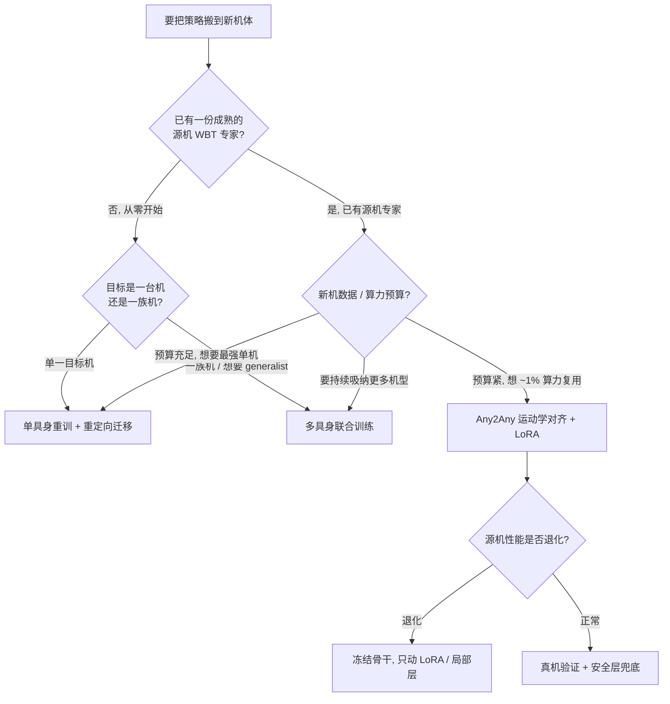

> **Query 产物**：本页由以下问题触发：「同一段人形运动控制能力要搬到一台新机器人，单具身重训、Any2Any 高效后训练、多具身联合训练这三条路怎么选、各踩什么坑？」
> 综合来源：[Whole-Body Tracking Pipeline](../concepts/whole-body-tracking-pipeline.md)、[Any2Any](../entities/paper-any2any-cross-embodiment-wbt.md)、[SONIC](../methods/sonic-motion-tracking.md)、[Motion Retargeting Pipeline](../concepts/motion-retargeting-pipeline.md)、[Behavior Foundation Model](../concepts/behavior-foundation-model.md)

# 跨具身策略迁移选型指南

**问题定位**：[Whole-Body Tracking Pipeline](../concepts/whole-body-tracking-pipeline.md) 的**阶段 5（跨具身迁移）** 是一道独立的工程岔路——把「在机器人 A 上能用的全身控制策略」搬到机器人 B（不同 DoF、观测布局、关节限位、质量分布、动力学）上。本页把三条主流路径放进 **「数据需求 × 算力成本 × 跨机泛化」** 同一坐标系里，给出可执行的选型决策树与各自的典型故障模式。

> **一句话区分**：单具身重训「**每台机从头训一份，最稳但最烧卡**」；Any2Any「**冻结源机专家，运动学对齐 + 低秩动力学补丁，~1% 算力搬新机**」；多具身联合训练「**一开始就把多机塞进同一份训练，换统一动作空间换泛化**」。

---

## 一句话定义

| 路径 | 一句话 | 典型入口 |
|------|--------|----------|
| **单具身重训 + 重定向迁移** | 目标机重新跑一遍参考池 → 重定向 → 训练全链路；只复用**数据与配方**，不复用策略权重。 | [Motion Retargeting Pipeline](../concepts/motion-retargeting-pipeline.md) + [BeyondMimic](../methods/beyondmimic.md) |
| **Any2Any 高效后训练** | 冻结源机 WBT 专家，差距拆成**无梯度运动学对齐** + **动力学敏感层 LoRA**，约 1% 全量算力迁到新机。 | [Any2Any](../entities/paper-any2any-cross-embodiment-wbt.md) |
| **多具身联合训练** | 从一开始就把多台机器人塞进同一训练，用统一观测/动作编码吸收差异，训出一个 generalist 骨干。 | [SONIC](../methods/sonic-motion-tracking.md) 多具身路线 / [BFM](../concepts/behavior-foundation-model.md) |

**灵巧手子栈（与上表正交）：** 若迁移对象是 **多指灵巧手** 而非整身人形，[UHAS](../methods/uhas-unified-hand-action-space.md) 用 **规范球面形变 + 级联 IK** 定义共享动作空间，在 [手内重定向](../methods/in-hand-reorientation.md) 上实证 **四手单策略、零样本与 500 iter 微调**（Allegro / LEAP / Shadow / MANO）。选型时勿把人形 WBT 的 token/LoRA 经验直接套到手指关节层。

**末端/工具接口轴（与整机迁移正交）：** 若「换具身」主要是换夹爪或工具头而非换整机骨架，见 [GEN-1 千手](../entities/generalist-gen1-thousand-hands.md)——闭源产业样本用多末端混合预训练 + 视觉条件化，并演示任务中途换手；工程上可借鉴其评测协议，勿与本页三条 WBT 路径混选。

**正交维度（机体参数，而非策略权重）：** 若问题从「搬策略」变成「在固定拓扑下改质量、几何、PD、执行器限位等连续设计变量」，见 [Shape Your Body（VGDS 价值梯度共设计）](../entities/paper-shape-your-body-value-gradient-design.md)——先多具身训 URMA critic，再冻结沿 $\nabla_f V$ 搜索，边际约 1–2 min/设计。

---

## TL;DR 决策路径

| 主要约束 | 优先路径 | 理由 |
|----------|----------|------|
| 只有一台目标机、要最稳基线 | 单具身重训 | 配方成熟、可复现、无迁移伪影 |
| 已有源机专家、预算紧 | Any2Any | ~1% 算力，运动学对齐 + LoRA |
| 要服务一族机型 / generalist | 多具身联合训练 | 统一动作空间，边际新增机型成本低 |
| 跨机结构差异大（髋轴、闭链） | Any2Any（对齐层）或重训 | 对齐层必须覆盖结构差异，否则重训 |
| 源机表现不能退化 | Any2Any 冻结骨干 + 局部 LoRA | 避免 catastrophic forgetting |

---

## 三路径核心维度对比

| 维度 | **单具身重训 + 重定向** | **Any2Any 高效后训练** | **多具身联合训练** |
|------|--------------------------|--------------------------|---------------------|
| **复用什么** | 数据 + 配方（不复用权重） | 源机策略权重（冻结 + LoRA） | 一个共享骨干吸收所有机型 |
| **新机数据需求** | 整套参考池重定向 | 少量（后训练样本） | 大（多机型仿真 + 参考） |
| **算力成本** | 高（每台机一份全量训练） | **低（约 1% 全量预训练）** | **极高**（一次性，但摊薄） |
| **跨机泛化** | 无（每台机独立） | 单源 → 单目标，按对迁移 | ✅ 统一空间，天然多机 |
| **结构差异处理** | 重定向阶段吸收 | 运动学对齐层（Level-1 重排 + Level-2 髋/闭链） | 统一动作空间编码 |
| **动力学差异处理** | 域随机化 + 重训 | 动力学敏感层 LoRA 残差 | 联合训练内化 |
| **新增机型边际成本** | 高（再来一遍全量） | 中（再对齐 + 一份 LoRA） | **低（数据里加一台）** |
| **catastrophic forgetting 风险** | 无（互不影响） | 有（需冻结骨干兜底） | 有（联合调度不均会偏科） |
| **典型代表** | BeyondMimic 单具身路线 | [Any2Any](../entities/paper-any2any-cross-embodiment-wbt.md) | [SONIC](../methods/sonic-motion-tracking.md) 多具身 / [BFM](../concepts/behavior-foundation-model.md) |

---

## 分路径选型说明

### 1. 单具身重训 + 重定向迁移：最稳的基线

**何时选**：只有一台目标机；预算允许从头训；想要一条「无迁移伪影」的最强单机基线，或要验证 sim-to-real gap 的归因。

把参考池经 [Motion Retargeting Pipeline](../concepts/motion-retargeting-pipeline.md) 重定向到目标机，再跑一遍训练全链路。它**只复用数据与配方**，策略权重从头学，因此不会引入跨机迁移特有的伪影。代价是**每台机一份全量训练**——机型一多就线性烧卡。

**常见误判**：把「重定向到新机」当成迁移本身。重定向只解决**参考层**的运动学映射；目标机的动力学差异（质量、关节限位、PD）仍需训练阶段的域随机化与重训吸收，不是改改 URDF 就能搬。

### 2. Any2Any 高效后训练：已有专家时的首选

**何时选**：源机上已有成熟 WBT 专家（如 [SONIC](../methods/sonic-motion-tracking.md) / Gear-SONIC），目标机预算紧，想用 ~1% 算力把能力搬过去。

[Any2Any](../entities/paper-any2any-cross-embodiment-wbt.md) 把跨机差距拆成两段：

- **运动学对齐（无梯度）**：Level-1 观测项重排 + Level-2 髋轴解耦 / 闭链处理，把目标机的观测/动作接到源机骨干上。
- **动力学适配（仅训 LoRA）**：在动力学敏感层上低秩更新 $W' = W + BA$，骨干其余冻结。

这套「**对齐 + 低秩补丁**」让单源专家以约 1% 全量预训练成本迁到 LimX Oli/Luna、Unitree G1/H1 等目标机并真机验证。

**常见误判**：(1) 把 Any2Any 当成「再训一个 SONIC」——它是**冻结单源专家 + 后训练**，不是亿级帧从头预训练；(2) 运动学对齐层只做关节 index 重排——必须覆盖**髋轴、闭链**等结构差异，否则动力学 LoRA 会被迫去补本该对齐层解决的问题。

### 3. 多具身联合训练：要 generalist 时才值

**何时选**：要服务**一族机型**而非单台；有大规模多机型仿真与数据预算；想要边际新增机型成本低的长期资产。

从训练之初就把多台机器人塞进同一份训练，用**统一观测/动作空间编码**吸收 DoF 与布局差异，训出一个 generalist 骨干（[SONIC](../methods/sonic-motion-tracking.md) 的多具身路线、[BFM](../concepts/behavior-foundation-model.md) 叙事）。一旦骨干训成，加一台新机型主要是「数据里加一台」，边际成本远低于重训。代价是**前期一次性成本极高**，且联合调度不均容易让某些机型「偏科」。

**常见误判**：以为「多具身 = 自动跨具身」。统一动作空间只在**训练时见过的机型分布**内泛化；分布外的新机仍可能要回到 Any2Any 风后训练或重训。

---

## 三路径不是互斥，而是连续谱

实际系统常**串联**：

1. 先用**多具身联合训练**或**大规模单机预训练**养出一个强骨干（[SONIC](../methods/sonic-motion-tracking.md)）；
2. 遇到分布外的新机型，用 **Any2Any** 运动学对齐 + LoRA 以 ~1% 算力快速适配；
3. 对极端关键的旗舰机型，再退回**单具身重训**榨出最后一点性能与最干净的 sim-to-real。

> 选型的本质不是「谁先进」，而是 **「你愿意把代价付在算力、数据、还是泛化的边界上」**。

---

## 典型故障模式

| 故障模式 | 出现在哪条路径 | 典型表现 | 工程对策 |
|----------|----------------|----------|----------|
| **重定向伪影被放大** | 单具身重训 | 训练曲线好，真机脚滑/穿地 | 加 contact-phase 监督，重定向产物先做 feasibility 检查 |
| **只做关节重排忽略结构差异** | Any2Any | 髋轴/闭链不同导致动作扭曲 | 对齐层必须覆盖髋解耦 $D_r$、闭链 $J_r$，不能只 index 重排 |
| **catastrophic forgetting** | Any2Any / 多具身 | 新机适配后源机表现退化 | 冻结骨干，只动 LoRA / 局部层；联合训练时均衡采样 |
| **联合训练偏科** | 多具身 | generalist 在某些机型上明显弱 | 按机型难度重加权采样，避免数据量大的机型主导梯度 |
| **把重定向当迁移本身** | 单具身重训 | 改完 URDF 直接上，动力学 gap 未处理 | 重定向只解参考层；动力学差异仍需域随机化 + 重训 |
| **新机首日"死机一次"** | 三者皆可能 | 安全层缺失 → 一次摔毁机器 | 力矩/速度护栏先行（见 [Sim2Real](../concepts/sim2real.md) 阶段 6） |
| **误以为多具身 = 自动跨具身** | 多具身 | 分布外新机直接套骨干失败 | 分布外机型回退到 Any2Any 后训练或重训 |

---

## 推荐组合 pipeline

| Pipeline | 组合 | 适用 |
|----------|------|------|
| **单机最强** | 重定向 → 单具身重训 | 旗舰机、论文复现、最干净 sim-to-real |
| **专家搬家** | 源机 SONIC/WBT 专家 → Any2Any 对齐 + LoRA | 新机少数据、保留源先验、~1% 算力 |
| **机群 generalist** | 多具身联合预训练 → 按需 Any2Any 适配新机 | 服务一族机型、长期资产 |
| **混合分层** | 多具身骨干 → Any2Any 快速铺机 → 旗舰机重训 | 大规模产品线 + 旗舰精修 |

---

## 英文缩写速查

| 缩写 | 英文全称 | 简要说明 |
|------|----------|----------|
| WBT | Whole-Body Tracking | 全身参考运动跟踪控制 |
| Sim2Real | Simulation to Real | 把仿真中学到的策略迁移落地真机的工程主线 |
| Retargeting | Motion Retargeting | 将人体/动物动作映射到目标机器人骨架 |
| DoF | Degrees of Freedom | 自由度，人形通常 20–50+ 关节 |
| LoRA | Low-Rank Adaptation | 低秩增量微调，低成本适配大模型 |
| BFM | Behavior Foundation Model | 大规模行为数据预训练的可复用全身行为先验 |
| PD | Proportional–Derivative | 关节位置/阻抗底层控制，策略输出常为其 setpoint |
| DR | Domain Randomization | 训练时随机化仿真参数以提升跨域鲁棒迁移 |
| URDF | Unified Robot Description Format | 统一机器人描述格式 |
| G1 | Unitree G1 Humanoid | 宇树入门级教育科研人形平台 |
| HRL | Hierarchical Reinforcement Learning | 高层技能 + 低层控制分层结构的强化学习 |
| AMP | Adversarial Motion Prior | 用对抗判别约束状态转移接近专家运动分布的先验 |

## 参考来源

- [Any2Any（arXiv:2605.23733）](../../sources/papers/any2any_arxiv_2605_23733.md) — 运动学对齐 + 动力学 LoRA 的跨具身后训练
- [SONIC（arXiv:2511.07820）](../../sources/papers/bfm_awesome_sonic_arxiv_2511_07820.md) — 规模化 tracking 预训练与多具身路线
- [SONIC 在 42 篇 HRL 栈中的策展条目](../../sources/papers/humanoid_rl_stack_17_sonic_supersizing_motion_tracking_for_natural_hu.md)

## 关联页面

- [Whole-Body Tracking Pipeline](../concepts/whole-body-tracking-pipeline.md) — 本页是其**阶段 5（跨具身迁移）** 的选型横切面
- [Motion Retargeting Pipeline](../concepts/motion-retargeting-pipeline.md) — 单具身重训路径依赖的重定向上游
- [Motion Retargeting](../concepts/motion-retargeting.md) — 重定向的概念基础
- [Sim2Real](../concepts/sim2real.md) — 三路径共用的真机部署与安全层
- [Behavior Foundation Model](../concepts/behavior-foundation-model.md) — 多具身联合训练的「身体基础模型」叙事
- [Any2Any](../entities/paper-any2any-cross-embodiment-wbt.md) — 高效后训练路径的代表论文
- [SONIC](../methods/sonic-motion-tracking.md) — 规模化预训练 / 多具身骨干
- [SONIC vs BeyondMimic vs SD-AMP vs Heracles](../comparisons/sonic-vs-beyondmimic-vs-sdamp-vs-heracles.md) — WBT 策略学习阶段的方法谱系对比
- [人形运动跟踪方法选型指南](./humanoid-motion-tracking-method-selection.md) — 方法选型（阶段 4），本页接其阶段 5
- [GEN-1 千手：跨末端执行器泛化](../entities/generalist-gen1-thousand-hands.md) — 末端/工具接口多样性（与整机 WBT 迁移正交）

## 一句话记忆

> **单台就重训、有专家就 Any2Any、要机群就联合训练**——三条路按「算力 / 数据 / 泛化」分占谱系，生产系统往往是「多具身骨干 → Any2Any 铺机 → 旗舰重训」的串联而非三选一。
