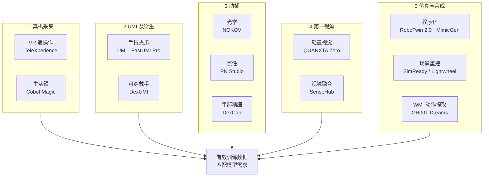

> **Query 产物**：本页由以下问题触发：「具身智能数据采集有哪些技术路线？各路线装备分支与代表案例是什么？」
> 叙事骨架编译自 [AIRS产业研究 2026-09-15 公众号文](../../sources/blogs/wechat_airs_embodied_data_five_routes_2026-09-15.md)；与 [四层术语地图](../concepts/embodied-data-collection-four-layers-taxonomy.md)（怎么读黑话）和 [人形数采六范式地图](./humanoid-robot-data-collection-landscape.md)（投资/产业视角）互补。

# 具身数据采集五大路线产业地图

## 一句话定义

具身训练数据来自 **五条并行路线**——**真机采集、UMI 及衍生接口、人体/手部动捕、第一视角采集、仿真与合成**——各自在质量、成本、可扩展性、跨本体复用与真实性上 trade-off；2026 行业从「小规模验证」转向 **数采规模化**，选型关键是 **有效数据是否匹配模型与任务**，而非单看录制时长或设备数量。

## 英文缩写速查

| 缩写 | 英文全称 | 简要说明 |
|------|----------|----------|
| UMI | Universal Manipulation Interface | 手持夹爪无机器人示教接口（Stanford RSS 2024） |
| VR | Virtual Reality | 头显呈现机器人视角的遥操作数采 |
| IMU | Inertial Measurement Unit | 惯性测量；UMI/头环等定位辅助 |
| Ego | Egocentric | 第一人称视角行为记录 |
| IL | Imitation Learning | 示范驱动训练；多数路线最终服务 IL/VLA |
| SimReady | Simulation-Ready | 可导入仿真的数字资产（光轮等） |

## 为什么重要

- **数采已成独立展品类**：WRC/WAIC 2026 数采设备展示量显著增加（文内引述光轮智能杨海波），整机之外的 **「教具」层** 值得单独建图。
- **路线≠四层术语**：同一句「动捕 + UMI」可能跨 **设备层与教法层**；本页按 **产业路线** 组织，读黑话仍用 [四层地图](../concepts/embodied-data-collection-four-layers-taxonomy.md)。
- **与 Substack 六范式互补**：[人形数采产业地图](./humanoid-robot-data-collection-landscape.md) 偏投资/飞轮/地产；本页偏 **装备分支 + 中英文学术锚点 + 国内产品案例**。
- **有效数据判据**：多源互补 + **训练/真机评测反向指导采集**（文内小结），对接 [飞轮最小闭环](../concepts/embodied-data-flywheel-minimal-closed-loop.md)。

## 流程总览

## 五条路线详解

### 1. 真机采集 — 含目标机器人约束与真实接触

| 项 | 内容 |
|----|------|
| **定义** | 记录真机传感器、控制指令与环境反馈；遥操作示教同步记录执行过程 |
| **价值** | 观察–动作–结果直接对应；可含力/触 |
| **学术锚点** | [ALOHA](../entities/aloha.md)（~10 min → 80–90% 六项任务）；Mobile ALOHA；[Open-TeleVision](../entities/paper-loco-manip-161-131-open-television.md) |
| **VR 分支** | 头显 + 手柄/手追 + 机载相机 → 艾欧 **TeleXperience**（标注导出一体化） |
| **主从臂分支** | 主端编码 → 从端同步 → 松灵 **Cobot Magic**（移动双臂 Mobile ALOHA 复现） |
| **规模瓶颈** | 机器人数、人力、维护、任务复位；可补自主运行/接管/失败 retry 数据 |
| **站内** | [Teleoperation](../tasks/teleoperation.md) · [演示数采指南](./demo-data-collection-guide.md) |

### 2. UMI 及衍生 — 采集与本体解耦

| 项 | 内容 |
|----|------|
| **定义** | 手持夹爪或可穿戴装置在无机器人下录真实示范，再适配为可学数据 |
| **学术锚点** | UMI（Chi 等，RSS 2024）— 相对轨迹 + 推理时延匹配 |
| **手持夹爪** | 夹爪 + 相机 + IMU + 定位 → 鹿明 **FastUMI Pro**（RGB/深度/位姿/可选触觉） |
| **可穿戴手** | [DexUMI](../entities/paper-notebook-dexumi-using-human-hand-as-the-universal-manipul.md)（CoRL 2025，~86% 平均成功率） |
| **边界** | 无本体 ≠ 免处理；灵巧手需外骨骼与视觉编译 |

### 3. 人体与手部动捕 — 自然动作 → 重定向

| 项 | 内容 |
|----|------|
| **定义** | 光学/惯性/电磁记录人体/手指运动 → 动作重定向 |
| **学术锚点** | DeepMimic（SIGGRAPH 2018）；[DexCap](../entities/paper-notebook-dexcap-scalable-and-portable-mocap-data-collecti.md)（RSS 2024） |
| **光学** | 多相机 + 标记点 → **NOKOV**（骨骼映射） |
| **惯性** | 穿戴节点 → **诺亦腾 PN Studio** |
| **手部精细** | DexCap：SLAM + 电磁手捕 + 环境 3D |
| **边界** | 轨迹 alone 不够；插接/拧紧/柔性物体需力触与物体状态 |

### 4. 第一视角采集 — 真实行为经验

| 项 | 内容 |
|----|------|
| **定义** | 佩戴相机/轻量设备记录任务视觉与交互过程 |
| **学术锚点** | [Ego4D](../entities/paper-ego4d.md)（3670 h）；Ego-Exo4D（1286 h 技能，第一+第三视角） |
| **轻量视觉** | 头环/眼镜/胸前相机 → 自变量 **QUANXTA Zero-E0** |
| **视触融合** | 第一视角 + 手套/触觉/体感 → 它石 **SenseHub**（TARS-Vision + TARS-Glove） |
| **边界** | 视频→动作需重建/提取；时长 ≠ 有效数据量 |

### 5. 仿真与合成 — 可扩展覆盖

| 项 | 内容 |
|----|------|
| **定义** | 物理引擎 / 场景建模 / 生成模型构造交互或行为序列 |
| **程序化** | [MimicGen](../entities/mimicgen.md)（~200 示范 → 5 万+ 轨迹）；[RoboTwin 2.0](../entities/robotwin.md)（50 项双臂任务） |
| **场景重建** | 光轮 **SimReady Library** + Lightwheel-Platform（见 [Lightwheel 资产](../entities/cn-os-lightwheel-simready-asset.md)） |
| **WM + 动作提取** | [GR00T-Dreams](../entities/paper-gr00t-dreams-synthetic-trajectories.md) DreamGen 管线 |
| **边界** | 仿真物理偏差；生成视频视觉合理 ≠ 可执行 — 需接触/IDM/本体验证 |

## 选型对照（文内五维）

| 维度 | 真机 | UMI 系 | 动捕 | 第一视角 | 仿真/合成 |
|------|------|--------|------|----------|-----------|
| **数据质量/真实性** | 最高（ onboard ） | 高（经适配） | 中–高（运动自然） | 视触融合可达高 | 取决于物理/IDM |
| **采集成本** | 高 | 中 | 中–高 | 低–中 | 边际低（算力） |
| **可扩展性** | 低 | 中–高 | 中 | 高 | 最高 |
| **跨本体复用** | 低（同构） | 中（接口设计） | 中（重定向） | 低–中（需提取） | 高（程序化） |
| **典型训练目标** | 真机 IL/VLA | 跨平台 manipulation | 全身/灵巧 motion | 预训练 / Ego-VLA | 扩增 / sim-pretrain |

## 工程实践：怎么读这张地图

1. **先定训练问题** — BC/VLA/WAM 要什么监督？真机/contact 还是 Ego 预训练？
2. **再对四层术语** — 设备 vs 教法 vs 产物（见 [四层地图](../concepts/embodied-data-collection-four-layers-taxonomy.md)）。
3. **组合而非单选** — MimicGen + 少量真机、Ego4D + UMI 后训练等常见。
4. **用评测闭环** — [depth-embodied-data](../../roadmap/depth-embodied-data.md) Stage 5 飞轮；失败/接管数据见 [监督分流](../concepts/robot-data-supervision-signal-types.md)。

## 常见误区

1. **「数采设备多 = 数据有效」** — 复位效率、标签与筛选决定有效量。
2. **「无本体 = 即插即用」** — UMI/DexUMI 仍需适配与视觉编译。
3. **「动捕轨迹 = 可操作数据」** — 接触/力/物体状态常缺失。
4. **「仿真成功 = 真机成功」** — 摩擦、质量、碰撞结构偏差需 sim2real 验证。
5. **「Ego 时长 = 机器人数据」** — 需动作提取或跨 embodiment 对齐。

## 关联页面

- [四层采集术语地图](../concepts/embodied-data-collection-four-layers-taxonomy.md)
- [具身数据从采集到飞轮（系列）](../overview/embodied-data-collection-to-flywheel-album.md)
- [Query：人形数采六范式](./humanoid-robot-data-collection-landscape.md)
- [Query：演示数采指南](./demo-data-collection-guide.md)
- [Teleoperation](../tasks/teleoperation.md)
- [具身数据纵深路线](../../roadmap/depth-embodied-data.md)

## 参考来源

- [AIRS产业研究：五大路线盘点（2026-09-15）](../../sources/blogs/wechat_airs_embodied_data_five_routes_2026-09-15.md)

## 推荐继续阅读

- [Ego4D 项目页](https://ego4d-data.org/) — 第一视角大规模基准
- [UMI 论文](https://arxiv.org/abs/2402.10329) — 手持无机器人接口原典
