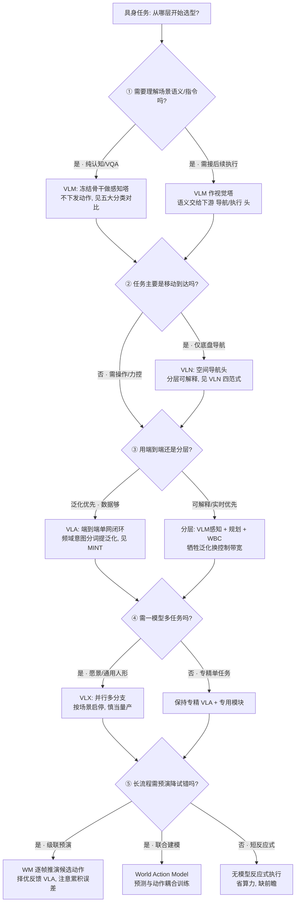

# Query：具身大模型分类学选型闭环知识链

> **Query 产物**：本页由以下问题触发：「我要给一个具身系统选模型，从『看懂场景』到『在真机上稳定完成任务』中间到底分几层——VLM / VLN / VLA / VLX / 世界模型各自解决什么、各家族的 I/O 边界与数据需求/泛化能力/实时性/闭环稳定性怎么互相约束、哪一层选错会怎样失败？」
> 综合来源：[五大具身模型分类对比](../comparisons/vlm-vln-vla-vlx-world-model-taxonomy.md)、[VLA 方法页](../methods/vla.md)、[VLN 任务页](../tasks/vision-language-navigation.md)、[World Action Models](../concepts/world-action-models.md)、[生成式世界模型](../methods/generative-world-models.md)、[统一多模态 token](../methods/unified-multimodal-tokens.md)。

## TL;DR：五层选型闭环一句话定位

具身大模型不是「一个端到端 VLA 就搞定一切」，它是一条**自感知向执行递进、再由世界模型回环校验的选型链**。五类模型**共享 Transformer + 多模态编码底座**（详见[五大分类对比页](../comparisons/vlm-vln-vla-vlx-world-model-taxonomy.md)），差异在于**任务头、时序跨度、分支配置与运行方式**。任意一层选型偏离其 I/O 边界，上层都补不回来：

| 层 | 家族 | 解决什么 | 核心 I/O | 数据需求 | 这一层选错会怎样 |
|----|------|---------|---------|---------|----------------|
| ① 感知理解 | VLM | 「场景里有什么、指令是什么意思」 | 图像/视频+语言 → 语义、物体关系、指令解析 | 图文对，海量互联网弱标注 | 语义理解 ≠ 可执行动作，误当动作接口用 |
| ② 空间导航 | VLN | 「往哪走、怎么避障到达目标」 | VLM 输入+深度/拓扑 → 路径、目标坐标 | 轨迹-指令对，环境覆盖有限 | 只有底盘移动，无力控/操作分支 |
| ③ 动作执行 | VLA | 「关节/末端下一步给什么控制量」 | 全模态+本体状态 → 关节/底盘/末端控制量 | 真机动作数据，采集昂贵 | 泛化好但可解释/可调差，实时带宽吃紧 |
| ④ 一体化扩展 | VLX | 「一个模型并行支撑感知/导航/执行」 | 同 VLA 输入 → 并行三路输出 | 多任务混采，规模巨大 | 通用性↑但专精精度↓，多为架构愿景 |
| ⑤ 世界模型推演 | WM | 「这组动作推演下去环境会怎样」 | 观测+候选动作 → 未来多帧状态 | 时序动态数据，推演步长敏感 | 推演步长↑累积误差↑，不即时执行 |

**总原则**：先保证「**这一层的输出是上一层能消化的**」——VLM 的语义要能被导航/执行头对接，VLA 的动作粒度要匹配控制带宽，WM 的推演步长要短到累积误差可控。选型的第一问永远是「**这层的 I/O 边界能不能覆盖任务，而不是缩写谁更新**」。

---

## 五层选型闭环决策树

---

## 1. ① VLM 感知理解层：闭环的「语义真值」从哪来

整条闭环的入口是**把像素与指令翻译成可被下游消化的语义**（详见[五大分类对比页](../comparisons/vlm-vln-vla-vlx-world-model-taxonomy.md)「VLM 能力边界」）：

- **I/O 边界**：输入图像/视频 + 语言，输出语义、物体关系、指令解析——**没有动作、没有轨迹**，是纯认知层。
- **数据需求**：主要吃图文对与海量互联网弱标注，是五层里**采集最便宜、泛化最广**的一层。
- **选型陷阱**：把 VLM 的语义直接当「动作接口」用是最常见错误——语义理解 ≠ 可执行控制量，中间必须由 VLN/VLA 头补上从语义到动作的映射。工程上常**冻结 VLM 骨干**只训下游头，以省算力并保留泛化。

## 2. ② VLN 空间导航层：可解释的移动决策

VLN 在 VLM 之上加**空间移动分支**，回答「往哪走、怎么避障到达目标」：

- **I/O 边界**：VLM 输入 + 深度/拓扑 → 路径、避障、目标坐标；**仅底盘移动，无力控/操作分支**（见[VLN 任务页](../tasks/vision-language-navigation.md)）。
- **数据需求**：轨迹-指令对，环境覆盖天然有限，复现门槛集中在数据管线与环境适配（见 [VLN 复现四范式](../../sources/blogs/wechat_shenlan_vln_repro_four_paradigms_2026.md)）。
- **与 VLA 的包含关系**：`VLN ⊂ VLA`——VLA 完整搭载 VLN 导航能力并扩展操作/力控分支。选型时若任务只需移动，单独训 VLN 头比上整套 VLA 更省、更可解释、更好调。

## 3. ③ VLA 动作执行层：泛化 ↔ 实时的核心取舍

VLA 是「感知–决策–执行单网闭环」，也是整条链**泛化与实时性矛盾最尖锐**的一层：

- **I/O 边界**：全模态 + 本体状态 → 关节/底盘/末端控制量（见 [VLA 方法页](../methods/vla.md)）。
- **数据需求**：吃**真机动作数据**，采集昂贵，是五层里数据成本最高的一层——模型规模不替代真机动作数据。
- **端到端 vs 分层的取舍**：端到端 VLA 泛化强但可解释/可调差、推理时延与控制带宽吃紧；分层（VLM 感知 + 规划 + [WBC](../concepts/humanoid-policy-network-architecture.md)）牺牲泛化换实时性与可调性。
- **动作表征前沿**：[MINT](../../sources/papers/mint_rss_2026.md) 用**频域意图分词**模仿意图而非逐点轨迹，是在「泛化 ↔ 精确执行」间找平衡的代表性动作 tokenization 路线，与[统一多模态 token](../methods/unified-multimodal-tokens.md) 的表征接口相呼应。

> 工程判据：VLA 输出的 action chunk 粒度必须给底层控制留出执行窗口，且模型规模↑带来的推理时延不能超过任务要求的控制带宽——否则泛化再好也无法在真机稳定闭环。这条「实时性 ↔ 泛化」的量化取舍单独沉淀为姊妹概念页 [具身大模型实时性↔泛化取舍](../concepts/embodied-fm-latency-generalization-tradeoff.md)，把模型规模/多模态跨度/世界模型推演步长三个旋钮如何共同压缩控制带宽讲透。

## 4. ④ VLX 一体化扩展层：通用性 ↔ 专精精度

VLX（Vision-Language-X，X = 可扩展任务）把感知/导航/执行收进**单模型并行多分支**：

- **I/O 边界**：同 VLA 输入 → 并行感知/导航/动作三路输出，可按场景启停分支，对应「一脑多能」的通用人形叙事。
- **选型现实**：VLX 多为**架构愿景**而非量产；统一 VLX 的通用性以专精精度为代价，当前开源主力仍是**分立 VLA + 专用 WBC/导航模块**。把 VLX 当成「已经能替代分立方案」是典型误区。
- **表征前提**：VLX 依赖[统一多模态 token](../methods/unified-multimodal-tokens.md) 把异构模态与任务收进同一表征接口，否则多分支只是拼装而非一体。

## 5. ⑤ WM 世界模型推演层：闭环的「虚拟校验器」

世界模型不直接驱动硬件，而是**在虚拟空间对候选动作逐帧推演**，为上层选型兜底：

- **I/O 边界**：观测 + 候选动作 → 未来多帧状态/物理反馈；**长时序推演，不即时执行**（见[生成式世界模型](../methods/generative-world-models.md)、[世界模型开源地图](../../sources/blogs/wechat_shenlan_world_models_15_open_source_2026.md)）。
- **两种耦合范式**：**级联**（VLA 出候选 → WM 推演择优 → 真机执行，与[五大分类对比页](../comparisons/vlm-vln-vla-vlx-world-model-taxonomy.md)一致）vs **联合建模**（[World Action Models](../concepts/world-action-models.md) 把前向预测与动作生成耦合进同一策略，联合分布 `p(o',a|o,l)`）。选型要看清「事后串联 vs 联合训练」。
- **数据与误差**：WM 吃时序动态数据，**推演步长越长累积误差越大**；WM 也可独立服务 Real2Sim 数据生成与策略评估（如 [SimFoundry](../../sources/papers/simfoundry_arxiv_2606_28276.md) 的模块化场景生成），与 [Sim2Real](../concepts/sim2real.md) 闭环互补，而非替代物理引擎。

---

## 家族选型矛盾速查（按取舍归因）

| 矛盾 | 一端 | 另一端 | 选型第一判据 |
|------|------|--------|-------------|
| 端到端 vs 分层 | VLA 泛化强 | VLN/分层可解释可调 | 任务是否需可解释/实时带宽 |
| 显式 WM vs 反应式 | WM 前瞻降试错 | 反应式省算力低时延 | 流程长度与试错代价 |
| 规模 vs 带宽 | 大模型泛化↑ | 参数量↑推理时延↑ | 控制带宽是否够 |
| 统一 VLX vs 专精 | VLX 一模型多能 | 分立模型精度高 | 是否真需多任务共栈 |
| 语义 vs 动作 | VLM 语义广 | 需真机动作数据落地 | 有无从语义到动作的头 |

---

## 典型失败模式速查（按层归因）

| 现象 | 最可能的选型崩溃层 | 第一优先排查 |
|------|------------------|-------------|
| 语义对但机器人不动 | ① 把 VLM 当动作接口 | 补 VLN/VLA 动作头 |
| 会导航但不会操作 | ② 误用 VLN 覆盖操作任务 | 换 VLA 或加操作分支 |
| 仿真好真机崩 | ③ 缺真机动作数据 / 带宽超限 | 补真机数据、降模型规模 |
| 多任务样样稀松 | ④ VLX 通用换掉了专精 | 关键任务回退专精模块 |
| 长流程越推越偏 | ⑤ WM 推演步长过长 | 缩短推演步长或改反应式 |

---

## 英文缩写速查

| 缩写 | 英文全称 | 简要说明 |
|------|----------|----------|
| VLM | Vision-Language Model | 视觉–语言跨模态理解与语义解析，纯认知层 |
| VLN | Vision-Language Navigation | 视觉–语言条件下的空间导航决策 |
| VLA | Vision-Language-Action | 视觉–语言–动作端到端执行策略 |
| VLX | Vision-Language X | 融合感知/导航/执行的多分支通用架构（X=可扩展任务） |
| WM | World Model | 环境时序动态建模与虚拟推演，不直接驱动执行 |
| WAM | World Action Model | 前向预测与动作生成联合建模的具身策略 |
| WBC | Whole-Body Control | 协调全身关节满足多任务/约束的控制基础设施 |

## 参考来源

- [wechat_shenlan_five_embodied_model_taxonomy.md](../../sources/blogs/wechat_shenlan_five_embodied_model_taxonomy.md) — 深蓝《五大具身模型详解：VLM、VLA、VLN、VLX、世界模型》，五层分类底座
- [wechat_shenlan_vln_repro_four_paradigms_2026.md](../../sources/blogs/wechat_shenlan_vln_repro_four_paradigms_2026.md) — VLN 复现四范式，② 导航层数据与复现门槛
- [wechat_shenlan_world_models_15_open_source_2026.md](../../sources/blogs/wechat_shenlan_world_models_15_open_source_2026.md) — 世界模型 15 项开源地图，⑤ 推演层生态
- [mint_rss_2026.md](../../sources/papers/mint_rss_2026.md) — MINT 频域意图分词 VLA，③ 执行层「泛化↔精确」动作表征
- [simfoundry_arxiv_2606_28276.md](../../sources/papers/simfoundry_arxiv_2606_28276.md) — SimFoundry 模块化场景生成，⑤ WM 服务 Real2Sim 数据

## 关联页面

- [五大具身模型分类对比（VLM/VLN/VLA/VLX/WM）](../comparisons/vlm-vln-vla-vlx-world-model-taxonomy.md) — 本链的家族底座与 I/O 边界总表
- [VLA 方法页](../methods/vla.md) — ③ 动作执行层代表方法与训练数据
- [VLN 任务页](../tasks/vision-language-navigation.md) — ② 空间导航层基准与复现
- [World Action Models（WAM）](../concepts/world-action-models.md) — ⑤ 世界模型「联合建模」范式
- [生成式世界模型](../methods/generative-world-models.md) — ⑤ 世界模型「级联预演」范式
- [统一多模态 token](../methods/unified-multimodal-tokens.md) — ④ VLX 一体化的表征接口
- 专题汇总：[VLA（专题汇总）](../overview/topic-vla.md) — ③ 执行层在图谱专题视图的统一入口
