> **Query 产物**：本页由以下问题触发：「模块化、技能编排、IL、RL、VLA、世界模型六条路线在吵什么？有没有一条按综述补课的阅读顺序？」
> 综合来源：[五大范式](../comparisons/robot-learning-five-paradigms-taxonomy.md)、[六条路线的窟窿](./embodied-six-routes-holes.md)、[VLA](../methods/vla.md)、[生成式世界模型](../methods/generative-world-models.md)、[深蓝 2026-09-20 公众号归档](../../sources/blogs/wechat_shenlan_embodied_six_routes_survey_lineage_2026-09-20.md)。

# 六条路线 × 12 篇综述：补课线，不是终局赌注

深蓝具身智能 2026-09-20 专栏第 13 篇（[公众号](https://mp.weixin.qq.com/s/iyzL2yLzIqsIRergN3qS_Q)）与 2026-09-04 [六条窟窿](./embodied-six-routes-holes.md) **同六条叙事、不同切口**：本篇用 **12 篇高频综述** 说明「问题很老、技术单位变大」；窟窿页回答 **2026 各自卡在哪、怎么按时间尺度缝合**。两页应一起读。

## 一句话定义

**具身智能六条产业路线并置，是因为行业对「机器人该从什么里学」给出过六次不同回答；综述分类法比 benchmark 分数更长寿——读经典先建立问题意识，再追 FM / VLA / 新一代 WM，看到的才是同一老问题换了什么新解法。**

## 英文缩写速查

| 缩写 | 英文全称 | 简要说明 |
|------|----------|----------|
| TAMP | Task and Motion Planning | 离散任务规划 + 连续运动规划；模块化路线的形式化入口 |
| BT | Behavior Tree | 技能编排的经典层级结构（Sequence / Fallback / Action） |
| LfD | Learning from Demonstration | 模仿学习 / 示范学习 |
| IL | Imitation Learning | 从示范 state–action 学策略 |
| RL | Reinforcement Learning | 通过 reward 与 interaction 学策略 |
| MBRL | Model-Based Reinforcement Learning | 先学环境模型再规划或 acting |
| VLA | Vision-Language-Action | 视觉–语言–动作统一建模 |
| WM | World Model | 预测「动作之后世界怎样变」 |
| FM | Foundation Model | 预训练大模型进入机器人栈各层 |

## 为什么重要

追新模型时容易以为「端到端换掉了模块化」。综述链给出的反论是：**Task Planning vs Motion Planning、Skill 封装与调度、Demonstration 覆盖、真机 interaction 成本、Symbol Grounding、Dynamics / 视觉未来预测**——这些诉求在 2009–2026 的论文标题里反复出现。本页把文内 **12 篇代表综述** 排成可执行的补课表，并接到站内已有节点；**不**重复窟窿页的产业案例与 SmoothRL 后训练细节。

## 流程总览：六条路线与综述锚点

```mermaid
flowchart LR
  subgraph mod [模块化]
    TAMP[TAMP 2021]
    FMRev[FM in Robotics 2024]
  end
  subgraph skill [技能编排]
    BT[Behavior Trees 2022]
    LLMRob[LLM for Robotics 2024]
  end
  subgraph il [模仿学习]
    LfD[LfD Survey 2009]
    FMManip[FM for Manipulation 2026]
  end
  subgraph rl [强化学习]
    RLCC[RL Continuous Control 2019]
    RLReal[Real-World DRL 2025]
  end
  subgraph vla [VLA]
    Sym[Symbol Emergence 2016]
    VLASur[VLA Survey 2026]
  end
  subgraph wm [世界模型]
    MBRL[MBRL Survey 2020]
    WMSur[WM for Robot Learning 2026]
  end
  mod --> skill --> il --> rl --> vla --> wm
```

## 12 篇综述补课表

| # | 文内标题（简称） | 路线 | 文内要读的问题 | 站内已有归档 / 节点 |
|---|------------------|------|----------------|---------------------|
| 1 | Integrated Task and Motion Planning | 模块化 | 离散动作 + 连续位姿；为何无通用解；层间翻译丢信息 | [轨迹优化 / TAMP](../methods/trajectory-optimization.md)、[ScheduleStream](../entities/schedulestream.md) |
| 2 | Real-World Robot Applications of Foundation Models | 模块化 | FM 进入 perception / planning / control 哪些位置 | [具身基础模型 hub](../overview/hub-embodied-foundation-model.md) |
| 3 | A Survey of Behavior Trees in Robotics and AI | 技能编排 | Skill 封装、Sequence/Fallback；BT 相对 FSM 的可扩展性 | [行为树 × VLA 编排](../concepts/behavior-tree-vla-orchestration.md) |
| 4 | Large Language Models for Robotics | 技能编排 | LLM 作 planner；纯文本缺视觉；PDDL + 经典规划器混合 | [LLM 控制接口](../concepts/llm-robotics-control-interfaces.md) |
| 5 | A Survey of Robot Learning from Demonstration | IL | 2009 即成体系：示范者、采集、policy derivation；数据集覆盖边界 | [Action chunking](../methods/action-chunking.md) |
| 6 | What Foundation Models Can Bring for Robot Learning in Manipulation | IL | 示范 → 多层级任务知识；跨任务/跨 embodiment 数据聚合 | [Diffusion Policy](../methods/diffusion-policy.md)、[VLA](../methods/vla.md) |
| 7 | A Tour of RL: The View from Continuous Control | RL | 机器人视角 RL：reward 定义 vs 逐状态监督；interaction 成本 | [强化学习](../methods/reinforcement-learning.md) |
| 8 | Deep RL for Robotics: Real-World Successes | RL | 成熟度分级：仿真 → 实验室 → 多样真机；真机 RL 未结束 | [Sim2Real](../concepts/sim2real.md)、[六条窟窿](./embodied-six-routes-holes.md)（后训练实例） |
| 9 | Symbol Emergence in Robotics | VLA | 词如何通过 embodied interaction 获得意义（Grounding 前身） | [VLA](../methods/vla.md) |
| 10 | A Survey on Vision-Language-Action Models for Embodied AI | VLA | VLA 组件 / control policy / task planner 三线；互联网 VLM → action space | [VLA 综述归档](../../sources/papers/hmi_p071_vla-survey-embodied.md) |
| 11 | Model-Based Reinforcement Learning: A Survey | WM | Dynamics learning + planning 预算；acting loop 中何时规划 | [生成式世界模型](../methods/generative-world-models.md) |
| 12 | World Model for Robot Learning: A Comprehensive Survey | WM | Policy / planning / learned simulator / eval / data gen 五角色；video WM | [WM 综述](../../sources/papers/wm_robot_survey_arxiv_2605_00080.md)、[六路线 WM 地图](../overview/embodied-wm-six-routes-technology-map.md) |

文内 #1–#11 尚未全部单独 ingest 为 `sources/papers/`；上表「站内已有」指概念/方法页或已归档综述。**勿把公众号转述的 1 亿 / 千亿小时、100+ 模型、30+ WM 公司写成已核实事实。**

## 与「六条窟窿」页如何分工

| 维度 | 本页（survey lineage） | [六条窟窿](./embodied-six-routes-holes.md) |
|------|------------------------|--------------------------------------------|
| 时间感 | 2009–2026 综述 continuity | 2026-09 产业案例与卡点 |
| 核心问题 | 「这些问题为什么一开始就难」 | 「2026 各路线窟窿在哪、怎么缝合」 |
| 典型锚点 | TAMP、BT、LfD、Symbol Emergence | Helix 分层、SmoothRL、ER 2、RTC |
| 读者动作 | 按表补课 12 篇综述 | 按窟窿表选型 / 分层 |

## 推荐阅读顺序（文内 + 站内合成）

1. **模块化 + 技能**：#1 TAMP → #3 BT → #4 LLM for Robotics（建立「层与调度员」语言）。
2. **学习范式**：#5 LfD → #7 RL continuous control → #8 real-world DRL（示范边界与真机成本）。
3. **接地与预测**：#9 Symbol Emergence → #10 VLA survey → #11 MBRL → #12 WM survey。
4. **回到 2026 产业**：读 [六条窟窿](./embodied-six-routes-holes.md) + [五大范式](../comparisons/robot-learning-five-paradigms-taxonomy.md)。

## 局限与风险

- **12 篇为文内代表列表**，非本库 exhaustive bibliography；单篇 bibliographic ingest 待补。
- **与五大范式 / 五层模型族正交**：六条是产业叙事轴，选型时勿与 [五大范式](../comparisons/robot-learning-five-paradigms-taxonomy.md) 混为一谈。
- **数据规模叙事**：文内 Scaling Law 在物理世界能否复现仍为开放工程问题，非科学定理。

## 关联页面

- [六条路线的窟窿](./embodied-six-routes-holes.md) — 同系列互补页
- [机器人学习五大范式](../comparisons/robot-learning-five-paradigms-taxonomy.md)
- [具身大模型分类学选型闭环](./embodied-fm-taxonomy-loop.md)
- [VLA](../methods/vla.md)
- [生成式世界模型](../methods/generative-world-models.md)
- [行为树 × VLA 编排](../concepts/behavior-tree-vla-orchestration.md)

## 参考来源

- [深蓝六条路线综述补课公众号归档](../../sources/blogs/wechat_shenlan_embodied_six_routes_survey_lineage_2026-09-20.md)
- [公众号原文抓取](../../sources/raw/wechat_shenlan_embodied_six_routes_survey_lineage_2026-09-20.md)
- [World Model for Robot Learning 综述](../../sources/papers/wm_robot_survey_arxiv_2605_00080.md)
- [VLA Survey（HMI P071）](../../sources/papers/hmi_p071_vla-survey-embodied.md)

## 推荐继续阅读

- [原文](https://mp.weixin.qq.com/s/iyzL2yLzIqsIRergN3qS_Q) — 六条路线 × 12 综述全文叙事
- [WM 综述项目页](https://ntumars.github.io/wm-robot-survey/) — #12 官方资源
- [六条窟窿 · 2026-09-04 姊妹篇](./embodied-six-routes-holes.md) — 产业卡点与分层缝合
