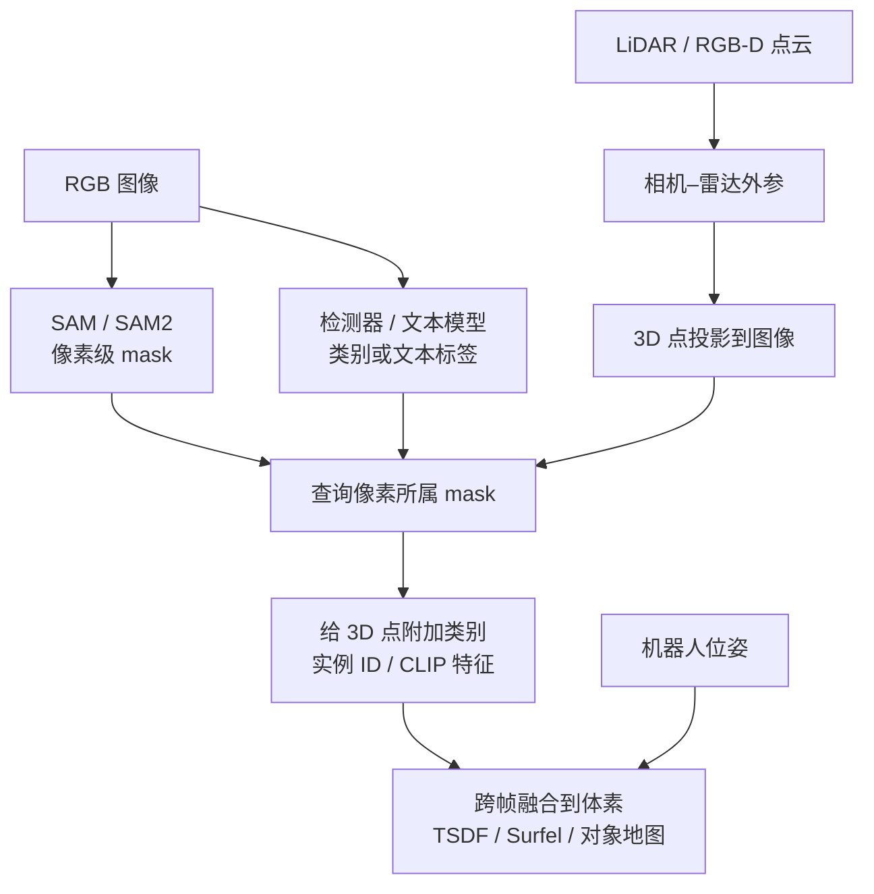
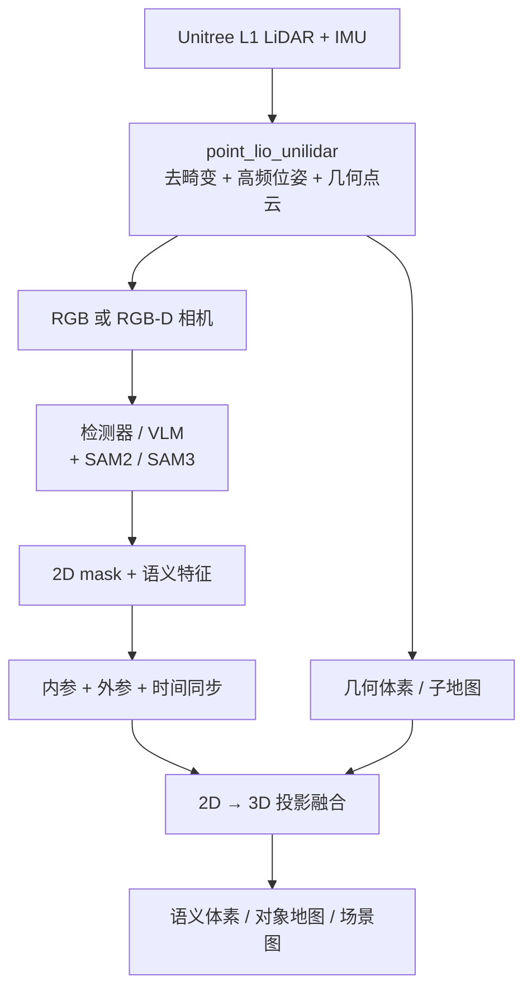

# GO2 三维语义建图与 SAM 流水线

> **Query 产物**：本页由以下问题触发：「GO2 有哪些可用的三维语义建图资料？运动中点云建图效果差应如何排查？点云建图结合 SAM 时，二维 mask 如何落到三维？常被提及的 CMU 相关工作各自解决什么问题？」
> 综合来源：[point_lio_unilidar](../entities/point-lio-unilidar.md)、[autonomy_stack_go2](../entities/autonomy-stack-go2.md)、[DualMap](../entities/dualmap.md)、[OVO](../entities/ovo-semantic-mapping.md)、[OV-SAM3D](../entities/ov-sam3d.md)、[FindAnything](../entities/findanything.md)、[CMU MSCV Semantic 3D Mapping](../entities/cmu-mscv-semantic-3d-mapping.md)、[FAST-LIO](../entities/fast-lio.md)、[LIO-SAM](../entities/lio-sam.md)、[导航·SLAM 栈](../overview/navigation-slam-autonomy-stack.md)、[LiDAR/LIO 选型](../comparisons/lidar-slam-lio-vio-selection.md)、[Real-Time Polygonal Semantic Mapping（待深读占位）](../entities/paper-notebook-real-time-polygonal-semantic-mapping-for-humanoi.md)

## 一句话定义

**GO2 三维语义建图**应拆成两层：先用 **LiDAR–IMU（Point-LIO）** 得到锐利几何地图与高频位姿，再用 **检测器/VLM + SAM(2) 的二维 mask**，经相机内参、相机–雷达外参与机器人位姿投影到点云并跨帧融合——SAM **不会**单独把 2D「变成」3D。

## 英文缩写速查

| 缩写 | 英文全称 | 简要说明 |
|------|----------|----------|
| GO2 | Unitree Go2 | 宇树四足平台；EDU 版便于 SDK/开源自驾栈 |
| LIO | LiDAR-Inertial Odometry | 激光–惯性里程计，几何建图与去畸变主路径 |
| SAM | Segment Anything Model | 提示式二维分割，输出像素 mask（非三维点）；实体见 [paper-segment-anything](../entities/paper-segment-anything.md) |
| SAM2 | Segment Anything Model 2 | 图像+视频统一可提示分割与跨帧跟踪；实体见 [paper-sam2](../entities/paper-sam2.md) |
| DETR | Detection Transformer | 二维目标检测；可作 SAM 的框提示 |
| CLIP | Contrastive Language–Image Pretraining | 开放词汇语义/查询常用视觉语言特征 |
| IMU | Inertial Measurement Unit | 惯性单元；与 LiDAR 时间同步与外参是几何质量关键 |
| TSDF | Truncated Signed Distance Function | 稠密几何融合表示之一 |
| RGB-D | RGB + Depth | 彩色与深度；OVO 等语义栈常见输入 |
| FOV | Field of View | 视场；L1/L2 约 360°×90° |

## 问题背景与核心疑问

在四足平台（尤其是 [Unitree GO2](../entities/unitree.md)）上做室内外建图时，常见诉求会叠在一起：既要 **运动中稳定的三维点云地图**，又希望借助 **SAM 一类二维分割** 得到语义或实例信息，并往往听说 **CMU** 有相关工作可参考。实际推进时，这几类问题容易缠在一起：

| # | 核心疑问 | 本页对应解答 |
|---|----------|--------------|
| Q1 | GO2 / L1 上有哪些可复现的建图与导航资料？本库覆盖到哪一层？ | [库内现状](#库内现状对照本仓库) · [一手项目](#最值得参考的一手项目) |
| Q2 | 狗子移动时点云重影、墙面变厚、地图撕裂，是否应先换更「高级」的点云算法或直接上 SAM？ | [§1 先几何再语义](#1-先解决几何建图再叠加-sam) |
| Q3 | SAM（或 SAM2）如何从二维图像「变成」三维点云上的标签？ | [§2 SAM 与 2D→3D](#2-sam-并不是直接把-2d变成3d) |
| Q4 | 常被一并提起的 CMU 工作，是几何自主导航还是 DETR+SAM 语义投影？ | [§3 CMU 两条路线](#3-cmu-相关工作常是两条不同路线) |

**结论先行（面向选型）：** 把问题拆成「几何建图」与「语义融合」两层。运动中点云质量差时，优先排查 LiDAR/IMU 时间同步、逐点时间戳、运动去畸变、外参与回环，再叠加 SAM。几何基线可选 [point_lio_unilidar](../entities/point-lio-unilidar.md) 与 [autonomy_stack_go2](../entities/autonomy-stack-go2.md)。SAM 产出的是二维 mask；三维标签来自相机内参、相机–LiDAR 外参、机器人位姿下的投影与跨帧融合——流程对照见 [CMU MSCV Semantic 3D Mapping](../entities/cmu-mscv-semantic-3d-mapping.md)。后续语义系统可重点看 [DualMap](../entities/dualmap.md)、[OVO](../entities/ovo-semantic-mapping.md)、[OV-SAM3D](../entities/ov-sam3d.md)、[FindAnything](../entities/findanything.md)。

## 库内现状（对照本仓库）

| 层次 | 状态 | 代表页 / 源 |
|------|------|-------------|
| GO2 / L1 几何建图 | **较完整** | [point_lio_unilidar](../entities/point-lio-unilidar.md)、[FAST-LIO](../entities/fast-lio.md)、[LIO-SAM](../entities/lio-sam.md) |
| GO2 全栈几何导航 | **有独立实体** | [autonomy_stack_go2](../entities/autonomy-stack-go2.md) |
| 多边形语义建图论文 | **待深读占位** | [Real-Time Polygonal Semantic Mapping](../entities/paper-notebook-real-time-polygonal-semantic-mapping-for-humanoi.md) |
| GO2 + 相机 + SAM + 3D 语义一体方案 | **本 Query 补选型与流水线**；非该论文深读替代 | [DualMap](../entities/dualmap.md) / [OVO](../entities/ovo-semantic-mapping.md) / [OV-SAM3D](../entities/ov-sam3d.md) |

## 1. 先解决几何建图，再叠加 SAM

GO2 运动时点云 **重影、墙面变厚、地图撕裂**，通常不是「点云算法不够高级」，而是下列之一：

1. LiDAR 与 IMU **时间未严格对齐**；
2. 点云缺少 **逐点时间戳**，无法运动畸变补偿；
3. LiDAR–IMU **外参不准**；
4. 起步时 IMU **尚未完成初始化**；
5. 足端冲击 / 机身高频振动导致姿态误差；
6. 长距离无 **回环**，累计漂移未修正；
7. 行人等 **动态物体** 被写入静态地图。

Point-LIO 官方强调：同步、逐点时间戳、IMU 量程与外参；算法面向剧烈振动、快速运动与畸变。宇树 [point_lio_unilidar](../entities/point-lio-unilidar.md) 已适配 L1/L2，并建议启动后前几秒保持相对静止完成初始化。本库记录：它是目前最适合 GO2/L1 的开源起点，但地图质量高度依赖时间同步与外参；官方实现主测 **Ubuntu 20.04 + ROS Noetic**，接 ROS 2 需桥接或移植。

## 2. SAM 并不是直接把 2D「变成」3D

[SAM](../entities/paper-segment-anything.md) / [SAM 2](../entities/paper-sam2.md) 从图像生成 **二维像素掩码**：不自动生成三维点，也不自动给出物体名称。原始 SAM 接受点/框/掩码提示；SAM 2 在任意帧提示并跨帧传播 masklet。

真正的 2D→3D 过程：

对 LiDAR 点 \(p_L\)：

\[
p_C = T_{C\leftarrow L}\, p_L,\quad
\begin{bmatrix}u\\v\\1\end{bmatrix}
\sim K\, p_C
\]

检查 \((u,v)\) 落在哪个 SAM mask，再经

\[
p_W = T_{W\leftarrow C}\, p_C
\]

写入世界系语义地图。重点不是「投影一次」，而是 **多帧关联、遮挡、置信度融合、回环后修正**。

[CMU MSCV Semantic 3D Mapping](../entities/cmu-mscv-semantic-3d-mapping.md) 正是：DETR 框 → SAM 实例 mask → 外参/位姿映射到 3D 点云（伪标注/检测管线）。

## 3. CMU 相关工作常是两条不同路线

文献与社区讨论里，「CMU + GO2 / 语义建图」往往混指不同项目，宜按问题拆开：

| 路线 | 代表 | 回答什么问题 |
|------|------|----------------|
| **GO2 几何自主导航** | [autonomy_stack_go2](../entities/autonomy-stack-go2.md) | 内置 L1 + 雷达 IMU，Point-LIO SLAM，地形可通行性、避障、FAR Planner。**不是** SAM 语义建图 |
| **二维语义投影到三维** | [MSCV Semantic 3D Mapping](../entities/cmu-mscv-semantic-3d-mapping.md) | DETR + SAM + 标定，把 2D 标签投到点云。与「SAM 如何落到 3D」**直接对应** |

## 推荐的 GO2 技术架构

工程建议：**Point-LIO 始终高频运行**；语义网络只处理 **关键帧**。动态物体进动态层，勿永久写入静态占据地图。

## 最值得参考的一手项目

| 项目 | 用途 | 开源（入库核查） |
|------|------|------------------|
| [point_lio_unilidar](../entities/point-lio-unilidar.md) | GO2 L1/L2 几何基线：时间戳、IMU、外参、去畸变 | **已开源** → 实体页 |
| [autonomy_stack_go2](../entities/autonomy-stack-go2.md) | Point-LIO ↔ 地形/规划/避障如何串 | **已开源** → 实体页 |
| [CMU Semantic 3D Mapping](../entities/cmu-mscv-semantic-3d-mapping.md) | DETR→SAM→3D 投影说明 | **项目页实体**；独立仓待补 |
| [DualMap](../entities/dualmap.md) | ROS1/2、在线、动态场景；MobileCLIP + SAM 系 + YOLO-World | **已开源** → 实体页 |
| [OVO](../entities/ovo-semantic-mapping.md) | 有位姿 RGB-D；SAM2；可接 ORB-/Gaussian-SLAM | **已开源** → 实体页 |
| [OV-SAM3D](../entities/ov-sam3d.md) | 离线超点 + 多视角 SAM + RAM 开放标签 | **已开源** → 实体页 |
| [FindAnything](../entities/findanything.md) | 对象级体素子地图；Orin NX 级演示 | **项目页实体**；宣称并入 OKVIS2-X，仓待补 |

## 建议的落地顺序

1. 录制同步的 **L1 点云、IMU、相机图像、相机信息、TF**。
2. 三组测试：**雷达静止** → **极慢行走** → **正常步态闭环**。
3. 仅当慢速与正常运动地图都足够锐利，再进语义阶段。
4. 先做 **离线着色点云**：检测器 + SAM → mask 投影到保存的 PCD。
5. 离线稳定后，改为 **在线关键帧融合**；再接入 DualMap / OVO / 对象级场景图。

## 常见误区

- **「先上 SAM 再调建图」**：语义噪声会掩盖几何故障；几何锐利是语义投影的前提。
- **「SAM = 三维分割」**：SAM 是二维；三维来自标定与融合。
- **「autonomy_stack_go2 = 语义建图」**：那是几何导航栈。
- **「Polygonal Semantic Mapping 占位页 = 已有完整方案」**：该实体仍是待深读索引，勿当作可运行 GO2+SAM 方案。

## 关联页面

- [point_lio_unilidar](../entities/point-lio-unilidar.md) — GO2/L1 几何起点
- [autonomy_stack_go2](../entities/autonomy-stack-go2.md) — CMU GO2 几何全栈
- [CMU MSCV Semantic 3D Mapping](../entities/cmu-mscv-semantic-3d-mapping.md) — DETR→SAM→3D 项目页
- [DualMap](../entities/dualmap.md) — 在线开放词汇语义 + ROS
- [OVO](../entities/ovo-semantic-mapping.md) — 在线 RGB-D 开放词汇语义
- [OV-SAM3D](../entities/ov-sam3d.md) — 离线多视角 SAM→3D
- [Segment Anything（SAM）](../entities/paper-segment-anything.md) / [SAM 2](../entities/paper-sam2.md) — 2D 可提示分割基础模型
- [FindAnything](../entities/findanything.md) — 对象级体素子地图（仓待补）
- [FAST-LIO](../entities/fast-lio.md) / [LIO-SAM](../entities/lio-sam.md) — 通用 LIO 对照
- [导航·SLAM·自动驾驶栈](../overview/navigation-slam-autonomy-stack.md) — 栈分层
- [LiDAR / LIO / VIO 选型](../comparisons/lidar-slam-lio-vio-selection.md) — 算法选型
- [Real-Time Polygonal Semantic Mapping（占位）](../entities/paper-notebook-real-time-polygonal-semantic-mapping-for-humanoi.md) — 勿与本流水线混同
- [野外机器人排障](./field-robotics-troubleshooting.md) — 户外传感器失效模式
- [Unitree](../entities/unitree.md) — 硬件与官方仓枢纽

## 参考来源

- [GO2 三维语义建图答疑整理](../../sources/personal/go2_3d_semantic_mapping_sam_answer.md)
- [point_lio_unilidar](../../sources/repos/point_lio_unilidar.md) → [实体](../entities/point-lio-unilidar.md)
- [autonomy_stack_go2](../../sources/repos/autonomy_stack_go2.md) → [实体](../entities/autonomy-stack-go2.md)
- [CMU MSCV Semantic 3D Mapping](../../sources/sites/cmu-mscv-semantic-3d-mapping.md) → [实体](../entities/cmu-mscv-semantic-3d-mapping.md)
- [DualMap](../../sources/repos/dualmap.md) → [实体](../entities/dualmap.md)
- [OVO](../../sources/repos/ovo-semantic-mapping.md) → [实体](../entities/ovo-semantic-mapping.md)
- [OV-SAM3D](../../sources/repos/ov-sam3d.md) → [实体](../entities/ov-sam3d.md)
- [FindAnything](../../sources/sites/findanything.md) → [实体](../entities/findanything.md)
- [Segment Anything 论文归档](../../sources/papers/segment_anything_arxiv_2304_02643.md) → [实体](../entities/paper-segment-anything.md)
- [SAM 2 论文归档](../../sources/papers/sam2_arxiv_2408_00714.md) → [实体](../entities/paper-sam2.md)

## 推荐继续阅读

- Point-LIO 论文与上游仓：<https://github.com/hku-mars/Point-LIO>
- DualMap 项目页：<https://eku127.github.io/DualMap/>
- OVO 项目页：<https://tberriel.github.io/ovo/>
- [SAM 官方仓](https://github.com/facebookresearch/segment-anything) / [SAM 2 官方仓](https://github.com/facebookresearch/sam2)
