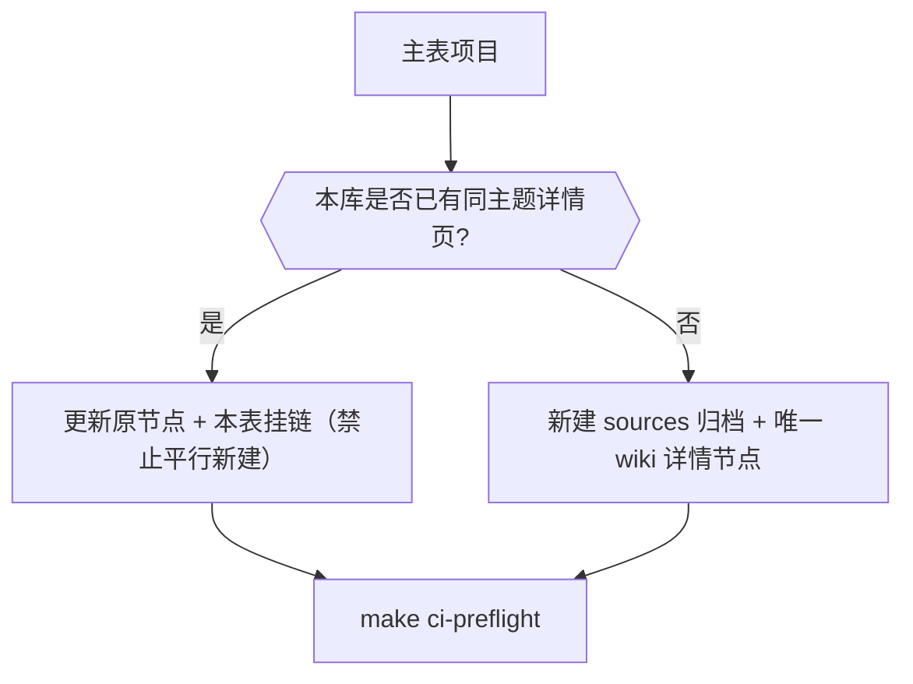

> **Query 产物**：本页由以下问题触发：「确保开源项目主表中提及的项目在本知识库中都有独立的详情节点。」
> 综合来源：[Humanoid Motion Intelligence](../entities/humanoid-motion-intelligence.md)、[开源运动控制项目结构化摘要](./open-source-motion-control-projects.md)、上游 [开源项目主表](https://github.com/RealXiaoze/humanoid-motion-intelligence/blob/main/%E8%AE%BA%E6%96%87%E4%B8%8E%E9%A1%B9%E7%9B%AE/%E5%BC%80%E6%BA%90%E9%A1%B9%E7%9B%AE%E4%B8%BB%E8%A1%A8.md)

# HMI 开源项目主表覆盖索引

## 英文缩写速查

| 缩写 | 英文全称 | 简要说明 |
|------|----------|----------|
| HMI | Humanoid Motion Intelligence | 具身智能研究室人形运动智能知识库 |
| VLA | Vision-Language-Action | 视觉–语言–动作策略 |
| WBC | Whole-Body Control | 全身控制 |
| Sim2Real | Simulation to Real | 仿真到真机 |
| LocoManip | Loco-Manipulation | 移动操作 |
| WBT | Whole-Body Tracking | 全身动作跟踪 |

## TL;DR

| 指标 | 数值 |
|------|------|
| 主表项目数 | 166 |
| 已映射详情节点 | 166 |
| 复用已有节点 | 120 |
| 其中合并撤销重复新建 | 18 |
| 确无已有页而新建 | 46 |
| 未覆盖 | 0 |

**规则：** 库内已有同主题详情页时 **只更新原节点并挂链**，禁止再剪平行实体；仅当确实不存在可复用页时才新建。

## 覆盖总表（按主表分组）

### 动作数据与重定向（12）

| 项目 | 本库详情节点 | 状态 |
| --- | --- | --- |
| [BifrostUMI](https://baai-aether.github.io/BifrostUMI/) | [paper-bifrost-umi](../entities/paper-bifrost-umi.md) | 已有 |
| [DDR](https://arxiv.org/abs/2605.23762) | [ddr-direct-dynamics-retargeting](../entities/ddr-direct-dynamics-retargeting.md) | 新建 |
| [DynaRetarget](https://atarilab.github.io/dynaretarget.io/) | [paper-notebook-dynaretarget-dynamically-feasible-retargeting-us](../entities/paper-notebook-dynaretarget-dynamically-feasible-retargeting-us.md) | 已有 |
| [GMR](https://github.com/YanjieZe/GMR) | [motion-retargeting-gmr](../methods/motion-retargeting-gmr.md) | 已有 |
| [GRAIL](https://github.com/NVlabs/GRAIL) | [paper-grail](../entities/paper-grail.md) | 已有 |
| [GVHMR](https://github.com/zju3dv/GVHMR) | [gvhmr](../entities/gvhmr.md) | 已有 |
| [HumanoidMimicGen](https://humanoidmimicgen.github.io/) | [paper-humanoidmimicgen](../entities/paper-humanoidmimicgen.md) | 已有 |
| [NMR / MakeTrackingEasy](https://github.com/NJU3DV-HumanoidGroup/MakeTrackingEasy) | [neural-motion-retargeting-nmr](../methods/neural-motion-retargeting-nmr.md) | 已有 |
| [OmniRetarget](https://github.com/amazon-far/holosoma) | [paper-hrl-stack-03-omniretarget](../entities/paper-hrl-stack-03-omniretarget.md) | 已有 |
| [PHC](https://github.com/ZhengyiLuo/PHC) | [phc](../entities/phc.md) | 已有 |
| [TRAM](https://github.com/yufu-wang/tram) | [paper-motion-cerebellum-tram](../entities/paper-motion-cerebellum-tram.md) | 已有 |
| [WHAM](https://github.com/yohanshin/WHAM) | [wham-world-human-motion](../entities/wham-world-human-motion.md) | 新建 |

### Locomotion与运动先验（24）

| 项目 | 本库详情节点 | 状态 |
| --- | --- | --- |
| [AMP_mjlab](https://github.com/ccrpRepo/AMP_mjlab) | [amp-mjlab](../entities/amp-mjlab.md) | 已有 |
| [BFM-Zero](https://github.com/LeCAR-Lab/BFM-Zero) | [paper-bfm-zero](../entities/paper-bfm-zero.md) | 已有 |
| [Booster Gym](https://github.com/BoosterRobotics/booster_gym) | [paper-notebook-booster-gym-an-end-to-end-rl-framework-for-human](../entities/paper-notebook-booster-gym-an-end-to-end-rl-framework-for-human.md) | 已有 |
| [DBHL窄地形全身运动](https://whole-body-loco.github.io/) | [dbhl-whole-body-loco](../entities/dbhl-whole-body-loco.md) | 新建 |
| [DreamWaQ（社区实现）](https://github.com/Manaro-Alpha/DreamWaQ) | [dreamwaq](../methods/dreamwaq.md) | 已有（合并） |
| [Generative Motion Prior](https://sites.google.com/view/humanoid-gmp) | [paper-motion-cerebellum-t-gmp](../entities/paper-motion-cerebellum-t-gmp.md) | 已有 |
| [Hiking in the Wild](https://project-instinct.github.io/hiking-in-the-wild/) | [paper-hiking-in-the-wild](../entities/paper-hiking-in-the-wild.md) | 已有 |
| [Humanoid Parkour Learning](https://humanoid4parkour.github.io/) | [paper-notebook-humanoid-parkour-learning](../entities/paper-notebook-humanoid-parkour-learning.md) | 已有 |
| [Humanoid-Gym](https://github.com/roboterax/humanoid-gym) | [humanoid-gym](../entities/humanoid-gym.md) | 已有 |
| [InternRobotics运动控制开源生态](https://github.com/InternRobotics) | [internrobotics](../entities/internrobotics.md) | 新建 |
| [Legged Lab DWAQ（Unitree G1）](https://gitee.com/chaomingsanhua/legged_lab) | [dreamwaq](../methods/dreamwaq.md) | 已有（合并） |
| [legged_gym](https://github.com/leggedrobotics/legged_gym) | [legged-gym](../entities/legged-gym.md) | 已有 |
| [MoRE](https://github.com/TeleHuman/MoRE) | [paper-amp-survey-08-more](../entities/paper-amp-survey-08-more.md) | 已有 |
| [Perceptive Humanoid Parkour](https://php-parkour.github.io/) | [paper-hrl-stack-22-perceptive_humanoid_parkour](../entities/paper-hrl-stack-22-perceptive_humanoid_parkour.md) | 已有 |
| [Project Instinct](https://project-instinct.github.io/) | [project-instinct](../entities/project-instinct.md) | 已有（合并） |
| [PULSE](https://github.com/ZhengyiLuo/PULSE) | [pulse-physics](../entities/pulse-physics.md) | 新建 |
| [roboparty_train](https://github.com/Roboparty/roboparty_train) | [roboparty](../entities/roboparty.md) | 已有（合并） |
| [Robot Parkour Learning](https://robot-parkour.github.io/) | [extreme-parkour](../entities/extreme-parkour.md) | 已有 |
| [SafeFall](https://safefall.github.io/) | [paper-hrl-stack-41-safefall](../entities/paper-hrl-stack-41-safefall.md) | 已有 |
| [UFO](https://github.com/Roboparty/UFO) | [roboparty-ufo](../entities/roboparty-ufo.md) | 已有 |
| [Unitree RL Gym](https://github.com/unitreerobotics/unitree_rl_gym) | [unitree-rl-gym](../entities/unitree-rl-gym.md) | 已有 |
| [Unitree RL Lab](https://github.com/unitreerobotics/unitree_rl_lab) | [unitree-rl-lab](../entities/unitree-rl-lab.md) | 已有 |
| [Unitree RL Mjlab](https://github.com/unitreerobotics/unitree_rl_mjlab) | [unitree-rl-mjlab](../entities/unitree-rl-mjlab.md) | 已有 |
| [X-Loco](https://x-loco-humanoid.github.io/) | [x-loco-humanoid](../entities/x-loco-humanoid.md) | 新建 |

### 动作跟踪与全身控制（24）

| 项目 | 本库详情节点 | 状态 |
| --- | --- | --- |
| [ALMI-Open](https://github.com/TeleHuman/ALMI-Open) | [paper-amp-survey-07-adversarial_locomotion_and_motion_im](../entities/paper-amp-survey-07-adversarial_locomotion_and_motion_im.md) | 已有（合并） |
| [BeyondMimic](https://github.com/HybridRobotics/whole_body_tracking) | [beyondmimic](../methods/beyondmimic.md) | 已有（合并） |
| [BeyondMimic-Reproduction](https://github.com/hunter20041220/BeyondMimic-Reproduction) | [beyondmimic](../methods/beyondmimic.md) | 已有（合并） |
| [Deep Whole-Body Parkour](https://project-instinct.github.io/deep-whole-body-parkour/) | [paper-deep-whole-body-parkour](../entities/paper-deep-whole-body-parkour.md) | 已有 |
| [DeepMimic](https://github.com/xbpeng/DeepMimic) | [deepmimic](../methods/deepmimic.md) | 已有 |
| [Embrace Collisions](https://project-instinct.github.io/embrace-collisions/) | [paper-amp-survey-19-embrace_collisions](../entities/paper-amp-survey-19-embrace_collisions.md) | 已有 |
| [engineai_rl_lab](https://github.com/engineai-robotics/engineai_rl_lab) | [engineai-rl-lab](../entities/engineai-rl-lab.md) | 新建 |
| [GenMimic](https://genmimic.github.io/) | [paper-hrl-stack-04 GenMimic](../entities/paper-hrl-stack-04-from_generated_human_videos_to_physi.md) | 已有（合并） |
| [GMT](https://github.com/zixuan417/humanoid-general-motion-tracking) | [paper-gmt](../entities/paper-gmt.md) | 已有 |
| [H2O / human2humanoid](https://github.com/LeCAR-Lab/human2humanoid) | [paper-hrl-stack-07-learning_human_to_humanoid_real_time](../entities/paper-hrl-stack-07-learning_human_to_humanoid_real_time.md) | 已有 |
| [Heracles](https://heracles-humanoid-control.github.io/) | [paper-heracles-humanoid-diffusion](../entities/paper-heracles-humanoid-diffusion.md) | 已有 |
| [HoloMotion](https://github.com/HorizonRobotics/HoloMotion) | [holomotion](../entities/holomotion.md) | 已有 |
| [HumanPlus](https://github.com/MarkFzp/humanplus) | [paper-loco-manip-161-012-humanplus](../entities/paper-loco-manip-161-012-humanplus.md) | 已有 |
| [LIMMT / GQS](https://github.com/GalaxyGeneralRobotics/Humanoid-GPT) | [paper-humanoid-gpt](../entities/paper-humanoid-gpt.md) | 已有 |
| [MaskedMimic / ProtoMotions](https://github.com/NVlabs/ProtoMotions) | [protomotions](../entities/protomotions.md) | 已有 |
| [MimicKit](https://github.com/xbpeng/MimicKit) | [mimickit](../entities/mimickit.md) | 已有 |
| [Motion-Between BFM-2](https://www.agibot.com.cn/article/315/detail/161.html) | [agibot-bfm-2](../entities/agibot-bfm-2.md) | 已有（合并） |
| [OmniH2O](https://omni.human2humanoid.com/) | [paper-hrl-stack-08-omnih2o](../entities/paper-hrl-stack-08-omnih2o.md) | 已有 |
| [OmniTrack](https://omnitrack-humanoid.github.io/) | [paper-hrl-stack-12-omnitrack](../entities/paper-hrl-stack-12-omnitrack.md) | 已有 |
| [OmniXtreme](https://github.com/Perkins729/OmniXtreme) | [paper-hrl-stack-16-omnixtreme](../entities/paper-hrl-stack-16-omnixtreme.md) | 已有 |
| [OpenTrack / Any2Track](https://github.com/GalaxyGeneralRobotics/OpenTrack) | [paper-opentrack](../entities/paper-opentrack.md) | 已有 |
| [TrackerLab](https://github.com/Renforce-Dynamics/trackerLab) | [trackerlab](../entities/trackerlab.md) | 新建 |
| [TWIST](https://github.com/YanjieZe/TWIST) | [paper-twist](../entities/paper-twist.md) | 已有 |
| [TWIST2](https://github.com/amazon-far/TWIST2) | [paper-twist2](../entities/paper-twist2.md) | 已有 |

### LocoManip（21）

| 项目 | 本库详情节点 | 状态 |
| --- | --- | --- |
| [CEER](https://robotproject8.github.io/ceer_page/) | [paper-motion-cerebellum-ceer](../entities/paper-motion-cerebellum-ceer.md) | 已有 |
| [CHIP](https://nvlabs.github.io/CHIP/) | [paper-hrl-stack-36-chip](../entities/paper-hrl-stack-36-chip.md) | 已有 |
| [CoorDex](https://github.com/Skevinci/coordex) | [paper-coordex-dexterous-humanoid-loco-manipulation](../entities/paper-coordex-dexterous-humanoid-loco-manipulation.md) | 已有 |
| [DoorMan](https://doorman-humanoid.github.io/) | [paper-doorman-opening-sim2real-door](../entities/paper-doorman-opening-sim2real-door.md) | 已有 |
| [FACET](https://facet.pages.dev/) | [facet-impedance](../entities/facet-impedance.md) | 新建 |
| [GentleHumanoid](https://gentle-humanoid.axell.top/) | [paper-gentlehumanoid](../entities/paper-gentlehumanoid.md) | 已有 |
| [HANDOFF](https://github.com/lzyang2000/HANDOFF) | [paper-motion-cerebellum-handoff](../entities/paper-motion-cerebellum-handoff.md) | 已有 |
| [HDMI](https://github.com/LeCAR-Lab/HDMI) | [paper-hrl-stack-06-hdmi](../entities/paper-hrl-stack-06-hdmi.md) | 已有 |
| [HumanX](https://wyhuai.github.io/human-x/) | [paper-hrl-stack-05-humanx](../entities/paper-hrl-stack-05-humanx.md) | 已有 |
| [OASIS](https://github.com/TeleHuman/OASIS) | [paper-loco-manip-04-oasis](../entities/paper-loco-manip-04-oasis.md) | 已有 |
| [OmniContact](https://github.com/Ingrid789/OmniContact_sim2sim) | [omnicontact-sim2sim](../entities/omnicontact-sim2sim.md) | 已有 |
| [OpenHLM](https://huggingface.co/OpenHLM) | [paper-loco-manip-161-154-openhlm](../entities/paper-loco-manip-161-154-openhlm.md) | 已有 |
| [SceneBot](https://ericcsr.github.io/scenebot/) | [paper-scenebot](../entities/paper-scenebot.md) | 已有 |
| [SimToolReal](https://github.com/tylerlum/simtoolreal) | [simtoolreal](../entities/simtoolreal.md) | 新建 |
| [SkillBlender](https://github.com/Humanoid-SkillBlender/SkillBlender) | [paper-loco-manip-161-077-skillblender](../entities/paper-loco-manip-161-077-skillblender.md) | 已有 |
| [SoFTA / Hold My Beer](https://github.com/LeCAR-Lab/SoFTA) | [paper-loco-manip-161-042-hold](../entities/paper-loco-manip-161-042-hold.md) | 已有 |
| [SoftMimic](https://gmargo11.github.io/softmimic/) | [paper-notebook-softmimic-learning-compliant-whole-body-control](../entities/paper-notebook-softmimic-learning-compliant-whole-body-control.md) | 已有 |
| [SplitAdapter](https://splitadapter.github.io/) | [paper-splitadapter-load-aware-loco-manipulation](../entities/paper-splitadapter-load-aware-loco-manipulation.md) | 已有 |
| [Thor](https://baai-aether.github.io/baai-thor/) | [paper-hrl-stack-42-thor](../entities/paper-hrl-stack-42-thor.md) | 已有 |
| [VIRAL](https://viral-humanoid.github.io/) | [paper-viral-humanoid-visual-sim2real](../entities/paper-viral-humanoid-visual-sim2real.md) | 已有 |
| [WT-UMI](https://wt-umi.github.io/WTUMI/) | [paper-loco-manip-07-wt-umi](../entities/paper-loco-manip-07-wt-umi.md) | 已有 |

### 世界模型、VLA与Agent（15）

| 项目 | 本库详情节点 | 状态 |
| --- | --- | --- |
| [ACT](https://github.com/tonyzhaozh/act) | [action-chunking](../methods/action-chunking.md) | 已有（合并） |
| [Diffusion Policy](https://github.com/real-stanford/diffusion_policy) | [diffusion-policy](../methods/diffusion-policy.md) | 已有 |
| [DreamDojo](https://github.com/NVIDIA/DreamDojo) | [paper-hrl-stack-35-dreamdojo](../entities/paper-hrl-stack-35-dreamdojo.md) | 已有 |
| [DreamZero](https://github.com/dreamzero0/dreamzero) | [paper-notebook-dreamzero-world-action-models-are-zero-shot-poli](../entities/paper-notebook-dreamzero-world-action-models-are-zero-shot-poli.md) | 已有 |
| [DROID Policy Learning](https://github.com/droid-dataset/droid_policy_learning) | [droid-policy-learning](../entities/droid-policy-learning.md) | 新建 |
| [GE-2 / GE-Sim 2.0](https://github.com/AgibotTech/GE-Sim-V2) | [ge-sim-2](../entities/ge-sim-2.md) | 已有 |
| [GigaWorld-0](https://giga-world-0.github.io/) | [gigaworld-0](../entities/gigaworld-0.md) | 新建 |
| [GO-2](https://www.agibot.com/article/231/detail/56.html) | [go-2](../entities/go-2.md) | 已有 |
| [HoloAgent](https://github.com/HorizonRobotics/HoloAgent) | [holoagent](../entities/holoagent.md) | 新建 |
| [Isaac-GR00T / GR00T N1.7](https://github.com/NVIDIA/Isaac-GR00T) | [paper-hrl-stack-34-gr00t_n1](../entities/paper-hrl-stack-34-gr00t_n1.md) | 已有 |
| [Octo](https://github.com/octo-models/octo) | [octo-model](../methods/octo-model.md) | 已有 |
| [openpi](https://github.com/Physical-Intelligence/openpi) | [π0-policy](../methods/π0-policy.md) | 已有（合并） |
| [OpenVLA](https://github.com/openvla/openvla) | [openvla](../entities/openvla.md) | 已有 |
| [WholeBodyVLA](https://github.com/OpenDriveLab/WholebodyVLA) | [paper-hrl-stack-30-wholebodyvla](../entities/paper-hrl-stack-30-wholebodyvla.md) | 已有 |
| [WorldArena](https://github.com/tsinghua-fib-lab/WorldArena) | [worldarena](../entities/worldarena.md) | 新建 |

### 工程与实机部署（70）

| 项目 | 本库详情节点 | 状态 |
| --- | --- | --- |
| [ASAP](https://github.com/LeCAR-Lab/ASAP) | [paper-notebook-asap-aligning-simulation-and-real-world-physics](../entities/paper-notebook-asap-aligning-simulation-and-real-world-physics.md) | 已有 |
| [BEHAVIOR / OmniGibson](https://github.com/StanfordVL/BEHAVIOR-1K) | [behavior-1k](../entities/behavior-1k.md) | 已有（合并） |
| [Brax](https://github.com/google/brax) | [brax](../entities/brax.md) | 已有 |
| [CALVIN](https://github.com/mees/calvin) | [calvin-benchmark](../entities/calvin-benchmark.md) | 新建 |
| [CleanRL](https://github.com/vwxyzjn/cleanrl) | [cleanrl](../entities/cleanrl.md) | 新建 |
| [CoppeliaSim](https://github.com/CoppeliaRobotics/coppeliaSimLib) | [coppeliasim](../entities/coppeliasim.md) | 新建 |
| [Crocoddyl](https://github.com/loco-3d/crocoddyl) | [crocoddyl](../entities/crocoddyl.md) | 已有 |
| [DexMimicGen](https://github.com/NVlabs/dexmimicgen) | [paper-notebook-dexmimicgen-automated-data-generation-for-bimanu](../entities/paper-notebook-dexmimicgen-automated-data-generation-for-bimanu.md) | 已有 |
| [Drake](https://github.com/RobotLocomotion/drake) | [drake](../entities/drake.md) | 已有 |
| [EmbodiedGen V2](https://github.com/HorizonRobotics/EmbodiedGen) | [paper-embodiedgen-v2-sim-ready-world-engine](../entities/paper-embodiedgen-v2-sim-ready-world-engine.md) | 已有 |
| [EngineAI Native SDK](https://github.com/engineai-robotics/engineai_robotics_native_sdk) | [engineai-native-sdk](../entities/engineai-native-sdk.md) | 新建 |
| [Foxglove](https://github.com/foxglove/studio) | [foxglove-studio](../entities/foxglove-studio.md) | 新建 |
| [Gazebo Sim](https://github.com/gazebosim/gz-sim) | [gazebo-sim](../entities/gazebo-sim.md) | 新建 |
| [Genesis](https://github.com/Genesis-Embodied-AI/Genesis) | [genesis-sim](../entities/genesis-sim.md) | 已有 |
| [Genie Sim 3.0](https://github.com/AgibotTech/genie_sim) | [genie-sim-3](../entities/genie-sim-3.md) | 已有 |
| [Genie Studio Agent](https://www.agibot.com/article/231/detail/59.html) | [genie-studio-agent](../entities/genie-studio-agent.md) | 已有 |
| [Humanoid Everyday](https://github.com/physical-superintelligence-lab/Humanoid-Everyday) | [humanoid-everyday-dataset](../entities/humanoid-everyday-dataset.md) | 已有 |
| [HumanoidBench](https://github.com/carlosferrazza/humanoid-bench) | [humanoid-bench](../entities/humanoid-bench.md) | 新建 |
| [HumanoidVerse](https://github.com/LeCAR-Lab/HumanoidVerse) | [paper-notebook-humanoidverse](../entities/paper-notebook-humanoidverse.md) | 已有 |
| [Hydra](https://github.com/facebookresearch/hydra) | [hydra-config](../entities/hydra-config.md) | 新建 |
| [Isaac Lab](https://github.com/isaac-sim/IsaacLab) | [isaac-lab](../entities/isaac-lab.md) | 已有 |
| [Isaac Sim](https://github.com/isaac-sim/IsaacSim) | [isaac-sim](../entities/isaac-sim.md) | 已有 |
| [IsaacGymEnvs](https://github.com/isaac-sim/IsaacGymEnvs) | [isaac-gym](../entities/isaac-gym.md) | 已有（合并） |
| [LeRobot](https://github.com/huggingface/lerobot) | [lerobot](../entities/lerobot.md) | 已有 |
| [LIBERO](https://github.com/Lifelong-Robot-Learning/LIBERO) | [libero-benchmark](../entities/libero-benchmark.md) | 新建 |
| [LocoMuJoCo](https://github.com/robfiras/loco-mujoco) | [loco-mujoco](../entities/loco-mujoco.md) | 新建 |
| [ManiSkill](https://github.com/haosulab/ManiSkill) | [paper-notebook-maniskill3-gpu-parallelized-robotics-simulation](../entities/paper-notebook-maniskill3-gpu-parallelized-robotics-simulation.md) | 已有 |
| [mc_rtc](https://github.com/jrl-umi3218/mc_rtc) | [mc-rtc](../entities/mc-rtc.md) | 新建 |
| [MCAP](https://github.com/foxglove/mcap) | [mcap-log-format](../entities/mcap-log-format.md) | 新建 |
| [MetaWorld](https://github.com/Farama-Foundation/Metaworld) | [paper-hrl-stack-32-metaworld](../entities/paper-hrl-stack-32-metaworld.md) | 已有 |
| [MimicGen](https://github.com/NVlabs/mimicgen) | [mimicgen](../entities/mimicgen.md) | 新建 |
| [Mink](https://github.com/kevinzakka/mink) | [mink-ik](../entities/mink-ik.md) | 新建 |
| [MJX](https://github.com/google-deepmind/mujoco/tree/main/mjx) | [mujoco-vs-isaac-lab](../comparisons/mujoco-vs-isaac-lab.md) | 已有 |
| [MLflow](https://github.com/mlflow/mlflow) | [mlflow](../entities/mlflow.md) | 新建 |
| [MOS9 开源人形机器人](https://github.com/THMOS2025/MOS-9-Open-Source-Humanoid-Robot) | [mos9-open-source-humanoid](../entities/mos9-open-source-humanoid.md) | 新建 |
| [MoveIt 2](https://github.com/moveit/moveit2) | [moveit2](../entities/moveit2.md) | 已有 |
| [MuJoCo](https://github.com/google-deepmind/mujoco) | [mujoco](../entities/mujoco.md) | 已有 |
| [MuJoCo Menagerie](https://github.com/google-deepmind/mujoco_menagerie) | [mujoco](../entities/mujoco.md) | 已有（合并） |
| [OCS2](https://github.com/leggedrobotics/ocs2) | [ocs2](../entities/ocs2.md) | 新建 |
| [OmniGibson](https://github.com/StanfordVL/OmniGibson) | [behavior-1k](../entities/behavior-1k.md) | 已有（合并） |
| [OSQP](https://github.com/osqp/osqp) | [osqp](../entities/osqp.md) | 新建 |
| [Pink](https://github.com/stephane-caron/pink) | [pink-ik](../entities/pink-ik.md) | 新建 |
| [Pinocchio](https://github.com/stack-of-tasks/pinocchio) | [pinocchio](../entities/pinocchio.md) | 已有 |
| [PlotJuggler](https://github.com/facontidavide/PlotJuggler) | [plotjuggler](../entities/plotjuggler.md) | 已有 |
| [PRIME](https://github.com/well-robotics/PRIME) | [prime-system-id](../entities/prime-system-id.md) | 新建 |
| [Project Instinct InstinctLab](https://github.com/project-instinct/instinctlab) | [project-instinct](../entities/project-instinct.md) | 已有（合并） |
| [Project Instinct Robot Motion Editor](https://github.com/project-instinct/robot-motion-editor) | [robot-motion-keyframe-editors](../entities/robot-motion-keyframe-editors.md) | 已有 |
| [project-instinct/instinct_onboard](https://github.com/project-instinct/instinct_onboard) | [project-instinct](../entities/project-instinct.md) | 已有（合并） |
| [project-instinct/instinct_rl](https://github.com/project-instinct/instinct_rl) | [project-instinct](../entities/project-instinct.md) | 已有（合并） |
| [ProxSuite](https://github.com/Simple-Robotics/proxsuite) | [proxsuite](../entities/proxsuite.md) | 新建 |
| [PyBullet](https://github.com/bulletphysics/bullet3) | [pybullet](../entities/pybullet.md) | 已有 |
| [RaiSim](https://github.com/raisimTech/raisimLib) | [raisim](../entities/raisim.md) | 新建 |
| [rerun](https://github.com/rerun-io/rerun) | [rerun-io](../entities/rerun-io.md) | 新建 |
| [rl_games](https://github.com/Denys88/rl_games) | [rl-games](../entities/rl-games.md) | 新建 |
| [RLBench](https://github.com/stepjam/RLBench) | [rlbench](../entities/rlbench.md) | 新建 |
| [RoboCasa](https://github.com/robocasa/robocasa) | [paper-notebook-robocasa-large-scale-simulation-of-everyday-task](../entities/paper-notebook-robocasa-large-scale-simulation-of-everyday-task.md) | 已有 |
| [robomimic](https://github.com/ARISE-Initiative/robomimic) | [robomimic](../entities/robomimic.md) | 新建 |
| [robosuite](https://github.com/ARISE-Initiative/robosuite) | [robosuite](../entities/robosuite.md) | 新建 |
| [robot_descriptions.py](https://github.com/robot-descriptions/robot_descriptions.py) | [robot-descriptions-py](../entities/robot-descriptions-py.md) | 新建 |
| [ROS 2](https://github.com/ros2/ros2) | [unitree-ros2](../entities/unitree-ros2.md) | 已有 |
| [ros2_control](https://github.com/ros-controls/ros2_control) | [ros2-control](../entities/ros2-control.md) | 新建 |
| [rsl_rl](https://github.com/leggedrobotics/rsl_rl) | [amp-rsl-rl](../entities/amp-rsl-rl.md) | 已有 |
| [SafeWBC](https://kwlee365.github.io/SafeWBC-Website/) | [paper-motion-cerebellum-safewbc](../entities/paper-motion-cerebellum-safewbc.md) | 已有 |
| [SAPIEN](https://github.com/haosulab/SAPIEN) | [sapien](../entities/sapien.md) | 已有 |
| [skrl](https://github.com/Toni-SM/skrl) | [skrl](../entities/skrl.md) | 新建 |
| [Stable-Baselines3](https://github.com/DLR-RM/stable-baselines3) | [stable-baselines3](../entities/stable-baselines3.md) | 新建 |
| [ToddlerBot](https://github.com/hshi74/toddlerbot) | [paper-loco-manip-161-141-toddlerbot](../entities/paper-loco-manip-161-141-toddlerbot.md) | 已有 |
| [TSID](https://github.com/stack-of-tasks/tsid) | [tsid](../concepts/tsid.md) | 已有 |
| [Webots](https://github.com/cyberbotics/webots) | [webots](../entities/webots.md) | 新建 |
| [Weights & Biases](https://github.com/wandb/wandb) | [wandb-vs-tensorboard](../comparisons/wandb-vs-tensorboard.md) | 已有 |

## 决策路径

## 已合并撤销的重复新建（摘要）

| 曾误建 | 收敛到 |
|--------|--------|
| act-aloha | [action-chunking](../methods/action-chunking.md) |
| openpi | [π0-policy](../methods/π0-policy.md) |
| isaac-gym-envs | [isaac-gym](../entities/isaac-gym.md) |
| omnigibson | [behavior-1k](../entities/behavior-1k.md) |
| instinctlab / instinct-rl / instinct-onboard | [project-instinct](../entities/project-instinct.md) |
| legged-lab-dwaq | [dreamwaq](../methods/dreamwaq.md) |
| roboparty-train | [roboparty](../entities/roboparty.md) |
| beyondmimic-reproduction | [beyondmimic](../methods/beyondmimic.md) |
| motion-between-bfm-2 | [agibot-bfm-2](../entities/agibot-bfm-2.md) |
| mujoco-menagerie | [mujoco](../entities/mujoco.md) |
| almi-open | [paper-amp-survey-07 ALMI](../entities/paper-amp-survey-07-adversarial_locomotion_and_motion_im.md) |
| genmimic | [paper-hrl-stack-04 GenMimic](../entities/paper-hrl-stack-04-from_generated_human_videos_to_physi.md) |
| DreamWaQ 社区实现（曾误挂 dreamwaq-plus） | [dreamwaq](../methods/dreamwaq.md) |

## 一句话记忆

主表负责策展地图；本库优先 **复用并更新** 已有详情节点，只在真正缺失时新建。

## 关联页面

- [Humanoid Motion Intelligence](../entities/humanoid-motion-intelligence.md)
- [开源运动控制项目结构化摘要](./open-source-motion-control-projects.md)
- [人形 RL 运动控制身体系统栈](../overview/humanoid-rl-motion-control-body-system-stack.md)
- [运动小脑技术地图](../overview/humanoid-motion-cerebellum-technology-map.md)

## 参考来源

- [sources/repos/humanoid-motion-intelligence.md](../../sources/repos/humanoid-motion-intelligence.md)
- [开源项目主表（上游）](https://github.com/RealXiaoze/humanoid-motion-intelligence/blob/main/%E8%AE%BA%E6%96%87%E4%B8%8E%E9%A1%B9%E7%9B%AE/%E5%BC%80%E6%BA%90%E9%A1%B9%E7%9B%AE%E4%B8%BB%E8%A1%A8.md)

## 推荐继续阅读

- [上游开源项目主表](https://github.com/RealXiaoze/humanoid-motion-intelligence/blob/main/%E8%AE%BA%E6%96%87%E4%B8%8E%E9%A1%B9%E7%9B%AE/%E5%BC%80%E6%BA%90%E9%A1%B9%E7%9B%AE%E4%B8%BB%E8%A1%A8.md)
