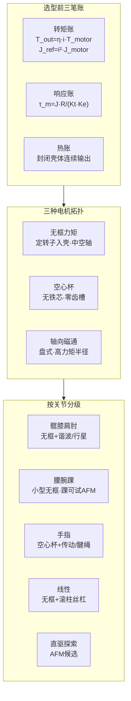

> **Query 产物**：本页由以下问题触发：「无框力矩、空心杯、轴向磁通，谁才是人形机器人关节电机的首选？」
> 叙事骨架编译自 [Zane Hub 2026-09-20 公众号文](../../sources/blogs/wechat_zanehub_joint_motor_topology_selection_2026-09-20.md)；与 [自研关节模组开发流程](../concepts/joint-module-self-development-workflow.md)（怎么做模组）互补，本页聚焦**三种电机拓扑在各关节点位的分工**。

# 人形关节电机拓扑选型：三种路线如何分工？

## 一句话定义

人形关节电机选型不是押注单一「最好」拓扑，而是按关节负载谱与包络，在**无框力矩（量产大关节中坚）、空心杯（灵巧手毫秒响应）、轴向磁通（扁薄/直驱探索）** 之间匹配减速链与热/公差边界——先算转矩、响应、热三笔账，再定减速器与电机。

## 英文缩写速查

| 缩写 | 英文全称 | 简要说明 |
|------|----------|----------|
| AFM | Axial-Flux Machine | 轴向磁通电机，气隙沿轴向、盘式结构 |
| PMSM | Permanent Magnet Synchronous Motor | 永磁同步电机，人形关节主流 |
| QDD | Quasi Direct Drive | 准直驱，低减速比换带宽与反驱 |
| PRS | Planetary Roller Screw | 行星滚柱丝杠，线性关节常用 |
| TN | Torque–Speed | 转矩–转速曲线，区分峰值与连续区 |
| PWM | Pulse Width Modulation | 脉宽调制，低电感绕组对频率敏感 |

## 为什么重要

- **BOM 与性能天花板**：关节电机决定负载自重比、动态响应与控制上限；样机 demo 与批量交付的分水岭常在执行器一致性与连续输出。
- **三类拓扑常被误读为「谁取代谁」**：它们对应不同物理边界与供应链成熟度；把 AFM 当默认、或把空心杯塞进髋膝，都会踩结构性坑。
- **减速器是选型的一半**：公开拆解显示同一整机可混用谐波、行星、滚柱丝杠；电机拓扑必须与传动构型联立（见 [关节模组流程](../concepts/joint-module-self-development-workflow.md)）。

## 流程总览：三笔账 → 三种拓扑 → 关节分级

## 三种拓扑：机制、量产锚点与边界

| 拓扑 | 结构要点 | 量产锚点（公开口径） | 主要边界 |
|------|----------|----------------------|----------|
| **无框力矩** | 仅定转子裸件，壳体由关节承担；中空走线 | Optimus 28 执行器；[Unitree](../entities/unitree.md) G1 自研关节（膝峰 90–120 N·m）；步科/雷赛/昊志等批量供货 | **连续瓶颈在散热**；转矩密度须分清峰值/连续、本体/含减速器 |
| **空心杯** | 无铁芯杯状绕组；零齿槽、极低 J | Optimus 手 12 台；G1 Dex3-1 微电机路线；Maxon/Faulhaber + 国内鸣志/鼎智 | 单机转矩极小 → 大减速比或腱绳；绕组即结构件，过载温升敏感 |
| **轴向磁通** | 气隙沿轴向，力矩半径大，轴向薄 | 车/农机等已出货；机器人样机报高扭矩密度；[axfluxmdo](../entities/axfluxmdo.md) 等工具做早期权衡 | **公差链、轴向磁拉力、定子制造、成本与热**四道坎；跟踪路线非默认 |

### 无框力矩 + 减速器：当前默认主力

- **旋转大关节**：无框力矩 + 谐波或行星 — 转矩密度、供应链、成本平衡最好。
- **线性关节**：无框工作在较高转速 + [行星滚柱丝杠](../overview/humanoid-hardware-101-linear-transmission-bearings.md) 换直线推力。
- **细节**：G1 小腿采用**两级行星**而非谐波 — 说明腿足冲击工况下行星抗冲击/成本可被优先。

### 空心杯：灵巧手的事实标准（短期）

- 看重 **毫秒级响应与零齿槽平滑性**，而非本体转矩密度。
- 须配多级行星、蜗轮蜗杆或腱绳；驱动器电流环/PWM 须匹配低电感，否则物理优势被抹平。
- **跟踪变量**：Optimus 新一代手可能前臂集中驱动 + 部分有齿槽微型电机 — 「唯一解」标签在松动。

### 轴向磁通：扁薄与高力矩半径探索

- 电磁上适合踝等**轴向空间极受限**点位与直驱/QDD 探索。
- 工程上先算**壳体端面跳动、轴承预紧、装配一致性** — 漂亮电磁参数救不了批量公差。
- 开源预研链见 [轴向磁通对比](../comparisons/open-source-torque-motor-em-design.md) 与 [PCB Motor](../entities/pcb-motor.md)（微型学习向，非髋膝主力）。

## 按关节分级选型参考

| 关节点位 | 推荐构型 | 备注 |
|----------|----------|------|
| 髋、膝、肩、肘 | 无框力矩 + 谐波或行星 | 量产主流；膝侧行星 vs 谐波见 [humanoid-knee-harmonic-drive-limits](../concepts/humanoid-knee-harmonic-drive-limits.md) |
| 腰、腕、踝 | 无框小型框架（~50 mm 级）+ 谐波/摆线 | 踝可评估 AFM |
| 手指 / 灵巧手 | 空心杯 + 多级行星或腱绳 | 灵巧手 BOM 占比高（文内 ~17% 量级） |
| 线性（膝踝等） | 无框 + 滚柱丝杠 | Optimus 14 线性执行器路线 |
| 直驱 / QDD 探索 | AFM 候选 | 须同步热设计与公差链 |

## 工程实践：六条反复出现的坑

1. **先定减速器，再定电机** — 由关节输出反推减速比 i，再选电机工作点落 [TN 高效区](../concepts/motor-torque-speed-curve.md)。
2. **分清峰值与连续** — 封闭关节看连续堵转温升；预留 **≥30%** 裕量是常规做法。
3. **热设计早进场** — 定子–壳体导热、灌封、传感布局与结构同步，勿样机过热后补救。
4. **力控看双编反馈链** — 电机端 + 输出端编码已成主力标配；分辨率与安装勿让位于电机标称参数。
5. **空心杯配驱动** — 低电感绕组对电流环带宽与 PWM 敏感。
6. **AFM 先算公差账** — 优先核对端面跳动与轴承配置。

## 常见误区

1. **「转矩密度越高越好」** — 忽略连续/峰值口径与含不含减速器总成。
2. **「一种电机通吃全身」** — 忽视手指 ms 级响应 vs 髋膝百 N·m 连续/冲击分工。
3. **「AFM 论文数字 = 可量产关节」** — 跳过公差、磁拉力与定子制造工艺。
4. **「选好电机就完事」** — 减速比 i 放大 J_ref=i²·J_motor，力控透明度与带宽一并改变。

## 关联页面

- [自研关节模组开发流程](../concepts/joint-module-self-development-workflow.md) — 需求→传动→五件套→测试
- [Humanoid Hardware 101 · 集成执行器](../overview/humanoid-hardware-101-integrated-actuators.md)
- [传动与感知链](../overview/humanoid-hardware-101-actuation-sensing-chain.md) — 空心杯与径向磁通语境
- [电机设计工作流](../overview/motor-design-workflow.md) — 电磁–热–FOC 子链
- [开源力矩电机电磁设计对比](../comparisons/open-source-torque-motor-em-design.md)
- [人形量产工程能力](../concepts/humanoid-mass-production-engineering.md) — 无框绕线/散热 DFM
- [力矩电机设计纵深路线](../../roadmap/depth-torque-motor-design.md)

## 参考来源

- [Zane Hub：无框力矩、空心杯、轴向磁通选型（2026-09-20）](../../sources/blogs/wechat_zanehub_joint_motor_topology_selection_2026-09-20.md)

## 推荐继续阅读

- [Kollmorgen TBM2G 无框力矩产品资料](https://www.kollmorgen.com/en-us/products/motors/tbm2g) — 海外机座/连续堵转参数口径示例
- [Unitree G1 官方文档](https://www.unitree.com/g1) — 自研关节峰值扭矩与中空轴配置
