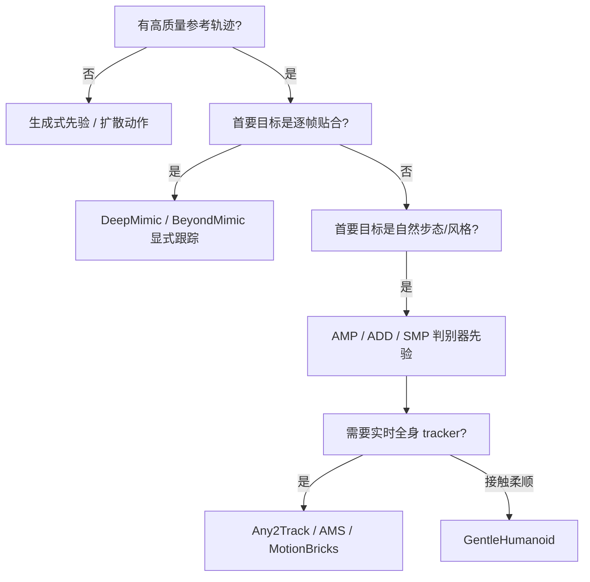

> **Query 产物**：本页由以下问题触发：「人形运动跟踪与风格先验方法这么多，工程上怎么选、怎么组合？」
> 综合来源：[DeepMimic](../methods/deepmimic.md)、[BeyondMimic](../methods/beyondmimic.md)、[AMP & HumanX](../methods/amp-reward.md)、[Locomotion](../tasks/locomotion.md)、[人形 AMP 先验综述](../overview/humanoid-amp-motion-prior-survey.md)

# 人形运动跟踪方法选型指南

## TL;DR 决策路径

| 阶段目标 | 优先方法族 | 典型入口 |
|----------|------------|----------|
| 证明「能跟参考跑起来」 | 显式 tracking reward | [DeepMimic](../methods/deepmimic.md)、[BeyondMimic](../methods/beyondmimic.md) |
| 任务完成后仍像「人」 | 对抗式 motion prior | [AMP](../methods/amp-reward.md)、[ADD](../methods/add.md)、[SMP](../methods/smp.md) |
| 多动作通用 tracker | 规模化 tracking policy | [Any2Track](../methods/any2track.md)、[AMS](../methods/ams.md)、[MotionBricks](../methods/motionbricks.md) |
| 数据稀缺、要合成参考 | 生成式动作 | [ASE](../methods/ase.md)、[GenMo](../methods/genmo.md)、[扩散动作生成](../methods/diffusion-motion-generation.md) |

---

## 分阶段选型说明

### 1. 显式跟踪：先解决「跟得上」

[DeepMimic](../methods/deepmimic.md) 用多 term 跟踪奖励 + RSI，适合作为**第一条可复现基线**。[BeyondMimic](../methods/beyondmimic.md) 在同类框架上面向人形与更复杂参考，适合在 DeepMimic 已跑通后升级。

**常见误判**：把 tracking MSE 当成最终目标——高频抖动往往说明需要进入 motion prior 阶段，而不是继续堆 tracking 权重。

### 2. Motion prior：再解决「像不像」

当任务奖励已满足，仍出现步态不自然时，引入 [AMP](../methods/amp-reward.md) 判别器先验。[ADD](../methods/add.md) 用对抗差分减轻多目标手调；[SMP](../methods/smp.md) 把先验拆成可复用 reward model，便于模块化实验。

三者对比见 [AMP / ADD / SMP 运动先验变体对比](../comparisons/amp-add-smp-motion-prior-variants.md)。

### 3. 通用 tracker 与实时原语

[MotionBricks](../methods/motionbricks.md) 强调实时 smart primitives + 全身控制；[Any2Track](../methods/any2track.md)、[AMS](../methods/ams.md) 面向**多参考、抗扰、负载变化**的通用跟踪器，常作为「身体基础模型」层。

### 4. 接触柔顺与生成式补充

[GentleHumanoid](../methods/gentlehumanoid-motion-tracking.md) 把力/柔顺约束写进跟踪目标，适合接触丰富场景。参考不足时，[ASE](../methods/ase.md)、[GenMo](../methods/genmo.md)、[扩散动作生成](../methods/diffusion-motion-generation.md) 用于扩充或平滑参考分布。

---

## 推荐组合 pipeline

| Pipeline | 组合 | 适用 |
|----------|------|------|
| **经典 mimic** | DeepMimic → BeyondMimic | 单动作高保真、论文复现 |
| **AMP 增强** | BeyondMimic + AMP/ADD/SMP | 行走/舞蹈等需自然风格 |
| **通用 tracker** | GMR/NMR 重定向 → Any2Track/AMS | 多动作库、遥操作闭环 |
| **接触任务** | GentleHumanoid + 下游操作/搬运 | 推、扶、柔顺交互 |

---

## 常见误区

1. **AMP ≠ 更好 tracking**：AMP 约束的是**状态转移分布**，不能替代任务奖励与稳定跟踪基线。
2. **生成式先验不能跳过仿真验证**：扩散/ASE 产物仍需进物理仿真做 feasibility 检查。
3. **tracker 与 prior 混在同一 reward**：建议分阶段训练或明确权重 schedule，避免梯度互相掩盖。

---

## 参考来源

- [DeepMimic 论文摘要](../../sources/papers/deepmimic.md)
- [AMP 论文摘要](../../sources/papers/amp.md)
- [具身智能研究室：人形 AMP 先验综述](../../sources/blogs/wechat_embodied_ai_lab_humanoid_amp_motion_prior_survey.md)

## 关联页面

- [DeepMimic](../methods/deepmimic.md)、[BeyondMimic](../methods/beyondmimic.md)
- [AMP & HumanX](../methods/amp-reward.md)、[ADD](../methods/add.md)、[SMP](../methods/smp.md)
- [MotionBricks](../methods/motionbricks.md)、[Any2Track](../methods/any2track.md)、[AMS](../methods/ams.md)
- [GentleHumanoid](../methods/gentlehumanoid-motion-tracking.md)
- [ASE](../methods/ase.md)、[GenMo](../methods/genmo.md)、[扩散动作生成](../methods/diffusion-motion-generation.md)
- [AMP / ADD / SMP 对比](../comparisons/amp-add-smp-motion-prior-variants.md)
- [人形 RL 运动控制身体系统栈](../overview/humanoid-rl-motion-control-body-system-stack.md)
- [人形 RL Cookbook](./humanoid-rl-cookbook.md)

## 一句话记忆

> **先 DeepMimic 证明能跟，再 AMP 家族修风格，最后 Any2Track/AMS 做通用 tracker；接触与生成式是两条侧向增强线。**
