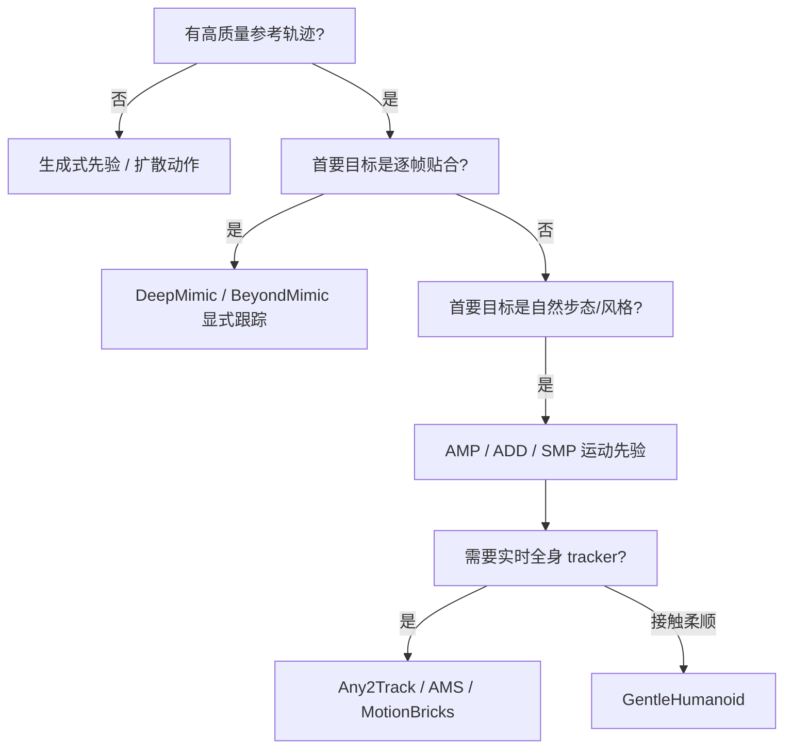

> **Query 产物**：本页由以下问题触发：「人形运动跟踪与风格先验方法这么多，工程上怎么选、怎么组合？」
> 综合来源：[DeepMimic](../methods/deepmimic.md)、[BeyondMimic](../methods/beyondmimic.md)、[AMP & HumanX](../methods/amp-reward.md)、[Locomotion](../tasks/locomotion.md)、[人形 AMP 先验综述](../overview/humanoid-amp-motion-prior-survey.md)

# 人形运动跟踪方法选型指南

## 英文缩写速查

| 缩写 | 英文全称 | 简要说明 |
|------|----------|----------|
| WBT | Whole-Body Tracking | 参考动作跟踪类方法总称 |
| AMP | Adversarial Motion Prior | 分布约束式运动先验路线 |
| RL | Reinforcement Learning | 任务奖励与先验联合优化 |
| MoCap | Motion Capture | 参考动作与风格数据来源 |
| Sim2Real | Simulation to Real | 跟踪策略上真机的迁移考量 |

## TL;DR 决策路径

```mermaid
flowchart TD
  A[有高质量参考轨迹?] -->|否| B[生成式先验 / 扩散动作]
  A -->|是| C[首要目标是逐帧贴合?]
  C -->|是| D[DeepMimic / BeyondMimic 显式跟踪]
  C -->|否| E[首要目标是自然步态/风格?]
  E -->|是| F[AMP / ADD / SMP 运动先验]
  F --> G[需要实时全身 tracker?]
  G -->|是| H[Any2Track / AMS / MotionBricks]
  G -->|接触柔顺| I[GentleHumanoid]
```

| 阶段目标 | 优先方法族 | 典型入口 |
|----------|------------|----------|
| 证明「能跟参考跑起来」 | 显式 tracking reward | [DeepMimic](../methods/deepmimic.md)、[BeyondMimic](../methods/beyondmimic.md) |
| 任务完成后仍像「人」 | 对抗式 motion prior | [AMP](../methods/amp-reward.md)、[ADD](../methods/add.md)、[SMP](../methods/smp.md) |
| 多动作通用 tracker | 规模化 tracking policy | [GMT](../entities/paper-gmt.md)、[Any2Track](../methods/any2track.md)、[AMS](../methods/ams.md)、[MotionBricks](../methods/motionbricks.md)、[EGM](../methods/egm-efficient-general-mimic.md)、[SONIC](../methods/sonic-motion-tracking.md)、[Humanoid-GPT](../entities/paper-humanoid-gpt.md) |
| 工业极简、跨形态真机 tracking | 下一步参考 + 无估计器 | [ZEST](../entities/paper-zest.md)（Atlas/G1/Spot；部署仍要播参考） |
| SciRob 同期三层怎么放 | 配方 / 底座 / 感知任务，勿与 WBT 方法族混表 | [ZEST vs SONIC vs 视觉足球](../comparisons/zest-vs-sonic-vs-vision-soccer.md) |
| 比较多个已有 tracker | 四族光学基准 + HumanScore，勿只报 AMASS-140 / MPJPE | [HumanTracker](../entities/paper-humantracker.md)（评测代码已开，153 h 数据待发布） |
| 高覆盖率下训练集长尾 | 能力对齐 expert + 路由蒸馏 | [Athena-WBC](../entities/paper-athena-wbc-humanoid-longtail.md)（改奖励/重力课程，非仅重采样；STC/TIS/MPJPE-W） |
| 动画参考 + latent 上下文跟踪 | 两阶段 VAE prior + 显式 PPO | [VMP](../entities/paper-notebook-vmp.md)（SCA 2024；LIME 真机） |
| 接触丰富场景 tracking | 参考运动 + per-link contact label | [SceneBot](../entities/paper-scenebot.md)（hindsight 场景重建 + 单策略 terrain/object） |
| 数据稀缺、要合成参考 | 生成式动作 | [ASE](../methods/ase.md)、[GenMo](../methods/genmo.md)、[扩散动作生成](../methods/diffusion-motion-generation.md) |
| 已有通才 tracker，缺可执行生成参考 | 生成器–跟踪器在线后训练 | [GenTrack](../entities/paper-gentrack.md)（接 SONIC/ProtoMotions；不采新数据；确认未开源） |
| **快速 WBT 迭代**（off-policy 墙钟，单参考/小 benchmark） | 结构化 MoE + 专家 critic + 配额 replay | [LooperMuscle](../entities/paper-loopermuscle.md)（~45 min vs PPO ~6 h；40 LAFAN1；MJLab 特权基准 ≠ Holosoma 真机 ckpt） |

---

## 分阶段选型说明

### 1. 显式跟踪：先解决「跟得上」

[DeepMimic](../methods/deepmimic.md) 用多 term 跟踪奖励 + RSI，适合作为**第一条可复现基线**。[BeyondMimic](../methods/beyondmimic.md) 在同类框架上面向人形与更复杂参考，适合在 DeepMimic 已跑通后升级。

**常见误判**：把 tracking MSE 当成最终目标——高频抖动往往说明需要进入 motion prior 阶段，而不是继续堆 tracking 权重。

### 2. Motion prior：再解决「像不像」

当任务奖励已满足，仍出现步态不自然时，引入 [AMP](../methods/amp-reward.md) 判别器先验。[ADD](../methods/add.md) 用对抗差分减轻多目标手调；[SMP](../methods/smp.md) 走 **冻结扩散 + SDS** 路线（非判别器），先验预训练后可**丢弃原始 MoCap**、在多任务多策略间复用，代价是两阶段训练、同采样量 wall-clock 约为 AMP 的 ~1.8×（论文报告 600M samples：SMP ~11.5h vs AMP ~6.2h）。

**选型轴**：每任务都要重训先验 / 必须保留数据集 → AMP/ADD；先验一次训好跨任务复用、不愿在 RL 阶段保留 MoCap → SMP；需要 **动画师可直接编 kinematic 参考**、且希望 **latent 与跟踪解耦**（相对 CALM/ASE 端到端）→ [VMP](../entities/paper-notebook-vmp.md)；已有 AMP/SMP 但异构参考与**当前任务上下文**冲突 → [CMP](../entities/paper-cmp.md)（相关度软重权，不另开 skill 空间；\(c\) 为局部 heading 系目标/命令/物体状态）；已有 ADD/BeyondMimic、痛点是**高动态跟踪样本效率**且只有无序姿态语料 → 旁挂 [PFM-HR](../entities/paper-pfm-hr.md)（冻结 Flow Matching + PGS；相对 [PDF-HR](../entities/paper-notebook-pdf-hr.md) 评关节差分而非单姿态距离；代码 Coming Soon）。变体对比见 [AMP / ADD / SMP 运动先验变体对比](../comparisons/amp-add-smp-motion-prior-variants.md)。

### 3. 通用 tracker 与实时原语

[MotionBricks](../methods/motionbricks.md) 强调实时 smart primitives + 全身控制；[GMT](../entities/paper-gmt.md) 用 **Adaptive Sampling + Motion MoE** 做大规模 filtered MoCap 上的**单策略**真机跟踪；[Any2Track](../methods/any2track.md)、[AMS](../methods/ams.md) 面向**多参考、抗扰、负载变化**的通用跟踪器，常作为「身体基础模型」层。

当瓶颈是 **墙钟** 而非数据规模——需要在 **29-DoF 全身跟踪** 上快速试参考/奖励/域随机，且可接受 off-policy 配方时，优先评估 **[LooperMuscle](../entities/paper-loopermuscle.md)**：在 [FastSAC](../entities/paper-notebook-learning-sim-to-real-humanoid-locomotion-in-15-m.md) 基座上叠加 **上下身分组 MoE + 专家感知 DVF + 配额路由 replay**；40 条 LAFAN1 上约 **45 min** 追回 PPO（~6 h）约 **72%** 归一化奖励，相对裸 FastSAC-MLP body err **↓34%**。注意论文主表在 **MJLab 特权 anchor 观测**，真机需在 **Holosoma 154-D 可部署接口重训**，勿把基准数字当部署承诺。

当瓶颈不在网络结构而在**数据不平衡与高动态精度**时，看 [EGM](../methods/egm-efficient-general-mimic.md)：它用 **bin 级误差驱动的跨动作采样课程** + **上下身分组 CDMoE**，论证「小而高质量的精选 MoCap 子集优于大规则筛集」，把选型轴从「堆更多小时数据」转向「数据策展 + 采样调度」。

若已有 **AMASS 级大库** 且 tracker 已选定（如 Any2Track / TWIST2），优先评估 **[LIMMT / GQS](../methods/limmt-gqs-motion-curation.md)**：**离线** 三阶段策展（仿真可行性 → HME 多样性 → 复杂度加权 FPS）可在 **≈3% 数据** 上击败全量训练，且 **plug-and-play** 不改动算法——适合作为 WBT **阶段 3 前置数据模块**。

当 **全训练集 SR 已 >98%** 但仍有 **高动态/平衡关键** 片段反复失败，且 **对失败子集加训仍学不会** 时，问题往往不在曝光而在 **acquisition capability**（保守 effort/temporal 奖励、名义重力冷启动等）。此时优先评估 **[Athena-WBC](../entities/paper-athena-wbc-humanoid-longtail.md)**：**dynamic expert**（去保守奖励 + Grad-CAPS 辅助平滑）与 **balance expert**（重力课程）并行于同一残余集，再 **按 rollout 路由 DAgger 蒸馏 + RL 微调**；评测除单阈值 SR 外应看 **STC/TIS/MPJPE-W**，避免「高 SR 掩盖长尾」。

### 4. 接触柔顺、场景交互与生成式补充

[GentleHumanoid](../methods/gentlehumanoid-motion-tracking.md) 把力/柔顺约束写进跟踪目标，适合接触丰富场景。当已有 **通用 tracker（如 SONIC）** 但需在 **楼梯、搬箱、坐椅** 等 **terrain + object** 组合任务上零样本执行时，优先评估 **[SceneBot](../entities/paper-scenebot.md)**：在参考运动外增加 **per-link contact label**（link 应对 terrain/object 施力），并用 **hindsight scene reconstruction** 从无场景动捕合成训练配对数据；论文报告自由空间与 SONIC 同级，而 object/terrain 成功率 **95–100% vs 5–15%**。高层可用规则/遥操作生成 label，部署时 **$c_t=0$** 可回退平地跟踪。

若 **不能** 给 teleoperator 额外 contact label，但仍要 **online reference window + terrain/object + OOD/fall 鲁棒**，可对照 **[GigaBrain-WBC-0.5](../entities/paper-gigabrain-wbc-0-5.md)**（arXiv:2608.18234）：**Behavior World Model** 联合预测 action/next-state/next-command GMM，从 retarget corpus **自动恢复 3D terrain 几何**（非 2.5D height field），部署期用 **Mahalanobis retract** 处理不可行命令并把 **fall recovery** 训进同一 tracker；MuJoCo 四 regime 上 Terrain SR **81.3%**、Fall recovery **99.3%**；截至 2026-08-21 代码 **coming soon**。

当任务语义由 **「是否真正接触物体」** 定义（擦板 vs 挥手贴近、坐椅承重 vs 悬空蹲姿、搬箱 vs 手路过箱子），且需要 **同一 keypoint 下运行时开关接触** 时，优先评估 **[ContactMimic](../entities/paper-contactmimic.md)**（arXiv:2607.08742）：在 keypoint 外增加 **per-body 二值 contact 指令**，并用 **label 翻转 / 去物体 / 膨胀几何** 增广打破 keypoint–contact 相关；论文在 HUMOTO 10 条仿真与 G1 真机 5 条上验证 contact ✔/✘ controllability，MPJPE 与 BeyondMimic 相当但接触与物体位移显著更高，且搬箱 **无需任务专用奖励**。当前为 **per-motion 策略**，与 SceneBot 的通才单策略形成粒度对照。

当失败不在跟踪策略而在 **参考本身动力学不可行**（爬行/搬箱等接触丰富片段里参考违反作动极限、接触时刻表对不上，跟踪奖励再调也压不住）时，先在 **参考层** 做可行化：**[DSMS](../methods/dsms-contact-implicit-multiple-shooting.md)**（Shooting for Contact，arXiv:2608.03116）把可微仿真器的离散转移嵌进多重打靶 NLP，**接触隐式**（无 contact force 决策变量、无互补松弛、无预设时刻表），产出满足全身动力学与作动限的参考再喂给下游 mjlab PPO imitation。选型轴：周期步态用 one-shot，高动态拼接用 receding-horizon MPC；与 [GMR](../methods/motion-retargeting-gmr.md) 等 **运动学前端串联** 而非替代，采样式对照见 [DynaRetarget / SBTO](../methods/dynaretarget-sbto-motion-retargeting.md)。

参考不足时，[ASE](../methods/ase.md)、[GenMo](../methods/genmo.md)、[扩散动作生成](../methods/diffusion-motion-generation.md) 用于扩充或平滑参考分布。场景资产生成还可对照 [OmniRetarget](../entities/paper-hrl-stack-03-omniretarget.md) 的 **interaction-preserving retarget** vs SceneBot 的 **reconstruction-first**（论文：后者 OMOMO 上抓取失败更少）。

当入口是 **自然语言** 且目标是 **机器人可执行的高动态全身**（而非人体 SMPL 再 retarget）时，优先评估 **[PhyGile](../entities/paper-phygile.md)**：**262D robot-native 扩散 + physics-prefix + GMT 验证/微调闭环**；与 [Harmon](../entities/paper-loco-manip-161-097-harmon.md) 同族但强调 **物理前缀与跟踪器共训**，避免人体 T2M 先验的推理期重定向鸿沟。

当 **tracker 已经训好**（如 [SONIC](../methods/sonic-motion-tracking.md) / ProtoMotions），痛点是 **静态生成池跟不上执行前沿**、又不想再采具身数据时，优先评估 **[GenTrack](../entities/paper-gentrack.md)**：滞后闭环执行 + FlowGRPO 对齐 robot-native 生成器，新参考再等量混进 tracker。论文在仿真 G1 上把 SONIC 的 LAFAN1 SR 从 85 拉到 90；**不是** PhyGile 那种从头生成高动态，也 **没有代码**。

### 5. 大扰动：跟踪 vs 生成中间件 vs 统一 AMP

| 目标 | 优先路线 | 入口 |
|------|----------|------|
| 保持 tracker，只在 OOD 改参考 | **状态条件生成 middleware + tracker** | [Heracles](../entities/paper-heracles-humanoid-diffusion.md) |
| 单策略 RL，训练期分离 recovery/loco 先验 | **SD-AMP 双判别器** | [SD-AMP](../entities/paper-unified-walk-run-recovery-sdamp.md) |
| 工程复现统一 walk+recovery（mjlab） | **AMP_mjlab 统一判别器** | [AMP_mjlab](../entities/amp-mjlab.md) |

**常见误判**：把 Heracles 当作「又一个 tracking 论文」——其贡献在 **中间层改参考命令**，底层仍是高频 tracking MDP。

### 6. 竞技冲刺：参考极少 + 连续全速域

当目标是 **6 m/s 级冲刺**、**走–跑–冲无缝变速**，且 **人形可用 MoCap 极少** 时：

| 目标 | 优先路线 | 入口 |
|------|----------|------|
| 频域外推 + 单策略全速域 | **频率自适应频谱先验 + 冻结先验 + 残差 PPO** | [SPRINT](../entities/paper-sprint-humanoid-athletic-sprints.md) |
| 单演示扩展周期参考库 + 控制引导 | **动态重定向 + goal-conditioned RL** | [Chasing Autonomy](../methods/chasing-autonomy-pipeline.md) |
| 对抗风格 + 跌倒/起身统一 | **SD-AMP 双判别器** | [SD-AMP](../entities/paper-unified-walk-run-recovery-sdamp.md) |

**常见误判**：在冲刺段继续堆 AMP 参考——论文指出高动态下 AMP 易不稳定；SPRINT 用 **5 条 LAFAN1 单周期 + 频谱生成** 外推，与「多 clip 对抗先验」是不同数据假设。

### 7. 跨具身：已有 WBT 专家迁到新硬件

当 **源机上已有大规模 WBT 专家**（如 [SONIC](../methods/sonic-motion-tracking.md) / Gear-SONIC on G1），而目标机 DoF、观测布局与动力学不同时：

| 目标 | 优先路线 | 入口 |
|------|----------|------|
| 少数据、少算力迁到新机型 | **运动学对齐 + 局部 LoRA 动力学适配** | [Any2Any](../entities/paper-any2any-cross-embodiment-wbt.md) |
| 近亲骨架、更严冻结、要看 OOD 能否反超原生 tracker | **闭式 codec + 单解码器 LoRA** | [SONIC-Transfer](../entities/paper-sonic-transfer.md) |
| 从零获得单平台最强 tracker | **继续 scaling 预训练** | [SONIC](../methods/sonic-motion-tracking.md)、[Humanoid-GPT](../entities/paper-humanoid-gpt.md)（2B 帧 + Transformer 蒸馏，CVPR 2026） |
| 多机统一 generalist | **多具身联合预训练 / 统一动作空间** | 见 [BFM](../entities/paper-behavior-foundation-model-humanoid.md) 等 |

**常见误判**：把 Any2Any 当作「再训一个 SONIC」——其设定是 **冻结单源专家 + 后训练**，与亿级帧从头预训练的算力预算不同；运动学对齐层必须覆盖 **髋轴、闭链** 等结构差异，不能只做关节 index 重排。

> **三路径展开**：单具身重训 / Any2Any / 多具身联合训练的「算力 × 数据 × 泛化」决策树与故障模式，见 [跨具身策略迁移选型指南](./cross-embodiment-transfer-strategy.md)。

---

## 推荐组合 pipeline

| Pipeline | 组合 | 适用 |
|----------|------|------|
| **经典 mimic** | DeepMimic → BeyondMimic | 单动作高保真、论文复现 |
| **AMP 增强** | BeyondMimic + AMP/ADD/SMP | 行走/舞蹈等需自然风格 |
| **通用 tracker** | GMR/NMR 重定向 → Any2Track/AMS | 多动作库、遥操作闭环 |
| **跨具身 WBT** | 源机 Sonic/Oli-WBT → Any2Any 对齐+LoRA | 新机少量数据、保留源先验 |
| **接触任务** | GentleHumanoid + 下游操作/搬运 | 推、扶、柔顺交互 |
| **场景交互 tracking** | SONIC/通用 tracker + contact label 或 SceneBot 单策略；或 GigaBrain-WBC-0.5 BWM + 3D terrain 标注（无 contact label） | 搬箱上楼、楼梯、坐椅；后者需 online reference + OOD/fall 一体 |
| **接触开关 tracking** | HUMOTO/OmniRetarget + ContactMimic 增广 + contact-conditioned PPO | 同 keypoint 下擦板/坐椅/搬箱 contact on/off；per-motion 策略 |
| **竞技冲刺** | LAFAN1→GMR 五周期 → 频谱先验 → 残差 PPO | G1 零样本 0–6 m/s（[SPRINT](../entities/paper-sprint-humanoid-athletic-sprints.md)） |
| **生成器–跟踪器后训练** | 已有 SONIC/ProtoMotions + robot-native T2M → GenTrack 在线互训 | 不采新数据、扩零样本覆盖（[GenTrack](../entities/paper-gentrack.md)；未开源） |

---

## 常见误区

1. **AMP ≠ 更好 tracking**：AMP 约束的是**状态转移分布**，不能替代任务奖励与稳定跟踪基线。
2. **生成式先验不能跳过仿真验证**：扩散/ASE 产物仍需进物理仿真做 feasibility 检查。
3. **tracker 与 prior 混在同一 reward**：建议分阶段训练或明确权重 schedule，避免梯度互相掩盖。
4. **AMASS-140 + MPJPE 当最终排名**：[HumanTracker](../entities/paper-humantracker.md) 显示 Ground 上 GMT/TWIST2 Succ 可为 0，且 HumanScore 与 MPJPE 会分家；比较通才 tracker 应看族级 Succ + 感知分。

---

## 参考来源

- [GigaBrain-WBC-0.5（arXiv:2608.18234）](../../sources/papers/gigabrain_wbc_0_5_arxiv_2608_18234.md)
- [SceneBot（arXiv:2606.27581）](../../sources/papers/scenebot_arxiv_2606_27581.md)
- [ContactMimic（arXiv:2607.08742）](../../sources/papers/contactmimic_arxiv_2607_08742.md)
- [VMP（SCA 2024 PDF）](../../sources/papers/humanoid_pnb_vmp.md)
- [DeepMimic 论文摘要](../../sources/papers/deepmimic.md)
- [AMP 论文摘要](../../sources/papers/amp.md)
- [具身智能研究室：人形 AMP 先验综述](../../sources/blogs/wechat_embodied_ai_lab_humanoid_amp_motion_prior_survey.md)
- [Heracles（arXiv:2603.27756）](../../sources/papers/heracles_humanoid_diffusion_arxiv_2603_27756.md)、[PhyGile（arXiv:2603.19305）](../../sources/papers/phygile_arxiv_2603_19305.md)、[SD-AMP（arXiv:2605.18611）](../../sources/papers/unified_walk_run_recovery_sdamp_arxiv_2605_18611.md)、[SPRINT（arXiv:2605.28549）](../../sources/papers/sprint_arxiv_2605_28549.md)
- [Any2Any（arXiv:2605.23733）](../../sources/papers/any2any_arxiv_2605_23733.md)
- [SONIC-Transfer（draft 2026-08）](../../sources/papers/sonic_transfer_frozen_wbc_codec_lora.md)
- [Shooting for Contact / DSMS（arXiv:2608.03116）](../../sources/papers/shooting_for_contact_arxiv_2608_03116.md)
- [PFM-HR（arXiv:2608.03227）](../../sources/papers/pfm_hr_arxiv_2608_03227.md)
- [HumanTracker（arXiv:2608.13555）](../../sources/papers/humantracker_arxiv_2608_13555.md)

## 关联页面

- [DeepMimic](../methods/deepmimic.md)、[BeyondMimic](../methods/beyondmimic.md)
- [AMP & HumanX](../methods/amp-reward.md)、[ADD](../methods/add.md)、[SMP](../methods/smp.md)、[CMP](../entities/paper-cmp.md)、[PFM-HR](../entities/paper-pfm-hr.md)
- [MotionBricks](../methods/motionbricks.md)、[Any2Track](../methods/any2track.md)、[AMS](../methods/ams.md)、[EGM](../methods/egm-efficient-general-mimic.md)
- [YAHMP](../entities/paper-yahmp.md) — 开源 G1 GMT 消融试验台（命令/历史/残差/PD/手部力）
- [Extreme-RGMT](../entities/paper-extreme-rgmt.md) — 高动态持续学习 generalist（未开源）
- [GentleHumanoid](../methods/gentlehumanoid-motion-tracking.md)
- [DSMS（接触隐式多重打靶）](../methods/dsms-contact-implicit-multiple-shooting.md) — 参考层动力学可行化，串联在跟踪 RL 之前
- [ASE](../methods/ase.md)、[GenMo](../methods/genmo.md)、[扩散动作生成](../methods/diffusion-motion-generation.md)
- [AMP / ADD / SMP 对比](../comparisons/amp-add-smp-motion-prior-variants.md)
- [SONIC vs BeyondMimic vs SD-AMP vs Heracles 对比](../comparisons/sonic-vs-beyondmimic-vs-sdamp-vs-heracles.md)
- [ZEST vs SONIC vs 视觉足球](../comparisons/zest-vs-sonic-vs-vision-soccer.md) — SciRob 同期三层（配方 / 底座 / 感知任务），不要和 WBT 方法族表混用
- [人形 RL 运动控制身体系统栈](../overview/humanoid-rl-motion-control-body-system-stack.md)
- [人形 RL Cookbook](./humanoid-rl-cookbook.md)
- [Heracles](../entities/paper-heracles-humanoid-diffusion.md)、[PhyGile](../entities/paper-phygile.md)、[SD-AMP](../entities/paper-unified-walk-run-recovery-sdamp.md)、[SPRINT](../entities/paper-sprint-humanoid-athletic-sprints.md)
- [GenTrack](../entities/paper-gentrack.md) — 已有 tracker 上的生成器–跟踪器在线后训练（AAAI 2027，未开源）
- [Any2Any](../entities/paper-any2any-cross-embodiment-wbt.md)
- [SONIC-Transfer](../entities/paper-sonic-transfer.md)
- [SceneBot](../entities/paper-scenebot.md)
- [GigaBrain-WBC-0.5](../entities/paper-gigabrain-wbc-0-5.md) — BWM + 3D terrain 标注 + OOD retract（Code coming soon）
- [ContactMimic](../entities/paper-contactmimic.md)
- [VMP](../entities/paper-notebook-vmp.md)
- [ZEST](../entities/paper-zest.md) — 工业极简 tracking；Science Robotics 2026，确认未开源
- [HumanTracker](../entities/paper-humantracker.md) — 比较已有 tracker 时用四族 + HumanScore，勿只报 AMASS-140 / MPJPE

## 一句话记忆

> **先 DeepMimic 证明能跟，再 AMP 家族修风格，最后 Any2Track/AMS 做通用 tracker；接触与生成式是两条侧向增强线。**
