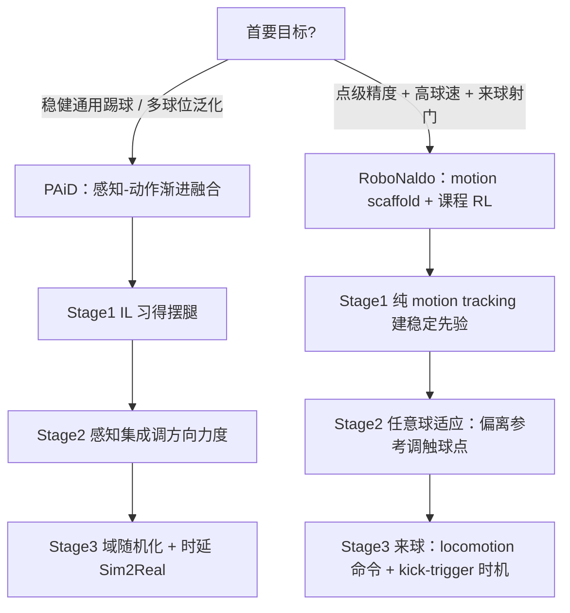

> **Query 产物**：本页由以下问题触发：「人形机器人踢球/射门技能学习，工程上该走 PAiD 式感知–动作渐进融合，还是 RoboNaldo 式 motion scaffold + 课程 RL，怎么选、怎么组合？」
> 综合来源：[PAiD Framework](../methods/paid-framework.md)、[RoboNaldo](../entities/paper-robonaldo-humanoid-soccer-shooting.md)、[Humanoid Soccer](../tasks/humanoid-soccer.md)

# 人形足球技能学习方法选型指南

## 英文缩写速查

| 缩写 | 英文全称 | 简要说明 |
|------|----------|----------|
| PAiD | Perception-Action integrated Decision-making | 感知–动作融合的渐进式踢球学习框架 |
| IL | Imitation Learning | 从人类踢球 MoCap 学基础摆腿协调 |
| RL | Reinforcement Learning | 任务奖励驱动的策略优化 |
| Sim2Real | Simulation to Real | 仿真策略迁移真机的工程主线 |
| MoCap | Motion Capture | 参考踢球动作的数据来源 |
| G1 | Unitree G1 Humanoid | 两条路线共同的真机验证平台 |

## TL;DR 决策路径

两条公开路线都走 **G1 + 三阶段课程**，但拆解轴不同——一条沿「能力维度」（动作 → 感知 → 迁移），一条沿「任务难度」（定点 → 移动球时机）。

| 任务目标 | 优先路线 | 典型入口 |
|----------|----------|----------|
| 先跑通「能自然踢、不摔倒」 | IL 习得基础动作 | [PAiD Stage 1](../methods/paid-framework.md)、[Imitation Learning](../methods/imitation-learning.md) |
| 多球位 / 室内外泛化、感知闭环 | 感知–动作融合 | [PAiD](../methods/paid-framework.md) |
| 点级瞄准 + 高冲量 + 来球射门 | motion-guided 课程 RL | [RoboNaldo](../entities/paper-robonaldo-humanoid-soccer-shooting.md) |
| 真机落地鲁棒性 | 域随机化 + 时延补偿 | [Domain Randomization](../concepts/domain-randomization.md) |

---

## 分阶段选型说明

### 1. 起步：用 IL 解决「会不会踢、像不像人」

两条路线第一阶段都不直接堆任务奖励，而是先建立**稳定的全身踢球先验**。[PAiD](../methods/paid-framework.md) 从人类 MoCap 用 [行为克隆](../methods/behavior-cloning.md) 习得摆腿协调；[RoboNaldo](../entities/paper-robonaldo-humanoid-soccer-shooting.md) 则把单条侧脚踢球参考经重定向后仿 BeyondMimic 纯跟踪，无球/任务奖励。

**常见误判**：跳过该阶段直接端到端 task RL——从零探索有效踢球极难收敛，且步态非类人。

### 2. 进阶：加入球与目标，决定「沿哪条轴扩展」

- **要泛化到不同球位、强调感知闭环** → 走 PAiD 的 **感知集成**：把视觉特征（球位、速度）引入状态空间，用 RNN 处理感知序列动态调整动作。
- **要点级瞄准与高球速** → 走 RoboNaldo 的 **射门适应**：随机化球 spawn，策略须主动**偏离参考**调整触球点、方向与冲量，并用 Instant Interaction / Densified Shooting 奖励监督 <10 ms 的足–球冲量。

**选型轴**：泛化与感知鲁棒优先 → PAiD；精度与功率指标优先 → RoboNaldo。二者并非互斥，PAiD 的感知融合可作为 RoboNaldo Stage 3 高层接口的补充。

### 3. 落地：Sim2Real 与来球时机

- [PAiD](../methods/paid-framework.md) Stage 3 以 **大规模域随机化 + 控制时延模拟** 保真机鲁棒，主打室内外多地形稳健成功率。
- [RoboNaldo](../entities/paper-robonaldo-humanoid-soccer-shooting.md) Stage 3 处理**来球射门**：用 locomotion command 与 kick-trigger 把 episode 分接近/踢球/稳定三模式，并在触球附近放松 motion tracking 权重；真机靠机载 LiDAR（近距）+ IR（远距）定位，真草场 3 m 平均误差 0.73 m（任意球）、触球后球速最高 13.10 m/s。

**指标锚点**：PAiD 报告 G1 上 >90% 稳健踢球成功率（成功率导向）；RoboNaldo 报告点级误差与球速（精度/功率导向）——二者指标口径不同，对照时勿直接比成功率。详细对照见 [PAiD 页内 RoboNaldo 对照表](../methods/paid-framework.md)。

## 参考来源

- [HumanoidSoccer (PAiD) 源码仓库](../../sources/repos/humanoid_soccer.md)
- [RoboNaldo（arXiv:2606.11092）入库摘录](../../sources/papers/robonaldo_arxiv_2606_11092.md)
- [Learning Soccer Skills for Humanoid Robots（Paper Notebooks 摘录）](../../sources/papers/humanoid_pnb_learning-soccer-skills-for-humanoid-robots.md)

## 关联页面

- [PAiD Framework](../methods/paid-framework.md) — 感知–动作渐进融合三阶段
- [RoboNaldo](../entities/paper-robonaldo-humanoid-soccer-shooting.md) — motion-guided 课程 RL 三阶段
- [Humanoid Soccer](../tasks/humanoid-soccer.md) — 任务总览与基准
- [Imitation Learning](../methods/imitation-learning.md)、[Reinforcement Learning](../methods/reinforcement-learning.md) — 两路线的基础学习范式
- [Domain Randomization](../concepts/domain-randomization.md) — Sim2Real 鲁棒性主线
- [Unitree G1](../entities/unitree-g1.md) — 共同真机平台
