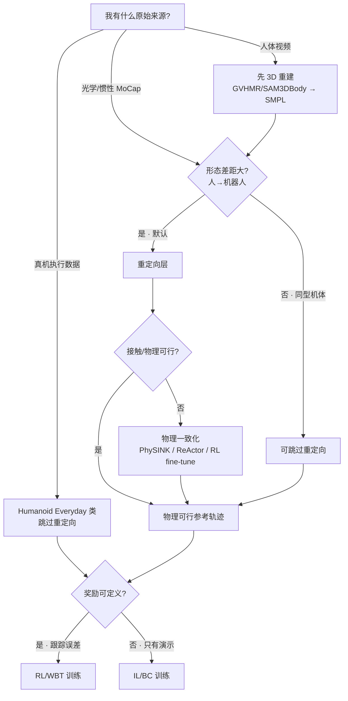

> **Query 产物**：本页由以下问题触发：「我要训练一个人形全身策略，从**原始动作捕捉 / 人体视频**到能喂进 **RL/IL** 的训练输入，参考运动来源、重定向方案、训练范式三层各该怎么选？」
> 综合来源：[人形参考运动与操作数据集选型](../comparisons/humanoid-reference-motion-datasets.md)、[Motion Data Quality](../concepts/motion-data-quality.md)、[Motion Retargeting](../concepts/motion-retargeting.md)

# 人形训练数据管线选型指南

## TL;DR

| 层 | 关键问题 | 推荐入口 |
|----|----------|----------|
| ① 参考来源 | 要最大分布 / 物理可信 / 真机操作？ | [数据集五集选型](../comparisons/humanoid-reference-motion-datasets.md) |
| ② 重定向 | 形态差距多大、要不要物理一致化？ | [Motion Retargeting](../concepts/motion-retargeting.md) |
| ③ 训练范式 | 有奖励可定义吗、参考可执行吗？ | [RL vs IL](../comparisons/rl-vs-il.md) |
| 贯穿 | 数据能不能直接用？ | [Motion Data Quality](../concepts/motion-data-quality.md) 四轴体检 |

---

## 三层决策树



---

## 第 1 层：参考运动来源

按目标任务在三类来源里选，先用 [Motion Data Quality](../concepts/motion-data-quality.md) 四轴粗筛：

| 来源类型 | 代表 | 优势 | 主要短板（质量轴） |
|----------|------|------|--------------------|
| 大规模人体 MoCap | [AMASS](../entities/amass.md) | 规模/多样性最强 | 物理可行性弱、形态差距大 |
| 高质量棚拍 MoCap | [LaFAN1](../entities/lafan1-dataset.md) | 干净、含 recovery | 规模小、**NC-ND 许可** |
| 人–物交互 MoCap | [OMOMO](../entities/omomo-dataset.md) | HOI / loco-manip 源 | 接触需对齐、规模中等 |
| 已重定向 locomotion | [PHUMA](../entities/dataset-bfm-phuma.md) | **物理可信 + 免重定向** | 分布由策展决定 |
| 真机操作数据 | [Humanoid Everyday](../entities/humanoid-everyday-dataset.md) | 天然物理可行、多模态 | 任务窄、非参考库 |
| 人体视频 | [GVHMR](../entities/gvhmr.md) / [VideoMimic](../entities/videomimic.md) | 规模可极大 | 3D/接触信息弱，需重建 |

**决策要点**：目标是 G1/H1-2 全身跟踪且不想从零重定向 → 直接选 PHUMA；要最大人体分布 → AMASS；要物体交互 → OMOMO；要真机操作模仿 → Humanoid Everyday。

---

## 第 2 层：重定向方案

形态差距是否可忽略，决定是否进入本层（详见 [Motion Data Quality §3](../concepts/motion-data-quality.md)）。需要时按「先几何、后动力学」分层：

| 子层 | 作用 | 代表方法 |
|------|------|----------|
| 运动学映射 | 解骨架/角度/关键点对应 | [GMR](../methods/motion-retargeting-gmr.md) |
| 物理一致化 | 补质心/力矩/接触可行性 | [ReActor](../methods/reactor-physics-aware-motion-retargeting.md)、QP（HALO）、RL fine-tune |

**典型失败模式**：只做几何映射就上机 → 脚滑、自碰、穿地；目标函数权重见 [重定向目标函数形式化](../formalizations/motion-retargeting-objective.md)。方法谱系选型见 [GMR vs NMR vs ReActor](../comparisons/gmr-vs-nmr-vs-reactor.md)。

> 已重定向数据集（PHUMA）已内含运动学+物理两层，可直接进第 3 层。

---

## 第 3 层：训练范式

把重定向产物 / 真机演示当训练输入，按「奖励能否定义」分流：

| 范式 | 适用 | 入口 |
|------|------|------|
| RL / WBT | 参考可执行、误差可作奖励 | [Whole-Body Tracking Pipeline](../concepts/whole-body-tracking-pipeline.md) |
| AMP 风格先验 | 要保留运动风格 | [Motion Retargeting §与 AMP/ASE 关系](../concepts/motion-retargeting.md) |
| IL / BC | 只有演示、奖励难定义 | [Imitation Learning](../methods/imitation-learning.md) |

换机体时进入迁移阶段，见 [跨具身策略迁移选型指南](./cross-embodiment-transfer-strategy.md)。

---

## 推荐 pipeline（端到端）

```text
原始来源（MoCap / 视频 / 真机）
  → [视频] 3D 重建 → SMPL
  → Motion Data Quality 四轴体检
  → [形态差距大] 重定向（GMR）→ 物理一致化（PhySINK/ReActor）
  → 物理可行参考 / 真机演示
  → [可定义奖励] RL/WBT  ·  [仅演示] IL/BC
  → Sim2Real 收尾
```

---

## 常见误区

1. **跳过四轴体检直接训**：物理不可行的参考会让 RL 学到不存在的力矩需求。
2. **把人体视频规模当万能**：视频 3D/接触信息弱，不补重建则接触一致性塌缩。
3. **几何重定向 = 可上机**：缺动力学一致化层，脚滑/自碰会进入策略。
4. **PHUMA 当 AMASS 用**：PHUMA 已重定向且策展，分布更窄但免工程；AMASS 覆盖广但成本自担。
5. **Humanoid Everyday 当重定向源**：它是机器人执行数据，不解决「人→机器人参考」问题。

---

## 英文缩写速查

| 缩写 | 英文全称 | 简要说明 |
|------|----------|----------|
| MoCap | Motion Capture | 动作捕捉，参考运动主要来源 |
| RL | Reinforcement Learning | 通过环境交互最大化回报学习策略 |
| IL | Imitation Learning | 从演示学习，奖励难定义时主路线 |
| BC | Behavior Cloning | 状态→动作监督式模仿，易受分布偏移 |
| WBT | Whole-Body Tracking | 全身跟踪 RL 任务 |
| SMPL | Skinned Multi-Person Linear Model | 人体参数化模型与重定向源 |
| AMP | Adversarial Motion Prior | 从 MoCap 提取运动风格先验约束 RL |
| HOI | Human-Object Interaction | 人–物交互任务域 |
| Sim2Real | Simulation to Real | 仿真策略迁移落地真机 |

## 参考来源

- [AMASS 站点归档](../../sources/sites/amass-dataset.md)
- [PHUMA 仓库归档](../../sources/repos/phuma.md)
- [OMOMO 仓库归档](../../sources/repos/omomo_release.md)
- [Humanoid Everyday 项目页归档](../../sources/sites/humanoideveryday.md)

## 关联页面

- [人形参考运动与操作数据集选型](../comparisons/humanoid-reference-motion-datasets.md) — 第 1 层来源选型主表
- [Motion Data Quality](../concepts/motion-data-quality.md) — 贯穿全链的四轴质量体检
- [Motion Retargeting](../concepts/motion-retargeting.md) — 第 2 层映射与物理一致化总览
- [Motion Retargeting Pipeline](../concepts/motion-retargeting-pipeline.md) — 重定向端到端工程链路
- [GMR vs NMR vs ReActor](../comparisons/gmr-vs-nmr-vs-reactor.md) — 重定向方法谱系选型
- [Whole-Body Tracking Pipeline](../concepts/whole-body-tracking-pipeline.md) — 第 3 层 RL/WBT 训练消费侧
- [Imitation Learning](../methods/imitation-learning.md) — 仅有演示时的训练范式
- [跨具身策略迁移选型指南](./cross-embodiment-transfer-strategy.md) — 换机体后的迁移决策
- [RL vs IL](../comparisons/rl-vs-il.md) — 第 3 层范式分流的总论

## 一句话记忆

> **来源（要分布还是物理可信）→ 重定向（形态差距决定要不要、要几层）→ 范式（奖励可定义就 RL 否则 IL），四轴体检贯穿三层。**
