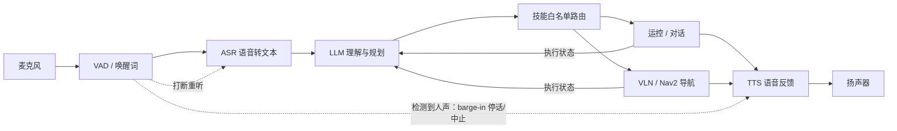

# 人形语音交互流水线：唤醒→ASR→LLM→技能/VLN→TTS 可打断闭环

要把一台人形机器人做成「能听懂话、会动、还能被打断」的系统，不是接一个云端聊天窗口就完事——它必须把 **语音输入、语言理解与规划、机器人动作、语音反馈** 组成一条低延迟、可唤醒、可打断的闭环。本页把 [人形智能语音交互](../methods/humanoid-voice-interaction.md) 方法页里的原理拆成一条**逐环可落地的工程流水线**，给出每一环的选型分叉、典型失败模式，以及出问题时的「第一个该查什么」，方便按图索骥地搭最小可运行系统并排障。

> **Query 产物**：本页由以下问题触发：「人形机器人的语音交互要做成可打断的闭环，工程上从唤醒/ASR、LLM 理解规划、技能或 VLN 执行到 TTS 反馈，每一环该怎么选型、会踩哪些坑、出问题先查什么？」

## 一句话定义

**人形语音交互流水线** 是把 **唤醒/ASR → LLM 理解与规划 → 技能或 [VLN](../tasks/vision-language-navigation.md) 执行 → TTS 反馈** 四环串成的**可唤醒、可打断（barge-in）闭环**，让非专业用户用自然语言给人形派任务，对应课程第 8.2 节的实践主线。

## 英文缩写速查

| 缩写 | 英文全称 | 简要说明 |
|------|----------|----------|
| ASR | Automatic Speech Recognition | 语音 → 文本，链路入口 |
| TTS | Text-to-Speech | 文本 → 语音，反馈出口 |
| LLM | Large Language Model | 意图理解与任务规划，输出对技能白名单的调用 |
| VLN | Vision-Language Navigation | 语言+视觉条件下的导航执行，语音「去哪儿」的落地下游 |
| HRI | Human-Robot Interaction | 人机交互，语音是其中最自然的接口层 |
| VAD / 唤醒 | Voice Activity Detection / Wake Word | 端点检测与唤醒词，决定何时开始/停止听，也支撑打断 |
| Barge-in / 打断 | Barge-in | TTS 播放中检测到人声即停话重听，闭环「可打断」的核心 |

## 四环闭环流水线

流水线由四环首尾相接，并由一个**状态机**（idle → listening → acting → speaking）统筹：唤醒/ASR 把声音变成文本；[人形智能语音交互](../methods/humanoid-voice-interaction.md) 的核心在中间——LLM 做意图理解与**任务规划**，只允许调用**已注册、已限幅的技能白名单**（走、转、导航到点、挥手、对话）；执行环按指令类型分流到运控、对话，或当用户说「去门口」「向前走两米」这类空间指令时走 [VLN](../tasks/vision-language-navigation.md) / Nav2；最后 TTS 把结果或追问播回。

**可打断（barge-in）是这条闭环区别于「一问一答机器人」的关键**：TTS 正在播报或技能正在执行时，VAD 一旦检测到人声，就要立刻停话、（必要时）安全地中止或降速当前动作，并回到 listening 重新识别——否则用户纠正指令时机器人还在自顾自地说或走，体验与安全都不可接受。

## 逐环选型与工程坑

| 环 | 选型分叉 | 典型失败模式 | 出问题先查 |
|----|----------|--------------|------------|
| 唤醒 / VAD | 唤醒词触发 vs 持续监听；嘈杂场馆调高阈值 | **误唤醒**（背景人声/噪声触发）导致机器人误动作 | 唤醒阈值与麦阵/回声消除是否针对现场噪声标定 |
| ASR | 本地（如 Whisper）vs 云 API | **噪声掉字/低置信**，赛场工厂噪声尤甚；云上传有隐私合规问题 | ASR 置信度日志与音频质量（麦阵、回声消除、采样） |
| LLM 理解/规划 | 正则槽位 NLU vs 小 LLM vs LLM tool-calling | **幻觉指令**：生成不存在或未限幅的技能；开放搜索当工具风险更高 | 是否强制接地到技能白名单、移动类指令是否二次确认 |
| 技能 / VLN 执行 | 预注册技能 API vs 语音→[VLN](../tasks/vision-language-navigation.md)/Nav2 | 技能**静默失败**；「去门口」缺地标/里程计而落不了地 | 技能返回码与执行状态是否回灌 LLM、失败是否语音报错 |
| TTS 反馈 | 本地中英 TTS vs 云 TTS | **首包延迟高**、播报冗长挡住 barge-in 窗口 | 首包 TTS 延迟、播报时 VAD 是否仍在监听以支持打断 |
| 闭环延迟 | 各环预算分配 | **端到端延迟**累积使对话体感迟钝（本地小模型通常更稳） | 分段计时（VAD+ASR / LLM / 首包 TTS），定位最慢环 |

补充要点：

- **安全优先级**：硬件急停高于一切语音指令；移动中忽略未确认的「加速」类指令；保留文本+技能的审计日志便于追责与调试。底层动作接口见 [G1 软件服务栈](../entities/unitree-g1-software-stack.md) 与 [ROS 2 基础](../concepts/ros2-basics.md)，真机平台参考 [Unitree G1](../entities/unitree-g1.md)。
- **导航契约**：「向前走两米」是相对位移技能（依赖里程计），「看着黄球走过去」应走视觉伺服/[VLN](../tasks/vision-language-navigation.md)（如 [NaVid](../entities/paper-vln-10-navid.md)）而非纯语音——别把需要视觉接地的指令硬塞进纯语音链路。

## 常见误区

- **误区：接个云端聊天窗口就算「上大模型」。** 没有 ASR/TTS + 机器人动作 API 的闭环，不构成系统课交付，也不是可打断交互。
- **误区：LLM 输出可以直接当动作执行。** 幻觉会生成不存在的技能，必须接地到已限幅的技能白名单，移动类指令还要二次确认或默认低速。
- **误区：把语音识别做好等于交互做好。** 缺了 barge-in、失败恢复（低置信→「请再说一次」）与执行状态回灌，闭环仍会「说着说着停不下来」或静默失败。
- **误区：VLN 榜分高就等于语音能指挥它走。** 仿真离散动作与真机连续控制、安全层之间仍有鸿沟，语音→导航要额外处理地标接地、里程计与碰撞规避。

## 参考来源

- [深蓝学院人形系统课程大纲](../../sources/courses/shenlan_humanoid_system_theory_practice.md) — 第 8.2 节智能语音交互实践主线

## 关联页面

- [人形智能语音交互](../methods/humanoid-voice-interaction.md) — 本流水线的方法主页（原理、路线、延迟预算与安全清单）
- [Vision-Language Navigation](../tasks/vision-language-navigation.md) — 语音「去哪儿」指令的导航执行下游
- [人形系统课程策展](../entities/humanoid-system-curriculum.md) — 第 8.2 节所在的整体课程脉络
- [大模型赋能人形](../overview/large-model-empowered-humanoids.md) — 语音交互在「大模型赋能」方法地图中的位置
- [NaVid](../entities/paper-vln-10-navid.md) — 语音→VLN 落地的代表性导航模型
