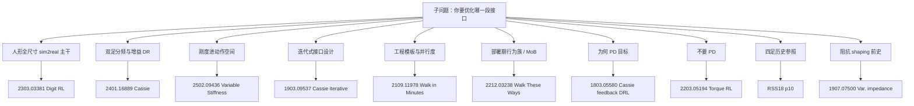
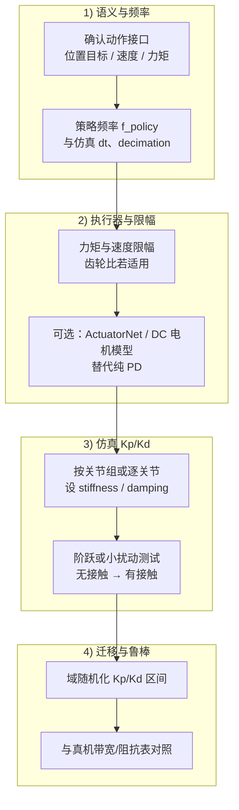

> **Query 产物**：本页由以下问题触发：「人形或腿足式机器人强化学习里，底层关节 Kp/Kd（或仿真里的 stiffness/damping）一般怎么设、和什么量绑定？」
> 综合来源：[legged_gym](../entities/legged-gym.md)、[Sim2Real](../concepts/sim2real.md)、[Sim2Real Checklist](./sim2real-checklist.md)、[Domain Randomization 指南](./domain-randomization-guide.md)、[开源实现索引](../../sources/notes/legged_humanoid_rl_pd_gains.md)、[RL+PD 接口论文索引](../../sources/papers/rl_pd_action_interface_locomotion.md)

# Legged / Humanoid RL 中 Kp/Kd（刚度阻尼）设置

**一句话定义**：在常见「策略输出关节目标 + 底层 PD 力矩」接口下，Kp/Kd 把策略的离散指令接到连续关节动力学上；数值必须与仿真时间步、控制分频、力矩/速度限幅以及（若做迁移）真实驱动器带宽一致考虑，而不是孤立调参。

---

## 为什么和 RL 强相关

- **动作语义**：若动作为「目标关节角（或默认姿态上的残差）」，则 PD 增益直接决定同一动作向量对应的关节加速度与接触冲量，进而改变最优策略形状。
- **有效带宽**：Kp 过大易激发接触/结构高频模态（仿真里抖动、真机里电流饱和或机械共振）；过小则跟踪慢、抗扰差，reward 里速度/姿态项更难优化。
- **sim2real**：真机驱动器在电流环/速度环上等效为有限带宽；仿真里用过高刚度会学到依赖「不真实刚体响应」的技巧。域随机化常对 Kp/Kd 做区间扰动，见 [Sim2Real Checklist](./sim2real-checklist.md) 中执行器随机化条目。

---

## 各仿真栈里参数叫什么

| 栈 | 配置名 | 典型单位（关节空间） |
|----|--------|----------------------|
| legged_gym | `control.stiffness` / `control.damping` | N·m/rad，N·m·s/rad |
| Isaac Lab `IdealPDActuator` | `stiffness` / `damping` | 与上类似，对应文档与实现中的 kp/kd |
| MuJoCo `<position>` 执行器 | `kp`（及力矩相关属性） | 见 MuJoCo XML 参考中 actuator 章节 |

具体代码锚点与链接见 [原始资料索引](../../sources/notes/legged_humanoid_rl_pd_gains.md)。

---

## 文献地图：按子问题选读

下列论文的 **一手链接与摘录** 见 [RL+PD 动作接口与增益设计论文索引](../../sources/papers/rl_pd_action_interface_locomotion.md)。下表只保留「你关心什么 → 读哪篇」的策展顺序（与上表同一批文献）。

| 若你最关心… | 知识库子页（含 Mermaid）· 外部一手 |
|-------------|--------|
| 全尺寸人形真机里 **PD 怎样嵌进大规模 RL + sim2real 流水线**（含公开增益表锚点） | [Digit 人形 RL 行走](../entities/paper-digit-humanoid-locomotion-rl.md) · [arXiv:2303.03381](https://arxiv.org/abs/2303.03381) |
| **固定标称增益 vs 随机化**、以及 **策略 Hz 与 PD 内环 Hz 的典型分频** | [Cassie 双足多技能 RL](../entities/paper-cassie-biped-versatile-locomotion-rl.md) · [arXiv:2401.16889](https://arxiv.org/abs/2401.16889) |
| **RL 能否学刚度/增益**、分组 vs 逐关节 | [可变刚度腿足 RL](../entities/paper-variable-stiffness-locomotion-rl.md) · [arXiv:2502.09436](https://arxiv.org/abs/2502.09436) |
| **复现落地**：reward / observation / action **多轮迭代** 的真实记录 | [Cassie 迭代式 sim2real](../entities/paper-cassie-iterative-locomotion-sim2real.md) · [arXiv:1903.09537](https://arxiv.org/abs/1903.09537) |
| **抄配置、跑消融、扫增益** 的并行仿真入口 | [ANYmal 分钟级并行 DRL](../entities/paper-anymal-walk-minutes-parallel-drl.md) · [arXiv:2109.11978](https://arxiv.org/abs/2109.11978) + [legged_gym](../entities/legged-gym.md) |
| 已能跑通固定 PD，想接 **泛化部署、行为切换与安全** | [Walk These Ways（MoB）](../entities/paper-walk-these-ways-quadruped-mob.md) · [arXiv:2212.03238](https://arxiv.org/abs/2212.03238)（**非** Walk in Minutes） |
| **为何常用 PD 目标空间** 的原始 MDP 叙述 | [Cassie 反馈控制 DRL](../entities/paper-cassie-feedback-control-drl.md) · [arXiv:1803.05580](https://arxiv.org/abs/1803.05580) |
| 判断 **是否应弃用 PD、改直驱扭矩** | [四足扭矩控制 RL](../entities/paper-quadruped-torque-control-rl.md) · [arXiv:2203.05194](https://arxiv.org/abs/2203.05194) |
| 四足 **sim2real 历史直觉**（位置/扭矩接口争论的背景） | [RSS 2018 敏捷四足 sim2real](../entities/paper-quadruped-agile-sim2real-rss2018.md) · [RSS PDF p10](https://www.roboticsproceedings.org/rss14/p10.pdf) |
| **位置 + 阻抗参数联合输出** 的思想前史（对照可变刚度） | [可变阻抗接触任务 RL](../entities/paper-variable-impedance-contact-rl.md) · [arXiv:1907.07500](https://arxiv.org/abs/1907.07500) |

### 阅读与工程分支（Mermaid）

### 策略层与 PD 内环的分频（Mermaid）

---

## 流程总览（主干）

下列流程强调 **从硬件与接口语义出发**，再落到仿真默认值与随机化范围；子步骤细节见下文分节。

---

## 可执行建议（精简）

1. **先锁接口与时间**：明确策略输出是 `q_des` 还是 `Δq`，以及每个策略步对应多少次仿真子步（legged_gym 的 `decimation` 即此意）。`dt` 加倍时，往往需重新评估阻尼与接触稳定性。
2. **从厂商或辨识数据取量级**：若有关节阻抗表或电流环带宽，用其倒推「位置环」上合理的 Kp 上限；无数据时，从同机型开源配置（如 ANYmal-C 的 80 / 2 量级）出发，按质量和连杆长度缩放需谨慎，仅作初值。
3. **分场景试**：先在悬空或小阻尼地面做关节阶跃，检查是否饱和与振荡；再上全接触训练。振荡优先减 Kp 或增 Kd（注意二者对接触噪声的不同影响）。
4. **与 ActuatorNet 路线区分**：legged_gym 中 ANYmal 默认可走数据驱动执行器网络；此时「解析 PD」增益可能被旁路，但仍影响训练初期与 fallback 行为，需在配置层分清主路径。
5. **训练期随机化**：在 checklist 思路上，对刚度/阻尼设物理合理区间做 DR，避免策略过拟合单一阻抗点；双足文献中除 ±30% 这类宽范围外，也有 **按标称 0.7–1.3 倍缩放** 的较窄区间实践（见 [2401.16889](https://arxiv.org/abs/2401.16889) 与 [Domain Randomization 指南](./domain-randomization-guide.md) 中关节刚度条目对照）。
6. **人形公开锚点**：精读 [2303.03381](https://arxiv.org/abs/2303.03381) 附录中的 **逐关节 PD 表**，勿只记单一数字；社区讨论中常以 **\(K_p\approx 200\) N·m/rad、\(K_d\approx 10\) N·m·s/rad** 作为髋关节量级锚点 — **以 PDF 与代码为准复核**。
7. **可变刚度路线**：若把刚度并入动作，优先读 [2502.09436](https://arxiv.org/abs/2502.09436) 中 **分组参数化** 与 **阻尼约束** 的设计动机，再决定仿真里是否允许 `Kd` 完全独立随机。
8. **扭矩路线门控**：若考虑去掉 PD，用 [2203.05194](https://arxiv.org/abs/2203.05194) 与当前平台的 **电流环带宽、安全滤波** 做对照实验，而不是仅改 `control_type`。

---

## 论文共识（与调参强相关的几句）

- **接口先于增益**：同一组 `Kp/Kd`，在「输出绝对角 / 默认位姿残差 / 扭矩」下语义不同；Cassie 系列工作反复强调 **观测归一化、动作缩放与 reward 重写** 与增益表同步迭代（[1903.09537](https://arxiv.org/abs/1903.09537)）。
- **分频是设计变量**：策略频率与 PD 频率相差 **两个数量级** 在双足真机文献中很常见；把二者写进同一页系统图再调 `decimation`，比只调 `stiffness` 更接近可部署系统（[2401.16889](https://arxiv.org/abs/2401.16889)）。
- **「能学增益」≠「应全关节独立学」**：可变刚度文献表明 **结构化（分腿 / 分组）动作空间** 往往更稳（[2502.09436](https://arxiv.org/abs/2502.09436)），与工程上「按 HAA/HFE/KFE 分组」的习惯一致（参见 [legged_gym](../entities/legged-gym.md) 配置风格）。
- **历史参照**：早期四足敏捷 sim2real 证明 **强随机化 + 高频力矩/扭矩控制** 可过 gap（[RSS 2018 p10](https://www.roboticsproceedings.org/rss14/p10.pdf)），与今日「位置目标 + PD」路线并行存在，选型应回到 **带宽与安全** 而非教条。

---

## 推荐继续阅读

- Isaac Lab 执行器实现（含 Ideal / Implicit PD 说明）：<https://github.com/isaac-sim/IsaacLab/blob/main/source/isaaclab/isaaclab/actuators/actuator_pd.py>
- legged_gym 基类 PD 字段与单位注释：<https://github.com/leggedrobotics/legged_gym/blob/master/legged_gym/envs/base/legged_robot_config.py>
- MuJoCo XML `<position>` 执行器参考：<https://mujoco.readthedocs.io/en/stable/XMLreference.html#actuator-position>
- 论文索引（本页文献地图的全文链接与摘录）：[sources/papers/rl_pd_action_interface_locomotion.md](../../sources/papers/rl_pd_action_interface_locomotion.md)

---

## 参考来源

- [腿足/人形 RL 关节 PD 增益原始资料索引](../../sources/notes/legged_humanoid_rl_pd_gains.md)
- [RL+PD 动作接口与增益设计论文索引](../../sources/papers/rl_pd_action_interface_locomotion.md)

---

## 关联页面

### 论文实体子页（各含 Mermaid）

- [Digit 人形 RL 行走](../entities/paper-digit-humanoid-locomotion-rl.md)
- [Cassie 双足多技能 RL](../entities/paper-cassie-biped-versatile-locomotion-rl.md)
- [可变刚度腿足 RL](../entities/paper-variable-stiffness-locomotion-rl.md)
- [Cassie 迭代式 sim2real](../entities/paper-cassie-iterative-locomotion-sim2real.md)
- [ANYmal 分钟级并行 DRL](../entities/paper-anymal-walk-minutes-parallel-drl.md)
- [Walk These Ways（MoB）](../entities/paper-walk-these-ways-quadruped-mob.md)
- [Cassie 反馈控制 DRL](../entities/paper-cassie-feedback-control-drl.md)
- [四足扭矩控制 RL](../entities/paper-quadruped-torque-control-rl.md)
- [RSS 2018 敏捷四足 sim2real](../entities/paper-quadruped-agile-sim2real-rss2018.md)
- [可变阻抗接触任务 RL](../entities/paper-variable-impedance-contact-rl.md)

### 其他

- [人形机器人 RL 策略训练完整 Checklist](./humanoid-rl-cookbook.md)
- [Sim2Real Checklist](./sim2real-checklist.md)
- [RL 超参数调节指南（locomotion）](./rl-hyperparameter-guide.md)
- [Domain Randomization 指南](./domain-randomization-guide.md)
- [Locomotion](../tasks/locomotion.md)
- [legged_gym](../entities/legged-gym.md)
- [Isaac Gym / Isaac Lab](../entities/isaac-gym-isaac-lab.md)
- [Sim2Real](../concepts/sim2real.md)
