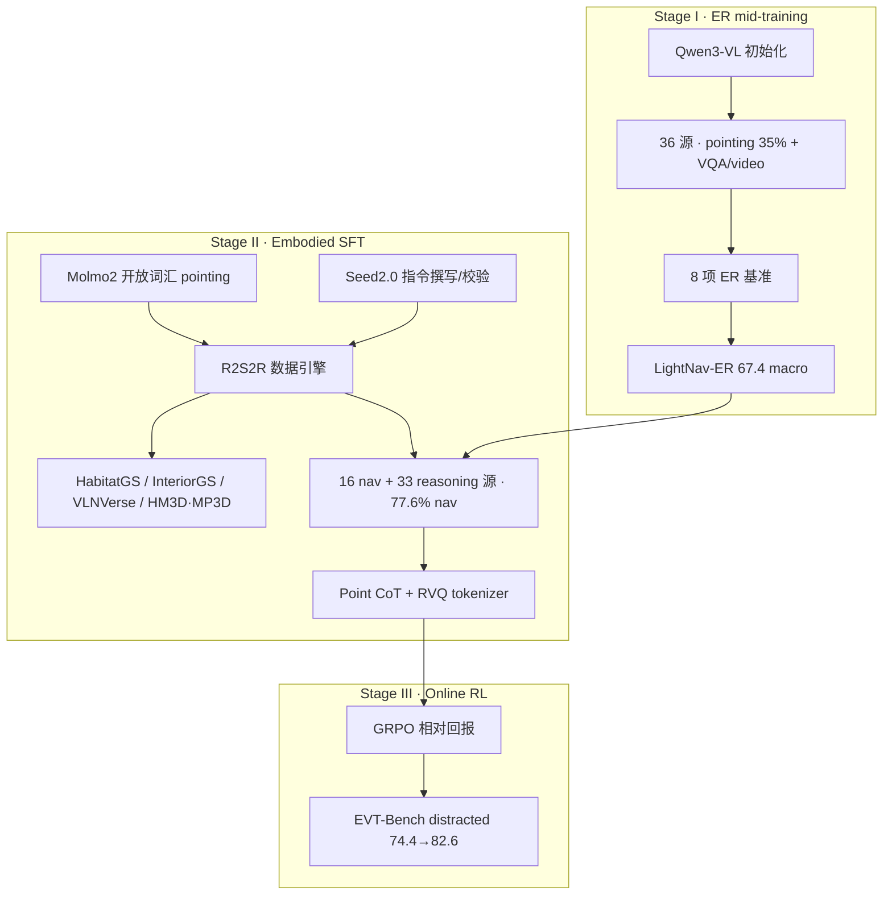

> **Query 产物**：本页由以下问题触发：「深读 [LightNav-0 Tech Blog](https://www.lightorigins.com/en/blog/lightnav-0) 引用的所有相关项目和论文。」
> 综合来源：[lightorigins-3blogs-technology-map](../overview/lightorigins-3blogs-technology-map.md)、[paper-lightnav-0](../entities/paper-lightnav-0.md)、[spatial-reasoning-benchmarks-technology-map](../overview/spatial-reasoning-benchmarks-technology-map.md) 及博客正文 ingest 节点。

# LightNav-0 博客引用深读

[LightNav-0 官方博客](https://www.lightorigins.com/en/blog/lightnav-0)（2026-09-01）是 **对齐段（Scalable Alignment）** 的产品叙事：用 **Real2Sim2Real 数据引擎** 把 2000+ 互联网场景变成 **4000+ 小时** 对齐 VLA 经验，再经 **ER → SFT → Online RL** 三阶段得到单 checkpoint，在 **10 个仿真设置 + INSIGHT-Bench + 四本体真机** 上测零样本泛化。

## 一句话定义

**读这篇博客的正确姿势：先抓「对齐记录 = 语言 + RGB 历史 + object/affordance 点 + RVQ 动作」这一数据单元，再按三阶段看引用项分别喂给哪一层——ER 基准喂空间先验，场景/ VLN 源喂 SFT 混合，GRPO/EVT 喂 RL，INSIGHT 喂诊断。**

## 英文缩写速查

| 缩写 | 英文全称 | 简要说明 |
|------|----------|----------|
| R2S2R | Real-to-Sim-to-Real | 真场景资产 → 仿真 rollout → 对齐训练样本 |
| ER | Embodied Reasoning | Stage I 中期训练；LightNav-ER 产物 |
| SFT | Supervised Fine-Tuning | Stage II 模仿对齐轨迹 |
| Point CoT | Point Chain-of-Thought | 图像空间 `<opos>` / `<apos>` 双点推理 |
| RVQ | Residual Vector Quantization | 10 路点 SE(2) 轨迹 → L0/L1/L2 三 token |
| EVT | Embodied Visual Tracking | TrackVLA 提出的跟踪评测族 |
| OGN | Object-Goal Navigation | 按语言找物体 |
| VLN | Vision-and-Language Navigation | 指令跟随导航 |

## 三阶段与引用分工

| 阶段 | 博客核心数字 | 引用项在管线中的角色 |
|------|-------------|---------------------|
| **I · ER** | LightNav-ER **67.4** macro；**4 第一 / 4 第二**；较 Qwen3-VL 初始化 **+4.3** | 八基准定义「空间先验」；Gemini Robotics-ER / MolmoER 为产业对照叙事 |
| **II · SFT** | **742K** 指令（**474K** unique）；Stage II 固定数据下 ER 初始化 **8/8** 设置 SR/SPL ↑；Point CoT **+8.4 SR / +5.7 SPL** | 场景源 + Molmo2/Seed2.0 构成引擎；R2R/RxR/ScaleVLN/SRDF 等灌入 **16 路导航混合** |
| **III · RL** | EVT distracted tracking **74.4 → 82.6**（step 120） | GRPO 方法论文；TrackVLA/EVT-Bench 提供 RL 读数 |

## 引用全表（按角色）

### A. 亮源自有（主叙事）

| 引用 | 博客中的角色 | 本库深读入口 | 开源（2026-09-22） |
|------|-------------|-------------|------------------|
| **LightNav-0** | 三阶段产物；10 仿真 monocular **全第一** | [paper-lightnav-0](../entities/paper-lightnav-0.md) | **已开源** `lightorigins/LightNav-0` + HF |
| **LightNav-ER** | Stage I；ER 八基准 **67.4** | [lightnav-er](../entities/lightnav-er.md) | **未单独发布** |
| **INSIGHT-Bench** | 数据引擎可复现切片 + **原子导航诊断** | [insight-bench](../entities/insight-bench.md) | **评测已开源** `Light-INSIGHT-Bench` |
| **LightBot-0** | 真机：指令跟随 / 户外跟踪 | [lightbot-0](../entities/lightbot-0.md) | 硬件叙事；非训练仓 |
| **亮源新创** | 机构与 Physical AGI 三段范式 | [light-origins](../entities/light-origins.md) | 组织页；子项目部分开源 |

### B. Stage I · 具身推理（ER 八基准 + 对照 VLM）

| 引用 | LightNav 用法 | 本库页 | 深读要点 |
|------|--------------|--------|----------|
| **Point-Bench** | ER 套件；训练混合 **35.14% pointing** | [er-point-bench](../entities/er-point-bench.md) | 与 [PointArena](../entities/pointarena.md) 同族；LightNav **Point CoT** 把 pointing 带进控制环 |
| **RefSpatial** | ER 套件 | [refspatial](../entities/refspatial.md) | 空间指代；见 [RoboRefer](../entities/paper-roborefer.md) |
| **RoboSpatial** | ER 套件（POI + VQA 轨） | [robospatial](../entities/robospatial.md) | 3D scan 空间 QA；[spatial-reasoning 地图](../overview/spatial-reasoning-benchmarks-technology-map.md) |
| **Where2Place** | ER 套件 | [where2place](../entities/where2place.md) | 可放置空间推理 |
| **CV-Bench** | ER 套件 | [cv-bench-embodied](../entities/cv-bench-embodied.md) | Cambrian 2D 空间 MLLM |
| **ERQA** | ER 套件 | [erqa](../entities/erqa.md) | 具身推理问答 |
| **EmbSpatial** | ER 套件 | [embspatial](../entities/embspatial.md) | Egocentric 六关系 |
| **Qwen3-VL** | LightNav-ER **初始化** 骨干 | [qwen3-vl](../entities/qwen3-vl.md) | 未 ER 时 Stage II **8 设置** 已可训；ER 再 **+2.3 mean SR** |
| **MolmoER / MolmoAct2** | 博客对照：「ER 再 Action」路线 | [molmo-er](../entities/molmo-er.md) · [paper-molmoact2](../entities/paper-molmoact2.md) | 开源 ER→VLA 栈对照 [Gemini Robotics-ER](../entities/gemini-robotics.md) |
| **Gemini Robotics-ER** | 同上（闭源产业锚） | [gemini-robotics](../entities/gemini-robotics.md) | Gemini Robotics 建立在 ER 之上 |

### C. R2S2R 数据引擎 · 场景与标注工具

| 引用 | 引擎中的路径 | 训练 episode 占比（INSIGHT 口径） | 本库页 |
|------|-------------|----------------------------------|--------|
| **HM3D / MP3D** | 已标注 mesh / 扫描 | **65.0%**（34,531 ep） | [paper-vln-02-vln-ce](../entities/paper-vln-02-vln-ce.md) 等 VLN 生态 |
| **InteriorGS** | **有 3D box** → 直接进统一 target inventory | **16.1%** | [interiorgs](../entities/interiorgs.md) |
| **HabitatGS** | **无标注 GS** → Molmo2 四向 RGB-D pointing → 3D merge | **10.9%** | [habitatgs](../entities/habitatgs.md) |
| **VLNVerse** | 场景源 | **8.0%** | [vlnverse](../entities/vlnverse.md) |
| **Molmo2** | 开放词汇 **2D pointing** → depth lift → 跨视角一致性门控 | 标注工具 | [molmo2-vlm](../entities/molmo2-vlm.md) |
| **Seed2.0** | 模板 + **video-VLM** 双路径指令 → 语义/视觉 **双 gate** | 语言层 | [seed2-0](../entities/seed2-0.md) |

**引擎不变量（深读关键）：** 先 **几何 rollout（target → start → route → RGB+action）**，后 **语言**；语言不得改写 target/几何。无标注 GS 要求 **≥2 视角、3D spread <0.6 m** 才进 inventory。渲染随机化 **FOV 90–130°、高度 0.5–1.5 m、pitch ±15°**。

INSIGHT-Bench 公开切片：**1683 训练场景 / 53090 ep**；**210 eval 场景 / 1097 ep**；5 场景类 × 5 指令机制（Base / Direction / Relation / Extremum / Ordinal）。

### D. Stage II · 导航数据与经典 VLN 论文

| 引用 | 博客定位 | 本库页 |
|------|----------|--------|
| **R2R** | VLN-CE · R2R **642K** 档；评测 SR **68.5** mono | [paper-vln-01-r2r](../entities/paper-vln-01-r2r.md) |
| **RxR** | VLN-CE · RxR **1.8M** 档；SR **73.6** mono | [paper-rxr](../entities/paper-rxr.md) |
| **ScaleVLN** | **2.8M** 合成 VLN | [paper-vln-08-scalevln](../entities/paper-vln-08-scalevln.md) |
| **SRDF** | **4.7M** self-refining flywheel | [paper-srdf-vln-flywheel](../entities/paper-srdf-vln-flywheel.md) |
| **VLN-CE** | 连续环境 VLN 框架 | [paper-vln-02-vln-ce](../entities/paper-vln-02-vln-ce.md) |

Stage II 可用池 vs 实际采样：**ObjectNav 4.7M、Tracking 2.8M、VQA 5.2M** 等；训练采样 **77.6% 导航+动作 / 22.4% VQA** 以保持 ER 能力。

**Point CoT 设计取舍（博客 §02D）：** 文本 CoT 难合成/难验证；metric 3D 绑 depth/pose/标定；**图像双点**（object + affordance）与仿真投影标签同构，部署 **无 depth/地图**。

**RVQ 动作：** 3×256 codebook；平均 waypoint 误差 **0.72 cm**；每步预测 **object point + affordance point + 3 action tokens**。

**Scaling 读法（Fig. 10）：** **环境数** 扩展最单调；同池 **数据量** 近饱和；**>4B** 模型 scaling 混合。

### E. Stage III · RL 与跟踪

| 引用 | 博客用法 | 本库页 |
|------|----------|--------|
| **DeepSeekMath / GRPO** | Stage III 优化 RVQ action token | [grpo](../methods/grpo.md) |
| **TrackVLA / EVT-Bench** | RL 读数 + 评测 **Single 91.7 / Distracted 82.6** mono 第一 | [paper-trackvla](../entities/paper-trackvla.md) |

### F. 十设置仿真 benchmark（Fig. 12 摘要）

| 设置 | LightNav-0 SR（mono） | 主要对照（mono） |
|------|----------------------|------------------|
| VLN-CE R2R | **68.5** | Qwen-RobotNav-4B 66.9 |
| VLN-CE RxR | **73.6** | Qwen-RN-8B 73.4 |
| ObjectNav MP3D | **53.3** | CogNav 46.6 |
| ObjectNav HM3D v1 | **74.5** | Uni-NaVid 73.7 |
| ObjectNav HM3D v2 | **79.5** | FiLM-Nav 77.0 |
| HM3D-OVON Seen | **55.3** | MTU3D 55.0 |
| HM3D-OVON Synonyms | **53.3** | MTU3D 45.0 |
| HM3D-OVON Unseen | **47.0** | MTU3D 40.8 |
| EVT Single-target | **91.7** | ReferTrack 89.4 |
| EVT Distracted | **82.6** | ReferTrack 73.3 |

**读榜注意：** 博客分 **monocular 同协议** 与 **pano/multi-camera** 两栏；LightNav **单目前向 RGB**；Qwen-RobotNav-8B 等在 pano 栏可更高——对比时须看 sensing 列。

未单独建页的 Fig. 12 对照（NaVILA、StreamVLN、Uni-NaVid、CogNav、WMNav 等）见 [VLN 任务页](../tasks/vision-language-navigation.md) 与 [Qwen-RobotNav](../entities/qwen-robot-nav.md) 的竞品语境。

### G. 真机与致谢（非论文引用）

| 引用 | 博客 Fig. | 本库 |
|------|-----------|------|
| **LightBot-0** | 15–16, 18 户外/办公室 | [lightbot-0](../entities/lightbot-0.md) |
| **Unitree Go2** | 17 室内跟踪 | 博客真机 demo；四足平台对照 [Locomotion 任务页](../tasks/locomotion.md) |
| **LimX TRON 1** | 19 开放词汇 OGN | [cn-os-tron1-rl-deploy-ros2](../entities/cn-os-tron1-rl-deploy-ros2.md)（逐际 TRON1 部署栈） |
| **LimX Dynamics** | Acknowledgements | 与 [light-origins](../entities/light-origins.md) 并列致谢；机构 tag `limx` |

## 推荐阅读顺序

1. **[paper-lightnav-0](../entities/paper-lightnav-0.md)** + **[light-origins](../entities/light-origins.md)** — 产品与技术报告锚点。
2. **[spatial-reasoning-benchmarks-technology-map](../overview/spatial-reasoning-benchmarks-technology-map.md)** — 理解 Stage I 八基准在 industry 的位置。
3. **场景源四页**：[habitatgs](../entities/habitatgs.md) · [interiorgs](../entities/interiorgs.md) · [vlnverse](../entities/vlnverse.md) — R2S2R「格式归一」。
4. **标注工具**：[molmo2-vlm](../entities/molmo2-vlm.md) · [seed2-0](../entities/seed2-0.md) — 目标发现 vs 语言验证。
5. **[insight-bench](../entities/insight-bench.md)** — 5×5 诊断；跑通 `lightorigins/Light-INSIGHT-Bench`。
6. **VLN 经典线**：[paper-vln-01-r2r](../entities/paper-vln-01-r2r.md) → [paper-rxr](../entities/paper-rxr.md) → [paper-vln-08-scalevln](../entities/paper-vln-08-scalevln.md) → [paper-srdf-vln-flywheel](../entities/paper-srdf-vln-flywheel.md)。
7. **[grpo](../methods/grpo.md)** + **[paper-trackvla](../entities/paper-trackvla.md)** — Stage III。
8. **竞品通才导航**：[qwen-robot-nav](../entities/qwen-robot-nav.md) — 同 benchmark 不同观测协议。

## 结论

1. **博客引用 ≈ 40+ 节点**，本库已拆成 **独立 wiki 实体**（见 [3 篇技术地图](../overview/lightorigins-3blogs-technology-map.md)）；本页是 **LightNav-0 单篇** 的深读索引。
2. **最该精读的三条外链论文链**：R2R/RxR（VLN 语料）· TrackVLA（跟踪+EVT）· Molmo2/Seed2.0（引擎工具）；其余八 ER 基准宜配合 [spatial-reasoning 地图](../overview/spatial-reasoning-benchmarks-technology-map.md) 批量读。
3. **开源可动手**：LightNav-0 推理 + INSIGHT-Bench 评测；**LightNav-ER 权重与 53090 ep 训练集未完整公开**。
4. **与 [Light REACT](../entities/light-react.md) / [LightParkour](../entities/paper-light-loco-parkour.md) 边界**：Nav-0 管 **对齐与跨本体导航 brain**；REACT 管 **部署期 ICL 韧性**；Parkour 管 **全身感知运动蒸馏**（见三篇地图）。

## 关联页面

- [lightorigins-3blogs-technology-map](../overview/lightorigins-3blogs-technology-map.md)
- [paper-lightnav-0](../entities/paper-lightnav-0.md)
- [vision-language-navigation](../tasks/vision-language-navigation.md)
- [zero-shot-object-navigation](../tasks/zero-shot-object-navigation.md)

## 参考来源

- [lightorigins_lightnav_0_2026-09-01.md](../../sources/blogs/lightorigins_lightnav_0_2026-09-01.md)
- [lightnav0_arxiv_2608_30935.md](../../sources/papers/lightnav0_arxiv_2608_30935.md)
- [LightNav-0 Tech Blog](https://www.lightorigins.com/en/blog/lightnav-0)

## 推荐继续阅读

- [arXiv:2608.30935](https://arxiv.org/abs/2608.30935) — 技术报告全文
- [github.com/lightorigins/LightNav-0](https://github.com/lightorigins/LightNav-0)
- [Light-INSIGHT-Bench](https://lightorigins.github.io/Light-INSIGHT-Bench/)
