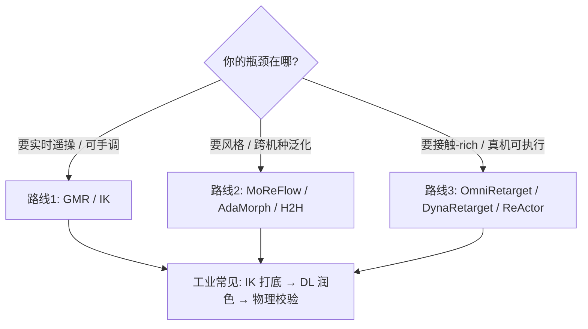

> **Query 产物**：本页由以下问题触发：「运动重定向有哪几条技术路线？深蓝 ICRA 2026 长文里每篇论文/项目分别是什么？」
> 综合来源：[深蓝公众号归档](../../sources/blogs/wechat_shenlan_motion_retargeting_three_routes_2026-09-07.md)

# Query：运动重定向三条技术路线与独立实体索引

人类 MoCap / 视频姿态 **不能** 直接当机器人关节角：连杆比例、DoF、限位与动力学都不同。**Motion Retargeting** 把源动作「翻译」为目标 embodiment 可执行轨迹。深蓝 2026-09-07 长文按 **IK 优化 · 深度学习 · 物理交互感知** 三路综述；本页为 **独立实体索引**（每个论文/项目一条详情页，技术细节见各页）。

## 英文缩写速查

| 缩写 | 英文全称 | 简要说明 |
|------|----------|----------|
| IK | Inverse Kinematics | 末端/关键点反解关节；约束优化路线核心 |
| GMR | General Motion Retargeting | YanjieZe 等人形 IK 重定向框架（≠ Disney GMR） |
| PHC | Perpetual Humanoid Control | SMPL 拟合 + 物理控制；常作重定向/跟踪基线 |
| VQ-VAE | Vector Quantized Variational Autoencoder | MoReFlow 等 motion token 化 |
| IM | Interaction Mesh | OmniRetarget 人-物-地形关系网格 |

## 三条路线 × 独立节点

### 路线 1：IK / 约束优化（可解释、实时）

| 节点 | 一句话 | 详情页 |
|------|--------|--------|
| **Retargeting Matters / GMR** | Retargeting matters；局部缩放 + 实时多机种 | [paper-hrl-stack-01-retargeting_matters](../entities/paper-hrl-stack-01-retargeting_matters.md) · [GMR 方法](../methods/motion-retargeting-gmr.md) |
| **PHC** | SMPL 姿态拟合；形态差大时偏差大，多作 benchmark | [PHC](../entities/phc.md) |

**路线特征（文内）：** 可解释、可手调约束、不依赖大数据；短板是逐帧局部最优、长时序与风格保留弱。

### 路线 2：深度学习数据驱动（风格与泛化）

| 节点 | 一句话 | 详情页 |
|------|--------|--------|
| **Human2Humanoid** | 骨架 GCN + 末端/限位；训练与遥操作 | [human2humanoid](../entities/human2humanoid.md) · [Learning H2H](../entities/paper-hrl-stack-07-learning_human_to_humanoid_real_time.md) |
| **MoReFlow** | VQ-VAE + flow matching；无配对跨角色 | [MoReFlow](../entities/paper-moreflow-motion-retargeting-flow.md) *(本次新建)* |
| **AdaMorph** | 统一 Transformer + AdaLN；12 机种一模型 | [AdaMorph](../entities/paper-adamorph-unified-motion-retargeting.md) *(本次新建)* |

**路线特征（文内）：** 保留风格与细节、可统一大模型；短板是数据分布敏感、推理延迟、物理接触弱，部署前要安全校验。

### 路线 3：物理约束与交互感知（真机可行）

| 节点 | 一句话 | 详情页 |
|------|--------|--------|
| **DynaRetarget** | SBTO 采样优化；长时域高动态 refinement | [DynaRetarget](../entities/paper-notebook-dynaretarget-dynamically-feasible-retargeting-us.md) · [SBTO 方法](../methods/dynaretarget-sbto-motion-retargeting.md) |
| **ReActor** | 仿真内双层 RL；物理可行性闭环 | [ReActor](../methods/reactor-physics-aware-motion-retargeting.md) |
| **OmniRetarget** | Interaction Mesh + Laplacian；**ICRA 2026 双最佳** | [OmniRetarget](../entities/paper-hrl-stack-03-omniretarget.md) · [holosoma](../entities/holosoma.md) |

**路线特征（文内）：** 足滑/穿模/物体相对位姿可保；短板是算力大、多离线，难实时遥操。

## 选型决策（混合架构）

1. **不要赌单一路线** — 文内与 [GMR vs NMR vs ReActor 对比](../comparisons/gmr-vs-nmr-vs-reactor.md) 一致：三者常 **串联**。
2. **OmniRetarget 是交互类锚点** — ICRA 2026 双最佳；loco-manipulation 数据生成见 holosoma 管线。
3. **MoReFlow / AdaMorph 代码待发布** — 2026-09-07 核查无官方 GitHub；选型时以 arXiv 为准。
4. **AdaMorph ≠ UMR** — 同名「Unified Retargeting」不同论文；见 [UMR 消歧](../entities/paper-umr-unified-motion-retargeting.md)。
5. **历史起点** — Gleicher 1998 奠定 retargeting 问题表述；见 [Motion Retargeting 概念](../concepts/motion-retargeting.md)。

## 结论（可操作）

1. **三路互补** — IK 给实时与可解释性，DL 给风格/跨形态，物理层给真机 contact 与 dynamics。
2. **ICRA 2026 文内焦点** — OmniRetarget 的 interaction mesh 解决「几何对齐丢交互」；不是替代 GMR，而是复杂操作的上游数据引擎。
3. **新建节点** — 本次 ingest 补 [MoReFlow](../entities/paper-moreflow-motion-retargeting-flow.md)、[AdaMorph](../entities/paper-adamorph-unified-motion-retargeting.md)；其余 6 项复用已有 wiki，避免重复造页。
4. **下游统一** — 重定向产出 reference → RL tracking / BC 仍是 [motion-retargeting-pipeline](../concepts/motion-retargeting-pipeline.md) 标准后半段。

## 参考来源

- [深蓝公众号归档](../../sources/blogs/wechat_shenlan_motion_retargeting_three_routes_2026-09-07.md)
- [MoReFlow 摘录](../../sources/papers/moreflow_arxiv_2509_25600.md)
- [AdaMorph 摘录](../../sources/papers/adamorph_arxiv_2601_07284.md)

## 关联页面

- [Motion Retargeting](../concepts/motion-retargeting.md)
- [重定向纵深路线](../../roadmap/depth-motion-retargeting.md)
- [GMR vs NMR vs ReActor](../comparisons/gmr-vs-nmr-vs-reactor.md)

## 推荐继续阅读

- <https://mp.weixin.qq.com/s/QKPp9grbgpy6-NBNm5Nl-w>
- <https://omniretarget.github.io/>
- <https://arxiv.org/abs/2509.25600>
- <https://arxiv.org/abs/2601.07284>
