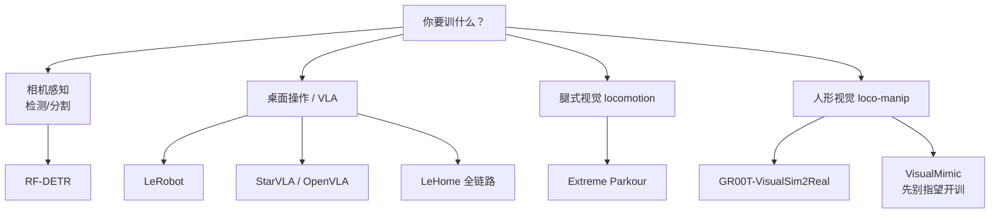

> **Query 产物**：本页由以下问题触发：「有哪个开源的带视觉的项目我可以直接开始训练的？」
> 综合来源：[VLA 开源复现景观](../overview/vla-open-source-repro-landscape-2025.md)、[LeRobot](../entities/lerobot.md)、[OpenVLA](../entities/openvla.md)、[StarVLA](../methods/star-vla.md)、[RF-DETR](../entities/rf-detr.md)、[Extreme Parkour](../entities/extreme-parkour.md)、[VIRAL / GR00T-VisualSim2Real](../entities/paper-viral-humanoid-visual-sim2real.md)、[VisualMimic](../entities/paper-notebook-visualmimic.md)

# 可直接开训的开源视觉项目选型

**一句话：** 「带视觉 + 已开源」不等于「能立刻训」；优先选 **训练脚本 + 数据/权重入口都齐** 的栈，再按你的目标（感知 / 桌面操作 / 视觉 locomotion / 人形视觉）选一层入口。

## 英文缩写速查

| 缩写 | 英文全称 | 简要说明 |
|------|----------|----------|
| VLA | Vision-Language-Action | 视觉–语言–动作多模态策略 |
| IL | Imitation Learning | 从演示学习策略，桌面操作主路线之一 |
| RGB | Red-Green-Blue | 彩色相机观测；端到端策略常见输入 |
| DR | Domain Randomization | 仿真域随机化，视觉 sim2real 常用 |
| HF Hub | Hugging Face Hub | 模型与数据集分发入口 |

## 核心结论（先看这个）

按「现在就能 clone 开训」的优先序：

| 你的目标 | 首选开训入口 | 为什么算「可直接训」 | 主要门槛 |
|----------|--------------|----------------------|----------|
| **先跑通视觉训练闭环**（非策略） | [RF-DETR](../entities/rf-detr.md) | `pip install` + `model.train(...)`，COCO/YOLO 标注即可 | 需自备或导出标注数据 |
| **桌面臂 / 模仿学习 / 轻量 VLA** | [LeRobot](../entities/lerobot.md) | 官方 CLI `lerobot-train` + Hub 数据集/权重；含 ACT、Diffusion、π₀、SmolVLA、Evo-1 | 真机需硬件；纯仿真可用 Hub 数据 |
| **单卡 / 小团队试 VLA 基线** | [StarVLA](../methods/star-vla.md) 或 VLA-Adapter | 模块化训练脚本；策展页明确「单卡可训」 | 需对齐 benchmark / 数据格式 |
| **经典开源 VLA 微调** | [OpenVLA](../entities/openvla.md) | 完整训练与 LoRA/OFT 微调脚本 | 7B 级算力；动作空间对齐 |
| **四足深度跑酷（视觉 RL）** | [Extreme Parkour](../entities/extreme-parkour.md) | Isaac Gym + `train.py` 两阶段（特权 → `--use_camera` 蒸馏） | Isaac Gym Preview、旧 PyTorch |
| **人形 RGB loco-manip（仿真训）** | [GR00T-VisualSim2Real](../entities/gr00t-visual-sim2real.md)（VIRAL / DoorMan） | 教师 PPO + RGB 学生 / DoorMan GRPO 训练入口已公开 | 高并行仿真；NVIDIA 栈 |
| **竞赛级全链路操作** | [LeHome / Learning to Fold](../entities/paper-lehome-learning-to-fold.md) | 采集–训练–RL–DAgger–权重全开源 | H200 级参考配置、Isaac Sim、磁盘大 |

**不建议当作「现在就能开训」的：** [VisualMimic](../entities/paper-notebook-visualmimic.md)（仅 Sim2Sim + 真机 checkpoint；高低层**训练代码待发布**）、多数「权重已发、训练脚本未发」的人形视觉论文仓。

---

## 分层推荐（可执行）

### 1. 感知层：最快「看见 → 训练 → 导出」

- **[RF-DETR](../entities/rf-detr.md)**（[仓库归档](../../sources/repos/rf_detr.md)）：检测 / 分割 / 关键点；文档级 `model.train(dataset_dir=..., epochs=...)`，可导出 ONNX/TensorRT。
- 选型语境见 [目标检测选型](./object-detection-model-selection.md)、[感知骨干选型](./perception-backbone-selection.md)。
- **边界：** 这是感知头，不是端到端机器人策略；适合先验证相机管线与标注质量。

### 2. 操作 / VLA：最贴近「直接开始训策略」

| 项目 | Wiki | 一手入口 | 适合谁 |
|------|------|----------|--------|
| **LeRobot** | [实体](../entities/lerobot.md) | [github.com/huggingface/lerobot](https://github.com/huggingface/lerobot) + [HF Hub](https://huggingface.co/lerobot) | **默认第一选择**：Hub 拉数据 → `lerobot-train` → 部署 |
| **StarVLA** | [方法](../methods/star-vla.md) | [starVLA/starVLA](https://github.com/starVLA/starVLA) | 换 VLM backbone、单卡消融 |
| **OpenVLA** | [实体](../entities/openvla.md) | [openvla/openvla](https://github.com/openvla/openvla) | 经典开源 VLA + LoRA/OFT |
| **OpenPI（π 系）** | [复现景观](../overview/vla-open-source-repro-landscape-2025.md) | [Physical-Intelligence/openpi](https://github.com/Physical-Intelligence/openpi) | 多任务操作复现；标定与 URDF 坑多 |
| **LingBot-VLA 2.0** | [实体](../entities/lingbot-vla-v2.md) | 见实体页 / HF | 已有强 GPU、要后训练与真机 policy server |
| **Isaac GR00T N1.7** | [实体](../entities/isaac-gr00t.md) | NVIDIA 官方微调栈 | 人形 VLA 微调；权重常需申请、显存高 |
| **LeHome** | [实体](../entities/paper-lehome-learning-to-fold.md) | [lehome_solution](https://github.com/IliaLarchenko/lehome_solution) | 要「从数据到 RL 到真机」完整工程样板 |

更完整的 VLA 仓库地图见 [VLA 开源复现景观（2025）](../overview/vla-open-source-repro-landscape-2025.md)；架构族怎么选见 [操作 VLA 选型](./manipulation-vla-architecture-selection.md)。

### 3. 视觉 locomotion / 人形视觉策略

| 项目 | 观测 | 开训状态 | 备注 |
|------|------|----------|------|
| **[Extreme Parkour](../entities/extreme-parkour.md)** | 深度 + 航向 | **可训**（两阶段 `train.py`） | 四足跑酷；Isaac Gym 依赖旧 |
| **[SRU-Odin](../entities/sru-odin.md)** | 深度导航 | **可训**（Docker + Isaac Lab 脚本） | 偏 Go2/Odin1 硬件栈 |
| **[GR00T-VisualSim2Real](../entities/gr00t-visual-sim2real.md)** | egocentric RGB | **可训**（教师 + 学生 / DoorMan） | 人形视觉 sim2real 实验室向 |
| **[VisualMimic](../entities/paper-notebook-visualmimic.md)** | 深度 visuomotor | **不可完整开训** | 仅推理/checkpoint；训练代码未发 |

纯本体感知 locomotion（如 Humanoid-Gym）**不算**「带视觉」答案，即使训练栈很成熟。

---

## 「可直接训练」判定标准（本页口径）

同时满足才进上表「首选」：

1. **公开仓库**有可读的训练入口（`train.py` / CLI / Hydra / README 步骤）。
2. **数据或仿真环境**可获取（Hub 数据集、自采脚本、或仿真内生成），不只 demo GIF。
3. **不是**仅推理 / 仅权重 / README 写 *coming soon* 的训练部分。

常见假阳性：

- **VisualMimic**：Sim2Sim ✅，训练代码 ⬜（见 [repos/visualmimic](../../sources/repos/visualmimic.md)）。
- **RoboInter1.5**：数据与 VLM 可训，**VLA 权重与 World 代码待齐**（见 [论文实体](../entities/paper-robointer-1-5.md)）。
- **GMT 等**：推理已开、Isaac 训练侧未发。

---

## 常见误区

1. **把「有 GitHub」当成「能开训」** — 先看 README 是否区分推理与训练发布进度。
2. **一上来就训 7B VLA** — 没有数据格式与相机键对齐经验时，先用 LeRobot + Hub 小数据集或 RF-DETR 打通管线。
3. **把 RLinf 当策略仓** — 它是 RL **系统**；策略权重仍在 OpenPI / OpenVLA 等仓（见复现景观）。
4. **视觉 locomotion ≠ 任意 legged_gym fork** — 确认观测里是否真有相机/深度，以及蒸馏阶段是否开 `--use_camera` 一类开关。

---

## 关联页面

- [VLA 开源复现景观（2025）](../overview/vla-open-source-repro-landscape-2025.md)
- [操作 VLA 架构选型](./manipulation-vla-architecture-selection.md)
- [目标检测模型选型](./object-detection-model-selection.md)
- [感知骨干选型](./perception-backbone-selection.md)
- [开源运动控制项目摘要](./open-source-motion-control-projects.md) — 偏运动控制，不保证视觉
- [VLN 四范式开源复现](../overview/vln-open-source-repro-paradigms.md) — 导航域可跑通栈

## 参考来源

- [深蓝具身智能：VLA GitHub 复现推荐](../../sources/blogs/wechat_shenlan_vla_github_repro_survey_2025.md)
- [LeRobot 仓库归档](../../sources/repos/lerobot.md)
- [RF-DETR 仓库归档](../../sources/repos/rf_detr.md)
- [StarVLA 仓库归档](../../sources/repos/star_vla.md)
- [Extreme Parkour 仓库归档](../../sources/repos/extreme-parkour.md)
- [GR00T-VisualSim2Real 仓库归档](../../sources/repos/gr00t_visual_sim2real.md)
- [VisualMimic 仓库归档](../../sources/repos/visualmimic.md)

## 推荐继续阅读

- [Hugging Face LeRobot](https://github.com/huggingface/lerobot) — 默认开训入口
- [Physical Intelligence openpi](https://github.com/Physical-Intelligence/openpi) — π 系官方栈
- [chengxuxin/extreme-parkour](https://github.com/chengxuxin/extreme-parkour) — 视觉四足跑酷训练
