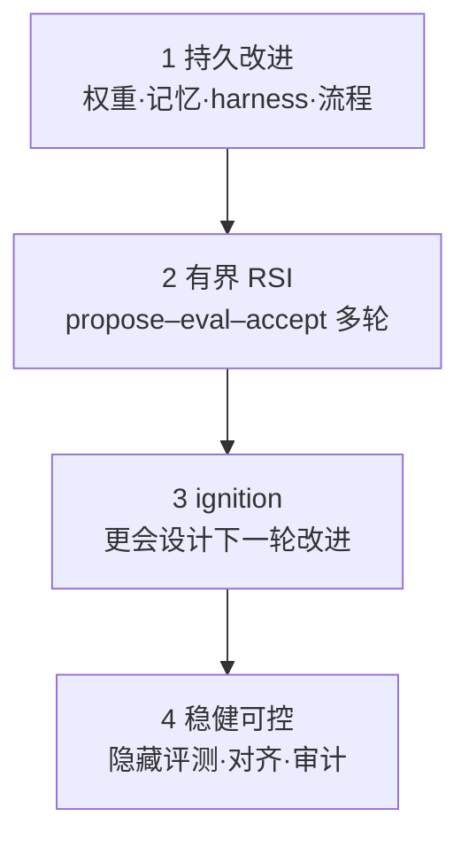
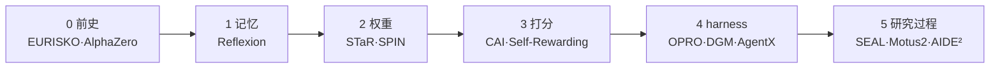

> **Query 产物**：本页由以下问题触发：「RSI 从 EURISKO 到 GPT-5.6 RSI Index 究竟走到了哪一层？会自我改进是否等于智能爆炸？」
> 综合来源：[递归自改进](../concepts/recursive-self-improvement.md)、[Awesome RSI](../entities/awesome-rsi.md)、[RSI Survey 实体](../entities/paper-rsi-survey-2607-07663.md)、[AI Auto-Research](../concepts/ai-auto-research.md)、[Motus2](../entities/paper-motus2.md)；叙事骨架编译自 [Datawhale 2026 RSI 科普综述](../../sources/blogs/wechat_datawhale_rsi_survey_2026-09-19.md)（赵志民）；机制 taxonomy 与验证层级对齐 [arXiv:2607.07663](../../sources/papers/rsi_survey_arxiv_2607_07663.md)。

# RSI 四层标准与五次边界推进

## 一句话定义

**递归自我改进（RSI）** 追问的不是「AI 会不会帮人造更好的 AI」，而是：**改进后的系统是否变得更会完成下一次改进**——在此之前，先把「持久变化」「有界闭环」「递归增益（ignition）」与「稳健可控」四层分开读。

## 英文缩写速查

| 缩写 | 英文全称 | 简要说明 |
|------|----------|----------|
| RSI | Recursive Self-Improvement | 用当前能力改进产生该能力的机制，并形成多轮闭环 |
| LLM | Large Language Model | 大语言模型；2022 起成为通用改进信号载体 |
| CAI | Constitutional AI | 人类写原则、AI 对照原则打分（Anthropic） |
| DPO | Direct Preference Optimization | 从偏好对直接更新模型，无需显式奖励模型 |
| DGM | Darwin Gödel Machine | 进化搜索可自改 harness 代码的代表工作 |
| RHI | Recursive Harness Self-Improvement | 递归式 harness 自我改进（2026 预印本） |
| ignition | Recursive gain / 点火 | 第三层：改进能力本身开始复利 |
| harness | Agent harness / 驾具 | 提示、工具、工作流、权限与运行时编排层 |

## 为什么重要

1. **消歧日常用语：** 「Agent 自进化」「研发提速」「自生成数据训练」都只是 **第一层持久改进** 或 **第二层有界 RSI** 的片段；不等于 ignition 或开放式 RSI。
2. **读 2026 新闻的标尺：** OpenAI **RSI Index**（GPT-5.6 Sol **57.9%**）、Weco **AIDE² Level 1**、Google 递归精炼循环——宜对照四层表，而非直接读成「RSI 已实现」。
3. **机器人侧锚点：** [Motus2](../entities/paper-motus2.md) 等把 **预测–评估–策略更新** 闭在真机，是第五次推进的 **有界权重级闭环**，不是「机器人已递归自我加速」。
4. **治理先于时间表：** 第四层要求验证器、权限与审计 **留在被进化系统之外**——与 [Anthropic 宏观 RSI 论述](../concepts/recursive-self-improvement.md) 的人侧选题瓶颈同构。

## 核心原理

### 四层标准（从易到难）

| 层 | 问什么 | 典型反例 |
|----|--------|----------|
| 1 | 变好是否 **留下**？ | 单次 CoT 更好但无记忆/无 checkpoint |
| 2 | 能否在 **固定边界** 内自我迭代？ | 人类逐步改 prompt；无自动 accept |
| 3 | 新版本是否 **更会改进**？ | SWE 分数 ↑ 但不会改训练算法（AI4AI-Bench） |
| 4 | 增益是否 **可迁移、可审计**？ | 公开分 ↑、隐藏分 ↓（奖励黑客） |

**文内 2026 判断：** 1–2 已有较直接证据；3 **尚无充分公开证据**；4 远未解决。

### 五次边界推进（时间重叠的叙事轴）

被系统改动的对象从 **输出/记忆** 向内收到 **参数、评判、harness、训练与研究过程**：

| 次 | 代表 | 解决了什么 | 仍卡在哪 |
|----|------|------------|----------|
| 0 | EURISKO、AlphaZero | 规则/权重级闭环 | 评估与人类写死沙盒；奖励黑客 |
| 1 | Reflexion | 跨任务 **情景记忆**（HumanEval pass@1 **91%**） | **参数不变**；移除记忆即回原形 |
| 2 | STaR、SPIN | **自生成数据 → 权重** | 目标分布与过滤仍人类 |
| 3 | CAI → Self-Rewarding → Meta-Rewarding | **AI 持红笔** | 评委与回答者共盲区；Meta-Rewarding 后期退化 |
| 4 | OPRO、ADAS、AFlow、Self-Harness、**DGM**、AgentX | **改 harness / 工作流**（DGM：SWE-bench Verified **20%→50%**） | 验证器、线上目标仍外部；harness 分 ↑ ≠ 底座变强 |
| 5 | SEAL、WebEvolver、Motus2、OpenAI/Google 研发 Agent | **训练材料、环境、研究执行** | 研究方向与采纳权仍人类；Motus2 等 **非 ignition** |

> **与 [Awesome RSI](../entities/awesome-rsi.md) 的关系：** 清单按 **artifact × mode** 索引已发表机制；本页的「五次推进」是 **历史叙事轴**，便于读新闻，非唯一技术世代划分。

### 2026 夏：闭环能转几圈？

| 信号 | 宜读成 | 不宜读成 |
|------|--------|----------|
| GPT-5.6 RSI Index **57.9%** | 前沿 lab 把「参与改进 AI」拆成可测能力 | 公开可复现通过率或 RSI 完成度 |
| AIDE² **Level 1**（Weco 博客） | **有界 harness RSI** 的阶段性自报；隐藏分减奖励作弊 | 已通过 ignition；同行评审结论 |
| Bilevel Autoresearch / RHI | 外层改 **搜索机制** 的净正信号 | 生产级 autoresearch 已闭合 |
| AI4AI-Bench **0.250/1.0** | 触及 **核心学习算法** 仍极浅 | 「AI 不会改代码」——会改 harness/工程，少改 learning rule |
| Motus2 **65%→75%** | 真机 **权重级有界闭环**（simulator/evaluator 冻结） | 开放式 RSI 或机器人递归加速 |

**一句话（文内结语）：** 闭环已经能够 **净正地转几圈**，但还没有证明 **下一圈会因为上一圈而转得更快**。

### 四道门：为何 ignition 难

1. **验证器锚** — 系统既是改进者又是评判者时，指标漂移（EURISKO 功劳簿、Meta-Rewarding 高分偏见）。**外部锚**：隐藏测试、编译器、证明器须不可被改。
2. **分布外** — 自训练 → **模型坍缩**；固定题库改 harness → **题库过拟合**。
3. **递归增益** — 任务分数 ≠ 更会设计训练/改进；AIDE² **未过 ignition test**。
4. **能力–控制同步** — AIDE² 死代码/复杂度膨胀是小尺度预警；[AutoResearchEval](https://arxiv.org/abs/2608.14905) 归纳 **45 类** 科研 Agent 失败 → 缺稳定 **元认知循环**（核对证据、回退、质疑路径）。

人类角色沿抽象阶梯上移：**验代码 → 设计验证 → 决定什么值得研究、何时停止**；机器接走执行，人保留 **目标、验证边界与否决权**。

## 工程实践

| 场景 | 做法 |
|------|------|
| 评估自家 Agent 闭环 | 先标 **artifact**（改权重还是 harness）再标 **层**（1–4）；见 [Awesome RSI Methods 页](https://prism-shadow.github.io/awesome-rsi/#methods) |
| 避免假 RSI | 分离 **公开分 / 隐藏分**；记录 propose–eval–accept 门槛（对照 Self-Harness、HarnessBank） |
| 机器人 / 真机 | 有界闭环可学 [Motus2](../entities/paper-motus2.md)；**ignition 叙事不替代** reset/verify — 见 [真机 autoresearch harness](../queries/real-robot-policy-autoresearch-harness.md) |
| 读厂商 RSI 新闻 | OpenAI/Google/快手案例作 **方向信号**；与 [Anthropic 内部生产率](../concepts/recursive-self-improvement.md) 一样打折 |
| 选题仍人侧 | 即使 80% 代码 Agent 写，**评什么、何时停** 应保留人类门 |

## 局限与风险

- **AIDE²、RSI Index 等多为 2026 夏预印本/博客**，证据边界文内已标注；勿写进路线图时间表。
- **「有界 RSI」≠ 对齐已解决** — Jakub Pachocki 等强调监控/对齐未达长期全速扩展；第四层仍空。
- **Harness 进化 ≠ 权重变强** — DGM 类结果可能只在固定测试集上 harness 最优；部署回归需门控（见 [HarnessBank](../entities/paper-harnessbank.md) 叙事）。
- **具身 Motus2** 截至入库日 **未开源**；RSI 四层读法来自综述归纳，非论文 RSI 正式定义。

## 关联页面

- [RSI 纵深路线](../../roadmap/depth-rsi.md) — 把四层标准与五次推进展开成 Stage 0–5 的可执行学习路径
- [递归自改进（宏观）](../concepts/recursive-self-improvement.md) — Anthropic 生产率、三情景与具身跟随假设
- [Awesome RSI](../entities/awesome-rsi.md) — 50+ 方法 / 29 基准的 artifact 索引
- [RSI Survey（2607.07663）](../entities/paper-rsi-survey-2607-07663.md) — 1,250 篇两轴 taxonomy + 验证层级 + 开源语料
- [RSI-Harness](../entities/rsi-harness.md) · [MetaRSI-v1](../entities/paper-metarsi-v1.md) — harness 一等对象与三算子框架
- [karpathy/autoresearch](../entities/karpathy-autoresearch.md) — 最小训练脚本自改环
- [Motus2](../entities/paper-motus2.md) — 第五次推进中的 GWM 真机有界闭环
- [AI Auto-Research](../concepts/ai-auto-research.md) — 学术全生命周期自动化 vs agent 状态自更新

## 参考来源

- [RSI Survey 论文归档（arXiv:2607.07663）](../../sources/papers/rsi_survey_arxiv_2607_07663.md)
- [Datawhale RSI 科普综述（微信公众号归档）](../../sources/blogs/wechat_datawhale_rsi_survey_2026-09-19.md)
- [原始 WebFetch 落盘](../../sources/raw/wechat_datawhale_rsi_survey_2026-09-19.md)

## 推荐继续阅读

- OpenAI GPT-5.6 / RSI Index：<https://openai.com/index/gpt-5-6/>
- Weco AIDE² Level 1：<https://www.weco.ai/blog/first-evidence-of-recursive-self-improvement>
- Lilian Weng, *Harness Engineering for Self-Improvement*：<https://lilianweng.github.io/posts/2026-07-04-harness/>
- AI4AI-Bench：<https://arxiv.org/abs/2608.20318> · RSI 综述：<https://arxiv.org/abs/2607.07663>
