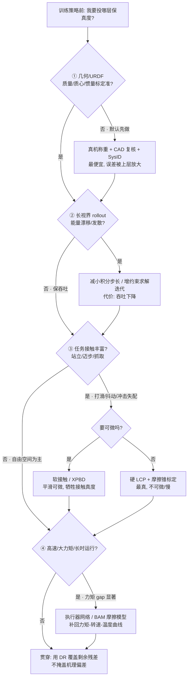

> **Query 产物**：本页由以下问题触发：「我要在仿真里训一个腿式/操作策略，**从几何/URDF 精度到执行器模型这几层物理保真度，分别该投到什么程度、各自补的是哪一种 sim2real gap、代价是什么？**」
> 综合来源：[Physics Fidelity ↔ Sim2Real Gap](../concepts/physics-fidelity-sim2real-gap.md)、[Sim2Real](../concepts/sim2real.md)、[Contact Dynamics](../concepts/contact-dynamics.md)

# 仿真物理保真度链路选型指南

## TL;DR

| 层 | 关键问题 | 投资判据 | 推荐入口 |
|----|----------|----------|----------|
| ① 几何 / URDF | 质量/质心/惯量标定准吗？ | 误差会被上层逐级放大，**最便宜先做** | [URDF 描述](../concepts/urdf-robot-description.md) |
| ② 刚体动力学 | 步长/求解器够精吗？ | 长视界发散才需加投，否则**保吞吐** | [ABA/RNEA](../formalizations/articulated-body-algorithms.md) |
| ③ 接触 / 摩擦 | 任务接触丰富吗？ | 打滑/抖动/冲击失配时**重投** | [Contact Dynamics](../concepts/contact-dynamics.md) |
| ④ 执行器 | 高速/大力矩/长时运行吗？ | 力矩 gap 显著时**必补** | [Joint Friction Models](../concepts/joint-friction-models.md) |
| 贯穿 | 建准了还差多少？ | 用 DR 覆盖**残差**，别掩盖机理偏差 | [Domain Randomization](../concepts/sim2real.md) |

## 英文缩写速查

| 缩写 | 英文全称 | 简要说明 |
|------|----------|----------|
| Sim2Real | Simulation to Real | 仿真到真机迁移工程主线 |
| DR | Domain Randomization | 域随机化，覆盖未建模残差 |
| SysID | System Identification | 系统辨识，反推物理参数 |
| URDF | Unified Robot Description Format | 机器人几何/惯量描述格式 |
| ABA | Articulated Body Algorithm | O(n) 正向动力学递归 |
| RNEA | Recursive Newton-Euler Algorithm | O(n) 逆动力学递归 |
| LCP | Linear Complementarity Problem | 硬接触互补问题，求导难 |
| XPBD | Extended Position-Based Dynamics | 平滑可微的软接触求解 |
| SEA | Series Elastic Actuator | 串联弹性执行器 |

---

## 四层保真度决策树

---

## 第 ① 层：几何 / URDF 精度

URDF 的连杆几何、碰撞体、质量、质心与惯量张量是后三层的输入，**标定误差会被逐级放大**。这是性价比最高的一层：靠真机称重、CAD 复核与 [SysID](../concepts/sim2real.md) 修正即可，不需要靠 DR 覆盖。

- **贡献的 gap**：整机姿态长期漂移、足底接触压力分布偏移。
- **典型失败模式**：质心偏移让仿真里平衡的步态在真机上持续偏向一侧。
- **取舍**：成本低、收益高，**优先做**。

## 第 ② 层：刚体动力学算法（ABA / RNEA）

给定模型，正/逆动力学由 [ABA/RNEA](../formalizations/articulated-body-algorithms.md) 在固定步长下积分。保真度损失来自**积分步长与约束求解器精度**。

- **贡献的 gap**：能量漂移、长视界 rollout 发散。
- **典型失败模式**：大步长下高速摆动腿数值「发飘」，仿真轨迹与真机偏离。
- **取舍**：**精度 vs 吞吐**——更小步长/更多迭代更准但拖慢并行采样；无明显发散时优先保吞吐。

## 第 ③ 层：接触 / 摩擦模型

腿式/操作任务的 gap 主战场，见 [Contact Dynamics](../concepts/contact-dynamics.md) 与 [Joint Friction Models](../concepts/joint-friction-models.md)。

- **贡献的 gap**：打滑、抖动、落地冲击与仿真失配。
- **典型失败模式**：库仑摩擦低估静摩擦区 → 仿真「站得住」的策略真机打滑；硬接触穿透 → 冲击力偏大。
- **取舍**：**接触保真度 ↑ 与可微性 / 吞吐冲突**——硬 LCP 最真但不可微、慢；软接触/XPBD 平滑可微但引入穿透与虚假阻尼。要梯度就接受接触真度损失，详见 [Differentiable Simulation](../concepts/differentiable-simulation.md)。

## 第 ④ 层：执行器模型

最常被理想化为「无限带宽力矩源」的一层，忽略 SEA 柔性、BLDC 力矩-电流-温度曲线、传动背隙/摩擦与控制延迟。

- **贡献的 gap**：高速段力矩跟踪塌陷、长时运行温度降额。
- **典型失败模式**：仿真满力矩起跳，真机因力矩-转速曲线达不到而落地失败。
- **取舍**：高速/大力矩/长时场景**必补**——用执行器网络或 [BAM 扩展摩擦模型](../../sources/papers/bam_extended_friction_servos_arxiv_2410_08650.md) 把 [actuator gap](../../sources/repos/sage-sim2real-actuator-gap.md) 建回仿真侧。

## 贯穿层：保真度 × SysID × 域随机化

三者互补而非替代：**先用保真度 + SysID 把能建的建准，再用 DR 覆盖剩下的残差**。一上来就靠超大 DR 范围掩盖一切，会同时牺牲训练效率与策略性能（详见 [Physics Fidelity ↔ Sim2Real Gap](../concepts/physics-fidelity-sim2real-gap.md) 的互补关系表）。real2sim 路线（如 [CRISP](../../sources/papers/crisp_real2sim_iclr2026.md)）则反过来用真机数据回写各层参数。

---

## 关联页面

- 因果概念页：[Physics Fidelity ↔ Sim2Real Gap](../concepts/physics-fidelity-sim2real-gap.md)
- 工程主线：[Sim2Real](../concepts/sim2real.md)
- 各层入口：[URDF 描述](../concepts/urdf-robot-description.md)、[ABA/RNEA](../formalizations/articulated-body-algorithms.md)、[Contact Dynamics](../concepts/contact-dynamics.md)、[Joint Friction Models](../concepts/joint-friction-models.md)、[Friction Compensation](../concepts/friction-compensation.md)、[Differentiable Simulation](../concepts/differentiable-simulation.md)
- 浮动基/质心动力学：[Floating Base Dynamics](../concepts/floating-base-dynamics.md)、[Centroidal Dynamics](../concepts/centroidal-dynamics.md)

## 参考来源

- [sources/courses/quadruped_control_simulation_rl_curriculum.md](../../sources/courses/quadruped_control_simulation_rl_curriculum.md) — 几何/URDF、刚体动力学与摩擦建模链路
- [sources/repos/sage-sim2real-actuator-gap.md](../../sources/repos/sage-sim2real-actuator-gap.md) — 执行器层 sim2real gap 与补偿
- [sources/papers/bam_extended_friction_servos_arxiv_2410_08650.md](../../sources/papers/bam_extended_friction_servos_arxiv_2410_08650.md) — 舵机扩展摩擦模型（BAM）
- [sources/papers/contact_dynamics.md](../../sources/papers/contact_dynamics.md) — 接触动力学一手资料
- [sources/papers/crisp_real2sim_iclr2026.md](../../sources/papers/crisp_real2sim_iclr2026.md) — real2sim 回写参数路线
