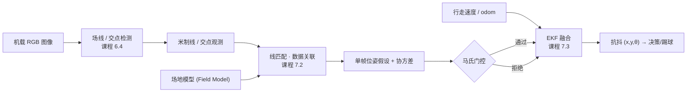

# 足球机器人视觉场线定位流水线

足球机器人要「知道自己在场上哪儿、朝哪边攻」，靠的不是单一算法，而是一条把 **看见线 → 对上图 → 平滑估计** 串起来的流水线。本页把课程第 6.4、7.2、7.3 三节各自成篇的方法拼成一条端到端落地路径，说明每一环吃什么、吐什么、在哪里最容易坏。

> **Query 产物**：本页由以下问题触发：「足球机器人只有相机，如何从场地白线一路做到抗抖的 (x,y,θ) 位姿？检测、线匹配、EKF 三步怎么串、各环怎么选型、坑在哪？」
> 综合来源：[场线/交点检测](../methods/soccer-field-line-detection.md)（课程 6.4）、[线匹配定位](../methods/visual-line-matching-localization.md)（课程 7.2）、[线特征 EKF 融合](../methods/visual-line-ekf-fusion.md)（课程 7.3）。

## 一句话定义

**视觉场线定位流水线**以机载相机为唯一定位传感器，先检测场地线与线–线交点，再把观测特征与已知场地模型做数据关联求单帧位姿假设，最后交给 EKF 用运动模型平滑，输出可直接供决策与踢球使用的抗抖 \((x,y,\theta)\) 赛场位姿。

## 英文缩写速查

| 缩写 | 英文全称 | 简要说明 |
|------|----------|----------|
| EKF | Extended Kalman Filter | 非线性局部线性化滤波，做预测+更新平滑 |
| ROI | Region of Interest | 限定检测/取线的场地感兴趣区，抑制反光误线 |
| YOLO | You Only Look Once | 课程主线实时检测族（YOLO11）检球/门/线 |
| KPI | Keypoint / Intersection | 线–线交点或角点观测量（L/T/X） |
| \((x,y,\theta)\) | SE(2) Pose | 场地平面位姿，流水线最终产物 |
| Data Association | Data Association | 观测特征 ↔ 场地模型特征的对应关系 |
| Field Model | Field Model | 规则尺寸的场地先验地图（米制） |
| Innovation | Innovation | EKF 观测残差 \(z-h(\hat{x})\)，用于门控 |
| Mahalanobis | Mahalanobis Distance | 马氏距离，做视觉观测的野值门控 |
| RoboCup | Robot World Cup | 机器人足球赛事，本流水线的目标场景 |

## 三段流水线

流水线严格分三段，且**数据只往后流**：前段的输出是后段的输入，后段不回改前段的检测结果，只通过整定后段参数（如 EKF 的 \(R\)、门控阈值）来消化前段噪声。

1. **检测**（课程 6.4）：从机载 RGB 图像用 [场线/交点检测](../methods/soccer-field-line-detection.md) 提取场地线段与 L/T/X 交点，经坐标后处理转成米制观测量。
2. **线匹配**（课程 7.2）：[线匹配定位](../methods/visual-line-matching-localization.md) 把这些观测特征与已知场地模型做数据关联，用重投影/线距离残差求出单帧位姿假设（可带协方差或多假设列表）。
3. **EKF 融合**（课程 7.3）：[线特征 EKF 融合](../methods/visual-line-ekf-fusion.md) 以行走/里程计运动模型预测、以线匹配位姿为观测更新，马氏门控拒野值，输出抗抖 \((x,y,\theta)\)。

## 逐环选型与工程坑

| 环节 | 选什么 | 典型失败模式 | 先查什么 |
|------|--------|--------------|----------|
| 检测 | YOLO11 检球/门 + 线分割/Hough/关键点头出交点；ROI 限场地区 | 白线断裂、反光地板误线、远距离小球漏检、仿真→真机掉点 | 交点是否稳定、类别定义（line vs intersection）是否与匹配端对齐 |
| 线匹配 | 交点–模型匹配 / 线–线匹配；RANSAC 或门控最小二乘拒野值 | 位姿跳到对称位置、贴边行走关联错边、FOV 内无线时长期无输出 | 模型单位（mm/m 勿混）、是否先去畸变、最小特征数是否满足才发布 |
| EKF 融合 | 松耦合：odom 预测 + 视觉位姿更新（课程默认教学路径） | EKF 发散、对称跳变穿过门控、视觉丢失时靠小 \(Q\) 硬积分「假装很准」 | 创新是否白化、\(R/Q\) 整定、角度是否 unwrap、门控是否真生效 |

- **对称场地歧义**是贯穿全链的头号坑：左右禁区相似 → 匹配出多峰后验 → EKF 若不门控就会跳到镜像位姿。消歧要靠球门颜色/朝向、历史位姿或进攻方向等唯一线索，单靠白线无解。
- **最小特征约束**决定可观测性：单条线沿线方向可滑移、定不全位姿；一个 L 角加朝向常可定 2D 位姿。发布观测前应做可观测性检查，不足则拒识而非硬解。
- **检测置信度要映射到 \(R\)**：低置信观测给大 \(R\) 或直接拒识，别让一帧误匹配把 EKF 估计拽飞。

## 常见误区

- **「检测 mAP 高就能定位」**：没有稳定交点与相机标定，位姿照样漂；端到端定位误差才是检测环节真正的目标指标。
- **「单帧线匹配结果可直接喂控制」**：单帧噪声大、会跳变，必须作为 EKF 观测经平滑与门控，而不是当地面真值用。
- **「EKF 一上就能救烂检测」**：EKF 平滑的是抖动，不是错误关联；对称跳变和错边关联需要在匹配环节消歧，滤波器只能门控、不能凭空恢复被漏检的约束。
- **「视觉丢了就把 \(Q\) 调小稳住」**：无观测时用过小过程噪声硬积分里程计，会让估计「假装很准」，反而掩盖真实漂移；应放大不确定度并触发降速/寻线行为。

## 参考来源

- [深蓝学院人形系统课程大纲](../../sources/courses/shenlan_humanoid_system_theory_practice.md) — 第 6.4（场线检测）、7.2（线匹配定位）、7.3（EKF 融合）节

## 关联页面

- [场线/交点检测](../methods/soccer-field-line-detection.md) — 流水线第一段，产出米制线/交点观测（课程 6.4）
- [线匹配定位](../methods/visual-line-matching-localization.md) — 第二段，观测与场地模型数据关联求单帧位姿（课程 7.2）
- [线特征 EKF 融合](../methods/visual-line-ekf-fusion.md) — 第三段，运动预测+视觉更新出抗抖位姿（课程 7.3）
- [EKF 形式化](../formalizations/ekf.md) — 融合环节的预测/更新递推与线性化基础
- [足球场仿真](../concepts/soccer-field-simulation.md) — 有真值位姿，便于画「匹配误差 vs 距离」并联调全链
- [Humanoid Soccer](../tasks/humanoid-soccer.md) — 本流水线服务的上层任务与基准
