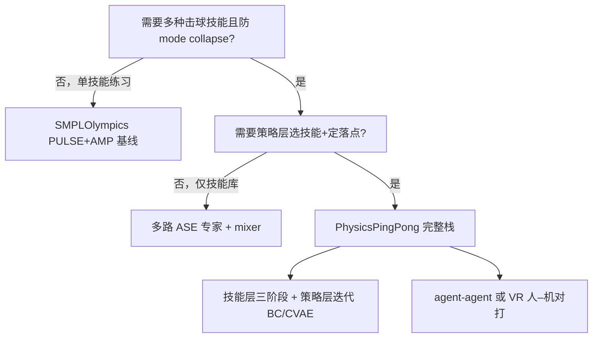

> **Query 产物**：本页由以下问题触发：「物理乒乓球动画里技能 mode collapse 严重、又要支持双智能体对打与 VR 人–机，该走单 ASE 还是分层专家 + 策略？」
> 综合来源：[Table Tennis Strategy & Skill Learning](../methods/table-tennis-strategy-skill-learning.md)、[SMPLOlympics](../entities/smplolympics.md)、[ASE](../methods/ase.md)

# 物理乒乓球分层技能学习选型指南

## 英文缩写速查

| 缩写 | 英文全称 | 简要说明 |
|------|----------|----------|
| ASE | Adversarial Skill Embeddings | 超球面 latent + 判别器的可复用技能嵌入 |
| CVAE | Conditional Variational Autoencoder | 策略层建模随机性的条件变分自编码器 |
| BC | Behavior Cloning | 从对局日志迭代克隆专家决策 |
| VR | Virtual Reality | 人–机实时对打的头戴显示与手柄接口 |
| RL | Reinforcement Learning | 技能层各阶段用深度 RL 训练 |

## TL;DR 决策路径

| 阶段目标 | 优先路线 | 典型入口 |
|----------|----------|----------|
| 统一体育 benchmark、快速乒乓球基线 | PULSE+AMP 单策略 | [SMPLOlympics](../entities/smplolympics.md) |
| 五种击球技能 + 过渡不塌缩 | 五路 ASE + mixer | [Table Tennis Strategy & Skill](../methods/table-tennis-strategy-skill-learning.md) |
| 双智能体战术 / VR 人–机 | 策略层 CVAE + 迭代 BC | 同上 PhysicsPingPong |
| 理解 ASE 单 latent 局限 | 单 ASE vs 多专家消融 | [ASE](../methods/ase.md) |

---

## 分阶段选型说明

### 1. 技能层：为何不用单 universal ASE？

[Table Tennis Strategy & Skill Learning](../methods/table-tennis-strategy-skill-learning.md)（PhysicsPingPong）指出：任务阶段若只用 **单 universal 模仿策略**，常出现 **mode collapse**——少数技能 dominate。论文用 **5 路 ASE 专家 + mixer** 将 Skill Accuracy 从 **0.38** 提到 **0.76**。

**选型轴**：

- **技能种类少、只需连续回球** → [SMPLOlympics](../entities/smplolympics.md) 的 PULSE+AMP 更简单（Avg Hits 1.83 级基线）。
- **需正手/反手/发球等多技能且过渡自然** → 走 **Imitation → Ball control → Mixer** 三阶段（见方法页 Mermaid）。

### 2. Mixer：专家与 universal 如何分工？

Mixer 在关节维混合 **universal 策略** 与 **选中技能专家** 输出：**触球用专家、过渡用 mixer**。这比硬切换 latent 更利于 **技能间平滑过渡** 与 **随机落点** 训练。

### 3. 策略层：何时加 CVAE + 迭代 BC？

若仅随机或启发式选技能，无法支撑 **竞争对打** 或 **VR 人–机**。策略层用 **迭代 BC** 从对局日志训练 **CVAE**，每次对手来球更新 **技能 one-hot + 落点**。

- **竞争模式**：只保留己方获胜片段。
- **合作模式**：保留对手成功回球片段（用于训练可接住的对手模型）。

### 4. VR 人–机 vs 纯仿真对打

PhysicsPingPong 用 **Unity 渲染 + Isaac Gym 仿真**，球拍刚体跟 VR 手柄——相对仅浮动球拍的商业 VR 乒乓球更接近 **全身动力学**。若项目只需 **离线动画渲染**，可省略 VR 管线，保留 agent–agent 即可。

## 常见误判

- **误判**：PhysicsPingPong 可替代 [SMPLOlympics](../entities/smplolympics.md) 统一 benchmark——前者是 **专项深化**（多技能+策略+VR），后者提供 **跨体育统一环境与基线**。
- **误判**：等同人形机器人真机乒乓球——本栈面向 **物理角色动画**；与硬件 loco-manipulation 正交。

## 关联页面

- [ASE](../methods/ase.md) — 技能模仿骨架与单 latent 路线
- [AMP](../methods/amp-reward.md) — style reward 家族
- [Imitation Learning](../methods/imitation-learning.md) — 技能层背景
- [Teleoperation](../tasks/teleoperation.md) — VR 交互范式
- [Locomotion](../tasks/locomotion.md) — 体育动画任务挂接

## 参考来源

- [Strategy and Skill Learning for Physics-based Table Tennis Animation](../../sources/papers/table_tennis_strategy_skill_arxiv_2407_16210.md)
- [PhysicsPingPong 项目页](../../sources/sites/physics-ping-pong-github-io.md)
- [GitHub 仓库](../../sources/repos/physics-ping-pong.md)
