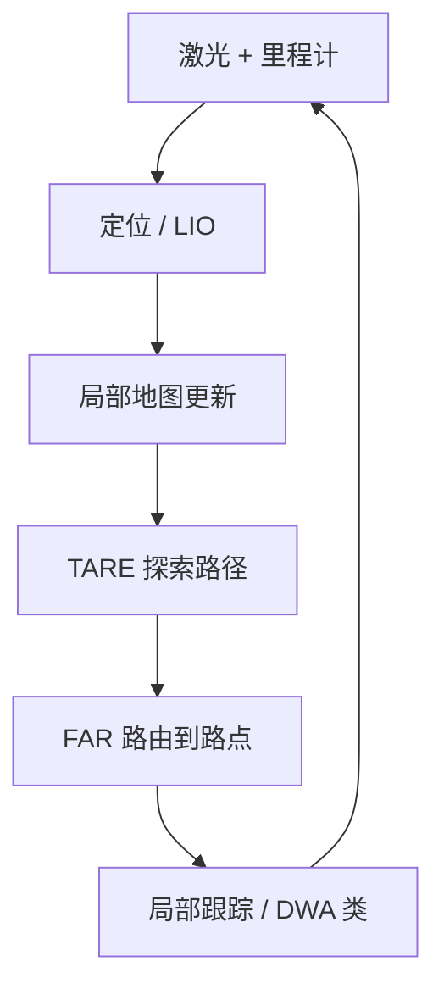

# 机器人自主探索

## 一句话定义

**自主探索**要求机器人在 **无完整先验地图** 时主动选择观测与运动，尽快覆盖未知空间，同时维持定位与安全通行——课程第 5.1 / 5.4 节任务定义。

## 英文缩写速查

| 缩写 | 英文全称 | 简要说明 |
|------|----------|----------|
| TARE | Technologies for Autonomous Robot Exploration | CMU 分层探索规划 |
| FAR | Fast Attemptable Route Planner | CMU 可见图路由 |
| Frontier | Frontier | 已知自由与未知边界 |
| NBV | Next-Best-View | 下一最佳视点经典族 |
| TSP | Traveling Salesman Problem | 路点访问顺序近似 |
| IG | Information Gain | 信息增益，常用效用 |

## 为什么重要

- 区别于「给定目标点导航」：目标由 **覆盖/信息增益** 在线生成。
- 地下、仓库首巡、灾后评估等场景的核心能力；课程用仿真把 [TARE](../entities/tare-planner.md)+[FAR](../entities/far-planner.md) 跑通即可迁移分层思想。
- 系统级对照可见 [Autonomous Spot / NeBula](../entities/paper-autonomous-spot-nebula-exploration.md)。

## 核心原理

### 问题要素

| 要素 | 含义 |
|------|------|
| 状态 | 位姿 + 局部/全局地图 |
| 动作 | 路点、视点或速度指令 |
| 效用 | 预期新体素/面积 − 代价（路程、时间、风险） |
| 终止 | 覆盖阈值、时间上限、电量 |

### 典型分层栈（课程对齐）

1. 感知更新占据或点云地图（依赖 [融合定位](../methods/lidar-odometry-fusion.md)）。
2. **探索层**（TARE）：分层表示 + TSP 风格覆盖顺序。
3. **路由层**（FAR）：可见图快速重规划，含 attemptable 未知穿越。
4. **局部层**：避障跟踪（[DWA](../methods/dwa.md) 等）。

### 与经典 frontier / NBV 的关系

| 方法 | 特点 | 弱点 |
|------|------|------|
| 最近 frontier | 实现简单 | 易局部反复 |
| 信息增益 NBV | 视点质量好 | 大场景算力高 |
| TARE 分层 | 近密远疏 + TSP | 工程集成偏 ROS1 车 |
| 学习探索 | 可适应 | 可解释性与安全需额外层 |

## 工程实践

### 课程仿真实践清单

1. 安装 [CMU Exploration 环境](../../sources/sites/cmu-exploration.md) 与依赖。
2. 启动仿真世界 → 状态估计 → 局部规划。
3. 接入 TARE，观察局部细路径与全局粗路径拼接。
4. 用 FAR 做点到点，对比 A\* 重规划耗时（论文叙事）。
5. 记录：覆盖率曲线、路径长度、CPU 占用、重访率。

### 评价指标

| 指标 | 含义 |
|------|------|
| 覆盖体积/面积 vs 时间 | 主效率 |
| 路径长度 / 重访率 | 是否无效绕行 |
| 规划耗时 | 是否实时 |
| 碰撞/救援次数 | 安全 |

### 迁到人形时的额外项

- 可通行性：台阶、狭窄相对车更严。
- 速度接口：探索路点 → [G1 软件栈](../entities/unitree-g1-software-stack.md) 速度/导航桥。
- 传感器高度与 FOV 变化导致 frontier 定义需重标定。

## 局限与风险

- 多数开源示例是地面车；人形不能「抄参数即用」。
- 定位漂了会出现漏扫或反复清同一区域。
- **误区**：用 TARE 替代局部避障——近场碰撞仍靠局部层。

## 关联页面

- [TARE Planner](../entities/tare-planner.md)
- [FAR Planner](../entities/far-planner.md)
- [导航·SLAM 栈总览](../overview/navigation-slam-autonomy-stack.md)
- [A\*](../methods/a-star.md)
- [人形系统课程策展](../entities/humanoid-system-curriculum.md)

## 参考来源

- [深蓝学院人形系统课程大纲](../../sources/courses/shenlan_humanoid_system_theory_practice.md)
- [CMU Exploration 站点归档](../../sources/sites/cmu-exploration.md)
- [tare_planner 归档](../../sources/repos/tare_planner.md)
- [far_planner 归档](../../sources/repos/far_planner.md)

## 推荐继续阅读

- <https://www.cmu-exploration.com/>
- Cao et al., RSS 2021 TARE；Yang et al., IROS 2022 FAR
