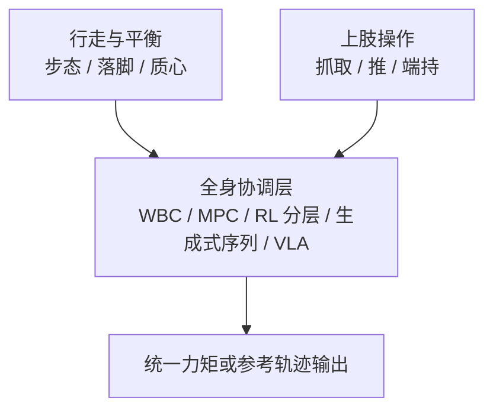

# Loco-Manipulation (移动操作)

**移动操作（Loco-Manipulation）**：机器人在运动（行走/移动）的同时执行操作任务（抓取/推动/交互），要求同时具备行走能力和上肢操作能力。

## 一句话定义

让机器人**边走边动手**——不是先停下来再操作，而是行走和操作在动力学层面高度耦合、在控制层面完全协调。

## 英文缩写速查

| 缩写 | 英文全称 | 简要说明 |
|------|----------|----------|
| Loco-Manip | Loco-Manipulation | 行走与操作动力学耦合的全身任务 |
| WBC | Whole-Body Control | 统一分配行走与上肢任务的协调层 |
| VLA | Vision-Language-Action | 高层语义/任务接口，低层全身执行 |
| MPC | Model Predictive Control | 滚动优化质心/接触的经典分层路线 |
| HLC | High-Level Control | 给出末端或技能目标的上层模块 |
| LLC | Low-Level Control | 跟踪全身参考或力矩的底层策略 |

## 全身协调流程总览

## 核心挑战

### 1. 全身动力学耦合
手臂运动会干扰质心平衡，步态振动会干扰操作精度。**独立优化行走和操作再简单合并通常无法实现复杂动作。**

### 2. 接触丰富与多约束
涉及足端地形接触与末端物体接触的并发管理，接触序列的规划空间巨大。

### 3. 高动态与精细度平衡
在进行跑酷或球类运动（高动态）的同时，需要保持末端对物体（球拍、托盘）的精密控制。

## 技术路线演进 (2024-2026)

### 1. 经典分层路线 (Modular/Hierarchical)
- **HLC (高层控制)**：VLA 或 RL 给出末端轨迹目标。
- **LLC (底层控制)**：WBC + MPC 负责全身执行。
- **代表作**：Humanoid Hanoi (2026), HiWET (2026)。

### 2. 统一生成式路线 (Unified Generative)
- **核心**：利用扩散模型（Diffusion）或概率流（Flow Matching）生成物理可行的全身运动序列。
- **特点**：天然支持多模态，能够生成极其自然的全身协调动作。
- **代表作**：SafeFlow (2026), DreamControl (2025), BeyondMimic (2025)。

### 3. 基础模型路线 (Foundation Models / VLA)
- **核心**：将视觉、语言和全身动作（Whole-body Actions）映射到统一的 Token 空间。
- **趋势**：强调从互联网规模的人类视频中学习，而非依赖昂贵的机器人演示。
- **代表作**：Ψ₀ (2026), WholeBodyVLA (2025), SENTINEL (2025), [DAJI](../entities/paper-daji-anticipatory-joint-intent.md)（2026，语言条件预期关节意图接口）。

### 4. 视觉分层 Sim2Real（Keypoint Tracker + Depth Visuomotor）
- **核心**：**任务无关低层** 从人类动作蒸馏 **关键点跟踪器**（motion teacher → keypoint student）；**任务专用高层** 从特权物体状态教师蒸馏 **egocentric 深度 visuomotor 生成器**；接口为 root + 头/双手/双足共 5 点，共享低层、逐任务训高层。
- **稳定技巧**：低层训时命令噪声；高层动作 clip 到人类动作空间（HMS）；仿真深度 heavy masking 抗 visual gap。
- **代表作**：[VisualMimic](../entities/paper-notebook-visualmimic.md) (Stanford, 2025, arXiv:2509.20322) — 真机零样本 **push / lift / kick / dribble**；**3.8 kg** 大箱全身 push 与 **户外** 泛化；相对 [TWIST](../entities/paper-twist.md) 补视觉、[VideoMimic](../entities/videomimic.md) 补 loco-manip、[VIRAL](../entities/paper-viral-humanoid-visual-sim2real.md) 走 **关键点+深度** 而非 RGB 大规模蒸馏。

### 5. 残差与自适应学习 (Residual & Adaptive)
- **核心**：在 **预训练全身先验**（GMT、WBC 等）或高层规划输出之上，用轻量 RL 学习 **残差修正**，注入物体条件、地形或扰动补偿，避免每条任务从零学平衡与步态。
- **代表作**：[ResMimic](../entities/paper-resmimic.md) (Amazon FAR, 2025, arXiv:2510.05070) — **GMT 预训练 + 物体条件残差**、点云/接触奖励与虚拟力课程，G1 真机 **4.5–5.5 kg** 全身接触搬运；SteadyTray (2026), SEEC (2025)。

### 6. 触觉增强的行为克隆路线 (Touch-Aware BC)
- **核心**：把接触信号纳入全身操作策略训练，而不是只依赖视觉与本体感受。
- **代表作**：[HTD](../methods/humanoid-transformer-touch-dreaming.md) (2026) 使用 lower-body controller 保持全身稳定，并在模仿学习中预测未来手部力和触觉 latent，提升插入、折叠、工具使用和端杯移动等接触丰富任务的成功率。

### 7. 反向层级架构 (MPC-over-RL)
- **核心**：底层使用通用的 RL WBC 策略（如 Relic）提供稳定的运动基座；高层使用基于采样的 MPC（如 CEM）在底层策略的命令空间内进行在线规划。
- **代表作**：[Sumo](../methods/sumo.md) (2026) 实现了 Spot 和 G1 操纵比自身更重、更大的物体（如扶起轮胎、拖拽大型护栏）。

### 8. 视频生成驱动路线 (Video-Generation-Driven)
- **核心**：把第三人称视频生成模型当成"想象出来的示教源"，再用动作估计 + 通用动作跟踪把视频翻译为机器人可执行轨迹，端到端避免任务级真实数据采集。
- **代表作**：[ExoActor](../methods/exoactor.md) (BAAI, 2026) — 在 Unitree G1 上做零样本任务的 B/A/S 三级评测，覆盖从基础导航到精细多步操作（如把瓶子直立放进篮子）。

### 9. 无机器人示范 + 分层 visuomotor（Robot-Free → SKR → WBC）
- **核心**：采集阶段用便携 VR/夹爪设备记录 **稀疏关键点 + 腕部视觉**（无需目标人形）；高层 **Diffusion Policy** 预测任务空间轨迹，经 **SKR** 保留度量几何后接 **全身 IK + WBC** 在 G1 上执行 loco-manipulation。
- **代表作**：[BifrostUMI](../entities/paper-bifrost-umi.md) (BAAI Aether, 2026) — 杂乱桌面 pick-place 与桌下全身处置；受 [UMI](https://arxiv.org/abs/2402.10329) 启发。

### 10. 光真实感合成演示 + VLA 微调（3DGS × 程序化 motion）
- **核心**：用 **3DGS 背景 + mesh 前景** 合成接近真机头摄的图像，在 **MuJoCo + 低层 WBC（SONIC）** 上程序化生成 loco-manip 演示；**motion 与外观解耦** 后可 GPU 重渲染增广，再微调预训练 **VLA**（ψ0 / π0.5 / GR00T 等）。
- **代表作**：[LEGS](../entities/paper-legs-embodied-gaussian-splatting-vla.md) (Stanford, 2026, arXiv:2606.01458) — 无遥操作合成数据在 G1 上匹配或超过 50-demo teleop，长时程 Task 3 上 teleop 可全线失败而 LEGS 仍成功。

### 11. 冻结策略 + 因子化在线适配（负载 × 动力学解耦）
- **核心**：先 **AMP/RL 预训练** 全身搬箱策略并 **冻结**；再用 **观测–动作历史** 学 **物体/负载** 与 **动力学** 双 latent，以 **分裂世界模型预测** + **GRL 交叉对抗** 减少混编，经 **分层 FiLM** 注入冻结网络；面向 **质量/搬放高度** 变化与 sim–real 动力学差的 **零样本真机** 部署。
- **代表作**：[SplitAdapter](../entities/paper-splitadapter-load-aware-loco-manipulation.md) (Samsung, 2026, arXiv:2606.03297) — 在 PhysHSI 类基策略上，MuJoCo sim-to-sim **86/90** vs **71/90** Full-task；G1 真机 **96.3%** vs **59.3%**，**6 kg** 与 **0 cm 地面搬起** 增益最大。

### 12. 感知统一低层 LLC（单阶段全身 RL + 高程图）
- **核心**：**单策略 PPO** 同时输出 **行走与上肢** 力矩/关节目标；机载 **LiDAR 高程图** 经 **跨模态编码**（本体预测 + 注意力地形）进入 **MoE** 全身 actor；上肢 **残差** 跟踪 $q^{\mathrm{upper}^*}$；**渐进命令课程** 替代 MoCap，作为上层 VLA/遥操作/分层 RL 的 **稳健低层 API**。
- **代表作**：[PILOT](../entities/paper-pilot-perceptive-loco-manipulation.md) (上海交大, 2026, arXiv:2601.17440) — G1 真机楼梯/高台等非结构化 **loco-manipulation**；相对 HOMIE/FALCON/AMO 跟踪误差更低；全地形 stumble 消融验证感知、注意力与 MoE。

### 13. 多向深度感知行走 + 载荷（FALCON 解耦 + 分地形蒸馏）
- **核心**：**FALCON 式双智能体**（下身条件 **多视角深度**，上身 **盲策略**）；Stage 1 用 **特权高程图** 训 **分地形专家** 并加 **末端力课程** 面向载荷；Stage 2 **DAgger** 蒸馏为统一深度 Transformer，辅以 **DFSV**（速度选相机）与 **RSM**（窄地形泛化）；配套 **Warp 多深度射线渲染** 降低训练成本。
- **代表作**：[RPL](../entities/paper-rpl-robust-humanoid-perceptive-locomotion.md) (Amazon FAR, 2026, arXiv:2602.03002) — G1 **前后双深度** 双向楼梯/坡/垫脚石；**2 kg 载荷** loco-manipulation；相对单前向深度方法强调 **多向与非对称感知**。

### 14. 梯上稳定操作（攀爬策略 + 双智能体遥操作）
- **核心**：先学 **深度 visuomotor 攀爬策略** 到梯顶；再训 **双智能体 manipulation**——下身 $\pi^l$ 维持梯子接触与骨盆姿态，上身 $\pi^u$ 跟踪 VR 遥操作目标；相对现成 **全身遥操作**（如 TWIST2）在梯顶切换后更不易失稳。
- **代表作**：[LadderMan](../entities/paper-ladderman-humanoid-perceptive-ladder-climbing.md) (Amazon FAR 等, 2026, arXiv:2606.05873) — G1 **零样本 sim-to-real** 多样梯子双向攀爬；梯顶 **调画 / 换灯泡 / 高处递箱**；深度经 **VFM + RFM** 桥接真机。

### 15. 训练期质心 MPC 地标奖励 + 部署期纯 RL（CD-MPC · πⁿ MPC）
- **核心**：**训练时** 用 **质心动力学 MPC（CD-MPC）** 批求解预测轨迹，转为 **landmark guidance reward** 监督 PPO；**部署时** 仅 MLP 关节策略（无在线 MPC）；配套 **[πⁿ MPC](../methods/pi-mpc.md)** 实现长时域 × 数千环境 GPU 批 ADMM。
- **代表作**：[MPC-RL](../entities/paper-mpc-rl-humanoid-locomotion-manipulation.md) (Caltech/JHU, 2026, arXiv:2606.05687) — Themis 真机行走、推恢复、未知负重与 **290 kg 推车** loco-manipulation；[junhengl/mpc-rl](https://github.com/junhengl/mpc-rl) 开源。

### 16. 实时 World Action Model + 统一全身 motion token（双 DiT · SONIC 解码）
- **核心**：**Video DiT** 在 **单次前向**（固定 flow 步隐状态）提供 egocentric **动力学先验**，**Motion DiT** 在同一 **SONIC motion token** 空间预测 **locomotion / 躯干 / 身高 / 足端 / 双手**；替代「上身关节 + 下身基座命令」分层，使腿能执行 **踩踏板、踢球** 等任务驱动足部行为；三阶段 **大规模 egocentric 视频 → 跨具身 G1 动作 → 全身 VR 遥操作微调**。
- **代表作**：[DiT4DiT](../entities/paper-dit4dit-video-action-model.md) (Mondo Robotics / HKUST, 2026, arXiv:2603.10448) — 双 DiT **联合** flow matching，G1 三项全身 + 八项桌面；前序 VAM 基座；[MotionWAM](../entities/paper-motionwam-humanoid-loco-manipulation-wam.md) (arXiv:2606.09215) 将其推到 **实时九项全身 loco-manip**（**76.1%** vs GR00T-N1.7 **43.9%**，**4.9 Hz**）。

### 17. 混合数据入口周报（ego / 生成 / 仿真 / 触觉 / 跨本体 teleop）
- **核心**：2026-06 周报将 loco-manip 数据生产拆为 **四组入口**——第一视角语义与全身动作（Ego-Pi、EgoPriMo）、生成视频与仿真 teleop（GenHOI、OASIS）、解耦命令与统一 WBC（VAIC、M3imic）、触觉与跨本体遥操作（WT-UMI、X-OP）；强调 **对齐、接触、命令接口与跨平台复用** 比单点真机采集更关键。
- **策展地图**：[Loco-Manip 8 篇技术地图](../overview/loco-manip-8-papers-technology-map.md)（具身智能研究室微信公众号，2026-06-14）；[161 篇十方向全景](../overview/humanoid-loco-manip-161-papers-technology-map.md)（2026-06-26）；[接触五段链路地图](../overview/loco-manip-contact-technology-map.md)（2026-07-03）。

### 18. 可穿戴人类数据 + 三系统耦合单策略 + 世界模型迭代环（HumanEx · Curr-0）
- **核心**：用软可穿戴 **HumanEx** 在野外采集 **embodied + interactive + retargetable** 人类演示（含 **incidental behavior**），将缩放律从 **robot-hour** 推向 **human-task-hour**；**System 2（推理接地）→ System 1（全身平衡与可达）→ System 0（21-DoF 灵巧手物交互）** 在 **70+ DoF** 人形上 **端到端单策略** 闭环，反对「先走再手」流水线；**多模态世界模型** 作可扩展评测与 **Human-in-the-World-Model** 部署后纠正。
- **代表作**：[Curr-0](../entities/current-robotics-curr0.md) (Current Robotics, 2026-06) — 博客报告 **21k h** 人类数据 / **2.8k h** 全身演示；演示泡茶、盖章、点香、踩踏板倒垃圾、肘推门送玩偶等 **loco-dexterous** 任务。

### 19. LLM 引导程序搜索 + 接触显式轨迹优化（Motion Discovery · 无示范）
- **核心**：把长时程 loco-manip 拆成 **离散接触模式序列** 的程序搜索问题；**LLM 进化式变异** Python 接触计划（`walk` / `append_mode` 等 API），由 **顺序运动学剪枝 + kinodynamic TO** 评分并返回 **文本失败反馈** 闭环指导下一轮变异；发现轨迹经 **DeepMimic 式 RL 跟踪** 在真机零样本部署——**不依赖遥操作或人体重定向**。
- **代表作**：[MotionDisco](../entities/paper-motiondisco-extreme-humanoid-loco-manipulation.md) (TUM / NYU / CMU, 2026, arXiv:2606.06139) — **8** 项任务（攀台、穿障、桌下取放等）；相对单次 LLM 调用，进化搜索 + 文本反馈显著提高有效接触计划比例；**G1** 真机据作者称首个完全由自动化进化搜索发现并执行的长时程 loco-manipulation。

### 20. 协调 body–hand 潜先验 + 连续 dexterous 残差 RL（CoorDex）
- **核心**：反对 **停走式** loco-manip 与 **夹爪级** 末端接口；将 **29-DoF 全身** 与 **20-DoF 五指手** 分别训成 **privileged tracking teacher → VAE 蒸馏的冻结潜先验**（body 16-D / hand 12-D），下游 PPO 在潜空间输出 **协调残差**——**共享任务上下文 trunk + 分体 body/hand 头**，而非单 MLP 或全关节探索。
- **不对称先验：** body prior 负责步态、躯干与 **腕位涌现**；**wrist-stabilized hand prior** 在仿真中运动学固定腕、只学指协调，避免手潜码容量被 6D 腕运动占用。
- **代表作**：[CoorDex](../entities/paper-coordex-dexterous-humanoid-loco-manipulation.md) (UNC / Berkeley, 2026, arXiv:2606.23680) — Isaac Lab **G1+WUJI** 仿真 **边走边抓瓶（55%）/ 后退开门（66%）/ 转身持物（89%）**；WalkGrab 消融：关节空间 PPO 与 Monolithic 潜残差在同奖励下 **0%**，凸显 **潜接口 + body–hand 结构** 必要性；真机视频为 **G1+Dex3-1** 轨迹回放定性验证。

### 21. 复合全身模仿：上身全库 + 下身双 AMP + 多 critic（CWI）
- **核心**：**不解耦成两个策略**，而是 **按角色解耦 MoCap**——**AMASS 上身全库** 保留多样操作参考（基座系、未过滤），**精选行走/蹲起小库** 经 **双 AMP 判别器** 提供稳定下身风格先验；**multi-critic PPO** 分离 locomotion / manipulation / style 优势估计；**师生蒸馏** 将稠密上身 teacher 压到 **双手 9D keypoint + 速度/身高** 部署接口。
- **代表作**：[CWI](../entities/paper-cwi-composite-humanoid-whole-body-imitation.md) (LimX / HKU / SUSTech / HKUST / ZJU-UIUC, 2026, arXiv:2606.27676) — **LimX Oli** 31-DoF 仿真优于重实现 HOVER*/FALCON*/HOMIE*；真机拧盖/开门/搬箱等；**Meta Quest VR** 无全身 MoCap；消融：去蒸馏手端误差 **42.9→173.2 mm**，去 AMP 风格 DTW **0.45→1.41**。

### 22. MimicGen 式全身规划合成示范（HumanoidMimicGen · 单 demo → 千级 IL 数据）
- **核心**：将 **object-centric 技能片段适配**（MimicGen / SkillGen / DexMimicGen 谱系）扩展到 **双足 G1 loco-manipulation**；**Homie RL 下肢 + 上身关节** 混合控制，**静态操作 / 动态行走** 解耦规划，**cuRobo 全身 IK + 碰撞规划** 交织技能 DAG 执行；**motion noise + init randomization** 提升 IL 鲁棒性。
- **代表作**：[HumanoidMimicGen](../entities/paper-humanoidmimicgen.md) (NVIDIA / UT Austin, 2026, arXiv:2605.27724) — **九任务 G1 仿真基准**；单 VR 示范 → **1000** 轨迹，VLA（GR00T N1.6）平均 PSR **0.89** vs DexMimicGen+ **0.33**；真机 **sim-and-real co-training +20%**。

### 23. 移动操作 WAM：latent action 桥接 + D-MoT 解耦 + Dream Forcing（ABot-M0.5）
- **核心**：**Wan2.2** 视频骨干预测未来 **video latent**；**帧级 latent action**（ALAM encoder）桥接粗粒度视觉与细控制；**双层 MoT** 将动作拆为 **移动 $a^{\mathrm{move}}$** 与 **操作 $a^{\mathrm{manip}}$**；**Dream Forcing** 在 **自生成 $\hat{z}, \hat{m}$** 上训逆动力学，对齐自回归部署；渐进 **世界模型预训练 → latent action 预训练 → SFT1/SFT2**。
- **代表作**：[ABot-M0.5](../entities/paper-abot-m05-mobile-manipulation-wam.md) (AMAP CV Lab / 阿里巴巴, 2026, arXiv:2607.00678) — **RoboCasa365** +Condensed Memory **46.6%**、Target 100% **54.2%**；**RoboTwin 2.0** **94.1%**；**LIBERO-Plus** 零样本 WAM 对照 **83.4%**；真机 Agilex Piper 长程摆盘/摆花等；[代码仓库](https://github.com/amap-cvlab/ABot-Manipulation)（M0.5 权重 coming soon）。

### 24. 分层 policy–GMT 接口基准（HumanoidArena · 双 tracker 扰动诊断）
- **核心**：将 egocentric 全身学习表述为 **高层策略 → 40D 中间全身动作 → 低层 GMT**；在 **7 项下肢关键 HOI/HSI** 上，从 **视觉/语义/执行扰动** 与 **TWIST2↔SONIC 跨 GMT** 两轴诊断 **policy–tracker 接口**——而非只报端到端成功率。
- **代表作**：[HumanoidArena](../entities/paper-humanoidarena.md) (HKUST-GZ 等, 2026, arXiv:2606.17833) — PICO+GMR 采集 → Isaac Lab NPZ → LeRobot 训练；实验显示分层控制能解多样腿关键交互，但 **性能强 tracker 条件化**、**跨 GMT 迁移脆弱**。

## 重点应用领域

| 领域 | 典型任务 | 代表研究 |
|------|---------|---------|
| **家务/生活** | 开门、端托盘、整理箱子 | BEHAVIOR Robot Suite (2025), StageACT (2025) |
| **体育竞技** | 网球、羽毛球、足球、滑板 | LATENT (2026), **LHBS** (2026), HITTER (2025), HUSKY (2026) |
| **极端环境** | 跑酷、徒步、复杂室内穿越 | [Perceptive Humanoid Parkour (PHP)](../entities/paper-hrl-stack-22-perceptive_humanoid_parkour.md) (RSS 2026), Hiking in the Wild (2026) |
| **人类协作** | 共同搬运物体、人机交互 | Human-Humanoid Interaction (2026) |

## 关联页面

- [Humanoid Locomotion](./humanoid-locomotion.md)
- [Manipulation](./manipulation.md)
- [Diffusion-based Motion Generation](../methods/diffusion-motion-generation.md) — 2026 年的主流高层运动生成技术
- [Whole-Body Control](../concepts/whole-body-control.md)
- [VLA](../methods/vla.md)
- [World Action Models（WAM）](../concepts/world-action-models.md) — 联合未来–动作建模与 VLA/世界模型分界（综述资源入口）
- [Teleoperation](./teleoperation.md)
- [Contact-Rich Manipulation](../concepts/contact-rich-manipulation.md)
- [Humanoid Transformer with Touch Dreaming](../methods/humanoid-transformer-touch-dreaming.md)
- [ExoActor](../methods/exoactor.md) — 视频生成驱动的零样本人形交互行为生成
- [VIRAL（论文实体）](../entities/paper-viral-humanoid-visual-sim2real.md) — 人形 loco-manipulation 视觉 Sim2Real 全栈（arXiv:2511.15200）
- [DoorMan（论文实体）](../entities/paper-doorman-opening-sim2real-door.md) — 人形纯 RGB 开门铰接操作与 GRPO 自举（arXiv:2512.01061）
- [InterPrior（论文实体）](../entities/paper-interprior.md) — 物理 HOI 生成式先验：模仿专家 → 变分蒸馏 → RL 微调（arXiv:2602.06035）
- [WEM（论文实体）](../entities/paper-wem-world-ego-modeling.md) — 混合导航–操作长程 **视频世界模型** 与 **HTEWorld** 基准（arXiv:2605.19957，BEHAVIOR-1K）
- [GR00T-VisualSim2Real](../entities/gr00t-visual-sim2real.md) — VIRAL / DoorMan 官方开源框架
- [BifrostUMI（论文实体）](../entities/paper-bifrost-umi.md) — 无机器人示范 + 扩散高层 + SKR + G1 WBC（arXiv:2605.03452）
- [LEGS（论文实体）](../entities/paper-legs-embodied-gaussian-splatting-vla.md) — 3DGS 合成演示 + VLA 微调，无遥操作 loco-manip 数据工厂（arXiv:2606.01458）
- [OASIS（论文实体）](../entities/paper-loco-manip-04-oasis.md) — 仿真 VR teleop + 视觉域随机化 + Flow Matching 层级策略，纯仿真数据零样本 G1（arXiv:2606.08548）
- [Argus（论文实体）](../entities/paper-argus-dynamic-symmetry.md) — 球形 20 腿平台运动中 ToF 点云推/跟物体；非常规形态 loco-manipulation（Science Robotics 2026）
- [SplitAdapter（论文实体）](../entities/paper-splitadapter-load-aware-loco-manipulation.md) — 冻结 AMP 搬箱策略 + 因子化世界模型/FiLM 负载感知适配（arXiv:2606.03297）
- [PILOT（论文实体）](../entities/paper-pilot-perceptive-loco-manipulation.md) — LiDAR 高程图 + MoE 单阶段感知全身 LLC（arXiv:2601.17440）
- [OmniRetarget（论文实体）](../entities/paper-hrl-stack-03-omniretarget.md) / [holosoma](../entities/holosoma.md) — 交互保留重定向与 loco-manipulation 参考数据生成
- [ResMimic（论文实体）](../entities/paper-resmimic.md) — GMT 预训练 + 残差后训练的全身 loco-manipulation（arXiv:2510.05070）
- [VisualMimic（论文实体）](../entities/paper-notebook-visualmimic.md) — 视觉分层 sim2real + 关键点 tracker 全身 loco-manipulation（arXiv:2509.20322）
- [Motion Retargeting](../concepts/motion-retargeting.md) — 人形搬运/攀台等技能的上游映射层
- [DiT4DiT（论文实体）](../entities/paper-dit4dit-video-action-model.md) — 双 DiT 联合 VAM，G1 全身 loco-manip 前序（arXiv:2603.10448）
- [MotionWAM（论文实体）](../entities/paper-motionwam-humanoid-loco-manipulation-wam.md) — 实时 WAM + 统一全身 token 的人形 loco-manip（arXiv:2606.09215）
- [ABot-M0.5（论文实体）](../entities/paper-abot-m05-mobile-manipulation-wam.md) — 移动操作 WAM：latent action + D-MoT + Dream Forcing（arXiv:2607.00678）
- [Loco-Manip 8 篇数据入口技术地图](../overview/loco-manip-8-papers-technology-map.md) — 2026-06 周报：四组数据入口（Ego-Pi/OASIS/VAIC/WT-UMI 等 8 篇）
- [人形 Loco-Manip 161 篇技术地图](../overview/humanoid-loco-manip-161-papers-technology-map.md) — 2026-06 长文：十类能力形成顺序（94+ 篇已挂接既有实体）
- [Loco-Manip 接触五段链路技术地图](../overview/loco-manip-contact-technology-map.md) — 2026-07 专题：接触数据→表示→生成补数→接触后稳定→VLA/WM（复用既有论文实体，不重复建节点）
- [Curr-0（Current Robotics）](../entities/current-robotics-curr0.md) — HumanEx 可穿戴数据 + 三系统单策略 + 世界模型评测/后训练全栈（2026-06 博客）
- [MotionDisco（论文实体）](../entities/paper-motiondisco-extreme-humanoid-loco-manipulation.md) — LLM 进化接触计划搜索 + TO 反馈 + G1 真机运动发现（arXiv:2606.06139）
- [HALOMI（论文实体）](../entities/paper-halomi-humanoid-loco-manipulation.md) — UMI+egocentric 无机器人示范、BFM-Zero 流形头手 WBC、π₀.₅ VLA 与 G1 主动颈（arXiv:2606.18772）
- [CoorDex（论文实体）](../entities/paper-coordex-dexterous-humanoid-loco-manipulation.md) — body/hand 潜先验协调残差、连续高 DoF dexterous loco-manipulation（arXiv:2606.23680）
- [SceneBot（论文实体）](../entities/paper-scenebot.md) — contact-prompted 单策略 WBT：自由空间+地形+搬箱/上楼；hindsight 场景重建数据引擎（arXiv:2606.27581）
- [CWI（论文实体）](../entities/paper-cwi-composite-humanoid-whole-body-imitation.md) — 复合全身模仿：AMASS 上身 + 双 AMP 下身 + multi-critic + VR 双手接口（arXiv:2606.27676）
- [OmniContact（论文实体）](../entities/paper-omnicontact-humanoid-loco-manipulation.md) — Contact Flow 分层 meta-skill 链式组合、50 Hz 重规划与 VLM 语义任务（arXiv:2606.26201）
- [Flexion Reflect v1.0](../entities/flexion-reflect-v1.md) — 产业长程自主栈：Reflect-VLM mission + VLA/RL 运动 + Reflex WBC + FlexComm（2026-06 博客）
- [HumanoidMimicGen（论文实体）](../entities/paper-humanoidmimicgen.md) — MimicGen 式全身规划合成 loco-manip 示范 + G1 九任务基准 + co-training（arXiv:2605.27724）
- [HumanoidArena（论文实体）](../entities/paper-humanoidarena.md) — egocentric 分层全身 benchmark：7 项腿关键 HOI/HSI + 双 GMT 扰动/迁移诊断（arXiv:2606.17833）

## 参考来源
- [awesome-humanoid-robot-learning](../../sources/repos/awesome-humanoid-robot-learning.md) — 持续更新的人形机器人学习论文集
- [ULTRA survey](./ultra-survey.md) — 统一多模态 loco-manipulation 综述 (2026)
- [arXiv 2603.23983](https://arxiv.org/abs/2603.23983), *SafeFlow: Real-Time Text-Driven Humanoid Whole-Body Control* (2026)
- **ingest 档案：** [sources/papers/diffusion_and_gen.md](../../sources/papers/diffusion_and_gen.md) — 包含 ACT / Diffusion Policy 等基础
- **ingest 档案：** [sources/papers/teleoperation.md](../../sources/papers/teleoperation.md) — HOMIE / ALOHA / OmniH2O 
- **ingest 档案：** [sources/papers/humanoid_touch_dream.md](../../sources/papers/humanoid_touch_dream.md) — HTD / Touch Dreaming 触觉增强人形移动操作
- **ingest 档案：** [sources/papers/exoactor.md](../../sources/papers/exoactor.md) — ExoActor 视频生成驱动的人形控制
- **ingest 档案：** [sources/papers/doorman_opening_sim2real_arxiv_2512_01061.md](../../sources/papers/doorman_opening_sim2real_arxiv_2512_01061.md) — DoorMan：人形 RGB 开门视觉 Sim2Real（arXiv:2512.01061）
- **ingest 档案：** [sources/papers/interprior_arxiv_2602_06035.md](../../sources/papers/interprior_arxiv_2602_06035.md) — InterPrior：物理 HOI 生成式控制（arXiv:2602.06035）
- **ingest 档案：** [sources/papers/x2n_transformable.md](../../sources/papers/x2n_transformable.md) — 具有轮足混合双模态与上肢操作能力的可变形人形机器人，用于展示强化学习的统一控制。
- **ingest 档案：** [sources/papers/bifrost_umi_arxiv_2605_03452.md](../../sources/papers/bifrost_umi_arxiv_2605_03452.md) — BifrostUMI：无机器人全身示范与 G1 部署（arXiv:2605.03452）
- **ingest 档案：** [sources/papers/legs_arxiv_2606_01458.md](../../sources/papers/legs_arxiv_2606_01458.md) — LEGS：3DGS 无遥操作 VLA loco-manip 数据（arXiv:2606.01458）
- **ingest 档案：** [sources/papers/splitadapter_arxiv_2606_03297.md](../../sources/papers/splitadapter_arxiv_2606_03297.md) — SplitAdapter：负载感知因子化适配与人形搬箱 sim2real（arXiv:2606.03297）
- **ingest 档案：** [sources/papers/pilot_arxiv_2601_17440.md](../../sources/papers/pilot_arxiv_2601_17440.md) — PILOT：感知统一 loco-manipulation 低层控制器（arXiv:2601.17440）
- **ingest 档案：** [sources/papers/omniretarget_arxiv_2509_26633.md](../../sources/papers/omniretarget_arxiv_2509_26633.md) — OmniRetarget：交互保留人形重定向（ICRA 2026）
- **ingest 档案：** [sources/papers/resmimic_arxiv_2510_05070.md](../../sources/papers/resmimic_arxiv_2510_05070.md) — ResMimic：GMT→残差全身 loco-manipulation（arXiv:2510.05070）
- **ingest 档案：** [sources/papers/visualmimic_arxiv_2509_20322.md](../../sources/papers/visualmimic_arxiv_2509_20322.md) — VisualMimic：视觉分层 sim2real + 关键点 tracker loco-manipulation（arXiv:2509.20322）
- **ingest 档案：** [sources/papers/dit4dit_arxiv_2603_10448.md](../../sources/papers/dit4dit_arxiv_2603_10448.md) — DiT4DiT：双 DiT 联合 VAM 与 G1 全身 loco-manip（arXiv:2603.10448）
- **ingest 档案：** [sources/papers/motionwam_arxiv_2606_09215.md](../../sources/papers/motionwam_arxiv_2606_09215.md) — MotionWAM：实时 WAM 人形全身 loco-manipulation（arXiv:2606.09215）
- **ingest 档案：** [sources/papers/abot_m05_arxiv_2607_00678.md](../../sources/papers/abot_m05_arxiv_2607_00678.md) — ABot-M0.5：移动操作 WAM（latent action + Dream Forcing，arXiv:2607.00678）
- **ingest 档案：** [sources/blogs/wechat_embodied_ai_lab_loco_manip_8_papers_survey.md](../../sources/blogs/wechat_embodied_ai_lab_loco_manip_8_papers_survey.md) — Loco-Manip 8 篇数据入口周报（`Ez87ljBYmCyIpLKjMjEyaQ`）
- **ingest 档案：** [sources/papers/motiondisco_arxiv_2606_06139.md](../../sources/papers/motiondisco_arxiv_2606_06139.md) — MotionDisco：LLM 引导运动发现与人形 loco-manipulation（arXiv:2606.06139）
- **ingest 档案：** [sources/papers/halomi_arxiv_2606_18772.md](../../sources/papers/halomi_arxiv_2606_18772.md) — HALOMI：主动感知无机器人示范→人形 loco-manipulation（arXiv:2606.18772）
- **ingest 档案：** [sources/papers/coordex_arxiv_2606_23680.md](../../sources/papers/coordex_arxiv_2606_23680.md) — CoorDex：body/hand 潜先验协调残差 dexterous loco-manipulation（arXiv:2606.23680）
- **ingest 档案：** [sources/papers/cwi_arxiv_2606_27676.md](../../sources/papers/cwi_arxiv_2606_27676.md) — CWI：复合全身模仿 loco-manipulation（arXiv:2606.27676）
- **ingest 档案：** [sources/papers/omnicontact_arxiv_2606_26201.md](../../sources/papers/omnicontact_arxiv_2606_26201.md) — OmniContact：Contact Flow meta-skill 链式 loco-manipulation（arXiv:2606.26201）
- **ingest 档案：** [sources/papers/humanoidmimicgen_arxiv_2605_27724.md](../../sources/papers/humanoidmimicgen_arxiv_2605_27724.md) — HumanoidMimicGen：全身规划驱动 loco-manip 合成示范（arXiv:2605.27724）
- **ingest 档案：** [sources/papers/humanoidarena_arxiv_2606_17833.md](../../sources/papers/humanoidarena_arxiv_2606_17833.md) — HumanoidArena：egocentric 分层全身 benchmark + 双 GMT 接口诊断（arXiv:2606.17833）
- **ingest 档案：** [sources/blogs/flexion_reflect_v1_0.md](../../sources/blogs/flexion_reflect_v1_0.md) — Flexion Reflect v1.0：长程 NL mission 跨楼层 loco-manip 产业演示（2026-06）

## 一句话记忆

> Loco-Manipulation 正在从“行走 + 操作”的简单叠加，演变为基于生成式模型、VLA 与触觉增强行为克隆的全身统一感知控制，是实现人形机器人从实验室走向通用场景的关键瓶颈。

## 推荐继续阅读

- [机器人论文阅读笔记：HOMIE Humanoid Loco-Manipulation with Isomorphic Exoskeleton Cockpit](https://imchong.github.io/Humanoid_Robot_Learning_Paper_Notebooks/papers/03_High_Impact_Selection/HOMIE_Humanoid_Loco-Manipulation_with_Isomorphic_Exoskeleton_Cockpit/HOMIE_Humanoid_Loco-Manipulation_with_Isomorphic_Exoskeleton_Cockpit.html)
- [机器人论文阅读笔记：BEHAVIOR Robot Suite Streamlining Real-World Whole-Body Manipulation](https://imchong.github.io/Humanoid_Robot_Learning_Paper_Notebooks/papers/03_High_Impact_Selection/BEHAVIOR_Robot_Suite_Streamlining_Real-World_Whole-Body_Manipulation/BEHAVIOR_Robot_Suite_Streamlining_Real-World_Whole-Body_Manipulation.html)
