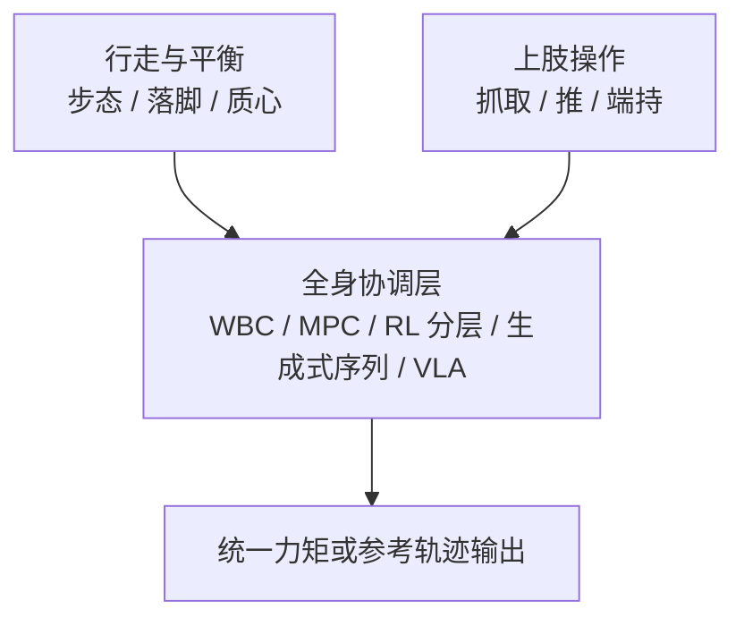

# Loco-Manipulation (移动操作)

**移动操作（Loco-Manipulation）**：机器人在运动（行走/移动）的同时执行操作任务（抓取/推动/交互），要求同时具备行走能力和上肢操作能力。

## 一句话定义

让机器人**边走边动手**——不是先停下来再操作，而是行走和操作在动力学层面高度耦合、在控制层面完全协调。

## 英文缩写速查

| 缩写 | 英文全称 | 简要说明 |
|------|----------|----------|
| Loco-Manip | Loco-Manipulation | 行走与操作动力学耦合的全身任务 |
| WBC | Whole-Body Control | 统一分配行走与上肢任务的协调层 |
| VLA | Vision-Language-Action | 高层语义/任务接口，低层全身执行 |
| MPC | Model Predictive Control | 滚动优化质心/接触的经典分层路线 |
| HLC | High-Level Control | 给出末端或技能目标的上层模块 |
| LLC | Low-Level Control | 跟踪全身参考或力矩的底层策略 |

## 全身协调流程总览

## 核心挑战

### 1. 全身动力学耦合
手臂运动会干扰质心平衡，步态振动会干扰操作精度。**独立优化行走和操作再简单合并通常无法实现复杂动作。**

### 2. 接触丰富与多约束
涉及足端地形接触与末端物体接触的并发管理，接触序列的规划空间巨大。

### 3. 高动态与精细度平衡
在进行跑酷或球类运动（高动态）的同时，需要保持末端对物体（球拍、托盘）的精密控制。

## 技术路线演进 (2024-2026)

### 1. 经典分层路线 (Modular/Hierarchical)
- **HLC (高层控制)**：VLA 或 RL 给出末端轨迹目标。
- **LLC (底层控制)**：WBC + MPC 负责全身执行。
- **代表作**：Humanoid Hanoi (2026), HiWET (2026)。

### 2. 统一生成式路线 (Unified Generative)
- **核心**：利用扩散模型（Diffusion）或概率流（Flow Matching）生成物理可行的全身运动序列。
- **特点**：天然支持多模态，能够生成极其自然的全身协调动作。
- **代表作**：SafeFlow (2026), DreamControl (2025), BeyondMimic (2025)。

### 3. 基础模型路线 (Foundation Models / VLA)
- **核心**：将视觉、语言和全身动作（Whole-body Actions）映射到统一的 Token 空间。
- **趋势**：强调从互联网规模的人类视频中学习，而非依赖昂贵的机器人演示。
- **代表作**：Ψ₀ (2026), WholeBodyVLA (2025), SENTINEL (2025), [DAJI](../entities/paper-daji-anticipatory-joint-intent.md)（2026，语言条件预期关节意图接口）。

### 4. 残差与自适应学习 (Residual & Adaptive)
- **核心**：在高层规划器输出的基础上，通过轻量级 RL 学习补偿项（Residual），以处理复杂地形或扰动。
- **代表作**：SteadyTray (2026), ResMimic (2025), SEEC (2025)。

### 5. 触觉增强的行为克隆路线 (Touch-Aware BC)
- **核心**：把接触信号纳入全身操作策略训练，而不是只依赖视觉与本体感受。
- **代表作**：[HTD](../methods/humanoid-transformer-touch-dreaming.md) (2026) 使用 lower-body controller 保持全身稳定，并在模仿学习中预测未来手部力和触觉 latent，提升插入、折叠、工具使用和端杯移动等接触丰富任务的成功率。

### 6. 反向层级架构 (MPC-over-RL)
- **核心**：底层使用通用的 RL WBC 策略（如 Relic）提供稳定的运动基座；高层使用基于采样的 MPC（如 CEM）在底层策略的命令空间内进行在线规划。
- **代表作**：[Sumo](../methods/sumo.md) (2026) 实现了 Spot 和 G1 操纵比自身更重、更大的物体（如扶起轮胎、拖拽大型护栏）。

### 7. 视频生成驱动路线 (Video-Generation-Driven)
- **核心**：把第三人称视频生成模型当成"想象出来的示教源"，再用动作估计 + 通用动作跟踪把视频翻译为机器人可执行轨迹，端到端避免任务级真实数据采集。
- **代表作**：[ExoActor](../methods/exoactor.md) (BAAI, 2026) — 在 Unitree G1 上做零样本任务的 B/A/S 三级评测，覆盖从基础导航到精细多步操作（如把瓶子直立放进篮子）。

### 8. 无机器人示范 + 分层 visuomotor（Robot-Free → SKR → WBC）
- **核心**：采集阶段用便携 VR/夹爪设备记录 **稀疏关键点 + 腕部视觉**（无需目标人形）；高层 **Diffusion Policy** 预测任务空间轨迹，经 **SKR** 保留度量几何后接 **全身 IK + WBC** 在 G1 上执行 loco-manipulation。
- **代表作**：[BifrostUMI](../entities/paper-bifrost-umi.md) (BAAI Aether, 2026) — 杂乱桌面 pick-place 与桌下全身处置；受 [UMI](https://arxiv.org/abs/2402.10329) 启发。

### 9. 光真实感合成演示 + VLA 微调（3DGS × 程序化 motion）
- **核心**：用 **3DGS 背景 + mesh 前景** 合成接近真机头摄的图像，在 **MuJoCo + 低层 WBC（SONIC）** 上程序化生成 loco-manip 演示；**motion 与外观解耦** 后可 GPU 重渲染增广，再微调预训练 **VLA**（ψ0 / π0.5 / GR00T 等）。
- **代表作**：[LEGS](../entities/paper-legs-embodied-gaussian-splatting-vla.md) (Stanford, 2026, arXiv:2606.01458) — 无遥操作合成数据在 G1 上匹配或超过 50-demo teleop，长时程 Task 3 上 teleop 可全线失败而 LEGS 仍成功。

### 10. 冻结策略 + 因子化在线适配（负载 × 动力学解耦）
- **核心**：先 **AMP/RL 预训练** 全身搬箱策略并 **冻结**；再用 **观测–动作历史** 学 **物体/负载** 与 **动力学** 双 latent，以 **分裂世界模型预测** + **GRL 交叉对抗** 减少混编，经 **分层 FiLM** 注入冻结网络；面向 **质量/搬放高度** 变化与 sim–real 动力学差的 **零样本真机** 部署。
- **代表作**：[SplitAdapter](../entities/paper-splitadapter-load-aware-loco-manipulation.md) (Samsung, 2026, arXiv:2606.03297) — 在 PhysHSI 类基策略上，MuJoCo sim-to-sim **86/90** vs **71/90** Full-task；G1 真机 **96.3%** vs **59.3%**，**6 kg** 与 **0 cm 地面搬起** 增益最大。

### 11. 感知统一低层 LLC（单阶段全身 RL + 高程图）
- **核心**：**单策略 PPO** 同时输出 **行走与上肢** 力矩/关节目标；机载 **LiDAR 高程图** 经 **跨模态编码**（本体预测 + 注意力地形）进入 **MoE** 全身 actor；上肢 **残差** 跟踪 $q^{\mathrm{upper}^*}$；**渐进命令课程** 替代 MoCap，作为上层 VLA/遥操作/分层 RL 的 **稳健低层 API**。
- **代表作**：[PILOT](../entities/paper-pilot-perceptive-loco-manipulation.md) (上海交大, 2026, arXiv:2601.17440) — G1 真机楼梯/高台等非结构化 **loco-manipulation**；相对 HOMIE/FALCON/AMO 跟踪误差更低；全地形 stumble 消融验证感知、注意力与 MoE。

### 12. 多向深度感知行走 + 载荷（FALCON 解耦 + 分地形蒸馏）
- **核心**：**FALCON 式双智能体**（下身条件 **多视角深度**，上身 **盲策略**）；Stage 1 用 **特权高程图** 训 **分地形专家** 并加 **末端力课程** 面向载荷；Stage 2 **DAgger** 蒸馏为统一深度 Transformer，辅以 **DFSV**（速度选相机）与 **RSM**（窄地形泛化）；配套 **Warp 多深度射线渲染** 降低训练成本。
- **代表作**：[RPL](../entities/paper-rpl-robust-humanoid-perceptive-locomotion.md) (Amazon FAR, 2026, arXiv:2602.03002) — G1 **前后双深度** 双向楼梯/坡/垫脚石；**2 kg 载荷** loco-manipulation；相对单前向深度方法强调 **多向与非对称感知**。

### 13. 梯上稳定操作（攀爬策略 + 双智能体遥操作）
- **核心**：先学 **深度 visuomotor 攀爬策略** 到梯顶；再训 **双智能体 manipulation**——下身 $\pi^l$ 维持梯子接触与骨盆姿态，上身 $\pi^u$ 跟踪 VR 遥操作目标；相对现成 **全身遥操作**（如 TWIST2）在梯顶切换后更不易失稳。
- **代表作**：[LadderMan](../entities/paper-ladderman-humanoid-perceptive-ladder-climbing.md) (Amazon FAR 等, 2026, arXiv:2606.05873) — G1 **零样本 sim-to-real** 多样梯子双向攀爬；梯顶 **调画 / 换灯泡 / 高处递箱**；深度经 **VFM + RFM** 桥接真机。

## 重点应用领域

| 领域 | 典型任务 | 代表研究 |
|------|---------|---------|
| **家务/生活** | 开门、端托盘、整理箱子 | BEHAVIOR Robot Suite (2025), StageACT (2025) |
| **体育竞技** | 网球、羽毛球、足球、滑板 | LATENT (2026), HITTER (2025), HUSKY (2026) |
| **极端环境** | 跑酷、徒步、复杂室内穿越 | [Perceptive Humanoid Parkour (PHP)](../entities/paper-hrl-stack-22-perceptive_humanoid_parkour.md) (RSS 2026), Hiking in the Wild (2026) |
| **人类协作** | 共同搬运物体、人机交互 | Human-Humanoid Interaction (2026) |

## 关联页面

- [Humanoid Locomotion](./humanoid-locomotion.md)
- [Manipulation](./manipulation.md)
- [Diffusion-based Motion Generation](../methods/diffusion-motion-generation.md) — 2026 年的主流高层运动生成技术
- [Whole-Body Control](../concepts/whole-body-control.md)
- [VLA](../methods/vla.md)
- [World Action Models（WAM）](../concepts/world-action-models.md) — 联合未来–动作建模与 VLA/世界模型分界（综述资源入口）
- [Teleoperation](./teleoperation.md)
- [Contact-Rich Manipulation](../concepts/contact-rich-manipulation.md)
- [Humanoid Transformer with Touch Dreaming](../methods/humanoid-transformer-touch-dreaming.md)
- [ExoActor](../methods/exoactor.md) — 视频生成驱动的零样本人形交互行为生成
- [VIRAL（论文实体）](../entities/paper-viral-humanoid-visual-sim2real.md) — 人形 loco-manipulation 视觉 Sim2Real 全栈（arXiv:2511.15200）
- [DoorMan（论文实体）](../entities/paper-doorman-opening-sim2real-door.md) — 人形纯 RGB 开门铰接操作与 GRPO 自举（arXiv:2512.01061）
- [InterPrior（论文实体）](../entities/paper-interprior.md) — 物理 HOI 生成式先验：模仿专家 → 变分蒸馏 → RL 微调（arXiv:2602.06035）
- [WEM（论文实体）](../entities/paper-wem-world-ego-modeling.md) — 混合导航–操作长程 **视频世界模型** 与 **HTEWorld** 基准（arXiv:2605.19957，BEHAVIOR-1K）
- [GR00T-VisualSim2Real](../entities/gr00t-visual-sim2real.md) — VIRAL / DoorMan 官方开源框架
- [BifrostUMI（论文实体）](../entities/paper-bifrost-umi.md) — 无机器人示范 + 扩散高层 + SKR + G1 WBC（arXiv:2605.03452）
- [LEGS（论文实体）](../entities/paper-legs-embodied-gaussian-splatting-vla.md) — 3DGS 合成演示 + VLA 微调，无遥操作 loco-manip 数据工厂（arXiv:2606.01458）
- [SplitAdapter（论文实体）](../entities/paper-splitadapter-load-aware-loco-manipulation.md) — 冻结 AMP 搬箱策略 + 因子化世界模型/FiLM 负载感知适配（arXiv:2606.03297）
- [PILOT（论文实体）](../entities/paper-pilot-perceptive-loco-manipulation.md) — LiDAR 高程图 + MoE 单阶段感知全身 LLC（arXiv:2601.17440）
- [OmniRetarget（论文实体）](../entities/paper-hrl-stack-03-omniretarget.md) / [holosoma](../entities/holosoma.md) — 交互保留重定向与 loco-manipulation 参考数据生成
- [Motion Retargeting](../concepts/motion-retargeting.md) — 人形搬运/攀台等技能的上游映射层

## 参考来源
- [awesome-humanoid-robot-learning](../../sources/repos/awesome-humanoid-robot-learning.md) — 持续更新的人形机器人学习论文集
- [ULTRA survey](./ultra-survey.md) — 统一多模态 loco-manipulation 综述 (2026)
- [arXiv 2603.23983](https://arxiv.org/abs/2603.23983), *SafeFlow: Real-Time Text-Driven Humanoid Whole-Body Control* (2026)
- **ingest 档案：** [sources/papers/diffusion_and_gen.md](../../sources/papers/diffusion_and_gen.md) — 包含 ACT / Diffusion Policy 等基础
- **ingest 档案：** [sources/papers/teleoperation.md](../../sources/papers/teleoperation.md) — HOMIE / ALOHA / OmniH2O 
- **ingest 档案：** [sources/papers/humanoid_touch_dream.md](../../sources/papers/humanoid_touch_dream.md) — HTD / Touch Dreaming 触觉增强人形移动操作
- **ingest 档案：** [sources/papers/exoactor.md](../../sources/papers/exoactor.md) — ExoActor 视频生成驱动的人形控制
- **ingest 档案：** [sources/papers/doorman_opening_sim2real_arxiv_2512_01061.md](../../sources/papers/doorman_opening_sim2real_arxiv_2512_01061.md) — DoorMan：人形 RGB 开门视觉 Sim2Real（arXiv:2512.01061）
- **ingest 档案：** [sources/papers/interprior_arxiv_2602_06035.md](../../sources/papers/interprior_arxiv_2602_06035.md) — InterPrior：物理 HOI 生成式控制（arXiv:2602.06035）
- **ingest 档案：** [sources/papers/x2n_transformable.md](../../sources/papers/x2n_transformable.md) — 具有轮足混合双模态与上肢操作能力的可变形人形机器人，用于展示强化学习的统一控制。
- **ingest 档案：** [sources/papers/bifrost_umi_arxiv_2605_03452.md](../../sources/papers/bifrost_umi_arxiv_2605_03452.md) — BifrostUMI：无机器人全身示范与 G1 部署（arXiv:2605.03452）
- **ingest 档案：** [sources/papers/legs_arxiv_2606_01458.md](../../sources/papers/legs_arxiv_2606_01458.md) — LEGS：3DGS 无遥操作 VLA loco-manip 数据（arXiv:2606.01458）
- **ingest 档案：** [sources/papers/splitadapter_arxiv_2606_03297.md](../../sources/papers/splitadapter_arxiv_2606_03297.md) — SplitAdapter：负载感知因子化适配与人形搬箱 sim2real（arXiv:2606.03297）
- **ingest 档案：** [sources/papers/pilot_arxiv_2601_17440.md](../../sources/papers/pilot_arxiv_2601_17440.md) — PILOT：感知统一 loco-manipulation 低层控制器（arXiv:2601.17440）
- **ingest 档案：** [sources/papers/omniretarget_arxiv_2509_26633.md](../../sources/papers/omniretarget_arxiv_2509_26633.md) — OmniRetarget：交互保留人形重定向（ICRA 2026）

## 一句话记忆

> Loco-Manipulation 正在从“行走 + 操作”的简单叠加，演变为基于生成式模型、VLA 与触觉增强行为克隆的全身统一感知控制，是实现人形机器人从实验室走向通用场景的关键瓶颈。

## 推荐继续阅读

- [机器人论文阅读笔记：HOMIE Humanoid Loco-Manipulation with Isomorphic Exoskeleton Cockpit](https://imchong.github.io/Humanoid_Robot_Learning_Paper_Notebooks/papers/03_High_Impact_Selection/HOMIE_Humanoid_Loco-Manipulation_with_Isomorphic_Exoskeleton_Cockpit/HOMIE_Humanoid_Loco-Manipulation_with_Isomorphic_Exoskeleton_Cockpit.html)
- [机器人论文阅读笔记：BEHAVIOR Robot Suite Streamlining Real-World Whole-Body Manipulation](https://imchong.github.io/Humanoid_Robot_Learning_Paper_Notebooks/papers/03_High_Impact_Selection/BEHAVIOR_Robot_Suite_Streamlining_Real-World_Whole-Body_Manipulation/BEHAVIOR_Robot_Suite_Streamlining_Real-World_Whole-Body_Manipulation.html)
