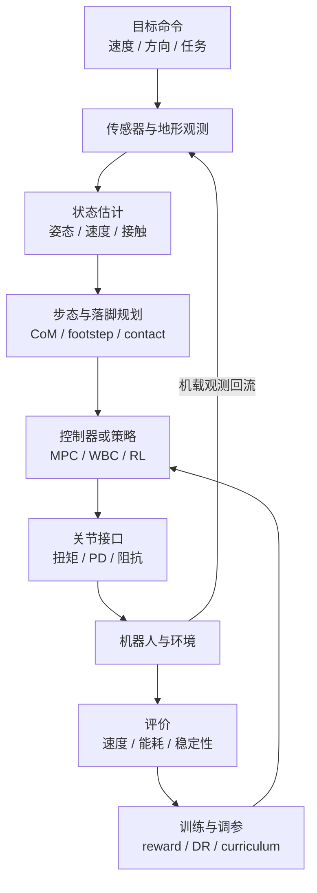

# Locomotion

**运动/行走**：让机器人（尤其人形/足式）实现稳定、高效、多地形移动的能力。

## 一句话定义

让机器人在不需要轮子的情况下，用腿走路，而且走得稳、走得快、走得自然。

## 任务边界

Locomotion 不是单个“会走路的策略”，而是一套闭环运动系统：把机体状态、接触状态、地形信息和目标速度/落脚点转成可稳定执行的关节指令。

| 视角 | 输入 | 输出 | 典型失败模式 |
|------|------|------|--------------|
| 任务层 | 目标速度、目标方向、地形约束 | 步态模式、落脚区域、速度跟踪目标 | 走得快但不可控，或只能在训练地形上工作 |
| 规划层 | 机器人状态、地形高度、接触约束 | 质心轨迹、足端轨迹、期望接触力 | 落脚点不可达、摩擦约束违反 |
| 控制层 | 参考轨迹、关节状态、接触估计 | 关节力矩、位置目标或 PD setpoint | 抖动、打滑、膝盖过伸、接触切换失稳 |
| 学习层 | 奖励、示范数据、扰动分布 | 策略、价值函数、运动先验 | reward hacking、sim2real 退化、动作不自然 |

## 闭环流程总览

阅读这张图时可以抓住两条主线：

- **在线闭环**：观测 → 状态估计 → 规划/策略 → 关节接口 → 机器人执行。
- **离线迭代**：真实或仿真 rollout 产生指标，再回到 reward、domain randomization、curriculum 和控制参数调试。

## 核心挑战

### 1. 平衡
人形机器人是天然不稳定的系统，必须主动维持平衡。

- 静态平衡：重心在支撑多边形内
- 动态平衡：ZMP（Zero Moment Point）条件
- 接触力分配：多接触时的力分配问题

### 2. 接触切换
行走本质是不断在单脚支撑和双脚支撑之间切换，每次切换都容易失稳。

### 3. 高维动作空间
30+ 自由度，每次决策都要协调所有关节。

### 4. 地形变化
平坦、崎岖、不平整、楼梯——每种地形需要不同的步态策略。

- **楼梯与离散接触上的学习案例：** [FastStair（论文实体页）](../entities/paper-faststair-humanoid-stair-ascent.md) 归纳 arXiv:2601.10365：用 **GPU 并行 DCM 落脚点离散搜索** 在 Isaac Lab RL 中提供显式可行落点监督，再以 **分速专家 + LoRA 融合** 缓解保守性与全速域动作分布差异，在 LimX Oli 上给出高速上楼梯实机叙事。

### 5. 状态估计与延迟
足式机器人在接触切换时很难直接观测机身速度和足端滑移；IMU、编码器、足端接触和视觉地形之间还存在时间同步与延迟问题。状态估计偏一点，控制器可能表现为“突然踢地”“脚底打滑”或“落脚点漂移”。

### 6. 仿真到真实
仿真里的摩擦、执行器带宽、关节间隙、地面柔顺性都比真实世界干净。只在仿真指标上最优的策略，常在真实机上因动作高频、冲击过大或接触模型偏差而退化。

## 子问题地图

| 子问题 | 要回答的问题 | 常见方法 | 对应页面 |
|--------|--------------|----------|----------|
| 平衡稳定 | 机器人被推、落脚偏差时如何不摔 | ZMP、Capture Point / DCM、step adjustment、WBC | [Capture Point / DCM](../concepts/capture-point-dcm.md)、[Balance Recovery](./balance-recovery.md) |
| 步态生成 | 何时抬脚、落哪里、摆腿轨迹如何生成 | CPG、参数化步态、MPC、RL gait command | [Gait Generation](../concepts/gait-generation.md)、[Footstep Planning](../concepts/footstep-planning.md) |
| 全身协调 | 腿、躯干、手臂如何共同满足平衡与任务 | WBC、centroidal dynamics、QP 优先级 | [Whole-Body Control](../concepts/whole-body-control.md)、[MPC-WBC Integration](../concepts/mpc-wbc-integration.md) |
| 接触建模 | 支撑脚、摩擦锥、冲击和滑移如何处理 | contact dynamics、friction cone、impedance control | [Contact Dynamics](../concepts/contact-dynamics.md) |
| 地形适应 | 楼梯、斜坡、碎石地如何转成可执行动作 | 高程图、落脚点评分、teacher-student、盲走鲁棒策略 | [Terrain Adaptation](../concepts/terrain-adaptation.md) |
| 数据与学习 | 如何获得自然、多样、可迁移的运动 | RL、IL、AMP、motion retargeting、curriculum | [Reinforcement Learning](../methods/reinforcement-learning.md)、[Imitation Learning](../methods/imitation-learning.md) |
| 真机部署 | 如何让策略在硬件上稳定运行 | domain randomization、系统辨识、低通滤波、PD/阻抗接口 | [Sim2Real](../concepts/sim2real.md)、[Kp/Kd 设置 query](../queries/legged-humanoid-rl-pd-gain-setting.md) |

## 主要方法路线

### 传统控制路线
- **ZMP + 预观控制**：经典人形行走（Honda ASIMO）
- **LIP + 步长调节**：简单高效的行走控制
- **Hybrid Zero Dynamics**：考虑机器人动力学结构的步态生成
- **MPC + WBC**：高层用简化动力学预测质心/接触，低层用 QP 或层级 WBC 跟踪全身任务。

### 学习路线
- **RL from scratch**：直接在仿真里训，不需要人工步态设计。
  - 代表：PPO 训四足/双足行走（Legged Gym, IsaacGymEnvs）。
  - 新趋势：**BRRL / BPO (2026)** 在 IsaacLab 环境下报告了比 PPO 更稳健的 locomotion 训练表现。
- **IL + RL**：用 MoCap 数据初始化，再用 RL 提升。
  - 代表：DeepMimic, AMP
- **Multi-Gait Learning (多步态学习)**：在一个统一的 RL 框架下训练多种步态。
  - 新趋势：使用 **Selective AMP (选择性 AMP)** 策略，对周期性步态（如行走、上楼梯）应用 AMP 以提高稳定性，对高动态步态（如跑、跳）则省略 AMP，避免正则化过度约束。
- **世界模型**：学习环境模型，在模型里规划。
  - 代表：[Model-Based RL（Dreamer 等）](../methods/model-based-rl.md)、[LIFT（BIGAI 三阶段管线）](../entities/lift-humanoid.md)

### 混合路线

实际系统常把传统控制和学习策略组合起来，而不是二选一：

- **RL policy + PD/阻抗底层**：策略输出关节位置增量或期望角度，PD/阻抗层保证高频执行稳定。
- **MPC/WBC baseline + learned residual**：模型控制提供安全可解释的主干，学习模块补偿摩擦、冲击或模型误差。
- **Teacher-student / privileged learning**：训练时 teacher 使用高度图、真实速度等 privileged information；部署时 student 只用机载传感器。
- **Motion prior + task RL**：先用 MoCap/视频/重定向得到自然运动先验，再用任务奖励获得速度、转向和地形适应能力。

## 方法选型速查

| 目标 | 优先路线 | 关键验证 |
|------|----------|----------|
| 做可解释、约束清晰的研究 baseline | LIP/ZMP 或 MPC + WBC | 轨迹跟踪误差、摩擦锥、力矩限幅是否满足 |
| 快速得到四足/人形平地移动策略 | PPO/BRRL + PD action interface | 随机扰动、不同速度命令、不同摩擦地面上的成功率 |
| 追求人形动作自然性 | IL/AMP/Selective AMP + RL fine-tuning | 与示范动作相似度、能耗、摔倒率 |
| 复杂地形与楼梯 | 地形感知 + footstep planning 或 teacher-student RL | 未见地形、感知延迟、落脚点可达性 |
| 真机部署 | Sim2Real + 系统辨识 + 动作平滑 | 长时间运行、温升、电流峰值、恢复站立能力 |

## 评价指标

- **行走速度**：m/s
- **能耗效率**：J/kg/m 或 Cost of Transport (CoT)
- **地形适应能力**：是否能处理楼梯、不平整地面
- **稳定性**：摔倒频率
- **运动自然性**：和人类步态的相似度
- **泛化能力**：能否迁移到未见过的地形
- **命令跟踪误差**：目标速度/角速度与实际速度的误差
- **硬件安全裕度**：关节力矩、电流、温度和冲击峰值是否留有余量

## 工程落地检查

1. **先定义动作接口**：策略输出扭矩、关节位置、位置增量还是阻抗参数，会直接决定训练难度和真机风险。
2. **先做站立与恢复**：能稳定站立、被推后恢复、跌倒后安全停机，再进入高速步态。
3. **把评测分层**：仿真看成功率和能耗；半实物看延迟和电流；真机看温升、冲击和长时间稳定性。
4. **保存失败 rollout**：摔倒、打滑、膝盖反关节、脚底震荡等失败样本比平均 reward 更能指导下一轮改动。
5. **不要只调 reward**：很多问题来自状态估计、动作滤波、PD gain、接触模型或 actuator lag，不能全部用奖励函数掩盖。

## RL + 底层 PD / 阻抗 / 扭矩接口（论文实体子页）

下列页面各含 **提炼正文 + Mermaid**，对应 [RL+PD 动作接口论文索引](../../sources/papers/rl_pd_action_interface_locomotion.md) 中的十篇；与 [Kp/Kd 设置 query](../queries/legged-humanoid-rl-pd-gain-setting.md) 交叉阅读。

- [Digit 人形 RL 行走](../entities/paper-digit-humanoid-locomotion-rl.md)
- [Cassie 双足多技能 RL](../entities/paper-cassie-biped-versatile-locomotion-rl.md)
- [可变刚度腿足 RL](../entities/paper-variable-stiffness-locomotion-rl.md)
- [Cassie 迭代式 sim2real](../entities/paper-cassie-iterative-locomotion-sim2real.md)
- [ANYmal 分钟级并行 DRL](../entities/paper-anymal-walk-minutes-parallel-drl.md)
- [Walk These Ways（MoB）](../entities/paper-walk-these-ways-quadruped-mob.md)
- [Cassie 反馈控制 DRL](../entities/paper-cassie-feedback-control-drl.md)
- [四足扭矩控制 RL](../entities/paper-quadruped-torque-control-rl.md)
- [RSS 2018 敏捷四足 sim2real](../entities/paper-quadruped-agile-sim2real-rss2018.md)
- [可变阻抗接触任务 RL](../entities/paper-variable-impedance-contact-rl.md)

## 参考来源

- Rudin et al., *Learning to Walk in Minutes Using Massively Parallel Deep Reinforcement Learning* — legged_gym 路线奠基论文
- Peng et al., *DeepMimic: Example-Guided Deep Reinforcement Learning of Physics-Based Character Skills* — IL+RL 融合代表
- [Locomotion RL 论文导航](../../references/papers/locomotion-rl.md) — 论文集合
- **ingest 档案：** [sources/papers/policy_optimization.md](../../sources/papers/policy_optimization.md) — PPO/SAC/TD3 + Rudin legged_gym
- **ingest 档案：** [sources/papers/state_estimation.md](../../sources/papers/state_estimation.md) — EKF/InEKF 状态估计
- **ingest 档案：** [Multi-Gait Learning for Humanoid Robots Using Reinforcement Learning with Selective Adversarial Motion Priority](../../sources/papers/multi-gait-learning.md) — 多步态学习中的 Selective AMP 策略
- **ingest 档案：** [sources/papers/rl_pd_action_interface_locomotion.md](../../sources/papers/rl_pd_action_interface_locomotion.md) — RL + PD/阻抗/扭矩接口论文索引

## 关联系统/方法

- [Whole-Body Control](../concepts/whole-body-control.md)
- [Sim2Real](../concepts/sim2real.md)
- [State Estimation](../concepts/state-estimation.md)
- [Reinforcement Learning](../methods/reinforcement-learning.md)
- [Imitation Learning](../methods/imitation-learning.md)
- [MPC](https://en.wikipedia.org/wiki/Model_predictive_control)（在行走中常用于步态预览）
- [MPC 与 WBC 集成](../concepts/mpc-wbc-integration.md)（人形/腿足 locomotion 的典型分层控制架构）
- [Capture Point / DCM](../concepts/capture-point-dcm.md)（步行平衡与扰动恢复的核心方法）
- [Lyapunov 稳定性](../formalizations/lyapunov.md)（分析闭环步态稳定性、扰动恢复和误差收敛的统一语言）
- [Gait Generation](../concepts/gait-generation.md)（步态时序编排：CPG / 参数化 / MPC 联合优化）
- [Footstep Planning](../concepts/footstep-planning.md)（接触序列规划：每步踩哪里、踩多久）
- [Terrain Adaptation](../concepts/terrain-adaptation.md)（把高度图 / 点云转成可执行的落脚点与姿态调整）
- [轮足四足机器人（四轮足）](../concepts/wheel-legged-quadruped.md)（Go2W / B2W 类：腿末驱动轮与足式步态混合）
- [HiPAN](../methods/hipan.md)（四足在非结构化 3D 环境中的分层深度导航 + 姿态自适应低层跟踪）
- [四足机器人](../entities/quadruped-robot.md)（四足形态与典型平台的实体入口）
- [Unitree](../entities/unitree.md)（当前主流人形/四足研究硬件平台）
- [ULTRA：统一多模态 loco-manipulation 控制](./ultra-survey.md)（UIUC 2026，新一代全身移动操作统一控制器）
- [Query：何时用 WBC vs RL？](../queries/when-to-use-wbc-vs-rl.md) — 实践决策指南

## 关联任务

- [Manipulation](./manipulation.md)：行走+操作 = loco-manipulation
- [Loco-Manipulation](./loco-manipulation.md)：全身移动操作的统一挑战
- [Balance Recovery](./balance-recovery.md)：扰动恢复，鲁棒 locomotion 的核心子能力
- [Query：人形机器人运动控制 Know-How](../queries/humanoid-motion-control-know-how.md) — locomotion 实战经验结构化摘要
- [Query：开源运动控制项目导航](../queries/open-source-motion-control-projects.md) — 主流开源框架与项目概览

## 继续深挖入口

如果你想沿着 locomotion 继续往下挖，建议从这里进入：

### 论文入口
- [Locomotion RL 论文导航](../../references/papers/locomotion-rl.md)

### Benchmark 入口
- [Locomotion Benchmarks](../../references/benchmarks/locomotion-benchmarks.md)

### 开源项目 / 框架入口
- [RL Frameworks](../../references/repos/rl-frameworks.md)
- [Simulation](../../references/repos/simulation.md)

## 关联页面

- [Humanoid Locomotion](./humanoid-locomotion.md) — 人形机器人全身移动任务
- [Hybrid Locomotion](./hybrid-locomotion.md)
- [Whole-Body Control](../concepts/whole-body-control.md)
- [MPC](../methods/model-predictive-control.md)

## 推荐继续阅读

- Rudin et al., *Learning to Walk in Minutes Using Massively Parallel Deep Reinforcement Learning*（legged_gym 原论文）
- Won et al., *Perpetual Robot Control: Designing Robot Agility and Recovery*（CPI + RL 路线）
- Jin et al., *Rapid and Scalable Reinforcement Learning for Legged Robots*（Isaac Lab 路线）
- [Humanoid Control Roadmap](../roadmaps/humanoid-control-roadmap.md) — 人形机器人运控的学习成长路线
- [Query：人形机器人硬件怎么选](../queries/humanoid-hardware-selection.md)
- [Query：人形机器人 RL 实战 Cookbook](../queries/humanoid-rl-cookbook.md)
