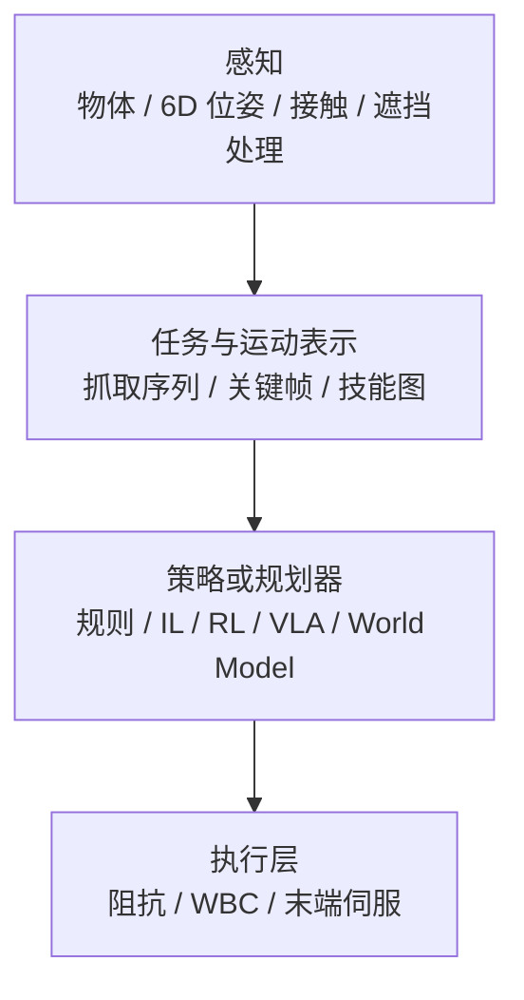

# Manipulation

**操作**：让机器人的手/末端执行器抓取、移动、操作物体。

## 一句话定义

让机器人的手能做事情——抓东西、搬东西、用东西。

## 英文缩写速查

| 缩写 | 英文全称 | 简要说明 |
|------|----------|----------|
| Manipulation | Robot Manipulation | 抓取、移动、操作物体的任务总称 |
| IL | Imitation Learning | 示教驱动路线，扩散策略、BC 等常见于操作 |
| VLA | Vision-Language-Action | 开放词汇操作与自然语言任务接口 |
| TAMP | Task and Motion Planning | 离散任务规划与连续运动/抓取联合求解 |
| WBC | Whole-Body Control | 移动操作中人形全身协调与阻抗执行 |
| 6DoF | Six Degrees of Freedom | 物体位姿（位置+朝向）抓取表示 |
| RL | Reinforcement Learning | 接触丰富场景中探索式策略学习 |

## 核心挑战

### 1. 接触力学
操作涉及多指接触、摩擦、约束——比纯运动控制复杂。

### 2. 视觉感知
需要识别物体、理解姿态、估计空间位置；**2D 目标检测**（见 [目标检测](../methods/object-detection.md)、[YOLO v1](../entities/paper-yolo-unified-realtime-detection.md)）常作第一级 **物体锚点**；抓取子问题中常需要 **6D/7DoF 抓取位姿** 或 **候选集合**（见 [AnyGrasp](../entities/anygrasp.md) 一类检测式管线）。视觉特征多来自 [视觉骨干](../concepts/vision-backbones.md)（如 [ResNet](../entities/paper-resnet-deep-residual-learning.md)）预训练微调。

### 3. 灵巧操作
很多操作需要多指协调、精细力控（如插头、拧瓶盖）。

### 4. 开放词汇
现实世界物体种类几乎无限，不可能为每个物体单独训练。

### 5. 仿真场景与交互资产
操作仿真除策略外，还依赖 **可关节、带物理字段的 3D 资产**（尺度、材料、affordance、运动学）。近期 **sim-ready 生成**（如 [PhysX-Omni](../entities/physx-omni.md)、[PhysForge](../entities/paper-physforge-physics-grounded-3d-assets.md)）试图缓解 **PartNet-Mobility 系数据** 在类别与标注上的瓶颈，但导入目标引擎（SAPIEN、MuJoCo、Isaac 等）时仍需核对 **URDF/碰撞/关节限位**。**真机视频孪生**路线见 [SimFoundry](../entities/paper-simfoundry-real2sim-scene-generation.md)（arXiv:2606.28276）：单段 RGB 视频 → 数字孪生 + **digital cousins**，并直接对接 **策略评测与仿真演示训练**（DROID / YAM）。

## 操作闭环流程总览

## 主要方法路线

### 传统路线
- **Pick and Place**：先移动到物体，再抓取，再移动
- **Keyframe/Constrained IL**：关键帧 + 约束
- **Task Space Control**：在任务空间控制末端执行器
- **TAMP / TAMPAS（任务–运动–调度）**：离散任务层 + 连续 stream（抓取、IK、轨迹）+ **多臂时间表**；[ScheduleStream](../entities/schedulestream.md) 把经典 TAMP 的 **顺序计划** 扩展到 **并行无碰撞 schedule**，并可用 **GPU 批处理** 加速采样

### 学习路线
- **RL**：在仿真中学习抓取策略
- **IL**：从演示中学习操作技能
- **Task-Level ILC（可变形体）**：[Flying Knots](../entities/paper-flying-knots.md)（arXiv:2602.21302）— **单次人类示教 + 粒子绳模型 + critical-point 逆模型 QP**，在 xArm7 真机上 **≤10 trials** 完成动态打结，绳型间 **2–5 trials** 可迁移；与大规模 BC/扩散策略形成 **样本效率** 对照
- **VLA (Vision-Language-Action Model)**：端到端视觉-语言-动作模型
  - 代表：UnifoLM, π₀, [Green-VLA](../entities/paper-greenvla-staged-vla-humanoid.md)（五阶段课程 + 统一多本体动作 + Green 人形上身部署，arXiv:2602.00919）
  - **产线后训练：** [KinetIQ Ascend](../entities/kinetiq-ascend.md)（Humanoid, 2026）在 **CFM-VLA** 上用 **真机 PPO** 把 BC 策略推到工业级吞吐/可靠性（双臂 Alpha、稀疏奖励、数天 robot-time）
- **World Model**：学习操作的世界模型，在模型里 planning；像素域上「静态场景 + 手轨迹 → 交互视频」的显式分解路线见 [DWM（Dexterous World Models）](../methods/dwm.md)；**语言条件 3D 物体点轨迹** 先验见 [MolmoMotion](../entities/molmo-motion.md)（DROID 微调后可提升 MolmoBot 规划样本效率）
- **Video-Action Model（VAM）**：用语义–动力学一体的 **视频扩散骨干潜计划** 条件化 **流匹配 / 逆动力学式动作头**，与 VLA 的静态 VLM 先验形成对照；入口见 [mimic-video](../methods/mimic-video.md)。**联合训练 + 测试时仿真选动作** 见 [τ₀-WM](../entities/tau0-world-model.md)（异构掩码预训练、propose–evaluate–revise）
- **DeFI**：**GFDM + GIDM** 分阶段预训练解耦前向/逆动力学，再用扩散适配器耦合微调；强调无动作标签人视频与 CALVIN / SimplerEnv 长程表现；入口见 [DeFI](../methods/defi-decoupled-dynamics-vla.md)
- **EgoScale**：在 **海量 egocentric 人视频** 上对 **流式 VLA** 做 **腕 + 重定向灵巧手** 显式预训练，并以 **对齐人–机 mid-training** 承接 embodiment gap，面向 **高 DoF 长程灵巧** 任务；入口见 [EgoScale](../methods/egoscale.md)
- **EgoWAM**：在 **双臂真机** 上实证 **朴素 BC 人–机共训** 可因具身差距 **负迁移**，而 **WAM 可替换世界目标**（DINO / 3D flow）使性能随 **EgoVerse 野外人数据** 扩展；入口见 [EgoWAM](../entities/paper-egowam-egocentric-human-wam-co-training.md)
- **T-Rex**（[实体页](../entities/paper-trex-tactile-reactive-dexterous-manipulation.md)，arXiv:2606.17055）：**触觉反应式灵巧操作**——人视频预训练 + **100 h 触觉 play mid-training** + 变频率 MoT；开源触觉数据集与 **12 任务** 双手真机基准
- **OmniTacTune**（[实体页](../entities/paper-omnitactune-tactile-residual-adaptation.md)，arXiv:2607.03723）：**策略无关触觉残差真机 RL**——冻结 Flow/ACT/DP/π₀.₅ 视觉基策略，**40–80 min** 在线练习把接触丰富任务 **5–40% → 85–100%**；**无需离线触觉演示**

## 在人形机器人中的特殊性

人形机器人操作的特点：
- 浮动基：身体位置不直接可控，影响操作稳定性
- 双手协调：两手同时操作一个物体
- 全身协调：操作时需要保持身体平衡
- loco-manipulation：边走边操作

## 评价指标

- 成功率（抓取成功率、操作任务成功率）
- 动作自然性
- 泛化能力（对未见过的物体）
- 速度

## 关联方法

- [Imitation Learning](../methods/imitation-learning.md)
- [Reinforcement Learning](../methods/reinforcement-learning.md)
- [Whole-Body Control](../concepts/whole-body-control.md)
- [Diffusion Policy](../methods/diffusion-policy.md)
- [Behavior Cloning](../methods/behavior-cloning.md)
- [DAgger](../methods/dagger.md)
- [VLA](../methods/vla.md)
- [mimic-video（Video-Action Model）](../methods/mimic-video.md) — 视频潜计划 + 轻量动作解码器的操作学习路线
- [τ₀-World Model（τ0-WM）](../entities/tau0-world-model.md) — 5B 统一视频–动作世界模型与测试时后果评估
- [DeFI（解耦前向/逆动力学 VLA）](../methods/defi-decoupled-dynamics-vla.md) — 混合视频前向 + 自监督逆向预训练的操作策略
- [EgoScale](../methods/egoscale.md) — 人视频规模预训练 VLA + 对齐 mid-training 的灵巧操作迁移
- [EgoWAM](../entities/paper-egowam-egocentric-human-wam-co-training.md) — WAM 人–机协同训练与野外 egocentric 人数据缩放
- [T-Rex](../entities/paper-trex-tactile-reactive-dexterous-manipulation.md) — 触觉反应式灵巧 VLA + 开源触觉数据集与 12 任务基准
- [OmniTacTune](../entities/paper-omnitactune-tactile-residual-adaptation.md) — 冻结视觉策略 + 触觉残差真机 RL 的快速接触适应（arXiv:2607.03723）
- [Flying Knots](../entities/paper-flying-knots.md) — 绳索动态打结的 Task-Level ILC + 单示教真机迭代（arXiv:2602.21302）
- [ENPIRE](../methods/enpire.md) — coding agent 驱动的真机策略自改进闭环（自动 reset/verify + 多 PI 范式 + 机队 scaling）
- [ASPIRE](../methods/aspire.md) — 持续学习 code-as-policy：逐原语 trace 调试 + 技能库复利 + 进化搜索（LIBERO-Pro / Robosuite / BEHAVIOR-1K）
- [GaP](../entities/paper-gap-graph-as-policy.md) — Graph-as-Policy 多 agent harness：ROS 式计算图 + MORSL 技能 + 仿真排练自学习，面向 [变体自动化](../concepts/variational-automation.md)（arXiv:2607.05369）
- [3D-IC](../entities/paper-3d-ic-joint-navigation-manipulation-planning.md) — 共享 3D 地图的 OVMM 交互路点链联合规划（ICML 2026，Stretch 3）
- [Embodied Scaling Laws](../concepts/embodied-scaling-laws.md) — 操作数据的规模化定律
- [Auto-labeling Pipelines](../methods/auto-labeling-pipelines.md) — 自动化操作轨迹标注
- [Action Tokenization (动作分词)](../formalizations/vla-tokenization.md) — 操作模型中常见的动作表示
- [Contact-Rich Manipulation](../concepts/contact-rich-manipulation.md)
- [In-hand Reorientation (手内重定向)](../methods/in-hand-reorientation.md) — 极致的灵巧操作
- [TopoRetarget（交互保留灵巧重定向）](../methods/toporetarget-interaction-preserving-dexterous-retargeting.md) — 人手演示 → 接触保真参考 → PPO 跟踪，Pen-Spin / 魔方重定向
- [CHORD（接触力旋量引导灵巧操作）](../entities/paper-chord-contact-wrench-dexterous-manipulation.md) — 人类演示 → CWS 奖励 + RL；4,739 项双手 benchmark 与 DexMachina/ManipTrans/SPIDER 对照
- [Grasp Pose Estimation (抓取位姿估计)](../methods/grasp-pose-estimation.md) — RGBD/点云 → 6-DoF 抓取候选；GraspNet → Contact-GraspNet → GSNet/AnyGrasp 方法谱系

## 关联实体

- [机器人关键帧与运动编辑工具](../entities/robot-motion-keyframe-editors.md) — 示教 CSV / NPZ / MuJoCo 关键帧的离线修整与导出
- [Allegro Hand](../entities/allegro-hand.md) — 主流灵巧操作研究硬件
- [AnyGrasp](../entities/anygrasp.md) — 平行夹爪稠密抓取感知与跨帧跟踪（GraspNet 系 SDK）
- [RLDX-1](../entities/rldx-1.md) — 灵巧操作向 VLA，可选触觉/力矩条件与低延迟推理栈
- [Green-VLA](../entities/paper-greenvla-staged-vla-humanoid.md) — Sber Green 人形双手操作与电商货架 JPM 引导（arXiv:2602.00919）
- [KEMO](../entities/paper-kemo-event-driven-keyframe-memory-vla.md) — 事件驱动关键帧记忆插拔 π₀.₅，真机双臂长程记忆依赖任务 TSR +23.6 pt（arXiv:2606.23589）
- [KinetIQ Ascend](../entities/kinetiq-ascend.md) — 产线 CFM-VLA 真机 PPO 后训练（Humanoid, 2026）
- [MolmoMotion](../entities/molmo-motion.md) — 语言条件 3D 点轨迹预测与 DROID 微调规划先验（arXiv:2606.18558）
- [EN02-OP](../entities/en02-op.md) — Westwood 开源三指 7-DoF 夹爪（Dynamixel + 3D 打印，DIY 约 $200 量级）
- [HRDexDB](../entities/hrdexdb-dataset.md) — 同物体配对的人–灵巧机器人抓取序列集（100+ 物体 · 23 相机 · 3D + 触觉）
- [OmniTacTune](../entities/paper-omnitactune-tactile-residual-adaptation.md) — 冻结视觉基策略 + 触觉残差真机 RL（arXiv:2607.03723）
- [GaP](../entities/paper-gap-graph-as-policy.md) — 变体自动化计算图策略；可 staging VLA 提升工业位姿鲁棒性（arXiv:2607.05369）

## 关联任务

- [Locomotion](./locomotion.md)：loco-manipulation 是两者的结合
- [Loco-Manipulation](./loco-manipulation.md)：边走边操作，manipulation 的全身协调扩展

## 参考来源

- Zhu et al., *Dexterous Manipulation from Images: Autonomous Grasping, Regrasping, Reorientation* — 视觉操作代表
- [Imitation Learning 论文导航](../../references/papers/imitation-learning.md) — IL 操作任务论文集合
- [Diffusion Policy 项目主页](https://diffusion-policy.cs.columbia.edu/) — 当前 SOTA IL 方法

## 关联页面

- [cuRobo（GPU 无碰撞运动生成）](../entities/curobo.md) — 到达、避障与 MoveIt / Isaac ROS 集成路径上的规划–优化参考栈
- [MoveIt 2](../entities/moveit2.md) — ROS 2 机械臂运动规划、Planning Scene 与 pick-and-place（MTC）事实标准栈
- [ScheduleStream（多臂 TAMP 与调度）](../entities/schedulestream.md) — 双臂/多臂 **物体分配 + 并行运动时间表** 的规划层框架（ICRA 2026）
- [AprilTag（视觉 fiducial 库）](../entities/april-tag.md) — 工作台基准、手眼与对齐任务中的低成本位姿观测
- [AnyGrasp](../entities/anygrasp.md) — 深度点云稠密抓取检测与跟踪的工程/SDK 入口
- [Imitation Learning](../methods/imitation-learning.md) — 操作任务的主流学习方法
- [Loco-Manipulation](./loco-manipulation.md) — 边走边操作的全身协调扩展
- [Teleoperation](./teleoperation.md) — 操作数据采集的主要手段
- [Query：操作演示数据采集指南](../queries/demo-data-collection-guide.md) — 如何高效采集人类演示数据
- [Query：接触丰富操作实践指南](../queries/contact-rich-manipulation-guide.md) — 装配、插拔、拧紧等任务的工程排错顺序
- [Query：抓取策略选型](../queries/grasp-policy-selection.md) — 开放场景 vs 已知物体 / 稀疏 vs 稠密 / 几何 vs 学习的方案组合指南
- [Query：操作 VLA 与视频-动作架构选型](../queries/manipulation-vla-architecture-selection.md) — VLA / mimic-video / DeFI / DWM / 开源策略族选型
- [Query：灵巧操作数据管线与 RL 基建](../queries/dexterous-manipulation-data-pipeline.md) — 自动标注、WiLoR、GAE、Actuator Network
- [AnyGrasp vs GraspNet：抓取检测家族选型对比](../comparisons/anygrasp-vs-graspnet.md) — 检测式抓取路线内部的 SDK vs 白盒基线选型坐标
- [Query：在 RL 中利用触觉反馈提升操作鲁棒性](../queries/tactile-feedback-in-rl.md) — 处理视觉遮挡的进阶方法
- [T-RO 2026 操作学习 5 篇技术地图](../overview/tro-manip-5-papers-technology-map.md) — 数据 scaling / SE(3) 等变 / DexRep / G3M 视频预训练 / 生成模型综述（深蓝具身智能策展）
- [Is Diversity All You Need（T-RO 2026）](../entities/paper-tro-manip-01-diversity-scaling.md) — 任务/本体/演示者三维数据多样性 scaling 与 GO-1-Pro 分布去偏
- [Canonical Policy（T-RO 2026）](../entities/paper-tro-manip-02-canonical-policy.md) — 规范化 3D 点云 SE(3) 等变模仿学习策略
- [DexRepNet++（T-RO 2026）](../entities/paper-tro-manip-03-dexrepnet-plus-plus.md) — DexRep 手物几何表征 + 灵巧操作 DRL
- [G3M（T-RO 2026）](../entities/paper-tro-manip-04-g3m.md) — 图到图生成视频预训练 → 操作策略（GraphMimic 期刊版）
- [DGM Robot Learning Survey（T-RO 2026）](../entities/paper-tro-manip-05-dgm-robot-learning-survey.md) — 深度生成模型在 LfD 中的模型族、应用与 OOD 设计
- [操作鲁棒性综述（Dong et al., arXiv:2606.31494）](../entities/paper-robustness-robotic-manipulation-survey.md) — 不确定性与失败管理双原则、五模块机制与评测协议的系统框架
- [Impedance Control](../concepts/impedance-control.md) — 接触任务最常见的柔顺执行层
- [PhysX-Omni](../entities/physx-omni.md) — 统一刚体/可变形/关节体 sim-ready 3D 生成与 PhysXVerse 数据引擎
- [HomeWorld](../entities/paper-homeworld-whole-home-scene-generation.md) — 全屋 sim-ready  furnished 3D 与 **>15 manipulable objects/scene** 的场景级生成（arXiv:2606.06390）
- [SimFoundry](../entities/paper-simfoundry-real2sim-scene-generation.md) — 真机视频 → sim-ready 孪生 + object/scene/task cousins；real-to-sim 评测与 sim-to-real 训练（arXiv:2606.28276）
- [TSIL](../entities/paper-tsil-temporal-self-imitation-learning.md) — 长时域 Meta-World 操作 PPO：自适应时间目标 + 效率加权自模仿（arXiv:2606.19752）

## 推荐继续阅读

- [机器人论文阅读笔记：HumDex](https://imchong.github.io/Humanoid_Robot_Learning_Paper_Notebooks/papers/06_Manipulation/HumDex_Humanoid_Dexterous_Manipulation_Made_Easy/HumDex_Humanoid_Dexterous_Manipulation_Made_Easy.html)
- [Imitation Learning](../methods/imitation-learning.md)
- [Diffusion Policy (Blog)](https://diffusion-policy.cs.columbia.edu/)（当前模仿学习 SOTA 路线之一）
- Unitree 开源操作项目：<https://github.com/unitreerobotics>
