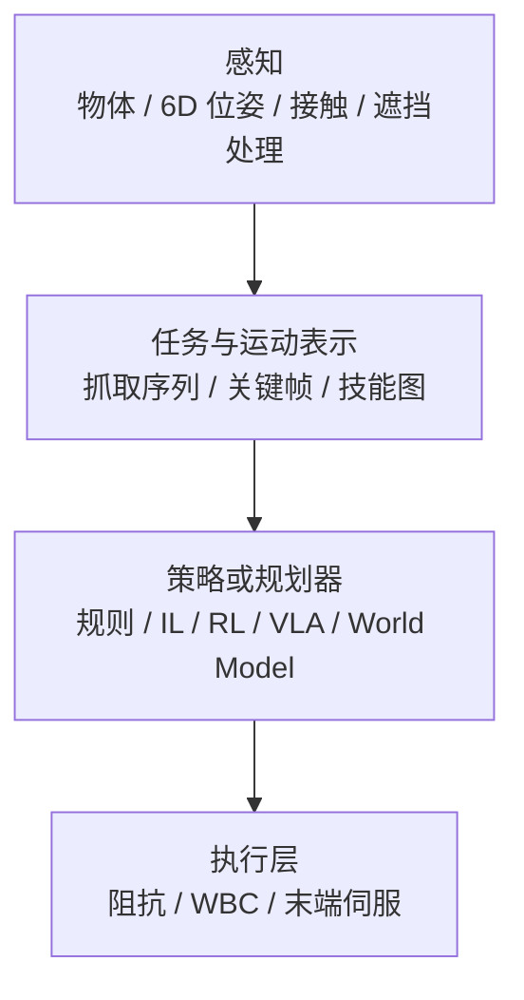

# Manipulation

**操作**：让机器人的手/末端执行器抓取、移动、操作物体。

## 一句话定义

让机器人的手能做事情——抓东西、搬东西、用东西。

## 核心挑战

### 1. 接触力学
操作涉及多指接触、摩擦、约束——比纯运动控制复杂。

### 2. 视觉感知
需要识别物体、理解姿态、估计空间位置；抓取子问题中常需要 **6D/7DoF 抓取位姿** 或 **候选集合**（见 [AnyGrasp](../entities/anygrasp.md) 一类检测式管线）。

### 3. 灵巧操作
很多操作需要多指协调、精细力控（如插头、拧瓶盖）。

### 4. 开放词汇
现实世界物体种类几乎无限，不可能为每个物体单独训练。

## 操作闭环流程总览

## 主要方法路线

### 传统路线
- **Pick and Place**：先移动到物体，再抓取，再移动
- **Keyframe/Constrained IL**：关键帧 + 约束
- **Task Space Control**：在任务空间控制末端执行器

### 学习路线
- **RL**：在仿真中学习抓取策略
- **IL**：从演示中学习操作技能
- **VLA (Vision-Language-Action Model)**：端到端视觉-语言-动作模型
  - 代表：UnifoLM, π₀
- **World Model**：学习操作的世界模型，在模型里 planning

## 在人形机器人中的特殊性

人形机器人操作的特点：
- 浮动基：身体位置不直接可控，影响操作稳定性
- 双手协调：两手同时操作一个物体
- 全身协调：操作时需要保持身体平衡
- loco-manipulation：边走边操作

## 评价指标

- 成功率（抓取成功率、操作任务成功率）
- 动作自然性
- 泛化能力（对未见过的物体）
- 速度

## 关联方法

- [Imitation Learning](../methods/imitation-learning.md)
- [Reinforcement Learning](../methods/reinforcement-learning.md)
- [Whole-Body Control](../concepts/whole-body-control.md)
- [Diffusion Policy](../methods/diffusion-policy.md)
- [Behavior Cloning](../methods/behavior-cloning.md)
- [DAgger](../methods/dagger.md)
- [VLA](../methods/vla.md)
- [Embodied Scaling Laws](../concepts/embodied-scaling-laws.md) — 操作数据的规模化定律
- [Auto-labeling Pipelines](../methods/auto-labeling-pipelines.md) — 自动化操作轨迹标注
- [Action Tokenization (动作分词)](../formalizations/vla-tokenization.md) — 操作模型中常见的动作表示
- [Contact-Rich Manipulation](../concepts/contact-rich-manipulation.md)
- [In-hand Reorientation (手内重定向)](../methods/in-hand-reorientation.md) — 极致的灵巧操作

## 关联实体

- [机器人关键帧与运动编辑工具](../entities/robot-motion-keyframe-editors.md) — 示教 CSV / NPZ / MuJoCo 关键帧的离线修整与导出
- [Allegro Hand](../entities/allegro-hand.md) — 主流灵巧操作研究硬件
- [AnyGrasp](../entities/anygrasp.md) — 平行夹爪稠密抓取感知与跨帧跟踪（GraspNet 系 SDK）
- [RLDX-1](../entities/rldx-1.md) — 灵巧操作向 VLA，可选触觉/力矩条件与低延迟推理栈

## 关联任务

- [Locomotion](./locomotion.md)：loco-manipulation 是两者的结合
- [Loco-Manipulation](./loco-manipulation.md)：边走边操作，manipulation 的全身协调扩展

## 参考来源

- Zhu et al., *Dexterous Manipulation from Images: Autonomous Grasping, Regrasping, Reorientation* — 视觉操作代表
- [Imitation Learning 论文导航](../../references/papers/imitation-learning.md) — IL 操作任务论文集合
- [Diffusion Policy 项目主页](https://diffusion-policy.cs.columbia.edu/) — 当前 SOTA IL 方法

## 关联页面

- [cuRobo（GPU 无碰撞运动生成）](../entities/curobo.md) — 到达、避障与 MoveIt / Isaac ROS 集成路径上的规划–优化参考栈
- [AprilTag（视觉 fiducial 库）](../entities/april-tag.md) — 工作台基准、手眼与对齐任务中的低成本位姿观测
- [AnyGrasp](../entities/anygrasp.md) — 深度点云稠密抓取检测与跟踪的工程/SDK 入口
- [Imitation Learning](../methods/imitation-learning.md) — 操作任务的主流学习方法
- [Loco-Manipulation](./loco-manipulation.md) — 边走边操作的全身协调扩展
- [Teleoperation](./teleoperation.md) — 操作数据采集的主要手段
- [Query：操作演示数据采集指南](../queries/demo-data-collection-guide.md) — 如何高效采集人类演示数据
- [Query：接触丰富操作实践指南](../queries/contact-rich-manipulation-guide.md) — 装配、插拔、拧紧等任务的工程排错顺序
- [Query：在 RL 中利用触觉反馈提升操作鲁棒性](../queries/tactile-feedback-in-rl.md) — 处理视觉遮挡的进阶方法
- [Impedance Control](../concepts/impedance-control.md) — 接触任务最常见的柔顺执行层

## 推荐继续阅读

- [Imitation Learning](../methods/imitation-learning.md)
- [Diffusion Policy (Blog)](https://diffusion-policy.cs.columbia.edu/)（当前模仿学习 SOTA 路线之一）
- Unitree 开源操作项目：<https://github.com/unitreerobotics>
