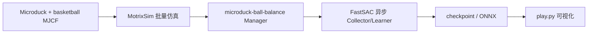

# Microduck 球平衡（蹬西瓜）

**Microduck 球平衡**让约 25 cm / 14-DoF 桌面双足 [Microduck](../entities/pollen-microduck.md) 站在一颗 **自由滚动的篮球**（半径 0.14 m）上，用全身关节协调维持直立并把球保持在双脚下方。社区口语「**蹬西瓜**」指这类站在滚动球体上的平衡把戏；官方仿真资产是篮球而非西瓜模型。

在 [MotrixLab](../entities/motrix.md) 中注册为 `microduck-ball-balance`，目前仅提供 **`motrix.fastsac`** 训练配方；与 Pollen 官方 [Microduck RL](../entities/pollen-microduck-rl.md)（mjlab + PPO，含行走/踢球等）形成 **第二套可复现栈**。

## 一句话定义

> 小鸭子不走路，改练双脚蹬球——全身 14 关节一起找平衡，球滚哪儿脚就跟哪儿。

## 英文缩写速查

| 缩写 | 英文全称 | 简要说明 |
|------|----------|----------|
| RL | Reinforcement Learning | 通过与环境交互最大化长期回报来学习策略的范式 |
| SAC | Soft Actor-Critic | 最大熵 off-policy actor-critic；MotrixLab 内置 **FastSAC** 为其工程化高速实现 |
| DoF | Degrees of Freedom | 驱动关节自由度；本任务 Microduck 为 14 |
| Manager | Manager-based Env | MotrixLab 用可组合 MDP 项（观测/奖励/终止）装配环境的工作流 |
| DR | Domain Randomization | 域随机化；本任务 **不做** 质量/摩擦/增益随机化，仅初始状态与 actor 观测噪声 |
| MJCF | MuJoCo XML Format | 机器人与篮球场景描述格式 |
| ONNX | Open Neural Network Exchange | MotrixLab 策略导出格式，可对接部署 CLI |

## 为什么重要

- **接触–平衡耦合入门：** 比平地速度跟踪更难——球心水平漂移会直接触发 `ball_escaped` 终止，强迫策略同时管姿态与球相对位姿。
- **Motrix 栈 showcase：** 单命令 `task=microduck-ball-balance/motrix.fastsac play=true`，2048 并行 env 下约 **5–10 分钟** 即可看到可玩策略，适合验证 MotrixSim + FastSAC 安装与吞吐。
- **与官方 mjlab 任务族互补：** Pollen 仓有 `BallKick`（踢小球、actor 盲球）等，但 **无** 官方「站球平衡」任务；MotrixLab 侧填补这一 demo 空白（资产自 microduck_rl 移植）。

## 核心机制

### 流程总览



### 动作与观测

- **动作（14 维）：** 关节位置目标，`q_target = q_default + action × 0.5`，底层位置 PD（增益来自模型）。
- **Actor 观测（54 维）：** 投影重力、基座角速度、**球相对位姿/速度**、关节角/速、上一步动作；各通道加均匀噪声。
- **Critic 特权（+9 维 → 63 维）：** 基座线速度、球世界坐标与线速度（无噪声），用于非对称 AC。

### 奖励与终止（设计要点）

| 项 | 权重 | 作用 |
|----|-----:|------|
| `ball_under_feet` | 3.0 | 球心水平贴近双脚中点（σ=0.05 m）——**任务核心** |
| `upright` | 4.0 | 躯干直立 |
| `base_height` | 1.5 | 站在球顶后目标高度 ≈ 0.40 m |
| `alive` | 1.0 | 存活保底，避免靠快速终止逃避动作率惩罚 |
| `action_rate_l2` | −0.5 | 抑制抖动 |

失败条件包括：基座 z < 0.22 m、倾角过大、球水平偏离脚底 > 0.20 m、关节发散；回合最长 20 s。

### 与 Microduck RL（mjlab）对照

| 维度 | MotrixLab `microduck-ball-balance` | Pollen `microduck_rl` |
|------|-----------------------------------|------------------------|
| 仿真 | MotrixSim | MuJoCo Warp（mjlab） |
| 算法 | FastSAC（off-policy） | PPO（on-policy） |
| 球相关任务 | 双脚 **站球平衡** | `BallKick` 踢 70 mm 球等 |
| 执行器建模 | 模型 PD（本任务无 BAM DR） | BAM XL330 + 丰富 DR |
| 部署路径 | MotrixLab deploy / ONNX | `export.py` → Runtime ONNX |

## 工程实践

### 快速复现（已开源）

```bash
git clone https://github.com/Motphys/MotrixLab && cd MotrixLab && git lfs pull
sh install.sh && source .venv/bin/activate

# 仅预览物理（不训练）
python scripts/view.py env=microduck-ball-balance

# 训练 + 实时渲染（用户实测约 5–10 min 可见效果）
python scripts/train.py task=microduck-ball-balance/motrix.fastsac play=true

# 加载 checkpoint 回放
python scripts/play.py env=microduck-ball-balance
```

前置：Python 3.10、`uv`、Git LFS、NVIDIA CUDA 或 AMD ROCm。任务固定 `num_envs=2048`、`num_learning_iterations=20000`；同步 baseline 可 `algo.asynchronous=false`。

### 局限

- **本任务无物理域随机化**，策略更偏仿真 showcase；真机站球需另做接触/执行器建模（可参考 [Microduck RL](../entities/pollen-microduck-rl.md) 的 BAM 与 DR 课）。
- **仅 FastSAC 配方**；若要 PPO 需自行接 `skrl.ppo` / `rslrl.ppo` 任务 yaml（官方未提供）。
- 口语「西瓜」≠ 仿真资产；复现时以 `basketball.xml` 为准。

## 关联页面

- [Motrix](../entities/motrix.md) — MotrixSim + MotrixLab 平台
- [Pollen Microduck](../entities/pollen-microduck.md) — 硬件与 Runtime
- [Microduck RL](../entities/pollen-microduck-rl.md) — 官方 mjlab 训练栈
- [Balance Recovery](./balance-recovery.md) — 更广义的扰动恢复任务族
- [Reward Design](../concepts/reward-design.md) — 指数核与惩罚项设计

## 推荐继续阅读

- [MotrixLab 球平衡环境文档（中文）](https://motrixlab.readthedocs.io/zh-cn/stable/user_guide/envs/ball_balance.html)
- [MotrixLab GitHub](https://github.com/Motphys/MotrixLab)
- [pollen-robotics/microduck_rl](https://github.com/pollen-robotics/microduck_rl) — Microduck MJCF 上游

## 参考来源

- [MotrixLab 仓库归档](../../sources/repos/motrixlab.md)
- [小鸭子在 MotrixSim 里练起了蹬西瓜](../../sources/blogs/motphys-microduck-ball-balance-motrixsim.md)
