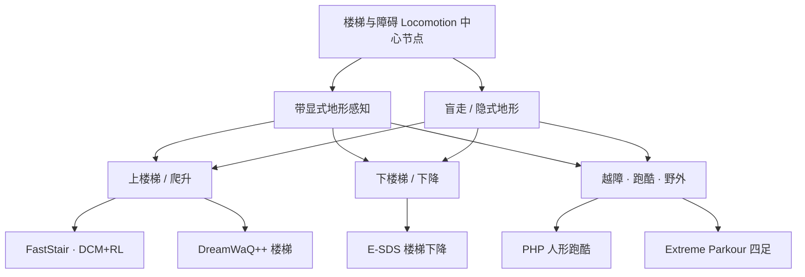

# 楼梯与障碍 Locomotion（感知 / 盲走中心节点）

> **本页定位**：腿式与人形机器人在 **楼梯、台阶、沟壑、高台** 等 **离散接触地形** 上移动的 **策展索引**；按 **带感知 / 不带感知（盲走或隐式地形）**、**上楼 / 下楼**、**越障 / 跑酷** 三条轴组织仓库内已有页面。**后续与本主题相关的新资料 ingest 时，应在本页「资料索引」中追加一行，并在对应 wiki 页的 `related` 中链回本页。**

## 一句话定义

**把「下一步踩哪里、身体多快过障」从平地 tracking 问题，升级为在离散可行接触集上的感知–规划–控制闭环（或盲走下的接触探测闭环）。**

## 英文缩写速查

| 缩写 | 英文全称 | 简要说明 |
|------|----------|----------|
| Locomotion | Robot Locomotion | 楼梯/障碍场景下的足式移动任务 |
| DCM | Divergent Component of Motion | 落脚点规划与 capture 相关概念 |
| RL | Reinforcement Learning | PPO 等学感知行走策略 |
| PPO | Proximal Policy Optimization | 显式几何/感知条件化 loco 常用算法 |
| Sim2Real | Simulation to Real | 感知策略从仿真到户外真机 |

## 为什么重要

- **接触选择与动态平衡耦合：** 楼梯与垫脚石类地形上，错误落脚比平地更容易一次失稳；纯速度跟踪奖励常与隐式稳定项冲突（见 [FastStair](../entities/paper-faststair-humanoid-stair-ascent.md) 问题表述）。
- **感知与否决定能力上限：** 盲走可依赖本体历史、隐式地形想象或「碰后再改步态」，但 **前瞻台阶/缺口** 通常需要高程图、深度或点云（见 [Terrain Adaptation](../concepts/terrain-adaptation.md)）。
- **工程路线分叉：** 同一任务上并存 **model-based 落脚点 + RL**、**特权 teacher 蒸馏**、**端到端深度/点云策略**、**VLM 生成奖励** 等路线，本页用于横向对照而非重复造页。

## 分类坐标（维护用）

| 轴 | 典型含义 | 仓库内常见实现 |
|----|----------|----------------|
| **感知** | 机载高程图 / 深度 / LiDAR / 点云进入策略或奖励 | FastStair、E-SDS、DreamWaQ++、PHP、Extreme Parkour |
| **盲走 / 弱感知** | 仅本体 + 隐式地形或接触后修正 | DreamWaQ 系盲走基线、部分「blind stair」RL、Walk These Ways 的 OOD 试参 |
| **楼梯** | 重复踢面/踏面、离散高度阶跃 | 上楼梯（FastStair）、下楼梯（E-SDS 分水岭）、四足楼梯竞速（DreamWaQ++） |
| **越障 / 跑酷** | 攀爬、翻越、沟壑、高台、技能链 | PHP、Deep Whole-body Parkour、Hiking in the Wild、Extreme Parkour |

## 资料索引（仓库内）

### 人形 · 楼梯

| 感知 | 方向 / 场景 | 页面 | 要点 |
|------|-------------|------|------|
| **有**（机载高程图 + 深度重建） | **高速上楼** | [FastStair](../entities/paper-faststair-humanoid-stair-ascent.md) | GPU 并行 DCM 落脚点作训练监督；分速专家 + LoRA；LimX Oli ~1.65 m/s 上楼 |
| **有**（点云 BEV → 几何 token） | **上楼 · OOD 踢面** | [Explicit Stair Geometry](../entities/paper-explicit-stair-geometry-humanoid-locomotion.md) | 踢面/踏面/航向四维条件化 PPO；G1 户外 33 级；相对 MoRE 更高 OOD 成功率 |
| **有**（高度图 + LiDAR 奖励） | **多地形含下楼** | [E-SDS](../entities/paper-e-sds-environment-aware-humanoid-locomotion-rl.md) | VLM 生成环境感知奖励；论文称感知基线未能完成楼梯下降 |
| **策展** | 综述位 | [Hiking in the Wild](../entities/paper-hiking-in-the-wild.md) | 持续通过楼梯、沟壑、高台等复杂野外地形（感知徒步/跑酷簇） |
| **有**（36×36 第一视角深度） | **上下楼梯 · 沟/台 · 户外长程** | [SSR](../entities/paper-ssr-humanoid-open-world-traversal.md) | 想象落脚点 + 潜空间对称 + 分地形 AMP；AgiBot X2 零样本 **1.3 km** 户外；90 cm 沟 / 45 cm 台 |
| **有**（LiDAR 11×11 高程 + cross-attn） | **楼梯/高台 + 边走边操作** | [PILOT](../entities/paper-pilot-perceptive-loco-manipulation.md) | 单阶段 MoE 全身 LLC；G1 非结构化 loco-manipulation；相对 HOMIE/AMO 更低跟踪误差 |
| **有**（前+后深度，特权高程蒸馏） | **双向楼梯/坡/垫脚石 + 载荷** | [RPL](../entities/paper-rpl-robust-humanoid-perceptive-locomotion.md) | 分地形专家 + DAgger；DFSV/RSM 鲁棒多向；G1 真机 2 kg 载荷、22–30 cm 台阶与 60 cm 缝垫脚石 |
| **有**（机载深度 + VFM） | **梯子攀爬 · 梯上操作** | [LadderMan](../entities/paper-ladderman-humanoid-perceptive-ladder-climbing.md) | 单参考 hybrid tracking 多几何专家 + DAgger+RL；RFM/VFM 零样本 sim-to-real；G1 双向 ~3.4 s/踏棍；梯顶 VR 双智能体操作 |
| **有**（机器人中心高程扫描 + identity-gated 残差） | **楼梯/块/坡/草地 · raw 参考 BFM** | [Perceptive BFM](../entities/paper-perceptive-bfm.md) | TCRS 离线监督 + PMT 四阶段；部署仍用 **原始人体参考**；G1 单策略覆盖 mocap 遥操作、舞蹈、杂技与户外 |

### 四足 · 楼梯与崎岖

| 感知 | 场景 | 页面 | 要点 |
|------|------|------|------|
| **有**（点云 + 本体） | 楼梯 / 陡坡 / OOD | [DreamWaQ++](../entities/dreamwaq-plus.md) | 相对盲走 DreamWaQ 在困难楼梯显著领先 |
| **弱 / 试参** | 楼梯等 OOD | [Walk These Ways](../entities/paper-walk-these-ways-quadruped-mob.md) | 人类调节行为参数 \(b\) 在楼梯、滑地等场景快速试错 |
| **仿真演示** | 楼梯模式 | [JackHan MuJoCo WalkE3](../entities/jackhan-mujoco-walke3-simulation.md) | 预训练策略含楼梯与扰动模式（仿真边界见页内说明） |

### 越障 · 跑酷（人形 / 四足）

| 平台 | 感知 | 页面 | 要点 |
|------|------|------|------|
| 人形 G1 | **深度** | [PHP（Perceptive Humanoid Parkour）](../entities/paper-hrl-stack-22-perceptive_humanoid_parkour.md) | motion matching 合成长程参考 + DAgger+PPO 单策略 |
| 人形 | **深度**（策展） | [Deep Whole-body Parkour](../entities/paper-deep-whole-body-parkour.md) | 全身跑酷，与 PHP 同簇 |
| 四足 Go1 | **单目深度** | [Extreme Parkour](../entities/extreme-parkour.md) | 端到端跑酷；两阶段特权 scandots → 深度蒸馏 |

### 概念与方法（跨论文）

| 主题 | 页面 |
|------|------|
| 地形感知闭环 | [Terrain Adaptation](../concepts/terrain-adaptation.md) |
| 落脚点 / DCM | [Footstep Planning](../concepts/footstep-planning.md)、[Capture Point / DCM](../concepts/capture-point-dcm.md) |
| 特权地形 teacher | [Privileged Training](../concepts/privileged-training.md) |
| 运动任务总览 | [Locomotion](./locomotion.md)、[Humanoid Locomotion](./humanoid-locomotion.md) |
| 人形 RL 八层栈 | [Humanoid RL Motion Control Body System Stack](../overview/humanoid-rl-motion-control-body-system-stack.md) |

## 选型速查

| 你的目标 | 建议入口 |
|----------|----------|
| 人形 **高速上楼梯** + 规划引导 RL | [FastStair](../entities/paper-faststair-humanoid-stair-ascent.md) |
| **下楼** 或自动奖励设计 | [E-SDS](../entities/paper-e-sds-environment-aware-humanoid-locomotion-rl.md) |
| 四足 **点云前瞻** 楼梯 | [DreamWaQ++](../entities/dreamwaq-plus.md) |
| 人形 **跑酷技能链** + 机载深度 | [PHP](../entities/paper-hrl-stack-22-perceptive_humanoid_parkour.md) |
| 人形 **开放世界长程** + 想象落脚 | [SSR](../entities/paper-ssr-humanoid-open-world-traversal.md) |
| 人形 **边走边操作** + LiDAR 高程 LLC | [PILOT](../entities/paper-pilot-perceptive-loco-manipulation.md) |
| 人形 **双向/多向** 深度感知 + **载荷** 爬楼梯/垫脚石 | [RPL](../entities/paper-rpl-robust-humanoid-perceptive-locomotion.md) |
| 人形 **梯子攀爬** + **梯上遥操作**（稀疏踏棍） | [LadderMan](../entities/paper-ladderman-humanoid-perceptive-ladder-climbing.md) |
| 人形 **BFM 式开放 raw 参考** + **地形感知落脚/间隙**（楼梯/块/户外） | [Perceptive BFM](../entities/paper-perceptive-bfm.md) |
| 四足 **极限跑酷** 端到端 | [Extreme Parkour](../entities/extreme-parkour.md) |
| 理解 DCM / 落脚点如何进 RL | [Capture Point / DCM](../concepts/capture-point-dcm.md) |

## 常见误区

1. **「有相机 = 感知楼梯」** — 传感器数据必须进入 **可优化目标**（策略输入或奖励）；仅堆传感器而策略盲感知仍会高摔（E-SDS 的 Foundation-Only 对照）。
2. **「盲走永远不如感知」** — 盲走在平坦/轻度起伏可更省算力；楼梯/缺口往往要先 **接触探测** 再改步态，速度上限更低。
3. **「上楼梯文献可类推下楼」** — 下楼对前向质心、踏空与制动要求不同，仓库内 **下楼** 以 E-SDS 等为显式分水岭案例。
4. **把本页当论文深读** — 单篇机制细节见各 **entity** 页与 [Humanoid_Robot_Learning_Paper_Notebooks](https://github.com/ImChong/Humanoid_Robot_Learning_Paper_Notebooks)；本页只做 **挂接与对照**。

## 关联页面

- [Locomotion](./locomotion.md) — 运动任务层总览
- [Humanoid Locomotion](./humanoid-locomotion.md) — 人形高程图与障碍反应
- [Terrain Adaptation](../concepts/terrain-adaptation.md) — 感知到动作的通用闭环

## 推荐继续阅读

- [机器人论文阅读笔记：Collision-Free Humanoid Traversal in Cluttered Indoor Scenes](https://imchong.github.io/Humanoid_Robot_Learning_Paper_Notebooks/papers/04_Loco-Manipulation_and_WBC/Collision-Free_Humanoid_Traversal_in_Cluttered_Indoor_Scenes/Collision-Free_Humanoid_Traversal_in_Cluttered_Indoor_Scenes.html)
- FastStair 论文 HTML：<https://arxiv.org/html/2601.10365v1>
- FastStair 项目页：<https://npcliu.github.io/FastStair>

## 参考来源

- [FastStair 论文摘录（arXiv:2601.10365）](../../sources/papers/faststair_arxiv_2601_10365.md)
- [SSR 论文摘录（arXiv:2605.30770）](../../sources/papers/ssr_arxiv_2605_30770.md)
- [E-SDS 论文摘录（arXiv:2512.16446）](../../sources/papers/e_sds_arxiv_2512_16446.md)
- [DreamWaQ++ 论文摘录（arXiv:2409.19709）](../../sources/papers/dreamwaq_plus_arxiv_2409_19709.md)
- [Extreme Parkour 论文摘录（arXiv:2309.14341）](../../sources/papers/extreme_parkour_arxiv_2309_14341.md)
- [42 篇人形 RL 运动控制目录摘录](../../sources/papers/humanoid_rl_stack_42_catalog.md)
