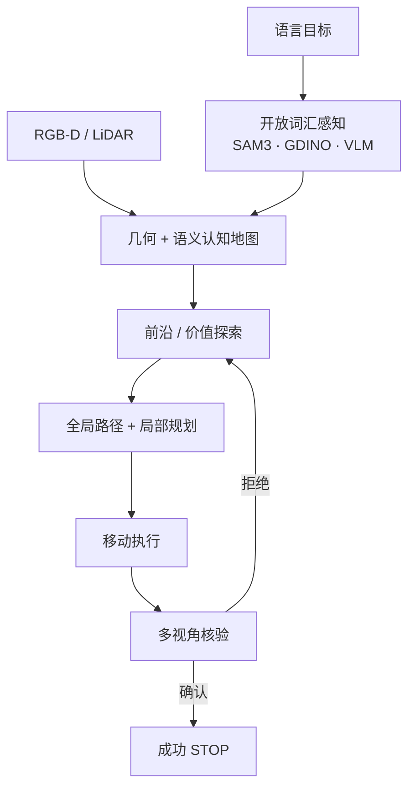

# 零样本目标导航（Zero-Shot Object Navigation）

**零样本目标导航**（Zero-Shot Object Navigation，**ZSON**；基准任务常称 **ObjectNav / Object-Goal Navigation**）要求智能体在 **未见地图** 的环境中，根据 **物体类别或开放词汇描述** 探索并导航至目标实例附近，且 **不在该目标导航轨迹上做任务微调**（感知模型可预训练）。

## 一句话定义

**没来过这栋楼、也没为「找椅子」单独训导航策略，只凭物体名字（或短语）自己建图、探索并走到目标跟前。**

## 英文缩写速查

| 缩写 | 英文全称 | 简要说明 |
|------|----------|----------|
| ZSON | Zero-Shot Object Navigation | 零样本目标导航设定 |
| ObjectNav | Object-Goal Navigation | 物体目标导航任务名 |
| SR | Success Rate | 成功率 |
| SPL | Success weighted by Path Length | 路径效率加权成功 |
| HM3D / MP3D | Habitat-Matterport 3D / Matterport3D | 常用室内基准 |
| VLM | Vision-Language Model | 开放词汇语义与核验 |
| FOV | Field of View | 视野限制驱动主动感知 |

## 为什么重要

- **服务机器人刚需：** 「去把杯子拿来」的前置是找到杯子；相对坐标点导航更贴近语言接口。
- **课程项目锚点：** 实战营 Day2 下午项目即为 **零样本目标导航的仿真 + 四足真机**。
- **与 VLN 分工：** [VLN](./vision-language-navigation.md) 强调逐步语言指令路径；ObjectNav 强调 **目标物体** 与探索效率。

## 任务要素

| 要素 | 说明 |
|------|------|
| 输入 | 目标类别/短语 + egocentric RGB-D（真机可加 LiDAR） |
| 输出 | 到达目标附近并 STOP（或报告失败） |
| 环境 | 室内多房间；进阶含 **多楼层 / 动态行人** |
| 零样本约束 | 不在目标导航专家轨迹上微调端到端策略；可用预训练检测/VLM |
| 指标 | SR、SPL、路径长度、软成功距离阈值 |

## 主流方法骨架

| 模块 | 常见实现 |
|------|----------|
| 实例提案 | [SAM 3](../entities/paper-sam3.md)、Grounding DINO、OWLv2 |
| 语言对齐 | [BLIP-2](../entities/paper-blip2.md)、CLIP、现代 VLM 嵌入 |
| 地图 | 占据 + 语义热力 + 实例记忆（[语义认知地图](../concepts/embodied-semantic-cognitive-map.md)） |
| 跨楼层 | [TravExplorer](../entities/paper-travexplorer.md) 可通行 3D；[ZONDA](../entities/paper-zonda.md) 高度差启发式 |
| 仿真 | [Habitat](../entities/habitat-sim.md) HM3D/MP3D |
| 真机 | 四足 Go2、轮腿双足等 + MPPI/局部规划 |

## 工程实践

| 项 | 建议 |
|----|------|
| 先仿真 | Habitat ObjectNav 跑通探索–核验闭环，再迁真机 |
| 假阳性 | 必须多视角/几何一致性核验，勿见类名即 STOP |
| Sim2Real | 离散仿真动作 → 真机连续跟踪；见 [sim2real](../concepts/sim2real.md) |
| 算力 | 重 VLM 离板；机载跑 LIO + 轻量检测（[Orin NX](../entities/jetson-orin-nx.md)） |

## 评价指标与读法

- **SR 高但 SPL 低：** 会找但乱逛——探索策略差。
- **单楼层强、多楼层崩：** 缺楼梯/可通行 3D 表示。
- **静态强、动态崩：** 缺行人预测与局部避障。

## 局限与风险

- **开放词汇 ≠ 开放世界鲁棒：** 稀有物体、重度遮挡仍难。
- **成功半径争议：** 3 m SR 可能未保证可见/可交互姿态（对照 REALM 对 VLN 末段的批评）。
- **开源参差：** TravExplorer / ZONDA 等方法页需核对代码是否真正可跑。

## 关联页面

- [视觉–语言导航](./vision-language-navigation.md)
- [TravExplorer](../entities/paper-travexplorer.md)
- [ZONDA](../entities/paper-zonda.md)
- [Uni-LaViRA](../entities/paper-uni-lavira.md)
- [四足×VLN 实战营总览](../overview/quadruped-vln-embodied-workshop.md)

## 参考来源

- [四足×VLN 实战营课程大纲](../../sources/courses/quadruped_vln_embodied_workshop_2day.md)
- [TravExplorer 论文摘录](../../sources/papers/travexplorer_arxiv_2605_19958.md)
- [ZONDA 论文摘录](../../sources/papers/zonda_arxiv_2607_21025.md)

## 推荐继续阅读

- [VLN 开源复现四范式](../overview/vln-open-source-repro-paradigms.md)
- Habitat 文档：<https://aihabitat.org/>
